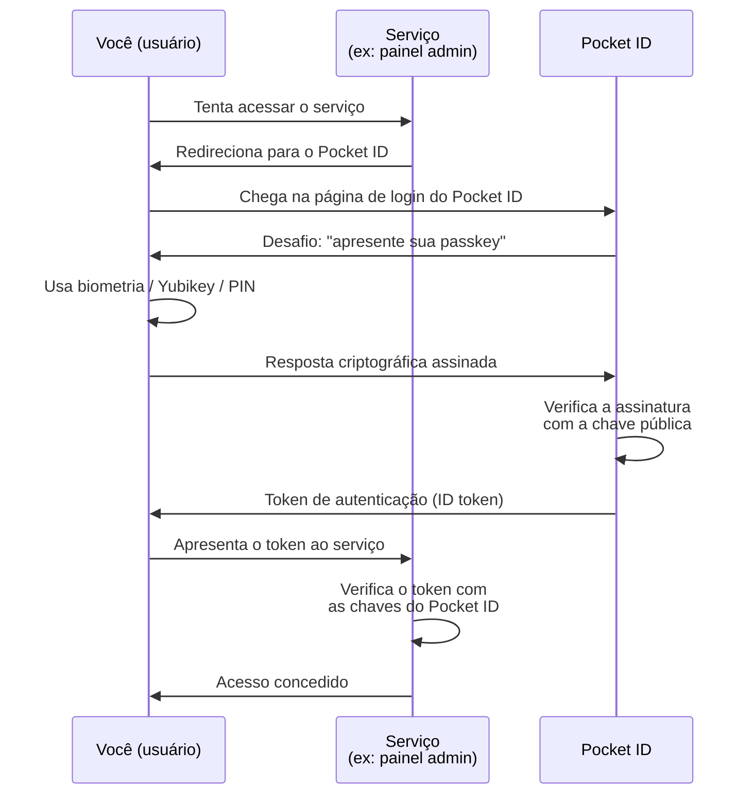

Imagine que você tem vários serviços rodando na sua casa ou num servidor na nuvem. Um painel administrativo, um servidor de mídia, uma ferramenta de gestão de projetos, um monitor de rede. Cada um com seu próprio login e senha. Alguns você acessa de casa, outros de fora, outros só por aplicativo.

Gerenciar isso é um pesadelo. Você acaba repetindo senhas, anotando em lugares inseguros, ou simplesmente desistindo de proteger alguns serviços.

O Pocket ID foi criado para resolver esse problema. Ele é um provedor de autenticação que você instala no seu próprio servidor, e que permite que você e outras pessoas acessem todos os seus serviços com uma única identidade digital, sem usar senhas.

## O que é o Pocket ID

O Pocket ID é um provedor OpenID Connect (OIDC) certificado e OAuth 2.0, projetado para ser auto-hospedado. Ele foi criado pelo desenvolvedor conhecido como stonith404 e lançado em agosto de 2024 no GitHub sob licença BSD-2.

A página oficial é [pocket-id.org](https://pocket-id.org/). O código-fonte está em [github.com/pocket-id/pocket-id](https://github.com/pocket-id/pocket-id).

O diferencial do Pocket ID em relação a alternativas como Keycloak ou ORY Hydra é a simplicidade. Enquanto essas ferramentas são poderosas mas complexas, o Pocket ID foi feito para um administrador doméstico ou uma pequena equipe colocar no ar em minutos.

E a característica mais marcante: ele só aceita autenticação por passkeys. Nada de senhas.

## O que são passkeys e por que isso importa

Passkey é um padrão de autenticação que substitui senhas por chaves criptográficas. Em vez de você digitar uma senha, você usa:

- A impressão digital ou reconhecimento facial do seu celular
- Um chip de segurança físico, como uma Yubikey
- O leitor de rosto ou impressão digital do seu notebook
- Um código PIN vinculado a um dispositivo confiável

Tecnicamente, as passkeys usam o padrão WebAuthn (Web Authentication), mantido pela FIDO Alliance e pelo W3C. Quando você registra uma passkey, seu dispositivo gera um par de chaves: uma pública (que fica no servidor do Pocket ID) e uma privada (que nunca sai do seu dispositivo).

Quando você faz login, o servidor desafia seu dispositivo a provar que ele possui a chave privada. Seu dispositivo responde usando biometria ou PIN para autorizar o uso da chave. A senha nunca é digitada, nunca é transmitida, nunca pode ser vazada.

Isso elimina os problemas mais comuns de segurança digital: senhas fracas, reuso de senhas, phishing (você não pode ser enganado a digitar uma senha num site falso se não existe senha para digitar) e vazamentos de banco de dados de credenciais.

## Como o Pocket ID funciona

O Pocket ID implementa dois padrões da web que você provavelmente já usou sem saber: OpenID Connect e OAuth 2.0.

O **OpenID Connect (OIDC)** é o protocolo que permite que um serviço (como seu painel administrativo) delegue a autenticação a outro serviço (o Pocket ID). Quando você tenta acessar o painel, ele redireciona você para o Pocket ID. Você se autentica lá com sua passkey, e o Pocket ID devolve um token informando que você é quem diz ser. O painel confia nesse token.

O **OAuth 2.0** é o protocolo que permite que um serviço peça permissão para acessar recursos em nome do usuário. Por exemplo, um aplicativo de terceiros pode pedir acesso apenas para ver seu perfil, e o Pocket ID gera um token com escopo limitado a essa permissão.

O fluxo completo é:



### E se você estiver em outro dispositivo que não tem sua passkey?

Esse é um ponto importante. A passkey fica vinculada ao dispositivo onde foi registrada. Se você está num computador público e precisa acessar um serviço, o Pocket ID permite usar passkeys de outros dispositivos via QR Code ou link. Você escaneia o QR Code com o celular (que tem a passkey), aprova o login no celular, e o computador ganha acesso.

Isso é possível porque o WebAuthn suporta um fluxo chamado "cross-device authentication" (CA), também conhecido como "hybrid flow". O Pocket ID implementa esse fluxo.

## Instalação passo a passo

O método mais simples e recomendado é com Docker. Você precisa de:

- Um servidor Linux (ou qualquer máquina com Docker instalado)
- Um domínio apontando para esse servidor (ex: auth.seudominio.com)
- Acesso HTTPS (Cloudflare, Caddy, Nginx ou Traefik)
- Um dispositivo com passkey (celular, Yubikey, notebook com biometria)

### Passo 1: Preparar o ambiente

Crie uma pasta para o Pocket ID no seu servidor:

```bash
mkdir ~/pocket-id
cd ~/pocket-id
```

Baixe os arquivos de configuração:

```bash
curl -o docker-compose.yml https://raw.githubusercontent.com/pocket-id/pocket-id/main/docker-compose.yml
curl -o .env https://raw.githubusercontent.com/pocket-id/pocket-id/main/.env.example
```

### Passo 2: Configurar as variáveis de ambiente

Edite o arquivo `.env` com um editor de texto. As variáveis mais importantes são:

```
APP_URL=https://auth.seudominio.com
ENCRYPTION_KEY=uma-chave-aleatoria-de-32-caracteres
TRUST_PROXY=true
```

A `APP_URL` é o endereço onde o Pocket ID vai ficar acessível. Precisa ser HTTPS.

A `ENCRYPTION_KEY` é a chave usada para criptografar dados sensíveis, incluindo as chaves privadas de assinatura de tokens. Gere uma com:

```bash
openssl rand -base64 32
```

O `TRUST_PROXY` deve ser `true` se você estiver usando um proxy reverso (Caddy, Nginx, Cloudflare Tunnel). Apenas use `true` se o Pocket ID não puder ser acessado diretamente sem o proxy.

### Passo 3: Subir o container

```bash
docker compose up -d
```

O Pocket ID vai rodar na porta 1411 dentro do container.

### Passo 4: Configurar o proxy reverso

Você precisa de um proxy reverso para servir o Pocket ID em HTTPS. Aqui estão duas opções:

**Com Caddy (recomendado para simplicidade):**

Crie um arquivo `Caddyfile`:

```
auth.seudominio.com {
    reverse_proxy localhost:1411
}
```

Inicie o Caddy com `caddy run`.

**Com Cloudflare Tunnel (se você já usa Cloudflare):**

Crie um tunnel no Zero Trust Dashboard apontando para `localhost:1411`. Veja a seção de integração com Cloudflare mais adiante.

### Passo 5: Criar a conta de administrador

Acesse `https://auth.seudominio.com/setup`. Você verá uma tela para criar a primeira conta de administrador. O Pocket ID vai pedir para você criar sua passkey. Se estiver no celular, use impressão digital ou face. Se estiver no computador, use o leitor biométrico ou uma Yubikey.

Pronto. Você tem um provedor de autenticação rodando.

## Gerenciando usuários

O painel administrativo do Pocket ID fica em `https://auth.seudominio.com/settings/admin`.

### Convidar usuários

Para adicionar um novo usuário, vá em "Users" e clique em "Invite User". O Pocket ID gera um link de convite. Esse link leva o usuário a uma página onde ele cria a própria passkey. O convite pode ser configurado para expirar após um certo número de dias ou usos.

Cada usuário gerencia sua própria passkey. Se perder o dispositivo, o administrador pode revogar a passkey antiga e o usuário cria uma nova.

### Grupos

Grupos são a forma de organizar usuários e controlar acesso a aplicações. Você cria um grupo (ex: "admin", "dev", "viewer"), adiciona usuários a ele, e depois define quais aplicações cada grupo pode acessar.

Por exemplo, você pode criar:

- Grupo "admins" → acesso a todos os serviços
- Grupo "devs" → acesso apenas ao GitLab e ao monitor
- Grupo "viewers" → acesso apenas ao painel de status

### Logs de auditoria

O Pocket ID registra cada tentativa de login, criação de token e alteração de configuração. O log inclui data, usuário, ação, endereço IP e localização geográfica aproximada (se configurado com o banco GeoLite2 da MaxMind). Isso é útil para detectar acessos suspeitos.

## Conectando aplicações ao Pocket ID

Para que um serviço use o Pocket ID como autenticador, ele precisa ser registrado como um "OIDC client".

### Registrar um cliente

No painel admin, vá em "OIDC Clients" e clique em "Add Client". Você precisa de:

- **Nome:** um nome para identificar o cliente (ex: "Painel Admin")
- **Callback URLs:** a URL para onde o Pocket ID redireciona após a autenticação (ex: `https://meupainel.com/oauth2/callback`)
- **Tipo de acesso:** "Confidential" para serviços que podem guardar segredo, "Public" para aplicações client-side

Após criar, o Pocket ID mostra um "Client ID" e um "Client Secret". Guarde o secret com segurança.

### Configurar o serviço

Cada serviço tem sua própria forma de configurar OIDC, mas os parâmetros são sempre os mesmos:

- **Discovery URL / Issuer URL:** `https://auth.seudominio.com`
- **Client ID:** o ID gerado pelo Pocket ID
- **Client Secret:** o segredo gerado pelo Pocket ID
- **Scopes:** `openid profile email`
- **Authorization Endpoint:** `https://auth.seudominio.com/authorize`
- **Token Endpoint:** `https://auth.seudominio.com/api/oidc/token`
- **JWKS URL:** `https://auth.seudominio.com/.well-known/jwks.json`

Muitos serviços modernos (Authelia, Grafana, Nextcloud, Home Assistant, authentik, Portainer, Traefik, e dezenas de outros) suportam OIDC nativamente. Basta preencher esses campos nas configurações de autenticação.

### Serviços que não suportam OIDC

Se um serviço não suporta OIDC, você pode usar o [OAuth2 Proxy](https://oauth2-proxy.github.io/). Ele funciona como um porteiro: fica na frente do serviço, intercepta requisições não autenticadas, redireciona para o Pocket ID, e só deixa passar se o token for válido.

## Integração com Cloudflare Zero Trust

A Cloudflare oferece um produto chamado Zero Trust (antigo Cloudflare for Teams) que inclui Access, Gateway, Tunnel e outros componentes. O Pocket ID pode ser usado como provedor de identidade dentro desse ecossistema.

### Por que integrar

O Cloudflare Zero Trust permite que você publique serviços internos sem expor IPs. O usuário acessa um domínio, o Cloudflare verifica a identidade, e só então encaminha o tráfego para seu servidor (via Tunnel). O servidor nunca fica diretamente exposto na internet.

O Cloudflare Access suporta vários provedores de identidade: Google, GitHub, Okta, Azure AD, e também provedores OIDC genéricos. O Pocket ID entra como um provedor OIDC genérico.

### Configurando o Pocket ID como provedor no Cloudflare Zero Trust

**Passo 1:** No painel admin do Pocket ID, crie um novo OIDC client com:

- Nome: "Cloudflare Zero Trust"
- Callback URL: `https://<sua-equipe>.cloudflareaccess.com/cdn-cgi/access/callback`

Substitua `<sua-equipe>` pelo nome da sua equipe no Cloudflare Zero Trust.

**Passo 2:** No Cloudflare Zero Trust Dashboard, vá em Settings → Authentication → Add new → OpenID Connect.

Preencha:

- Name: "Pocket ID"
- Issuer URL: `https://auth.seudominio.com`
- Client ID: (copiado do Pocket ID)
- Client Secret: (copiado do Pocket ID)
- OIDC Scopes: `openid profile email`
- Claims: `email`, `sub`, `name`

**Passo 3:** Salve. Agora o Pocket ID aparece como opção de provedor de identidade nas políticas de acesso do Cloudflare.

### Criando uma política de acesso

No Cloudflare Zero Trust, vá em Access → Applications → Add an application.

Escolha o tipo de aplicação (Self-hosted para seus serviços internos, SaaS para serviços externos).

Na configuração da política, em "Identity provider", selecione "Pocket ID". Defina as regras:

- Se o usuário pertence ao grupo "admins" no Pocket ID → permite acesso
- Se a localização é do Brasil → permite acesso
- Se o dispositivo é gerenciado → permite acesso

Quando um usuário tenta acessar o serviço, o Cloudflare redireciona para o Pocket ID, que pede a passkey, e só depois libera o acesso.

### Usando Cloudflare Tunnel em vez de expor porta

Em vez de expor a porta 1411 do Pocket ID diretamente, você pode usar o Cloudflare Tunnel (cloudflared):

```bash
cloudflared tunnel create pocket-id
cloudflared tunnel route dns pocket-id auth.seudominio.com
```

E no arquivo de configuração do tunnel (`~/.cloudflared/config.yml`):

```yaml
tunnel: pocket-id
credentials-file: /home/usuario/.cloudflared/pocket-id.json
ingress:
  - hostname: auth.seudominio.com
    service: http://localhost:1411
  - service: http_status:404
```

Assim, o Pocket ID nunca expõe uma porta na internet. Todo o tráfego chega pelo Cloudflare.

## Casos de uso práticos

### O homelab com múltiplos serviços

Você tem um servidor em casa rodando Portainer, Grafana, Home Assistant, um servidor de mídia e um GitLab. Antes, cada um tinha seu login e senha. Você instalou o Pocket ID e configurou cada serviço como cliente OIDC. Agora, você acessa qualquer serviço com um clique e sua Yubikey. Se um amigo precisa acessar o monitor de rede, você cria um convite, ele registra a passkey dele, e você define que ele só vê aquele serviço.

### A pequena empresa com acesso de terceiros

Uma empresa de desenvolvimento tem um servidor com GitLab, um painel de deploy e um monitor de infraestrutura. Os funcionários acessam tudo com passkey no celular. Consultores externos recebem convites com acesso limitado ao GitLab e ao monitor, mas não ao painel de deploy. Quando o contrato termina, o administrador desativa o usuário e todas as sessões são imediatamente bloqueadas.

### Autenticação para aplicações com Cloudflare

Uma startup usa Cloudflare Zero Trust para proteger seus ambientes de staging. O Pocket ID é o provedor de identidade. Desenvolvedores acessam os ambientes de staging com a passkey do notebook. Quando um desenvolvedor sai da empresa, o administrador remove o usuário do Pocket ID e imediatamente todas as políticas do Cloudflare param de aceitar tokens daquele usuário.

## Comparação com alternativas

| Característica | Pocket ID | Keycloak | Authelia | ORY Hydra |
|---|---|---|---|---|
| Complexidade | Muito baixa | Alta | Média | Alta |
| Autenticação | Só passkeys | Senha + MFA | Senha + 2FA | Customizável |
| OIDC certificado | Sim | Sim | Parcial | Sim |
| Docker | Nativo | Nativo | Nativo | Nativo |
| Base de dados | SQLite / PostgreSQL | PostgreSQL | SQLite / MySQL | PostgreSQL |
| Gerenciamento de usuários | Web UI | Web UI | Web UI | API |
| Ideal para | Homelab / pequenas equipes | Grandes organizações | Homelab | Desenvolvedores |

## Limitações e considerações

O Pocket ID é intencionalmente simples, e isso significa que algumas funcionalidades comuns em provedores maiores não existem:

- **Não há senha de fallback.** Se você perder todos os dispositivos que têm a passkey, a recuperação depende de um administrador revogar a passkey antiga e você registrar uma nova.
- **Não há LDAP / Active Directory.** A base de usuários é gerenciada exclusivamente pelo Pocket ID.
- **Não há federação com outros provedores** (ex: logar com Google ou GitHub). O Pocket ID é a fonte única de identidade.
- **Não há MFA progressivo.** Como a autenticação já é por passkey (que é inerentemente multi-fator: posse do dispositivo + biometria/PIN), não há uma segunda camada separada.

Para muitos cenários, especialmente homelab e pequenas equipes, essas limitações são aceitáveis em troca da simplicidade.

## Links úteis

- **Página oficial:** [pocket-id.org](https://pocket-id.org/)
- **Repositório GitHub:** [github.com/pocket-id/pocket-id](https://github.com/pocket-id/pocket-id)
- **Documentação oficial:** [docs.pocket-id.org](https://docs.pocket-id.org/)
- **Demo interativa:** [demo.pocket-id.org](https://demo.pocket-id.org)
- **OAuth2 Proxy (para serviços sem OIDC):** [oauth2-proxy.github.io](https://oauth2-proxy.github.io/)
- **Cloudflare Zero Trust:** [cloudflare.com/products/zero-trust](https://www.cloudflare.com/products/zero-trust/)
- **Passkeys (explicação oficial):** [passkeys.io](https://www.passkeys.io/)
- **WebAuthn (especificação W3C):** [w3.org/TR/webauthn](https://www.w3.org/TR/webauthn/)

## Conclusão

O Pocket ID resolve um problema real de forma elegante: autenticação centralizada sem senhas. Ele não tenta ser tudo para todos, e essa é sua maior força. Para quem administra alguns serviços e quer uma experiência de login unificada, segura e moderna, é difícil encontrar uma opção mais simples de configurar e manter.

Com a integração ao Cloudflare Zero Trust, você ganha uma camada adicional de segurança: o tráfego passa pelo Cloudflare, a autenticação é feita com passkey, e seu servidor nunca fica exposto diretamente na internet.

O projeto é open source, certificado OpenID Connect, e tem uma comunidade ativa no GitHub. Vale a pena testar na demo antes de instalar. Em cinco minutos você entende o valor.