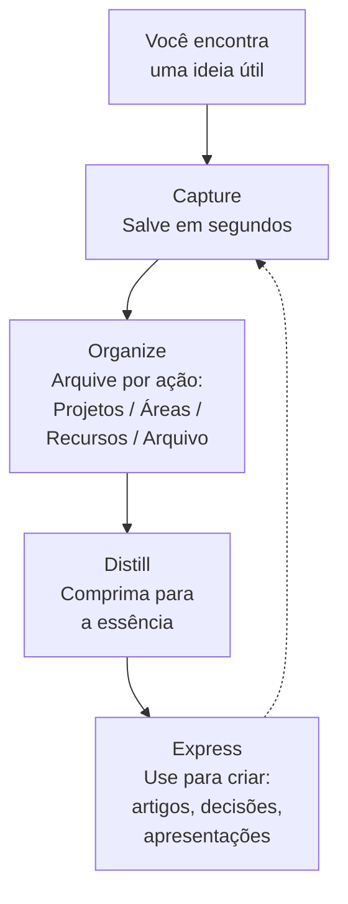
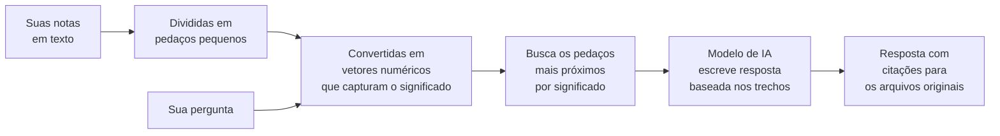

Você já passou por isso: leu um artigo importante, teve uma ideia brilhante, participou de uma reunião com decisões claras. Dias depois, quando precisou daquela informação, ela tinha sumido. Você sabia que tinha visto algo sobre o assunto, mas não lembrava onde, nem o que dizia.

Esse é o problema mais comum do conhecimento humano. Nossa memória biológica é excelente para conectar ideias e ter insights, mas péssima para armazenar informações com precisão. Tudo o que não está no nosso alcance imediato simplesmente desaparece.

O conceito de Segundo Cérebro, ou Second Brain, foi criado para resolver exatamente isso. E em 2026, com a inteligência artificial disponível para qualquer pessoa, ele ficou mais poderoso do que nunca.

## O que é um Segundo Cérebro

A definição mais conhecida vem de Tiago Forte, que escreveu o livro "Building a Second Brain". A ideia central é simples: sua mente é para ter ideias, não para guardá-las. Você cria um sistema externo e confiável onde deposita tudo o que aprende, e consulta quando precisa.

O método original segue quatro passos, conhecidos pela sigla CODE:

**Capture.** Você salva o que importa. Um trecho de um artigo, uma decisão de reunião, um insight que surgiu no banho. Leva segundos, e a regra é simples: se há qualquer chance de ser útil depois, capture.

**Organize.** Você arquiva por acionabilidade, não por assunto. O sistema PARA (Projects, Areas, Resources, Archives) divide tudo em quatro categorias: projetos ativos, responsabilidades contínuas, material de referência e arquivo.

**Distill.** Você comprime as notas para a essência. Da próxima vez que abrir a nota, você não precisa reler tudo. Os destaques e resumos contam o que importa.

**Express.** Você usa o conhecimento acumulado para produzir algo: um artigo, uma decisão, uma apresentação. O objetivo final não é acumular, é criar.

Esse fluxo funciona com qualquer ferramenta. Você pode fazer com cadernos físicos, com arquivos de texto, com aplicativos de notas. A mágica não está na ferramenta, está no hábito de capturar, organizar e usar o que você aprende.

## O que mudou com a inteligência artificial

Antes da IA, recuperar informação significava procurar. Você abria suas notas, lembrava palavras-chave, navegava pastas, relia documentos até encontrar o que precisava. Funcionava, mas era trabalhoso.

A IA mudou a interface de recuperação. Em vez de "achar a nota", você "faz a pergunta". Você digita "O que eu já aprendi sobre este assunto?" e o sistema busca nas suas notas, encontra os trechos relevantes e devolve uma resposta sintetizada com citações dos originais.

Isso não elimina a necessidade de capturar bem. Pelo contrário, ela aumenta. Se suas notas são vagas, a IA devolve respostas vagas. Mas a organização por pastas e tags, que antes era essencial, se torna menos importante. A busca por significado (busca semântica) substitui a busca por palavra-chave.

## Onde entra o Obsidian

O Obsidian é a ferramenta mais popular para quem leva o Segundo Cérebro a sério. E há um motivo.

Ele armazena suas notas como arquivos de texto simples em uma pasta do seu computador. Isso significa que você não fica preso ao aplicativo. Se amanhã o Obsidian deixar de existir, suas notas continuam lá, em arquivos que qualquer editor abre.

Além disso, o Obsidian permite criar links entre notas, formando uma teia de conexões entre ideias. Quando você está estudando um tema, pode pular para outra nota que escreveu meses atrás sobre um assunto relacionado. O sistema revela conexões que você nem lembrava que existiam.

Mas o Obsidian é só o substrato. É onde o conhecimento mora. A inteligência artificial entra como uma camada extra que transforma esse arquivo de notas em algo muito mais poderoso.

## Como a IA se conecta ao seu acervo de notas

Existem três formas principais de adicionar uma camada de IA sobre suas notas. Todas seguem o mesmo princípio técnico, chamado RAG (sigla em inglês para Geração Aumentada por Recuperação).

O diagrama abaixo mostra como o RAG funciona na prática:

Primeiro, suas notas são divididas em pedaços pequenos e cada pedaço é convertido em um vetor numérico, uma representação matemática do significado daquele texto. Segundo, quando você faz uma pergunta, ela também é convertida em vetor, e o sistema encontra os pedaços de nota com significado mais próximo. Terceiro, esses pedaços são entregues a um modelo de IA, que escreve uma resposta baseada exclusivamente neles, com referências aos arquivos originais.

O resultado é que você pode perguntar "Quais artigos me ajudaram a entender gestão de projetos?" e o sistema responde com os títulos, trechos e links diretos, mesmo que você nunca tenha usado a palavra "gestão" nos seus arquivos. Talvez tenha escrito sobre "gerenciamento de prazos" ou "metodologias ágeis".

### Forma 1: Ferramentas que já fazem tudo pronto

O NotebookLM, do Google, é o exemplo mais acessível. Você cria um caderno (notebook), adiciona suas fontes (artigos, PDFs, páginas da web), e faz perguntas. O sistema responde com citações numeradas apontando para as fontes originais. Zero instalação, zero configuração. Funciona para quem quer começar sem pensar em técnica.

### Forma 2: Obsidian com plugins locais e IA offline

Esta é a configuração mais equilibrada entre potência e simplicidade. Você instala o Obsidian e adiciona dois componentes gratuitos:

O Ollama, um programa que roda modelos de IA localmente no seu computador. Ele funciona em segundo plano e não envia nenhum dado para a internet.

Plugins de IA para o Obsidian, que se conectam ao Ollama e transformam seu acervo de notas.

O passo a passo é simples. Instale o Ollama no seu computador. Baixe dois modelos, um para converter notas em vetores e outro para responder perguntas. Instale o plugin Smart Connections no Obsidian e aponte para o Ollama. Depois de alguns minutos de indexação, você começa a usar.

Tudo funciona offline. Suas notas nunca saem do seu computador.

### Forma 3: Servidor sobre seus arquivos (para quem já usa agentes de IA)

Esta é a opção mais flexível. Você cria um servidor que expõe suas notas como ferramentas que qualquer assistente de IA pode consultar. O assistente busca semanticamente nos seus arquivos, encontra os artigos e posts relacionados e responde citando cada fonte, sem você precisar lembrar onde guardou ou como nomeou.

## Qual forma escolher

A escolha depende de como você trabalha e de quanto controle quer ter.

Se você quer começar hoje, sem instalar nada, use o NotebookLM. Adicione seus artigos e PDFs como fontes e comece a perguntar. Em 10 minutos você entende o valor do conceito.

Se você quer um sistema permanente, privado e offline, vá de Obsidian com plugins locais e Ollama. A configuração inicial leva uma tarde, e depois disso tudo roda sem depender de internet ou de serviços externos.

Se você já usa assistentes de IA como ferramenta de trabalho, um servidor sobre seus arquivos é o caminho. A busca se integra ao seu fluxo existente sem você mudar de aplicativo.

## Os benefícios concretos

Um Segundo Cérebro com IA muda a forma como você trabalha com conhecimento em três aspectos.

Você nunca mais perde uma ideia. O hábito de capturar vira automático. O que você leu, aprendeu ou decidiu fica registrado e acessível.

Você recupera em segundos o que levaria horas para encontrar. Em vez de abrir pastas e reler documentos, você pergunta e recebe a resposta com citações.

Você descobre conexões que não sabia que existiam. A busca semântica encontra relações entre notas que você escreveu em momentos diferentes, sobre temas aparentemente distintos, revelando padrões no seu pensamento que você não percebia.

## O que a IA não substitui

Toda a literatura sobre o assunto em 2026 é consistente num ponto: a IA não substitui a disciplina de captura. Se suas notas são ralas, a IA devolve respostas ralas. O que a IA elimina é o trabalho de organização. Pastas, tags e hierarquias profundas importam menos quando a recuperação é por significado. Mas a qualidade do que você salvou continua sendo o fator limitante.

Um erro comum é deixar a IA reescrever ou reorganizar suas notas automaticamente. Nesse caso, você não está construindo memória. Está entregando o controle para um sistema que pode cometer erros. A sequência que funciona é: você captura, a IA ajuda a recuperar e conectar, você decide o que fazer com aquilo.

## Um aviso sobre o Segundo Cérebro empresarial

O método que funciona para uma pessoa não pode ser copiado para uma empresa sem adaptação. Uma empresa não é uma cabeça maior. Ela é uma rede de pessoas, rotinas, conflitos e dependências.

O Segundo Cérebro empresarial precisa de fontes definidas (onde cada tipo de informação nasce), padrões claros (nomes e categorias iguais para todos), histórico útil (decisões registradas com contexto e justificativa), responsáveis visíveis (quem atualiza, quem valida) e integração com o fluxo de trabalho (o sistema precisa estar no dia a dia, não ser uma tarefa extra).

Ignorar esses pontos é o caminho mais rápido para criar uma base de conhecimento que ninguém consulta.

## Para quem este artigo é útil

Se você é uma pessoa que lê, estuda ou toma decisões baseadas em informação, o Segundo Cérebro com IA é relevante para você.

Um gerente de projetos que acumula atas de reunião, cronogramas e decisões ao longo dos meses pode perguntar ao sistema "Qual foi a justificativa para mudarmos o prazo deste projeto?" e obter a resposta em segundos, sem depender de quem estava na reunião.

Um administrador que mantém registros de processos, fornecedores e políticas internas pode criar uma base de conhecimento da equipe onde qualquer pessoa encontra respostas sem precisar perguntar aos colegas.

Um estudante que compila leituras, aulas e anotações ao longo do semestre pode pedir "Faça um resumo do que estudei sobre este tema até agora" e receber uma síntese com referências diretas ao material original.

A ferramenta muda conforme o perfil, mas o princípio é o mesmo: capture o que você aprende, e a IA ajuda a encontrar quando você precisa.

## Links úteis para começar

- **Building a Second Brain** (o livro de Tiago Forte que popularizou o método). Disponível em livrarias e bibliotecas.
- **[Obsidian](https://obsidian.md)** (aplicativo gratuito de notas em Markdown). Disponível para Windows, macOS, Linux, Android e iOS.
- **[Ollama](https://ollama.com)** (programa gratuito que roda modelos de IA localmente no seu computador).
- **[NotebookLM](https://notebooklm.google.com)** (ferramenta gratuita do Google que permite fazer perguntas sobre seus documentos sem instalar nada).

## Conclusão

O Segundo Cérebro com IA não é uma moda tecnológica. É uma resposta prática a um problema real: o conhecimento que você adquire se perde se não for capturado e organizado de forma confiável.

A IA torna a recuperação dramática e imediata. Você pergunta, ela responde. Mas a base continua sendo a mesma de sempre: o hábito de salvar o que importa, a disciplina de destilar o essencial e a decisão consciente de usar o conhecimento acumulado para criar algo novo.

Ferramentas vêm e vão. O Obsidian pode ser substituído amanhã. O Ollama pode dar lugar a outro motor de IA. Mas o fluxo de capturar, conectar e criar é atemporal. Invista no hábito, não na ferramenta.