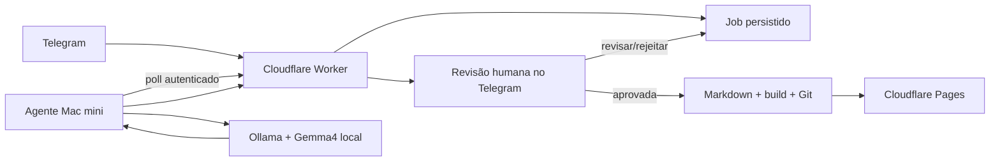

# CLAUDE.md

Instruções para Claude e outros agentes de código que trabalhem neste repositório.

## Contexto

Este repositório contém um blog Astro estático. A arquitetura planejada adiciona:

- Cloudflare Pages para hospedagem;
- Cloudflare Worker, Queues, D1 e R2 opcional para integração;
- Telegram como interface editorial;
- Mac mini M4 como executor privado;
- Ollama + modelo configurado por `OLLAMA_MODEL` (`gemma4` no desenho atual);
- Git como fonte de verdade e mecanismo de publicação.

Consulte `docs/SDD.md`, `docs/GSD.md`, `docs/PRD.md` e `docs/TDD.md` antes de implementar integrações.

## Comandos

```bash
npm install
npm run dev      # http://localhost:5321
npm run build    # astro check + astro build
npm run preview
```

O painel editorial local está disponível em `http://localhost:5321/keystatic` enquanto `npm run dev` estiver ativo.

Antes de concluir qualquer alteração, execute no mínimo `npm run build`.

## Estrutura atual

- `src/pages/`: rotas Astro.
- `src/layouts/`: layouts compartilhados.
- `src/components/`: componentes de UI.
- `src/styles/global.css`: estilos globais.
- `src/content/posts/`: posts Markdown.
- `src/content.config.ts`: contrato da coleção.
- `public/`: arquivos estáticos.

## Regras de implementação

- Preserve a saída estática do blog.
- Mantenha a porta de desenvolvimento em `5321`.
- Mantenha o frame principal centralizado e responsivo.
- Não altere o schema de posts sem atualizar documentação, exemplos e posts existentes.
- Use `pt-BR` para conteúdo e interface; nomes técnicos podem permanecer em inglês.
- Trate o diretório `src/content/posts` como único destino editorial do MVP.
- Não misture código do Worker ou agente local ao bundle do cliente Astro.
- Prefira módulos separados em `workers/editorial-api` e `agent/macmini`.
- Preserve mudanças não relacionadas já existentes no worktree.

## Limites de segurança

- Nunca exponha Ollama publicamente.
- O default de `OLLAMA_BASE_URL` deve ser `http://127.0.0.1:11434`.
- Nunca grave tokens, cookies, chat IDs privados ou credenciais no código, documentação ou logs.
- Use Cloudflare Secrets para o Worker e armazenamento seguro local para o agente.
- Valide webhook secret, allowlist do Telegram e Service Token em todos os endpoints aplicáveis.
- Não execute comandos vindos do Telegram ou da saída do modelo.
- Não publique conteúdo sem evento explícito de aprovação para a revisão exata.
- Normalize e valide qualquer slug antes de montar caminhos.
- Garanta idempotência com `telegram update_id` e `job_id`.

## Regras editoriais para conteúdo gerado

- Gere primeiro com `draft: true`.
- Use exatamente os campos definidos em `src/content.config.ts`.
- Não invente fontes, citações ou fatos.
- Marque pontos que exigem confirmação humana.
- Preserve notas originais separadas do texto transformado.
- Vincule cada revisão a um hash; aprovação vale apenas para aquele hash.
- Execute `npm run build` antes de commit ou push automatizado.

## Fluxo obrigatório



Qualquer proposta que pule a revisão humana, abra a API do Ollama à internet ou permita escrita arbitrária no workspace deve ser rejeitada.

## Definition of Done para código futuro

- Tipos e lint/checks sem erros.
- Testes relevantes adicionados e passando.
- `npm run build` passando.
- Nenhum segredo no diff.
- Estados de erro e retry tratados.
- Documentação atualizada quando contratos, comandos ou arquitetura mudarem.
- Para publicação: aprovação, hash da revisão, commit e URL do deploy rastreáveis pelo mesmo `job_id`.
