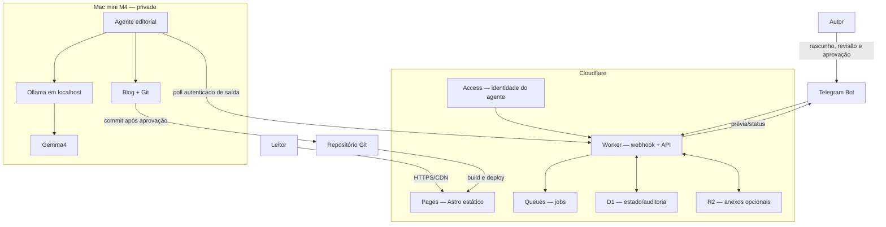

# alicino/knowledge base

Blog pessoal em Astro para notas sobre inteligência artificial, tecnologia e aprendizagem. O projeto também define uma arquitetura editorial assistida por IA: Telegram para captura e aprovação, Cloudflare na borda e um Mac mini M4 com Ollama + Gemma4 para inferência local.

## Estado atual

O blog está implementado e gera um site estático. A integração Telegram/Cloudflare/Mac mini está documentada como próxima etapa e ainda não existe no código deste repositório.

## Desenvolvimento local

Requisitos: Node.js compatível com as dependências do projeto e npm.

```bash
npm install
npm run dev
```

Abra [http://localhost:5321](http://localhost:5321).

O editor local de conteúdo fica em [http://localhost:5321/keystatic](http://localhost:5321/keystatic). Ele usa o modo local do Keystatic e salva diretamente em `src/content/posts/`; por isso, deve ser usado durante o desenvolvimento, com o servidor Astro em execução.

Verificações:

```bash
npm run build
npm run preview
```

O build estático é gravado em `dist/`.

## Conteúdo

Crie posts em `src/content/posts/<slug>.md`:

```yaml
---
title: "Título do post"
description: "Descrição curta"
publishedAt: 2026-07-21
category: "Categoria"
tags: ["ia", "notas"]
draft: true
---

Conteúdo em Markdown.
```

Use `draft: true` enquanto o texto não estiver pronto. O schema oficial está em `src/content.config.ts`.

## Arquitetura-alvo



O ponto central de segurança é que Ollama permanece em `127.0.0.1:11434`. O Mac mini busca jobs por uma conexão autenticada de saída; a internet não inicia conexões diretamente com o modelo.

## Documentação

- [SDD](docs/SDD.md): arquitetura, componentes, contratos, segurança e decisões.
- [GSD](docs/GSD.md): plano incremental de implementação e critérios de saída.
- [PRD](docs/PRD.md): problema, usuários, jornadas, requisitos e métricas.
- [TDD](docs/TDD.md): APIs, dados, integração Ollama, testes e rollout.
- [CLAUDE.md](CLAUDE.md): instruções para agentes de código que trabalham no repositório.

## Publicação no Cloudflare Pages

Configuração prevista:

| Campo | Valor |
|---|---|
| Build command | `npm run build` |
| Output directory | `dist` |
| Site | `https://kb.alicino.me` |

Nunca adicione tokens do Telegram, credenciais Cloudflare, Service Tokens ou segredos Git ao repositório.
