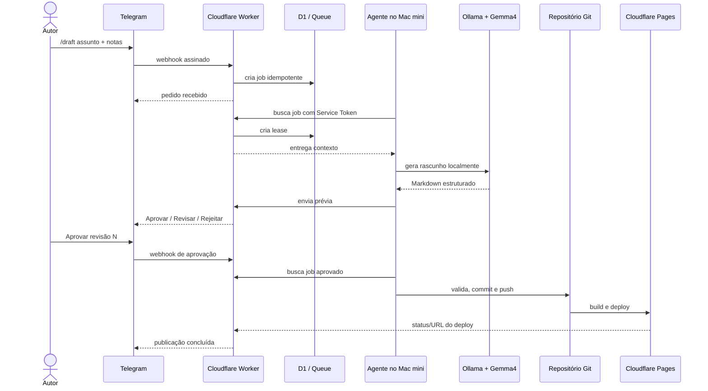

# GSD — Getting Stuff Done

## Objetivo

Plano incremental para sair do blog local atual e chegar à integração Mac mini + Ollama/Gemma4 + Telegram + Cloudflare, mantendo cada etapa testável e reversível.

## Definition of Done global

- Um autor autorizado cria um pedido pelo Telegram.
- O Mac mini processa o pedido localmente sem expor Ollama.
- O bot devolve uma prévia.
- Nenhum conteúdo é publicado sem aprovação explícita.
- Após aprovação, um Markdown válido entra no repositório.
- Cloudflare Pages publica o build aprovado.
- Falhas são observáveis, recuperáveis e não duplicam posts.

## Fase 0 — Base do blog

Estado: implementado.

- [x] Astro com TypeScript e Content Collections.
- [x] Posts em Markdown.
- [x] Build estático.
- [x] Servidor local na porta `5321`.
- [x] Layout principal centralizado.
- [ ] Versionar o estado inicial do projeto.
- [ ] Configurar CI com `npm ci` e `npm run build`.

Critério de saída: build limpo e preview navegável.

## Fase 1 — Cloudflare Pages

- [ ] Conectar o repositório ao Pages.
- [ ] Definir build command `npm run build`.
- [ ] Definir output directory `dist`.
- [ ] Apontar `kb.alicino.me` para o projeto.
- [ ] Habilitar preview deployments para branches/PRs.
- [ ] Validar cache, redirects e headers de segurança.

Critério de saída: cada alteração aprovada gera deploy rastreável e reversível.

## Fase 2 — Bot e Worker mínimo

- [ ] Criar bot no Telegram e guardar o token como secret.
- [ ] Criar Worker com rota `POST /telegram/webhook`.
- [ ] Validar secret do webhook, `update_id`, `user_id` e `chat_id`.
- [ ] Implementar `/status` e `/help`.
- [ ] Persistir updates e jobs no D1.
- [ ] Responder ao webhook antes de iniciar trabalho demorado.

Critério de saída: mensagens autorizadas criam exatamente um job; mensagens não autorizadas são recusadas.

## Fase 3 — Agente local e Ollama

- [ ] Instalar e validar Ollama no Mac mini M4.
- [ ] Confirmar a tag do modelo e configurar `OLLAMA_MODEL`.
- [ ] Criar agente local com polling autenticado.
- [ ] Chamar somente `http://127.0.0.1:11434`.
- [ ] Adicionar timeout, cancelamento e limite de concorrência.
- [ ] Executar o agente via `launchd` com reinício controlado.
- [ ] Publicar heartbeat sem dados sensíveis.

Critério de saída: um job de teste retorna texto ao Telegram e Ollama continua inacessível externamente.

## Fase 4 — Workflow editorial

- [ ] Implementar comando `/draft`.
- [ ] Gerar frontmatter compatível com `src/content.config.ts`.
- [ ] Salvar prévia e revisão no D1.
- [ ] Implementar `Aprovar`, `Revisar` e `Rejeitar`.
- [ ] Exigir aprovação vinculada à revisão exata.
- [ ] Rodar validações de conteúdo e `npm run build` antes de publicar.

Critério de saída: geração e aprovação são ações separadas e auditáveis.

## Fase 5 — Publicação

- [ ] Criar branch por job: `codex/post-<job-id>`.
- [ ] Escrever apenas em `src/content/posts/`.
- [ ] Fazer commit com `job_id` na mensagem.
- [ ] Abrir PR ou fazer merge conforme política definida.
- [ ] Enviar URL do preview ao Telegram.
- [ ] Após merge/deploy, enviar URL final e registrar `published`.

Critério de saída: uma aprovação gera um único post e um único deploy final.

## Fase 6 — Hardening

- [ ] Service Token e rotação de segredos.
- [ ] Rate limiting por usuário e chat.
- [ ] Dead-letter queue e replay administrativo.
- [ ] Backup/export periódico do D1.
- [ ] Alertas de agente offline e fila acumulada.
- [ ] Testes de prompt injection e conteúdo malformado.
- [ ] Runbook de indisponibilidade do Mac mini.

## Sequência operacional por post

