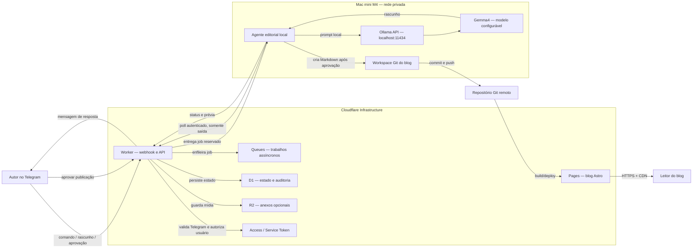

# SDD — System Design Document

## 1. Visão do sistema

O projeto combina um blog estático em Astro com uma esteira privada de produção assistida por IA. O Mac mini M4 executa Ollama e o modelo configurado como `gemma4`; o Telegram oferece a interface operacional; e a Cloudflare fornece a borda pública, o processamento de webhooks, a fila, o estado e a hospedagem do blog.

Esta é a arquitetura-alvo. No estado atual do repositório, o blog Astro está implementado; bot, Worker, fila, armazenamento e agente local ainda precisam ser adicionados.

## 2. Princípios de arquitetura

- Ollama não fica publicamente acessível.
- O Mac mini inicia conexões de saída para buscar trabalhos.
- Toda publicação exige aprovação humana.
- Markdown no Git é a fonte de verdade editorial.
- A borda deve responder rapidamente ao Telegram e delegar tarefas demoradas.
- Segredos ficam em Cloudflare Secrets ou no keychain/arquivo de ambiente local, nunca no Git.
- Cada trabalho possui identidade, estado, timestamps e trilha de auditoria.

## 3. Contexto e fluxo completo



## 4. Componentes

### Blog Astro

- Conteúdo: `src/content/posts/*.md`.
- Schema: `src/content.config.ts`.
- Saída: site estático.
- Desenvolvimento local: porta `5321`.
- Destino previsto: Cloudflare Pages.

### Worker de integração

Responsável por:

- receber e validar webhooks do Telegram;
- aceitar apenas usuários/chat IDs autorizados;
- normalizar comandos;
- criar trabalhos assíncronos;
- expor endpoints autenticados para o agente local;
- enviar respostas e prévias ao Telegram;
- registrar auditoria e idempotência.

### Queue e D1

`Queues` desacopla a entrada pública do processamento local. `D1` mantém jobs, revisões, aprovações e eventos. Se o agente local usar polling pela API do Worker, o Worker pode controlar reservas e leases em D1, enquanto Queue absorve e normaliza a entrada.

Estados recomendados:

```text
received -> queued -> leased -> generating -> review_pending
         -> approved -> publishing -> published
         -> rejected | failed | expired
```

### Agente editorial no Mac mini

Processo local, idealmente gerenciado por `launchd`, que:

1. autentica-se no Worker com Service Token;
2. busca um job disponível;
3. carrega o contexto editorial necessário;
4. chama Ollama em `127.0.0.1:11434`;
5. valida a saída e devolve a prévia;
6. após aprovação, cria o post e executa as verificações;
7. faz commit/push com credencial de escopo mínimo.

### Ollama e Gemma4

O endpoint deve permanecer em loopback. O nome real do modelo é configurado por ambiente, por exemplo `OLLAMA_MODEL=gemma4`, para permitir a troca da tag sem alterar código. Prompts precisam definir idioma, tom, formato de frontmatter e proibir publicação autônoma.

## 5. Contratos principais

### Job editorial

```json
{
  "id": "job_01...",
  "type": "draft_post",
  "chatId": "telegram-chat-id",
  "requestedBy": "telegram-user-id",
  "input": {
    "topic": "assunto",
    "notes": "contexto fornecido pelo autor",
    "language": "pt-BR"
  },
  "status": "queued",
  "createdAt": "ISO-8601"
}
```

### Post gerado

```yaml
---
title: "Título"
description: "Resumo curto"
publishedAt: 2026-07-21
category: "Categoria"
tags: ["tag"]
draft: true
---
```

## 6. Segurança

- Validar o secret token do webhook do Telegram.
- Aplicar allowlist de `user_id` e `chat_id`.
- Proteger APIs do agente com Cloudflare Access e Service Token.
- Não abrir a porta `11434` no roteador, Tunnel ou firewall público.
- Usar credencial Git limitada ao repositório.
- Sanitizar nomes de arquivo, frontmatter e Markdown.
- Limitar tamanho de mensagens, anexos, prompts e respostas.
- Registrar hashes/IDs, nunca tokens ou prompts sensíveis completos.
- Tornar o processamento idempotente pelo `update_id` do Telegram e `job_id`.

## 7. Resiliência e observabilidade

- Ack rápido do webhook; processamento fora da requisição.
- Lease com expiração para jobs reservados pelo Mac mini.
- Retry exponencial e dead-letter queue.
- Health heartbeat do agente local.
- Logs estruturados com `request_id`, `job_id` e `update_id`.
- Métricas: latência de fila, geração, taxa de falha, jobs pendentes e tempo até aprovação.

## 8. Decisões e pendências

| Tema | Decisão atual | Pendente |
|---|---|---|
| Exposição do Mac | Sem endpoint público | Implementar polling autenticado |
| Modelo | Variável `OLLAMA_MODEL=gemma4` | Confirmar tag instalada no Ollama |
| Publicação | Git + build do Pages | Escolher provedor Git e estratégia de branch/PR |
| Aprovação | Obrigatória no Telegram | Definir comandos e UX de botões |
| Dados | D1; R2 opcional | Definir retenção e política de exclusão |

