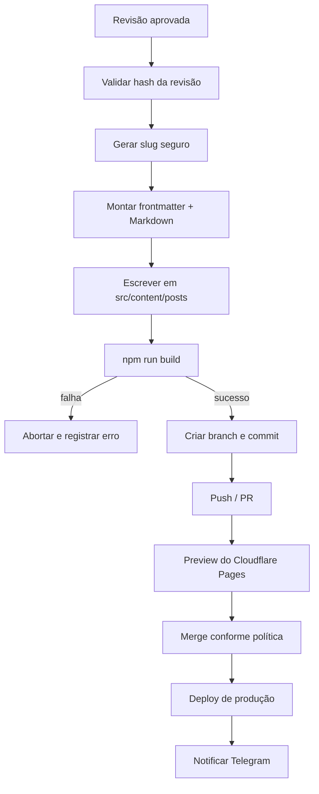

# TDD — Technical Design Document

## 1. Estado técnico atual

- Astro 5, TypeScript e Content Collections.
- Saída estática em `dist/`.
- Servidor local em `http://localhost:5321`.
- Posts em `src/content/posts`.
- O schema exige `title`, `description`, `publishedAt`, `category`, `tags` e `draft`.
- Integrações com Telegram, Cloudflare e Ollama ainda não estão presentes no código.

## 2. Estrutura-alvo sugerida

```text
.
├── src/                         # blog Astro existente
├── workers/
│   └── editorial-api/           # Worker, Telegram e API do agente
│       ├── src/
│       ├── migrations/
│       ├── test/
│       └── wrangler.jsonc
├── agent/
│   └── macmini/                 # daemon local
│       ├── src/
│       ├── prompts/
│       ├── test/
│       └── launchd/
├── docs/
└── README.md
```

Separar Worker e agente evita colocar dependências server-side no bundle estático do blog.

## 3. Endpoints

| Método | Rota | Autenticação | Função |
|---|---|---|---|
| POST | `/telegram/webhook` | Telegram secret header | Receber updates |
| GET | `/agent/jobs/next` | Access Service Token | Reservar próximo job |
| POST | `/agent/jobs/:id/heartbeat` | Access Service Token | Renovar lease |
| POST | `/agent/jobs/:id/result` | Access Service Token | Enviar prévia/erro |
| POST | `/agent/jobs/:id/published` | Access Service Token | Registrar commit/deploy |
| GET | `/health` | Público, resposta mínima | Saúde do Worker |

O Worker deve rejeitar payloads grandes e métodos inesperados antes de acessar banco ou fila.

## 4. Modelo de dados D1

```sql
CREATE TABLE jobs (
  id TEXT PRIMARY KEY,
  telegram_update_id INTEGER NOT NULL UNIQUE,
  chat_id TEXT NOT NULL,
  requested_by TEXT NOT NULL,
  type TEXT NOT NULL,
  status TEXT NOT NULL,
  input_json TEXT NOT NULL,
  lease_owner TEXT,
  lease_expires_at TEXT,
  approved_revision INTEGER,
  created_at TEXT NOT NULL,
  updated_at TEXT NOT NULL
);

CREATE TABLE revisions (
  job_id TEXT NOT NULL,
  revision INTEGER NOT NULL,
  content_markdown TEXT NOT NULL,
  content_sha256 TEXT NOT NULL,
  created_at TEXT NOT NULL,
  PRIMARY KEY (job_id, revision),
  FOREIGN KEY (job_id) REFERENCES jobs(id)
);

CREATE TABLE job_events (
  id INTEGER PRIMARY KEY AUTOINCREMENT,
  job_id TEXT NOT NULL,
  event_type TEXT NOT NULL,
  metadata_json TEXT,
  created_at TEXT NOT NULL
);
```

## 5. Protocolo de lease

1. Agente chama `GET /agent/jobs/next`.
2. Worker seleciona um job disponível e grava `lease_owner` e expiração.
3. Apenas o dono do lease pode enviar heartbeat ou resultado.
4. Heartbeat estende a expiração durante a geração.
5. Lease expirado torna o job elegível para retry.
6. Resultado é aceito uma única vez por combinação de job e revisão.

## 6. Integração Ollama

Configuração local sugerida:

```dotenv
OLLAMA_BASE_URL=http://127.0.0.1:11434
OLLAMA_MODEL=gemma4
EDITORIAL_API_URL=https://editorial-api.example.workers.dev
CLOUDFLARE_ACCESS_CLIENT_ID=...
CLOUDFLARE_ACCESS_CLIENT_SECRET=...
AGENT_ID=macmini-m4-primary
BLOG_WORKSPACE=/absolute/path/to/blog
```

Regras:

- validar que `OLLAMA_BASE_URL` resolve para loopback por padrão;
- usar respostas estruturadas quando suportado pelo modelo/tag;
- impor timeout e limite de tokens;
- tratar texto do Telegram e anexos como conteúdo não confiável;
- nunca permitir que a saída do modelo execute shell arbitrário;
- gerar em área temporária e mover para o workspace apenas após validação.

## 7. Pipeline de publicação



Antes de escrever, validar:

- slug composto apenas por caracteres permitidos;
- caminho final contido em `src/content/posts`;
- frontmatter conforme `src/content.config.ts`;
- Markdown sem HTML perigoso não autorizado;
- revisão aprovada ainda corresponde ao hash recebido.

## 8. Cloudflare

### Pages

- Build command: `npm run build`.
- Output directory: `dist`.
- Runtime recomendado para build: versão LTS de Node compatível com o lockfile.
- Produção vinculada à branch principal; previews para branches/PRs.

### Worker bindings

```text
DB              D1 database
EDITORIAL_QUEUE Queue producer/consumer
ATTACHMENTS     R2 bucket opcional
TELEGRAM_TOKEN  Secret
WEBHOOK_SECRET  Secret
ALLOWED_USERS   Config/secret
```

### Access

A API `/agent/*` deve aceitar apenas Service Tokens do agente. O token do Telegram autentica chamadas de saída para a API do Telegram; não autentica o agente local.

## 9. Estratégia de testes

### Unitários

- parser de comandos;
- allowlist e autenticação;
- máquina de estados;
- slug e frontmatter;
- idempotência e lease;
- parser/validador da resposta do modelo.

### Integração

- webhook -> D1/Queue;
- agente -> Worker com token de teste;
- Ollama simulado -> revisão;
- revisão aprovada -> arquivo Markdown;
- conteúdo gerado -> `npm run build`.

### End-to-end

- update fictício do Telegram até preview;
- aprovação até preview deployment;
- retry após Mac mini offline;
- lease expirado sem publicação duplicada;
- rejeição de usuário não autorizado e secret inválido.

## 10. Operação no Mac mini

- Executar como usuário sem privilégios administrativos.
- Usar `launchd` com diretório de trabalho e variáveis controlados.
- Limitar a um processo ativo via lock.
- Manter Ollama e agente atualizados em janelas planejadas.
- Não habilitar login remoto ou portas públicas apenas para esta integração.
- Monitorar espaço em disco, memória, temperatura e fila local.

## 11. Rollout

1. Worker/D1 em ambiente de desenvolvimento.
2. Agente com Ollama simulado.
3. Ollama real, mas geração sem escrita em Git.
4. Escrita em branch e preview somente.
5. Aprovação manual de merge.
6. Automação de merge opcional após período estável.

