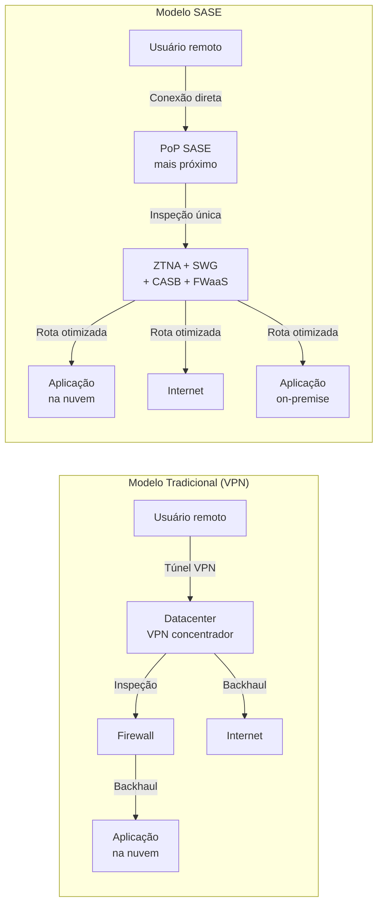
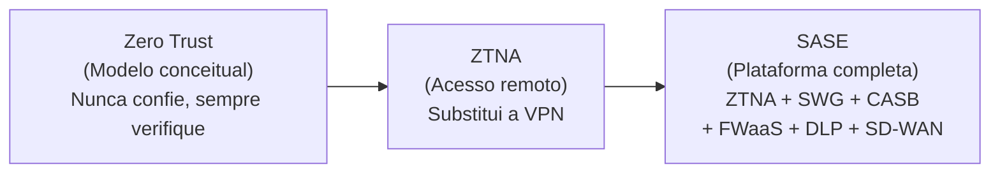
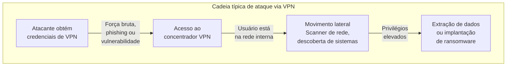

A forma como as pessoas trabalham mudou. Os aplicativos que elas usam também. Mas a segurança de rede de muitas empresas ainda funciona como se fosse 2010: um perímetro fixo, um datacenter central e todos os funcionários dentro do mesmo prédio.

Essa desconexão entre como o trabalho acontece e como a rede é protegida criou um problema grave. As ferramentas que antes funcionavam, como as VPNs corporativas, hoje são um dos principais pontos de entrada para ataques. Em 2025, credenciais de VPN comprometidas foram o vetor inicial em 48% dos ataques de ransomware, segundo dados do setor.

O Secure Access Service Edge, ou SASE, foi criado para resolver esse problema. Ele redefine a segurança de rede para um mundo onde aplicativos estão na nuvem, pessoas trabalham de qualquer lugar e o perímetro deixou de existir.

## Quem criou o SASE e quando

O termo SASE foi cunhado pelo Gartner em 2019. Os analistas Neil MacDonald, Lawrence Orans e Joe Skorupa publicaram o relatório "The Future of Network Security Is in the Cloud" em 30 de agosto de 2019, definindo pela primeira vez o conceito.

Na época, o Gartner colocou o SASE no início do ciclo de hype, estimando de 5 a 10 anos para se tornar mainstream. Em 2026, essa previsão se mostra acertada: o mercado amadureceu, provedores consolidaram suas ofertas, e a maioria das organizações de médio e grande porte está avaliando ou implementando SASE.

O Gartner também definiu em 2021 um subconjunto chamado SSE (Secure Service Edge), que são os componentes de segurança do SASE sem a parte de rede SD-WAN. Isso permite que empresas adotem primeiro a segurança em nuvem e depois integrem a camada de rede.

## Qual o objetivo do SASE

O SASE busca resolver três problemas simultâneos.

O primeiro é a migração para a nuvem. A maioria das empresas hoje roda mais de 80% dos seus aplicativos em SaaS ou infraestrutura cloud. Roteá-los por um datacenter central não faz sentido e adiciona latência desnecessária.

O segundo é o trabalho híbrido e remoto. Pessoas acessam recursos corporativos de casa, do escritório, de cafeterias, de aeroportos. O modelo de segurança precisa seguir o usuário, não o prédio.

O terceiro é a consolidação de ferramentas. A maioria das empresas acumulou ao longo dos anos uma pilha de soluções de segurança separadas: firewall, VPN, proxy web, CASB, DLP, cada um com seu console, suas políticas e seus custos. O SASE unifica esses componentes em uma única plataforma entregue como serviço de nuvem.

A definição original do Gartner é precisa:

> "SASE é uma oferta emergente que combina capacidades abrangentes de WAN com funções abrangentes de segurança de rede (como SWG, CASB, FWaaS e ZTNA) para suportar as necessidades dinâmicas de acesso seguro das empresas digitais."

Ou seja: o SASE não é um produto. É uma arquitetura de rede e segurança entregue da nuvem, baseada na identidade do usuário e do dispositivo, não na localização física.

## Como funciona o SASE na prática

A arquitetura SASE substitui o modelo antigo de "centro e spoke" (todos os usuários se conectam ao datacenter) por uma malha distribuída de pontos de presença (PoPs) na nuvem.

```mermaid
flowchart TB
    subgraph Usuários
        U1[Funcionário<br>remoto]
        U2[Funcionário<br>no escritório]
        U3[Funcionário<br>viajando]
        U4[Parceiro /<br>terceirizado]
    end

    subgraph SASE[Plataforma SASE na nuvem]
        POP1[PoP mais próximo]
        POP2[PoP regional]
        POP3[PoP global]
        ZTNA[ZTNA - Acesso<br>Zero Trust]
        SWG[SWG - Proxy Web<br>e filtragem]
        CASB[CASB - Segurança<br>SaaS]
        FWaaS[FWaaS - Firewall<br>como serviço]
        DLP[DLP - Prevenção<br>de perda de dados]
        SDWAN[SD-WAN - Roteamento<br>inteligente]
    end

    subgraph Destinos
        D1[Aplicações<br>corporativas<br>on-premise]
        D2[Aplicações<br>SaaS<br>(M365, Salesforce)]
        D3[Internet<br>aberta]
    end

    U1 --> SASE
    U2 --> SASE
    U3 --> SASE
    U4 --> SASE

    POP1 --> ZTNA
    POP2 --> ZTNA
    POP3 --> ZTNA

    ZTNA --> SWG
    ZTNA --> CASB
    SWG --> FWaaS
    FWaaS --> DLP
    DLP --> SDWAN

    SDWAN --> D1
    SDWAN --> D2
    SDWAN --> D3
```

O fluxo na prática é:

O usuário se conecta ao ponto de presença (PoP) mais próximo da plataforma SASE através de um agente leve instalado no dispositivo. Tudo é baseado em identidade e política, não em endereço IP.

A plataforma verifica quem é o usuário, em qual dispositivo ele está, se o dispositivo está em conformidade (sistema atualizado, antivírus ativo, disco criptografado), e qual aplicativo ele está tentando acessar. Essas verificações acontecem de forma contínua, não apenas no login.

Com base nessas informações, a plataforma concede acesso ao aplicativo específico, não à rede inteira. O usuário nunca recebe um endereço IP corporativo. A aplicação fica invisível para quem não tem autorização.

Todo o tráfego é inspecionado na borda da nuvem, independente do destino. Tráfego para SaaS passa pelo CASB. Tráfego para a web passa pelo SWG. Tráfego para aplicações internas passa pelo ZTNA. A inspeção acontece uma vez, no ponto de presença, e todas as políticas de segurança são aplicadas ali.



No modelo tradicional com VPN, o tráfego de um usuário remoto para um aplicativo SaaS faz um desvio desnecessário: sai do usuário, vai para o datacenter da empresa, passa pelo firewall, e só então segue para a nuvem. É o chamado backhaul ou hairpin, que adiciona latência e congestiona o link corporativo sem trazer benefício de segurança.

No modelo SASE, o usuário se conecta diretamente ao PoP mais próximo, a inspeção acontece ali, e a rota para o destino é otimizada pelo SD-WAN. O tráfego SaaS nunca passa pelo datacenter da empresa.

## Os componentes do SASE

A arquitetura SASE é composta por seis camadas principais:

**SD-WAN (Software-Defined Wide Area Network).** A camada de rede. Otimiza o roteamento do tráfego entre os pontos de presença e os destinos, escolhendo o caminho mais eficiente para cada sessão.

**ZTNA (Zero Trust Network Access).** Substitui a VPN para acesso a aplicações internas. Concede acesso ao aplicativo específico, não à rede. O usuário nunca é colocado na rede corporativa, o que elimina o movimento lateral.

**SWG (Secure Web Gateway).** Filtra o tráfego de internet, bloqueia sites maliciosos, aplica políticas de uso aceitável e inspeciona tráfego HTTPS para detectar ameaças.

**CASB (Cloud Access Security Broker).** Dá visibilidade e controle sobre o uso de aplicativos SaaS. Detecta shadow IT, controla compartilhamento de dados e aplica políticas de governança.

**FWaaS (Firewall as a Service).** Firewall entregue como serviço de nuvem. Substitui firewalls físicos em filiais e escritórios, com políticas centralizadas.

**DLP (Data Loss Prevention).** Previne que dados sensíveis saiam da organização por qualquer canal: web, email, upload em SaaS ou transferência entre aplicativos.

## SASE e Zero Trust: qual a relação

Zero Trust é o princípio. SASE é a implementação.

O Zero Trust (confiança zero) parte de uma premissa simples: nunca confie, sempre verifique. Um usuário autenticado não é automaticamente confiável. Cada requisição de acesso é avaliada com base em identidade, dispositivo, contexto e política.

O ZTNA (Zero Trust Network Access) é a aplicação prática do Zero Trust para acesso remoto. Ele substitui a VPN garantindo que o usuário acesse apenas o aplicativo autorizado, sem nunca entrar na rede.

O SASE engloba o ZTNA e adiciona todas as outras camadas de segurança em uma plataforma única. A relação é hierárquica: Zero Trust é o modelo conceitual. ZTNA substitui a VPN. SASE substitui a VPN mais o firewall mais o proxy mais o CASB mais o DLP em um único serviço.



## VPN vs SASE: por que a VPN não é mais suficiente

A VPN foi projetada para um mundo que não existe mais. Ela cria um túnel criptografado entre o usuário e a rede corporativa, e uma vez autenticado, o usuário tem acesso amplo à rede interna.

Esse modelo tem problemas estruturais que se agravam com o tempo.

**O perímetro está exposto.** O concentrador de VPN fica em um IP público, visível e escaneável por qualquer atacante na internet. Vulnerabilidades críticas em VPNs têm sido exploradas ativamente. A CISA (agência de segurança cibernética dos EUA) emitiu emergências direcionando agências federais a desconectarem dispositivos Ivanti e Fortinet devido a explorações ativas.

**O usuário tem acesso à rede inteira.** Uma vez autenticado, a VPN coloca o usuário dentro da rede corporativa. Se o dispositivo do usuário está comprometido, o atacante herda todo o alcance de rede daquele usuário e pode se mover lateralmente, escaneando sistemas, descobrindo vulnerabilidades e acessando dados sensíveis. Em 2025, 48% dos ataques de ransomware começaram com uma credencial de VPN comprometida.

**O tráfego SaaS faz um desvio desnecessário.** Roteirizar tráfego do Microsoft 365 ou Salesforce através do datacenter da empresa (backhaul) adiciona latência e não traz segurança, já que o tráfego já está criptografado de ponta a ponta.

**A experiência do usuário é ruim.** VPNs desconectam quando o usuário troca de rede (Wi-Fi para celular), exigindo reconexão manual. A latência adicional prejudica aplicações em tempo real como chamadas de vídeo.

**O custo de manutenção é alto.** Equipamentos VPN precisam de patches constantes, atualizações de firmware, monitoramento de capacidade e eventual substituição de hardware. Cada filial precisa de seu próprio appliance.

**Vulnerabilidades conhecidas.** Algumas das vulnerabilidades mais críticas dos últimos anos afetaram VPNs corporativas:

- Ivanti Connect Secure / Pulse Secure (CVE-2023-46805, CVE-2024-21887): bypass de autenticação e injeção de comandos exploradas ativamente antes de patches existirem.
- Fortinet FortiOS SSL VPN (CVE-2024-21762): execução remota de código sem autenticação.
- Cisco ASA / FTD (CVE-2023-20269): vulnerabilidade de força bruta explorada por grupos de ransomware Akira e LockBit para obter acesso não autorizado.

Em média, uma vulnerabilidade crítica de VPN leva 209 dias para ser corrigida pelas organizações, enquanto atacantes a exploram em 5 dias, segundo relatórios do setor.



## Casos de uso práticos

**Empresa com filiais e trabalho híbrido.** Uma rede de varejo com 30 lojas, matriz e funcionários remotos. Antes, cada loja tinha um firewall físico e os remotos usavam VPN. Com SASE, todos se conectam aos PoPs da plataforma. As lojas não precisam mais de appliances. Remotos não passam por VPN. A política de segurança é a mesma para todos.

**Migração para a nuvem com aplicações on-premise residuais.** Uma empresa de manufatura migrou 70% das aplicações para a nuvem, mas ainda mantém sistemas legados no datacenter. Com SASE, o ZTNA dá acesso seguro às aplicações on-premise sem expor a rede. O tráfego SaaS vai direto para a nuvem sem backhaul.

**Contratação de terceiros e parceiros.** Uma empresa que precisa dar acesso a fornecedores e consultores. No modelo VPN, eles ganhavam acesso à rede inteira. Com SASE, cada parceiro acessa apenas o aplicativo específico de que precisa, com política de tempo limitado e verificação de postura do dispositivo.

**Ambientes regulados.** Instituições financeiras e de saúde que precisam demonstrar controles de acesso granulares para auditoria. O SASE oferece trilhas de auditoria completas, políticas baseadas em identidade e verificação contínua, atendendo a requisitos de normas como PCI DSS, LGPD e NIS2.

## Como começar

A migração de VPN para SASE não precisa ser abrupta. A abordagem recomendada é gradual.

Primeiro, faça um inventário de aplicações que os usuários acessam via VPN e meça a latência atual, o número de incidentes e o tempo gasto pela equipe de TI com suporte a VPN.

Depois, implante o ZTNA para o grupo que mais sofre com VPN: funcionários remotos e viajantes. Mantenha a VPN ativa como fallback.

Então, expanda para filiais com SD-WAN, eliminando firewalls físicos.

Por fim, adicione as camadas de segurança (SWG, CASB, DLP) e descomissiona a VPN.

Organizações que seguem esse roteiro relatam redução de custos operacionais, melhora na experiência do usuário e eliminação de incidentes relacionados a VPN.

## Para quem este artigo é útil

Um CISO de uma empresa de médio porte pode usar este artigo para estruturar a justificativa técnica para uma migração de VPN para SASE, com fontes do Gartner e dados do setor para embasar a decisão.

Um administrador de redes pode entender como o SASE difere do modelo que ele conhece e quais componentes serão substituídos.

Um gestor de TI pode avaliar se o momento é adequado para iniciar uma avaliação de provedores SASE.

Um estudante ou profissional iniciante em segurança pode compreender a evolução das arquiteturas de rede e segurança nos últimos anos.

## Fontes

- Gartner, "The Future of Network Security Is in the Cloud" (30 de agosto de 2019). Autores: Lawrence Orans, Joe Skorupa, Neil MacDonald. ID G00441737.
- Gartner, "Market Trends: How to Win as WAN Edge and Security Converge Into the Secure Access Service Edge" (2019).
- Wikipedia, "Secure Access Service Edge" (verificada em agosto de 2026).
- Always Beyond, "Your VPN Is Now One of Hackers' Favourite Entry Points" (dados de ransomware Q3 2025).
- It-learn.io, "Secure Remote Access Architecture: VPN vs ZTNA vs SASE" (análise comparativa e vulnerabilidades documentadas).
- Zscaler, "SASE vs. VPN: Which Is Better for Secure Remote Work?".
- Jimber.io, "VPN vs SASE: Performance & Security Guide 2026" (NIS2 compliance).

## Conclusão

O SASE representa uma mudança de paradigma, não apenas uma atualização tecnológica. Ele substitui o modelo de perímetro fixo, onde a confiança é concedida por localização, por um modelo baseado em identidade, onde cada acesso é verificado de forma contínua e independente.

A VPN foi a ferramenta certa para o mundo corporativo dos anos 2000. Para o mundo de hoje, com aplicativos na nuvem, equipes distribuídas e ameaças que exploram exatamente as fraquezas do modelo antigo, o SASE oferece uma alternativa mais segura, mais rápida e mais simples de gerenciar.

A adoção não precisa ser imediata nem total. Mas ignorar a direção que o mercado está tomando é um risco que nenhuma organização pode arcar.