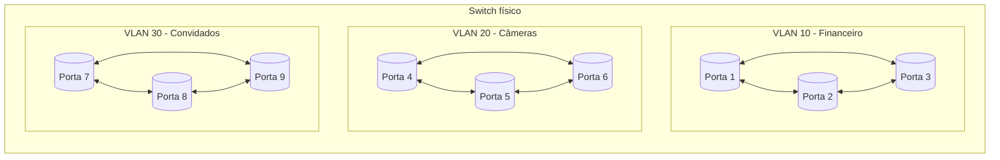
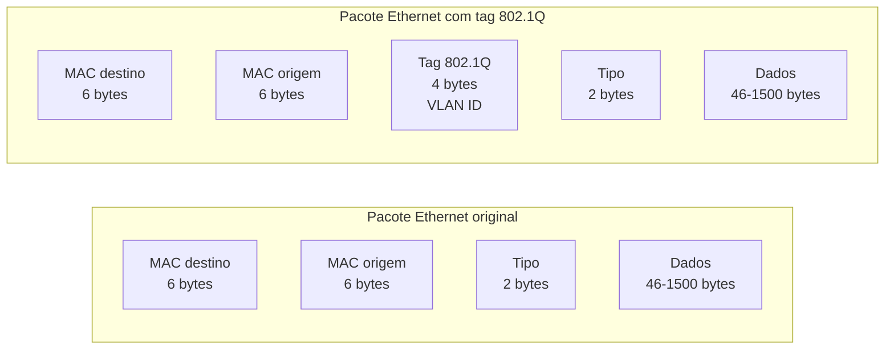
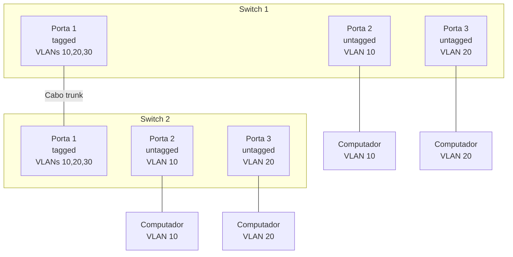
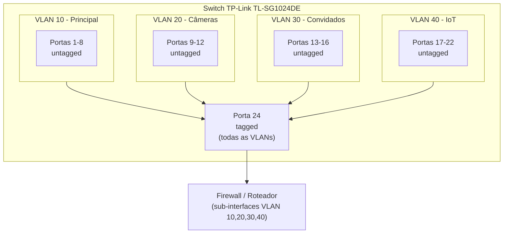
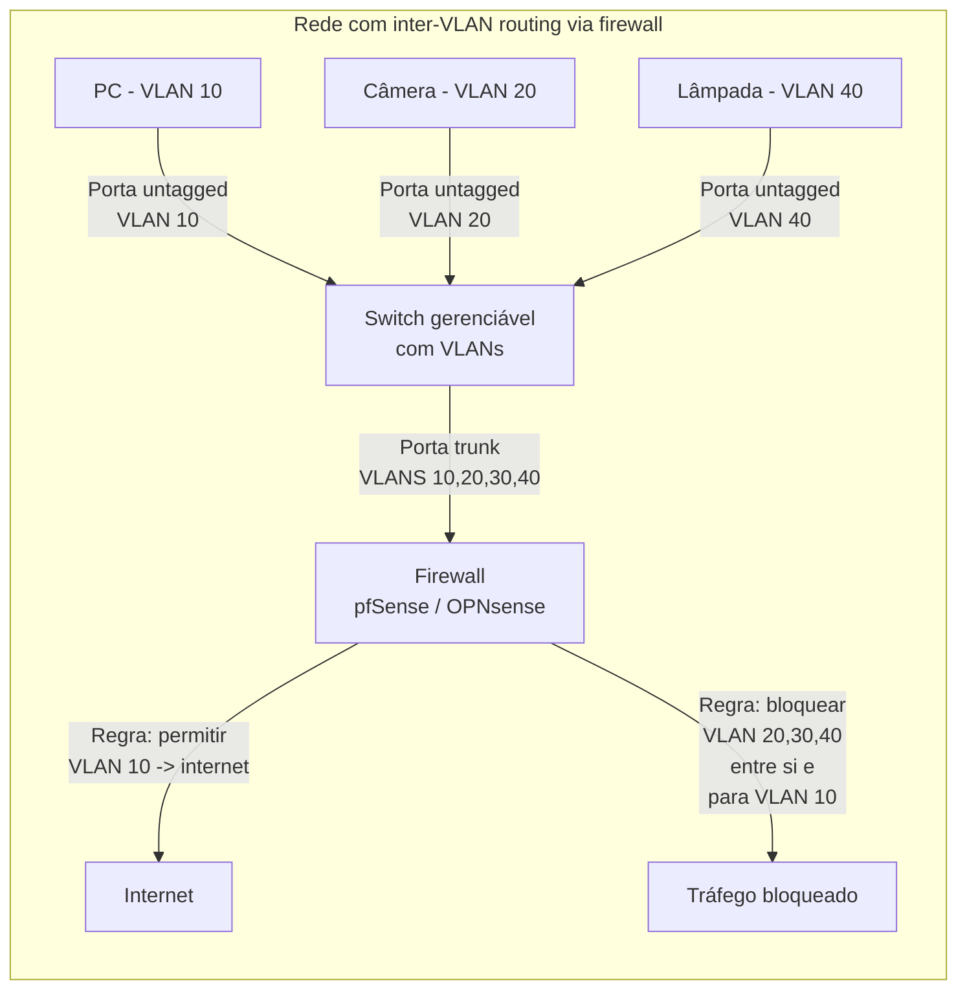

Imagine um prédio de escritórios com três empresas diferentes. Elas compartilham o mesmo espaço físico, mas cada uma tem suas próprias salas, seus próprios funcionários e seus próprios arquivos. Um funcionário da empresa A não pode simplesmente entrar na sala da empresa B e pegar um documento.

Agora imagine que esse prédio é sua rede de computadores. Todos os dispositivos estão conectados aos mesmos cabos e switches. Mas você quer que o servidor de arquivos financeiros não seja acessível pela câmera de segurança da portaria. Que o notebook do estagiário não alcance o banco de dados de produção. Que a TV da sala de reunião, que vive pedindo atualização, não converse com nada além da internet.

Sem separação, tudo se comunica com tudo. E em redes, comunicação indesejada é um problema de segurança e desempenho.

É para isso que servem as VLANs.

## O que é uma VLAN

VLAN é a sigla para Virtual Local Area Network, ou Rede Local Virtual. É um mecanismo que permite dividir um único switch físico em vários switches lógicos, isolando grupos de dispositivos uns dos outros.

Dispositivos na VLAN 10 conversam entre si, mas não enxergam os dispositivos na VLAN 20 ou 30. É como se fossem switches separados, mesmo estando dentro do mesmo equipamento.

O padrão que define como as VLANs funcionam é o **IEEE 802.1Q**, criado em 1998 e presente em qualquer switch gerenciável que você comprar hoje.

## Por que usar VLANs

Os motivos se resumem a três:

**Segurança.** Um dispositivo comprometido em uma VLAN não consegue alcançar dispositivos em outras VLANs sem passar por um roteador ou firewall, onde você pode aplicar regras de bloqueio. Se uma câmera IoT é invadida, ela fica presa na VLAN dela.

**Desempenho.** Redes grandes sofrem com broadcast storms. Toda vez que um dispositivo envia um pacote de broadcast (como uma requisição ARP para descobrir o endereço MAC de outro dispositivo), esse pacote se espalha para todas as portas do switch. Com VLANs, o broadcast fica contido dentro da VLAN. Menos dispositivos por VLAN significa menos tráfego de broadcast para cada um processar.

**Organização.** Você pode agrupar dispositivos por função em vez de por localização física. Um servidor no segundo andar pode estar na mesma VLAN que um servidor no quinto andar, enquanto a impressora ao lado do servidor está em outra VLAN. Tudo é definido por software, sem precisar mexer em cabos.

## Tipos de VLAN: port-based vs 802.1Q

Existem dois modos principais de configurar VLANs em switches gerenciáveis.

**Port-Based VLAN.** Você define manualmente quais portas do switch pertencem a cada VLAN. Um computador ligado na porta 1 está na VLAN 10. Um na porta 5 está na VLAN 20. Simples e direto. O problema é que cada porta só pode pertencer a uma VLAN. Se você precisa que uma porta participe de múltiplas VLANs (como uma porta que conecta dois switches), o modelo port-based não funciona.

**802.1Q Tagged VLAN.** O padrão IEEE 802.1Q resolve essa limitação adicionando um marcador, chamado de tag, dentro do próprio pacote Ethernet. Esse tag é um campo de 4 bytes inserido entre o endereço MAC de origem e o campo de tipo do pacote, contendo o VLAN ID (VID), um número entre 1 e 4094 que identifica a qual VLAN aquele pacote pertence.

Quando o switch recebe um pacote sem tag vindo de um computador (que não sabe nada sobre VLANs), ele adiciona o tag usando o **PVID** (Port VLAN ID) configurado naquela porta. O PVID é o número da VLAN padrão da porta. Por padrão, todas as portas têm PVID 1.

Quando o switch envia um pacote para um computador, ele pode remover o tag (untagged) ou mantê-lo (tagged), dependendo de como a porta foi configurada. Computadores comuns não entendem pacotes com tag 802.1Q, então as portas que conectam dispositivos finais devem ser configuradas como untagged.

## Tagged, Untagged e Trunk

Esses três conceitos são o coração do entendimento de VLANs.

**Untagged.** A porta remove o tag VLAN antes de entregar o pacote ao dispositivo conectado. É o que se usa para conectar computadores, impressoras, servidores e qualquer dispositivo que não saiba lidar com VLANs. O dispositivo recebe o pacote como se fosse uma rede comum.

**Tagged.** A porta mantém o tag VLAN no pacote. É o que se usa para conectar dispositivos que entendem VLANs, como outros switches, roteadores, firewalls ou servidores com placas de rede configuradas para VLAN.

**Trunk.** Na prática, uma porta trunk é uma porta que carrega pacotes **tagged** de múltiplas VLANs simultaneamente. O termo trunk vem do uso de "Port Trunking" ou "Link Aggregation" em alguns equipamentos (como o TP-Link TL-SG1024DE), onde múltiplas portas são combinadas para aumentar banda. Mas no contexto de VLANs, "trunk" virou sinônimo de "porta que carrega múltiplas VLANs tagged".

No diagrama acima, a porta 1 de cada switch está configurada como **tagged** para as VLANs 10, 20 e 30. Isso permite que o cabo entre os dois switches transporte pacotes de todas as três VLANs. Os computadores conectados às portas 2 e 3 recebem pacotes **untagged** apenas da sua VLAN específica.

## Exemplo prático com switch TP-Link TL-SG1024DE

O TP-Link TL-SG1024DE é um switch "Easy Smart" de 24 portas, gerenciável, com suporte a 802.1Q VLAN e um preço acessível. Ele é um ótimo exemplo porque representa o ponto de entrada para quem quer sair de switches não gerenciáveis e começar a segmentar a rede.

### Cenário

Você tem em casa ou no escritório:

- Rede principal com computadores, servidores e impressoras (VLAN 10)
- Câmeras IP de segurança (VLAN 20)
- Rede de convidados (VLAN 30)
- Dispositivos IoT (lâmpadas, tomadas inteligentes, TVs) (VLAN 40)

Você quer que todos compartilhem o mesmo switch físico, mas que não se enxerguem. A configuração no TL-SG1024DE seria:

**Passo 1:** Acessar a interface web do switch e habilitar o modo 802.1Q VLAN.

**Passo 2:** Criar as VLANs:

| VLAN ID | Nome | Portas |
|---|---|---|
| 10 | Principal | 1-8 (untagged), 24 (tagged) |
| 20 | Câmeras | 9-12 (untagged), 24 (tagged) |
| 30 | Convidados | 13-16 (untagged), 24 (tagged) |
| 40 | IoT | 17-22 (untagged), 24 (tagged) |

**Passo 3:** Configurar o PVID de cada porta:

| Porta | PVID | VLAN associada |
|---|---|---|
| 1-8 | 10 | Principal |
| 9-12 | 20 | Câmeras |
| 13-16 | 30 | Convidados |
| 17-22 | 40 | IoT |
| 24 | 1 | Trunk (a porta recebe pacotes de todas as VLANs) |

**Passo 4:** Conectar a porta 24 ao roteador ou firewall, que deve ter uma sub-interface configurada para cada VLAN.

Quando um computador na porta 3 envia um pacote, o switch:
1. Recebe o pacote sem tag
2. Adiciona o tag com VLAN ID 10 (baseado no PVID da porta 3)
3. Encaminha o pacote apenas para as portas que também pertencem à VLAN 10 (portas 1-8 e a porta 24 tagged)
4. Remove o tag antes de entregar o pacote aos computadores nas portas 1-8

Uma câmera na porta 10 jamais verá esse pacote. O switch descarta o tráfego entre VLANs no nível hardware.

## VLAN, Subnet e VNet: qual a diferença?

É comum ver esses termos sendo usados como se fossem a mesma coisa. Não são. Cada um opera em uma camada diferente do modelo OSI e resolve problemas diferentes.

**Subnet (sub-rede).** É um conceito da camada 3 (rede). Uma subnet divide um espaço de endereços IP em blocos menores. Em vez de usar 192.168.0.0/16 inteiro, você cria 192.168.10.0/24 para um departamento e 192.168.20.0/24 para outro. Duas subnets diferentes não conversam diretamente sem um roteador.

Subnets organizam **endereços IP**. Elas existem com ou sem VLANs. Você pode ter duas subnets no mesmo switch sem VLANs, mas aí elas estariam no mesmo domínio de broadcast e a separação seria apenas lógica, não física. Um dispositivo poderia trocar de subnet mudando o IP, sem mudar de porta.

**VLAN.** É um conceito da camada 2 (enlace). Uma VLAN isola o tráfego no nível do switch. Dispositivos em VLANs diferentes não trocam quadros Ethernet entre si. A separação é real, no hardware: o switch trata cada VLAN como uma tabela de endereços MAC separada.

**VNet (Rede Virtual na nuvem).** É um conceito de infraestrutura cloud. AWS VPC, Azure VNet e GCP VPC são redes virtuais isoladas que você cria dentro do datacenter do provedor. Elas combinam conceitos de subnet e VLAN em um único serviço gerenciado: você define blocos de IP, cria subnets, configura tabelas de roteamento e grupos de segurança, tudo sem tocar em hardware.

A tabela a seguir resume as diferenças:

| | VLAN | Subnet | VNet |
|---|---|---|---|
| Camada OSI | 2 (Enlace) | 3 (Rede) | 2 + 3 (abstração cloud) |
| O que isola | Portas do switch e quadros Ethernet | Endereços IP e roteamento | Rede inteira na nuvem |
| Identificador | VLAN ID (1-4094) | CIDR (ex: 192.168.10.0/24) | Nome da VNet + CIDR |
| Onde é configurado | Switches gerenciáveis | Roteadores e servidores DHCP | Console do provedor cloud |
| Precisa de hardware | Sim (switch gerenciável) | Não (qualquer roteador faz) | Não (tudo virtualizado) |
| Exemplo | TL-SG1024DE configurando portas | 192.168.10.0/24 no DHCP | aws_vpc no Terraform |

Na prática, você usa VLANs e Subnets juntas. A melhor prática é **uma VLAN = uma Subnet**. A VLAN isola na camada 2, a subnet organiza na camada 3, e o roteador (ou firewall) faz a ponte entre elas aplicando regras de segurança.

Por exemplo: VLAN 10 recebe a subnet 192.168.10.0/24. VLAN 20 recebe 192.168.20.0/24. Um firewall faz o roteamento entre elas, permitindo apenas o tráfego necessário.

## A limitação das VLANs: comunicação entre VLANs

VLANs isolam, mas em algum momento você precisa que diferentes grupos conversem. O servidor de arquivos na VLAN 10 precisa ser acessado pelos computadores na VLAN 30 (convidados)? Provavelmente não. Mas os computadores na VLAN 10 precisam acessar a internet, e ela está em outra rede.

Para permitir comunicação entre VLANs, você precisa de um dispositivo que faça roteamento, que pode ser:

**Router-on-a-stick.** Um roteador com uma única interface física conectada ao switch via uma porta trunk. O roteador cria sub-interfaces virtuais, uma para cada VLAN, cada uma com seu próprio endereço IP. O tráfego entre VLANs passa pelo roteador, que decide se permite ou bloqueia.

**Switch layer 3 (SVI).** Switches mais avançados (como o TP-Link TL-SG3424 ou um Cisco Catalyst) conseguem fazer roteamento internamente, usando Switch Virtual Interfaces (SVIs). Você cria uma interface virtual para cada VLAN, atribui um IP, e o switch roteia entre elas em hardware, sem precisar de um roteador externo.

**Firewall.** Um firewall (como pfSense, OPNsense, ou um appliance físico) conectado ao switch via trunk pode fazer o roteamento entre VLANs e aplicar políticas de segurança granulares. Esta é a opção mais segura.

## Casos de uso

**Homelab com servidores e serviços.** Um entusiasta tem um servidor Proxmox, um NAS, containers Docker e computadores pessoais. Ele cria VLAN 10 para a rede principal, VLAN 50 para servidores (acessível apenas da VLAN 10 via firewall), e VLAN 99 para management dos switches e roteadores.

**Escritório com departamentos separados.** Uma empresa separa os computadores do financeiro em VLAN 10, do comercial em VLAN 20, e da TI em VLAN 30. Cada VLAN tem sua própria subnet. O firewall permite que todos acessem a internet, mas bloqueia o acesso do comercial ao servidor financeiro.

**Rede de convidados.** Uma loja oferece Wi-Fi para clientes. O roteador cria uma VLAN específica para convidados, com acesso apenas à internet. Clientes não alcançam os computadores do caixa nem as impressoras.

**IoT isolado.** Lâmpadas inteligentes, tomadas, campainhas e aspiradores robôs vão para uma VLAN separada. Eles têm acesso à internet (para funcionar), mas não conversam com o resto da rede. Se algum fabricante chinês decidir escanear a rede local, ele só encontra outros dispositivos IoT.

## Como testar sem comprar equipamento novo

Se você não tem um switch gerenciável, mas quer experimentar VLANs, existem duas formas:

**VM com Open vSwitch.** Dentro do Proxmox ou VMware, você cria um switch virtual com VLANs usando o Open vSwitch. As VMs são conectadas a portas de diferentes VLANs. É um ambiente seguro para testar configurações antes de aplicar no hardware.

**Roteador virtual (pfSense/OPNsense).** O pfSense consegue criar VLANs virtuais nas interfaces de rede. Você pode simular a segmentação entre diferentes sub-redes sem precisar de um switch físico gerenciável. O isolamento não será no nível da camada 2 (porque tudo passa pela mesma interface física), mas o roteamento e as regras de firewall serão exatamente as mesmas.

## Limitações das VLANs

VLANs não resolvem tudo.

**Não substituem um firewall.** VLANs isolam no nível do switch, mas qualquer dispositivo que faça roteamento entre VLANs pode quebrar o isolamento se configurado errado. Um firewall é necessário para aplicar regras.

**O limite é 4094 VLANs.** O campo VLAN ID no padrão 802.1Q tem 12 bits, permitindo no máximo 4094 VLANs (os IDs 0 e 4095 são reservados). Para a maioria dos cenários, isso é suficiente. Para grandes provedores, existem extensões como Q-in-Q.

**Switches não gerenciáveis não suportam.** Se seu switch é daqueles que você compra por cinquenta reais sem nenhuma opção de configuração, ele não faz VLANs. Todo dispositivo conectado a ele está na mesma rede, ponto final.

**Configuração requer planejamento.** VLANs mal configuradas podem isolar dispositivos que precisam se comunicar, ou pior, criar brechas de segurança se o trunk não for protegido.

## Links úteis

- **Padrão IEEE 802.1Q:** [ieee802.org](https://www.ieee802.org/1/pages/802.1Q.html)
- **TP-Link TL-SG1024DE (Easy Smart Switch):** [tp-link.com](https://www.tp-link.com/us/business-networking/easy-smart-switch/tl-sg1024de/)
- **Manual do TL-SG1024DE (PDF):** [Guia do usuário](https://static.tp-link.com/TL-SG1024DE(UN)_V2_UG_1478227605744t.pdf)
- **Guia de configuração 802.1Q VLAN TP-Link:** [How to configure 802.1Q VLAN](https://www.tp-link.com/us/support/faq/328/)
- **pfSense (firewall para inter-VLAN routing):** [pfsense.org](https://www.pfsense.org/)

## Conclusão

VLANs são a ferramenta fundamental para organizar redes que cresceram além de um punhado de dispositivos. Elas permitem que tudo compartilhe o mesmo cabo sem se misturar, melhorando segurança, desempenho e organização.

A beleza do conceito está na simplicidade: um switch gerenciável de entrada, como o TP-Link TL-SG1024DE, combinado com algumas configurações de 802.1Q, transforma uma rede plana e insegura em uma rede segmentada e controlada.

O passo seguinte, depois de dominar VLANs, é colocar um firewall entre elas para decidir o que pode ou não passar. Mas a base de tudo é entender que na camada 2, o switch pode separar o que o cabo une. E com VLANs, você faz exatamente isso: tudo junto, mas nada misturado.