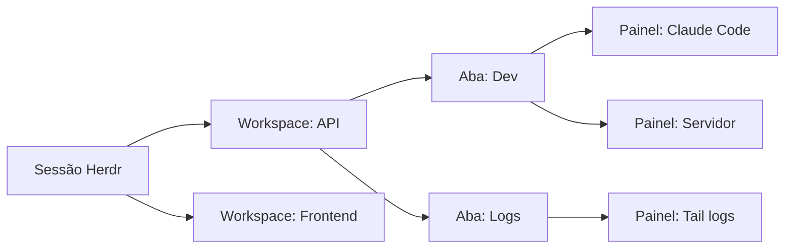

Rodar um agente de IA no terminal é simples. Rodar cinco deles em máquinas diferentes já é outro problema. Saber o que cada um está fazendo sem abrir uma janela para cada um é algo que o terminal tradicional não resolve.

O tmux mantém sessões vivas quando você fecha o laptop. O Zellij adiciona uma interface mais moderna. Mas nenhum dos dois entende que dentro daquele terminal tem um agente de IA. Esse agente pode estar processando, esperando sua resposta ou simplesmente parado.

O Herdr foi construído para preencher essa lacuna.


## O que é o Herdr

O Herdr é um multiplexer de terminais escrito em Rust. Foi criado por Can Celik e incubado no Y Combinator. O nome vem de "herder" (pastor). A ferramenta foi desenhada para pastorear múltiplos agentes de IA rodando em paralelo.

A ideia central é simples. Em vez de você gerenciar vários terminais ou abas do tmux procurando qual agente terminou ou travou, o Herdr mostra o estado de cada um em um painel lateral. Verde para ocioso, amarelo para trabalhando, vermelho para bloqueado esperando input. Você vê tudo de uma vez e clica para entrar no terminal que precisa.

## O que o torna diferente

Diferente do tmux, que trata todos os terminais como anônimos, o Herdr identifica qual processo está rodando em cada painel. Ele reconhece Claude Code, Codex, Cursor, OpenCode e vários outros agentes automaticamente. Não precisa de configuração.

Ele também funciona como um servidor em background. Você fecha o laptop e os agentes continuam rodando. Volta depois e reconecta de qualquer terminal ou via SSH. O layout está exatamente como você deixou.

### Herdr vs tmux: o que muda

É comum pensar que Herdr e tmux fazem a mesma coisa. Os dois são multiplexers de terminal, os dois mantêm sessões vivas depois que você desconecta, os dois permitem dividir a tela em painéis. As semelhanças param por aí.

O tmux foi criado em 2007, numa época em que ninguém imaginava agentes de IA rodando dentro de terminais. Ele trata todos os processos como anônimos. Para o tmux, um Claude Code rodando é a mesma coisa que um `htop` ou um `vim`. Não há como saber, olhando a lista de painéis, qual deles terminou uma tarefa e qual está esperando sua resposta.

O Herdr foi construído dezessete anos depois, com um problema diferente em mente. Ele sabe que dentro de um painel pode haver um agente de IA. Ele mostra o estado de cada um com bolinhas coloridas no painel lateral. Ele expõe uma API para que os próprios agentes possam se coordenar. E ele tem um sistema de plugins que permite estender o comportamento sem recompilar o binário.

Outra diferença prática: o tmux não tem um comando nativo para conectar a sessões remotas. Você precisa envolver tudo em SSH manualmente. O Herdr tem um comando `--remote` que faz isso em um passo só, instalando o binário no servidor remoto se necessário e preservando suas teclas de atalho e área de transferência.

O resumo é simples: o tmux multiplexa terminais anônimos. O Herdr multiplexa terminais que podem conter agentes de IA e dá a você visibilidade e controle sobre eles.

## Como funciona na prática

A instalação é uma linha de comando:

```bash
curl -fsSL https://herdr.dev/install.sh | sh
```

Ou via Homebrew:

```bash
brew install herdr
```

Depois de instalado, você inicia o Herdr:

```bash
herdr
```

A interface abre com um workspace vazio e um painel lateral. Você cria workspaces com a tecla `n`, divide painéis com `v` (vertical) ou `-` (horizontal). Dentro de cada painel você roda seus agentes normalmente.

O atalho padrão é `ctrl+b`, igual ao tmux. `ctrl+b q` desconecta, e `herdr` reconecta. Tudo que você conhece do tmux funciona, mas com detecção de estado de agente e suporte a mouse.

### Estados dos agentes

O painel lateral do Herdr mostra o estado de cada agente com bolinhas coloridas:

- **Verde**: agente ocioso, você já viu o resultado
- **Amarelo**: agente trabalhando
- **Vermelho**: agente bloqueado, esperando sua resposta
- **Azul**: agente terminou mas você ainda não olhou

A detecção funciona por heurísticas. O Herdr identifica o processo em foreground de cada painel. Ele lê a saída do terminal em tempo real, procurando padrões como spinners, mensagens de "waiting for input" e indicadores de execução de ferramentas. Tudo isso acontece sem que o agente precise reportar o próprio estado.

Para agentes com integração oficial, o Herdr consegue ir além. Ele recupera a sessão do agente mesmo depois de um restart completo do servidor.

#### Agentes detectados automaticamente

O Herdr detecta 20 agentes diferentes sem configuração adicional. A detecção funciona por três mecanismos:

- Manifestos de tela: o Herdr lê a saída do terminal e reconhece spinners, prompts de aprovação e mensagens de espera para cada agente
- Hooks de ciclo de vida: alguns agentes reportam estado diretamente (idle, working, blocked) com precisão total
- Identidade de sessão: o Herdr recupera a sessão após restart do servidor

**Agentes com detecção automática:**

- Claude Code: sessão e estado por manifesto de tela
- Codex CLI: sessão e estado por manifesto de tela
- Cursor Agent CLI: sessão e estado por manifesto de tela
- OpenCode: hooks de ciclo de vida e manifesto de tela
- Grok CLI: sessão e estado por manifesto de tela
- GitHub Copilot CLI: sessão por integração
- Pi: hooks de ciclo de vida (estado completo)
- OMP: hooks de ciclo de vida (estado completo)
- Droid: sessão por integração
- Kimi Code CLI: hooks de ciclo de vida (estado completo)
- Kilo Code CLI: hooks de ciclo de vida e manifesto de tela
- Hermes Agent: sessão por integração
- Devin CLI: sessão por integração
- Qoder CLI: sessão por integração
- Qwen Code: sessão por integração
- MastraCode: hooks de ciclo de vida (estado completo)
- Amp: manifesto de tela (sem integração)
- Antigravity CLI: sessão por integração
- Kiro CLI: manifesto de tela (sem integração)
- Maki: manifesto de tela (sem integração)

Além destes, Gemini CLI e Cline têm detecção parcial. Agentes não listados rodam normalmente como processos de terminal. O Herdr funciona como gerenciador de workspaces para qualquer CLI, mas sem a detecção de estado automática.

Para reportar estado manualmente de qualquer processo, existe o sistema de hooks de ciclo de vida. Um script ou plugin pode chamar `herdr agent report-agent` para informar que um painel está idle, working ou blocked.

## Recursos avançados

### API Socket completa

O Herdr expõe uma API sobre socket local com dezenas de métodos. Além dos comandos CLI mencionados, a API permite:

- Subscrever eventos em tempo real: quando um agente muda de estado, quando um painel recebe saída nova, quando um workspace é criado ou fechado
- Controlar plugins: instalar, ativar, desativar e invocar ações
- Gerenciar worktrees Git: criar checkouts como workspaces do Herdr
- Exportar e importar layouts completos da sessão
- Controlar popups e notificações programaticamente

### Restauração de sessão

O Herdr salva o layout da sessão em disco. Se o servidor reiniciar, ele restaura workspaces, abas, painéis e diretórios de trabalho. Para agentes com integração oficial, ele também retoma a sessão do agente usando o ID nativo de cada um. Isso significa que um Claude Code ou Codex que estava rodando volta ao estado anterior sem perder o histórico.

### Notificações

O Herdr notifica você quando um agente em background termina ou precisa de atenção. Três níveis de notificação:

- `herdr`: notificação dentro da própria interface do Herdr
- `terminal`: notificação no terminal externo, funciona também por SSH
- `system`: notificação do sistema operacional (macOS, Linux, Windows)

### Suporte a mouse

Diferente do tmux, que trata mouse como recurso secundário, o Herdr é nativo para mouse. Você pode:

- Clicar em painéis para selecionar
- Arrastar bordas para redimensionar
- Clicar com botão direito para menu de contexto
- Arrastar abas para reordenar
- Scroll na sidebar para navegar workspaces
- Selecionar texto com o mouse e copiar automaticamente para a área de transferência

O suporte a mouse funciona também sobre SSH e em clientes móveis.

### Plugins e marketplace

O Herdr tem um sistema de plugins onde cada plugin é um executável com manifesto `herdr-plugin.toml`. Não existe SDK separado: o CLI do Herdr é a API do plugin. O marketplace oficial lista mais de 700 plugins, instaláveis via GitHub shorthand:

```bash
herdr plugin install ogulcancelik/herdr-plugin-examples/tree-bootstrap
```

Os plugins podem criar novos painéis, adicionar hooks de evento, executar ações no servidor e estender qualquer parte da interface.

### Herdr M (app desktop)

Além do TUI no terminal, o Herdr tem um app macOS nativo chamado Herdr M. Ele wrappa as mesmas sessões em uma interface convencional com janelas, acesso a arquivos e conexões remotas. Como o dispositivo é vinculado à mesma sessão, você pode fechar o terminal no meio de uma tarefa e continuar de onde parou no app.

### Temas e configuração

O Herdr funciona sem arquivo de configuração. Quando você precisa personalizar, o arquivo fica em `~/.config/herdr/config.toml`. É possível configurar:

- Keybindings completos (prefixo, atalhos, modo resize)
- Layout da sidebar (largura, colapsar automaticamente, seções)
- Notificações (tipo, posição, delay)
- Tema de cores
- Comportamento do scrollback
- Limites de histórico dos painéis

## Adaptação a diferentes dispositivos

O Herdr funciona em laptop, desktop, tablet e celular. A adaptação é automática.

### Uso em desktop e laptop

No desktop, o Herdr mostra a interface completa com sidebar expandida, painéis lado a lado e menus de contexto. O layout é o mesmo do tmux, mas com detecção de agente e suporte a mouse.

### Uso em tablet e celular

Em dispositivos móveis, o Herdr pode ser acessado de duas formas:

**Via SSH direto:** instale qualquer cliente SSH no celular (Moshi no iOS, Termux no Android, Blink, Termius). Conecte ao servidor onde os agentes rodam e execute `herdr`. A TUI se adapta automaticamente a telas estreitas. A sidebar é escondida e substituída por um menu switcher. O layout dos painéis muda para coluna única. O suporte a mouse e toque funciona sobre SSH.

```bash
# Do celular, via SSH
ssh usuario@servidor
herdr
```

O site oficial recomenda o app Moshi (iOS) que tem suporte nativo ao Herdr. Você gerencia agentes do iPhone como se estivesse no desktop.

**Via Herdr M (app desktop):** no macOS, o Herdr M funciona como alternativa à interface TUI para quem prefere janelas convencionais.

**Via herdr-web:** existe um projeto mantido pela comunidade que roda o TUI real do Herdr no navegador como PWA instalável. Usa xterm.js para transmitir o terminal via WebSocket. Funciona em qualquer dispositivo com navegador, incluindo celular.

### Thin client remoto

O comando `--remote` transforma o Herdr local em um cliente leve para uma sessão remota:

```bash
herdr --remote ssh://usuario@servidor
```

Isso é mais responsivo que SSH bruto em conexões lentas, porque apenas os dados de renderização trafegam pelo socket. O clipboard local funciona, inclusive para imagens. As teclas de atalho configuradas localmente são preservadas mesmo na sessão remota.

### Limitação conhecida em multi-cliente

Quando um cliente móvel (janela estreita) se conecta a uma sessão que já tem um cliente desktop conectado, a sessão compartilhada se ajusta ao menor tamanho entre os clientes. Isso pode fazer os painéis no desktop ficarem estreitos temporariamente. O time do Herdr considera adicionar redimensionamento por cliente no futuro.

O Herdr organiza o trabalho em três níveis.

Um workspace corresponde a um projeto ou contexto. Dentro de cada workspace você pode ter múltiplas abas. Cada aba pode ter múltiplos painéis lado a lado, como no tmux.

Um workspace pode conter um agente de backend, outro de frontend, um terminal para logs do servidor e outro para testes. O painel lateral mostra o estado resumido de cada workspace. Você vê de relance se algo está bloqueado sem precisar entrar em cada um.



## Persistência e acesso remoto

O Herdr é um servidor que roda em background. Você pode desconectar e a sessão continua viva. Pode reconectar de qualquer lugar.

```bash
# De outro computador, via SSH
ssh usuario@servidor
herdr
```

A sessão está exatamente como você deixou. Os agentes continuaram trabalhando enquanto você estava offline.

Para usar o Herdr remotamente de forma mais direta:

```bash
herdr --remote ssh://usuario@servidor
```

Esse comando conecta o Herdr local a uma sessão remota. Ele instala o binário no servidor se necessário. O clipboard local funciona, inclusive para imagens. As teclas de atalho que você configurou são preservadas.

## Agentes podem usar o Herdr também

Um dos diferenciais mais interessantes do Herdr é que os próprios agentes podem interagir com ele. A ferramenta expõe uma API via socket local. Ela permite criar workspaces, dividir painéis, enviar comandos e esperar que outro agente termine.

```bash
# Um agente pode criar um workspace
herdr workspace create --cwd ~/projeto --label backend

# Dividir um painel
herdr pane split 1-1 --direction right

# Esperar outro agente terminar
herdr wait agent-status 1-1 --status done

# Ler a saída de um painel
herdr pane read 1-2 --source recent-unwrapped
```

Isso transforma o Herdr de um gerenciador passivo em uma plataforma de orquestração. Um agente coordenador pode lançar tarefas em paralelo, monitorar o progresso de cada uma e só prosseguir quando todas terminarem.

## Plugins

O Herdr suporta plugins que estendem painéis e fluxos de trabalho. Um plugin é qualquer executável com um manifesto `herdr-plugin.toml`. Pode ser escrito em Bash, JavaScript, Lua, Rust ou qualquer linguagem que a máquina execute.

Não existe SDK separado. Tudo que você pode fazer com o CLI do Herdr, um plugin também pode fazer. Isso geralmente acontece através da variável `HERDR_BIN_PATH`. O marketplace oficial já lista mais de 700 plugins.

## Agentes detectados automaticamente

O Herdr detecta o estado dos seguintes agentes sem configuração adicional:

- Claude Code
- Codex CLI
- Cursor Agent
- OpenCode
- Grok
- GitHub Copilot CLI
- Pi
- Droid
- Kimi

Para qualquer outro agente CLI, o Herdr ainda funciona como gerenciador de workspaces. Você só não tem a detecção de estado automática. Mas pode usar o sistema de hooks para reportar estado manualmente.

## Comparação com alternativas

| Funcionalidade | tmux | Zellij | Herdr |
|---|---|---|---|
| Sessões persistentes | Sim | Sim | Sim |
| Acesso remoto via SSH | Sim | Sim | Sim |
| Detecção de estado do agente | Não | Não | Sim |
| API para agentes | Scriptável | Limitado | Nativo |
| Mouse | Limitado | Sim | Sim |
| Plugin marketplace | Não | Parcial | 700+ plugins |
| Instalação | Sistema | Brew/Binário | Brew/Binário |
| Licença | BSD | MIT | Apache 2.0 / AGPL |

## Para quem é o Herdr

O Herdr é útil se você roda múltiplos agentes de IA em paralelo. Ele ajuda quando você precisa saber qual deles está esperando você, sem abrir cada terminal. Também é útil se você quer que seus agentes se coordenem entre si.

Não é uma ferramenta para substituir seu terminal. O Herdr roda dentro do Ghostty, Alacritty, Kitty, WezTerm e até dentro do próprio tmux. Ele é uma camada a mais, não um ambiente novo.

Também não é um gerenciador de agentes no sentido de "app que roda agentes para você". Ele gerencia os terminais onde seus agentes rodam. Os agentes são os mesmos que você já usa.

## Links úteis

- Site oficial: [herdr.dev](https://herdr.dev)
- Repositório GitHub: [github.com/herdrdev/herdr](https://github.com/herdrdev/herdr)
- Documentação: [herdr.dev/docs](https://herdr.dev/docs)
- Instalação: [herdr.dev/install](https://herdr.dev/install)

## Conclusão

O Herdr resolve um problema que o tmux e o Zellij nunca enfrentaram. Eles foram criados antes dos agentes de IA se tornarem ferramentas de trabalho comuns. Um multiplexer de terminais tradicional trata todos os processos como anônimos. O Herdr sabe que dentro de um painel pode ter um agente que está processando, esperando resposta ou simplesmente parado. Ele mostra isso para você sem que você precise adivinhar.

A combinação de persistência remota, detecção de estado e API para agentes faz dele uma peça de infraestrutura que vai além de um simples gerenciador de janelas. Para quem trabalha com múltiplos agentes em paralelo, especialmente em máquinas diferentes, o Herdr preenche um vazio que nenhuma outra ferramenta cobre.