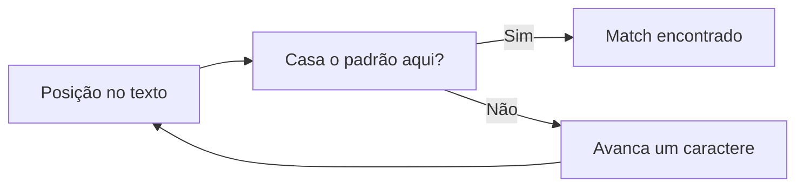
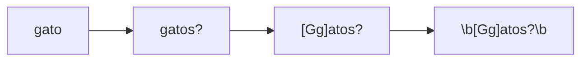
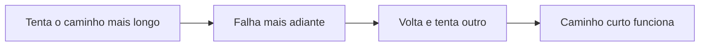

<style>
  /*
    Estilos locais do artigo de regex.
    Motivo: o global.css nao estiliza <details>/<summary> nem prove um callout.
    Tudo aqui e escopado por classes proprias para nao vazar para outros artigos.
    Usa apenas os tokens de design ja existentes no global.css.
  */
  .artigo-regex .nota {
    margin: var(--space-6) 0;
    padding: var(--space-4) var(--space-5);
    border-radius: var(--radius-sm);
    border-left: 3px solid var(--color-accent);
    background: var(--color-surface-muted);
    font-size: 0.98rem;
  }

  .artigo-regex .nota p {
    margin: 0;
  }

  .artigo-regex .nota p + p {
    margin-top: var(--space-3);
  }

  .artigo-regex .nota-rotulo {
    display: block;
    font-family: var(--font-ui);
    font-size: 0.78rem;
    font-weight: 600;
    text-transform: uppercase;
    letter-spacing: 0.04em;
    color: var(--color-text-muted);
    margin-bottom: var(--space-2);
  }

  .artigo-regex .nota-atencao {
    border-left-color: #b45309;
  }

  .artigo-regex .nota-erro {
    border-left-color: #b91c1c;
  }

  .artigo-regex .nota-dica {
    border-left-color: #15803d;
  }

  :root[data-theme='dark'] .artigo-regex .nota-atencao {
    border-left-color: #f59e0b;
  }

  :root[data-theme='dark'] .artigo-regex .nota-erro {
    border-left-color: #f87171;
  }

  :root[data-theme='dark'] .artigo-regex .nota-dica {
    border-left-color: #4ade80;
  }

  /* Bloco de anatomia: quebra a regex em partes com rotulo textual.
     A cor e reforco; o rotulo carrega o significado (acessibilidade). */
  .artigo-regex .anatomia {
    margin: var(--space-6) 0;
    padding: var(--space-4) var(--space-5);
    border: 1px solid var(--color-border);
    border-radius: var(--radius-sm);
    font-size: 0.98rem;
  }

  .artigo-regex .anatomia-regex {
    font-family: 'SFMono-Regular', Consolas, 'Liberation Mono', Menlo, monospace;
    font-size: 1.15rem;
    letter-spacing: 0.06em;
    display: block;
    margin-bottom: var(--space-4);
  }

  .artigo-regex .ancora {
    color: #1d4ed8;
  }

  .artigo-regex .classe {
    color: #15803d;
  }

  .artigo-regex .quant {
    color: #c2410c;
  }

  .artigo-regex .grupo {
    color: #7e22ce;
  }

  .artigo-regex .literal {
    color: var(--color-text-muted);
  }

  :root[data-theme='dark'] .artigo-regex .ancora {
    color: #93c5fd;
  }

  :root[data-theme='dark'] .artigo-regex .classe {
    color: #86efac;
  }

  :root[data-theme='dark'] .artigo-regex .quant {
    color: #fdba74;
  }

  :root[data-theme='dark'] .artigo-regex .grupo {
    color: #d8b4fe;
  }

  .artigo-regex .anatomia ul {
    margin: 0;
    padding-left: 1.2em;
  }

  .artigo-regex .anatomia li {
    margin-bottom: var(--space-2);
  }

  .artigo-regex .anatomia code {
    font-size: 0.92em;
  }

  /* <details> para as respostas dos exercicios (global.css nao estiliza). */
  .artigo-regex details {
    margin: var(--space-4) 0;
    padding: var(--space-3) var(--space-4);
    border: 1px solid var(--color-border);
    border-radius: var(--radius-sm);
    background: var(--color-surface-muted);
  }

  .artigo-regex details summary {
    cursor: pointer;
    font-family: var(--font-ui);
    font-weight: 600;
    font-size: 0.95rem;
  }

  .artigo-regex details[open] summary {
    margin-bottom: var(--space-3);
  }

  .artigo-regex details p {
    margin-bottom: var(--space-3);
  }

  .artigo-regex details p:last-child {
    margin-bottom: 0;
  }

  /* Tabela da folha de consulta: rolagem horizontal no celular em vez de
     espremer as colunas. */
  .artigo-regex .tabela-rolavel {
    overflow-x: auto;
    margin: var(--space-6) 0;
  }

  .artigo-regex .tabela-rolavel table {
    margin: 0;
    min-width: 34rem;
  }

  .artigo-regex .desafio {
    margin: var(--space-6) 0;
    padding-left: var(--space-5);
    border-left: 2px dashed var(--color-border);
  }
</style>

<div class="artigo-regex">


A primeira vez que você encara uma expressão regular, ela parece ter sido digitada por alguém que caiu no teclado. Uma sopa de barras invertidas, chaves, parênteses e asteriscos, sem nenhum ponto de entrada óbvio.

A segunda vez, você copia uma regex do Stack Overflow, funciona, e você segue em frente sem entender o que ela faz. Isso resolve o problema de hoje e cria o de amanhã.

Regex não é difícil. Ela é **densa**. Cada símbolo carrega bastante significado, e é por isso que ela assusta. Mas existe um vocabulário pequeno por trás de toda essa pontuação, e depois que ele entra na cabeça, ler uma expressão regular vira uma leitura normal, da esquerda para a direita.

Este guia constrói esse vocabulário em ordem. Começa com uma palavra literal, termina com lookaround e backtracking. Cada conceito novo entra em cima do anterior, e nenhuma expressão aparece sem ser explicada.

Se você trabalha com Linux, redes, desenvolvimento ou segurança, regex deixa de ser opcional em algum momento. Ela está no `grep`, no `sed`, no `nginx`, no `journalctl`, no filtro do seu editor, no WAF, e no primeiro dia de qualquer script que processa texto.

## O que é uma expressão regular

Uma expressão regular é uma **descrição de um padrão de texto**. Nada mais do que isso.

Em vez de dizer "procure a palavra gato", você diz "procure a palavra gato, mas aceite gatos no plural, com G ou g no começo, e só quando for palavra inteira". A regex é a forma escrita dessa descrição.

O computador então varre o texto e responde uma pergunta simples: **existe algum trecho aqui que bate com essa descrição?** Se sim, onde ele começa e onde termina.

Vale fixar uma distinção que aparece o artigo inteiro:

- **Buscar** é encontrar trechos do padrão dentro de um texto maior. O log tem 40 mil linhas, você quer as 12 que interessam.
- **Validar** é confirmar que o texto inteiro segue exatamente o padrão, do primeiro ao último caractere. O usuário digitou o CEP no campo, você quer saber se está correto.

São objetivos diferentes e usam âncoras diferentes. Voltaremos nisso várias vezes.

## Para que regex é utilizada

Os usos se agrupam em quatro famílias.

**Extrair informação de texto bagunçado.** Linhas de log, saída de comando, HTML raspado, CSV malformado. Você quer só o endereço IP, só o horário, só o código de status.

**Validar entrada.** Formato de CEP, de placa de carro, de hostname interno, de versão de software. Aceitar ou rejeitar rapidamente.

**Transformar texto.** Trocar todos os valores de IP por `[REDACTED]` antes de compartilhar um log. Reordenar campos de uma linha. Renomear arquivos em lote.

**Filtrar grandes volumes.** `grep` em gigas de log, `journalctl` num servidor com problema, busca no editor. Encontrar a agulha sem abrir o palheiro.

## Como ler uma regex sem se assustar

Aqui está uma expressão que parece assustadora:

```regex title="Parece difícil, mas não é" showLineNumbers
^(?<ip>\d{1,3}(?:\.\d{1,3}){3}) - - \[(?<data>[^\]]+)\] "(?<metodo>[A-Z]+) (?<rota>[^"]*)
```

Ela tem 90 caracteres e faz uma coisa só: quebrar uma linha de log do nginx em partes nomeadas.

A chave para ler regex é **fatiar**. Você não lê a expressão inteira de uma vez. Você procura os pontos de quebra, que são os símbolos com significado estrutural:

1. **Âncoras** marcam começo e fim. O `^` no início.
2. **Grupos** entre parênteses são subexpressões. Cada `(` abre uma nova fatia.
3. **Dentro de cada fatia**, existe um padrão curto: uma classe de caractere, um quantificador, um literal.

Fatiando aquela expressão, ela vira isto:

| Fatia | O que é |
|---|---|
| `^` | começo da linha |
| `(?<ip>...)` | grupo nomeado "ip" |
| `\d{1,3}` | de 1 a 3 dígitos |
| `(?:\.\d{1,3}){3}` | o grupo de ponto e dígitos, repetido 3 vezes |
| ` - - \[` | literal: espaço, hífen, espaço, hífen, espaço, colchete |
| `[^\]]+` | tudo que não seja `]`, uma ou mais vezes |
| `"` | literal: aspas |
| `[A-Z]+` | uma ou mais letras maiúsculas |

De nove símbolos misteriosos, sobraram conceitos que você vai aprender nos próximos quinze minutos. É essa a ideia: **regex é feita de peças pequenas e legíveis**.

## Caracteres literais

A regex mais simples é uma palavra comum. Sem símbolo nenhum, cada caractere significa exatamente ele mesmo.

```regex title="Uma palavra literal"
gato
```

Testando contra este texto:

```text title="Texto de teste"
O gato dormiu no sofá.
O gatinho brincou.
A gata saiu.
O GATO acordou.
```

A busca encontra **apenas** a primeira linha. O trecho `gato` existe dentro de "gatinho"? Não, porque a sequência é `g-a-t-i`, com um `i` depois do `t`. E `GATO` em maiúsculas não bate porque regex diferencia maiúsculas de minúsculas por padrão.

Literais são o ponto de partida, mas eles são rígidos. É aqui que os metacaracteres entram.

## O metacaractere ponto

O ponto é o coringa. Ele significa **qualquer caractere único**, com uma exceção importante: por padrão ele não bate com quebra de linha.

```regex title="Ponto substitui um caractere"
gat.
```

Contra o mesmo texto:

```text title="Texto de teste"
O gato dormiu no sofá.
O gatinho brincou.
A gata saiu.
O gato. Acordou.
```

Agora temos quatro acertos, não um:

- `gato` na linha 1 (o ponto casou com o `o`)
- `gati` na linha 2 (o ponto casou com o `i`)
- `gata` na linha 3
- `gato` na linha 4, e note que aqui o ponto literal **não** entrou no match, ele só precisou existir

O mecanismo avança pelo texto uma posição por vez e tenta casar a partir dali. Se falhar, ele desloca um caractere para a direita e tenta de novo. Esse deslocamento é o motor de qualquer busca.



Um detalhe fácil de esquecer: o ponto **consome** um caractere. Ele não é opcional. Para bater com `gato`, o texto precisa ter exatamente um caractere depois de `gat`. Não bate com `gat` sozinho nem com `gatos` (a menos que você use um quantificador, que veremos adiante).

<div class="nota nota-atencao">
  <span class="nota-rotulo">Atenção</span>
  <p>Usar o ponto para casar um ponto literal é o erro mais comum de quem está começando. Para encontrar endereços de IP, `192.168.1.1` também casa com `192x168y1z1`, porque cada ponto virou coringa. O certo é escapar: `192\.168\.1\.1`.</p>
</div>

## Classes de caracteres

Colchetes definem um **conjunto de caracteres aceitáveis** para uma única posição. Em vez de exigir "exatamente um `a`", você diz "uma vogal qualquer".

```regex title="Colchetes: uma de várias opções"
[Gg]atos?
```

Vamos por partes, porque essa expressão já tem três símbolos novos:

- `[Gg]` significa **um caractere: `G` maiúsculo ou `g` minúsculo**
- `ato` são literais
- `s?` significa **um `s` opcional**

O resultado é que a busca encontra `gato`, `Gato`, `gatos`, `Gatos`, e também o meio de `gatinho` não, porque ali vem um `i`.

Aqui vale uma parada importante. Vamos comparar com o ponto:

| Expressão | Casa com | Não casa com |
|---|---|---|
| `gat.` | `gato`, `gata`, `gatx`, `gat!` | `gat` sozinho |
| `gat[oa]` | `gato`, `gata` | `gatx`, `gat!` |
| `gat[^oa]` | `gatx`, `gat!` | `gato`, `gata` |

Dentro dos colchetes, quase todo símbolo perde o poder especial e vira literal. `[.]` é um ponto literal, não precisa de escape. O hífen só precisa de cuidado: `[a-z]` é um intervalo de `a` até `z`, `[a-]` é o `a` e o `-`.

| Classe | Significado |
|---|---|
| `[abc]` | um dos caracteres `a`, `b` ou `c` |
| `[a-z]` | uma letra minúscula de `a` a `z` |
| `[A-Z]` | uma letra maiúscula de `A` a `Z` |
| `[0-9]` | um dígito de 0 a 9 |
| `[a-zA-Z0-9]` | uma letra ou número, maiúscula ou minúscula |
| `[a-zA-Z0-9_.-]` | o mesmo, mais sublinhado, ponto e hífen literal |

## Classes abreviadas

Escrever `[0-9]` toda vez é cansativo, e `[a-zA-Z0-9_]` é pior ainda. Por isso existe um atalho para os conjuntos mais usados.

| Abreviação | Equivale a | Significado |
|---|---|---|
| `\d` | `[0-9]` | um dígito |
| `\w` | `[a-zA-Z0-9_]` | letra, número ou sublinhado |
| `\s` | espaço, tab, quebra de linha | um caractere de espaço em branco |
| `.` | qualquer coisa, menos quebra de linha | um caractere qualquer |

Mnemônica: **d** de *digit*, **w** de *word*, **s** de *space*.

```regex title="Classes abreviadas na prática"
\w+@\w+
```

Contra o texto:

```text title="Texto de teste"
alice@exemplo
bruno@empresa.com
a rota /api/v1/users foi chamada
```

Essa expressão encontra `alice@exemplo` e `bruno@empresa`. Repare que `.com` ficou de fora, porque o ponto não está nas classes aceitas. É um bom exemplo de regex que "quase funciona" e mostra por que validar formato é um assunto mais sério do que parece.

<div class="nota nota-dica">
  <span class="nota-rotulo">Dica</span>
  <p>Use `\d` e `\w` quando a legibilidade importa, e `[0-9]` quando você quer deixar explícito o intervalo. As duas formas são equivalentes na prática, mas a primeira é mais fácil de ler dentro de uma expressão longa.</p>
</div>

## Negação

Colocar `^` **dentro** dos colchetes inverte o sentido do conjunto: passa a aceitar tudo o que **não** está listado.

```regex title="Tudo menos o que está listado"
[^"]+
```

Essa expressão significa **um ou mais caracteres que não sejam aspas**. É uma peça clássica para capturar o valor de dentro de uma string.

Cuidado com um detalhe: o `^` tem dois significados completamente diferentes dependendo de onde está.

| Posição | Significado | Exemplo |
|---|---|---|
| Fora dos colchetes, no início | início do texto ou da linha | `^gato` |
| Dentro dos colchetes | negação do conjunto | `[^gato]` |

`[^gato]` não significa "não começa com gato". Significa "um caractere que não seja `g`, `a`, `t` ou `o`. É por isso que `[^abc]` casa com o `d` de `cadeira`.

## Quantificadores

Até aqui, tudo casa com **um** caractere. Quantificadores dizem **quantas vezes** repetir.

| Quantificador | Significado | Exemplo casa com |
|---|---|---|
| `*` | zero ou mais | `` (vazio), `a`, `aaa` |
| `+` | uma ou mais | `a`, `aaa` (nunca vazio) |
| `?` | zero ou uma | `` (vazio), `a` |
| `{3}` | exatamente 3 | `aaa` |
| `{2,5}` | de 2 a 5 | `aa`, `aaaaa` |
| `{3,}` | 3 ou mais | `aaa`, `aaaaaaa` |

Vamos construir a expressão do início do artigo em etapas, para ver cada peça entrar.

```regex title="Etapa 1: palavra literal"
gato
```

Casa com `gato`, exatamente, e só.

```regex title="Etapa 2: plural opcional"
gatos?
```

O `?` aplica ao `s` imediatamente antes dele, e o torna opcional. Agora casa com `gato` e `gatos`.

```regex title="Etapa 3: aceitar maiúscula"
[Gg]atos?
```

O `[Gg]` substitui o `g` literal e aceita as duas formas. Casa com `gato`, `Gato`, `gatos`, `Gatos`.

```regex title="Etapa 4: só palavra inteira"
\b[Gg]atos?\b
```

O `\b` garante que não há letra ou número colado nos dois lados. Agora `gatinho` fica de fora, e `Gatos!` entra, porque pontuação não é caractere de palavra.

Cada etapa somou uma condição, e a expressão final já é uma descrição bem específica:



Leia o diagrama da esquerda para a direita: cada seta é uma restrição que você acrescentou.

Essas quatro versões, lado a lado:

| Expressão | Casa com | Fica de fora |
|---|---|---|
| `gato` | `gato` | `Gato`, `gatos`, `gatinho` |
| `gatos?` | `gato`, `gatos` | `Gato`, `gatinho` |
| `[Gg]atos?` | `gato`, `Gato`, `gatos`, `Gatos` | `gatinho` |
| `\b[Gg]atos?\b` | `gato`, `Gato`, `gatos`, `Gatos`, `Gatos!` | `gatinho`, `agato` |

<div class="nota nota-dica">
  <span class="nota-rotulo">Dica</span>
  <p>Quantificador age sobre <strong>um</strong> elemento, o imediatamente anterior. Em `\d{3}`, ele se aplica ao `\d`. Já `\d{3}` significa "três dígitos", não "o número 3 três vezes".</p>
</div>

Para representar o intervalo de repetição, a leitura é:

| Notação | Leitura |
|---|---|
| `{m}` | exatamente m repetições |
| `{m,}` | m repetições ou mais, sem limite superior |
| `{m,n}` | no mínimo m e no máximo n repetições |

<div class="nota nota-erro">
  <span class="nota-rotulo">Erro comum</span>
  <p>Esquecer o `+` e usar `*` achando que é a mesma coisa. `\d*` casa com <strong>nada</strong>, então uma regex como `^\d*$` aceita string vazia. Isso passa em validação e vira bug em produção.</p>
</div>

## Âncoras

Âncoras não consomem caractere. Elas dizem **onde** o match precisa estar.

| Âncora | Significado |
|---|---|
| `^` | início do texto (ou da linha, com a flag `m`) |
| `$` | fim do texto (ou da linha, com a flag `m`) |
| `\b` | fronteira de palavra |
| `\B` | o oposto: dentro de uma palavra, sem fronteira |

```regex title="Âncora + classe + quantificador, sem pontos flutuantes"
^\d{3}-\d{4}$
```

Essa expressão valida o formato `123-4567` de forma estrita:

| Entrada | Resultado | Por quê |
|---|---|---|
| `123-4567` | casa | formato exato |
| `123-45678` | não casa | 5 dígitos no final, o `$` impede |
| `a123-4567` | não casa | o `^` impede |
| ` 123-4567` | não casa | espaço no início, o `^` impede |

Repare que, **sem as âncoras**, a mesma expressão casaria dentro de `123-456789`. Esse é o ponto central da diferença entre buscar e validar.

<div class="nota nota-atencao">
  <span class="nota-rotulo">Atenção</span>
  <p>Em JavaScript, o <code>$</code> casa com o fim do texto, mas também aceita uma quebra de linha no final. Na prática, <code>/^\d{3}-\d{4}$/</code> aceita <code>"123-4567\n"</code>. Se a validação precisa ser absoluta, remova a quebra de linha do valor antes de testar, ou use uma âncora mais estrita quando o dialeto oferecer uma: Python tem <code>\Z</code>, e PCRE e Java têm <code>\z</code>.</p>
</div>

## Grupos de captura

Parênteses fazem duas coisas: agrupam uma subexpressão e **capturam** o que casou ali dentro, para você usar depois.

```regex title="Grupos capturam cada parte"
^(\d{4})-(\d{2})-(\d{2})$
```

Contra `2026-09-23`, o resultado é:

| Grupo | Conteúdo | Como referenciar |
|---|---|---|
| 1 | `2026` | `$1` ou `\1` |
| 2 | `09` | `$2` ou `\2` |
| 3 | `23` | `$3` ou `\3` |

Essa capacidade de isolar partes é o que transforma regex de "encontrar texto" em "processar texto".

Existe também o grupo nomeado, que deixa a intenção legível e evita contar parênteses:

```regex title="Grupos nomeados"
^(?<ano>\d{4})-(?<mes>\d{2})-(?<dia>\d{2})$
```

Em Python e PCRE a sintaxe é `(?P<ano>...)`. Em JavaScript a partir do ES2018 é `(?<ano>...)`. Nomes resolve o problema real de ler `$6` sem saber o que é o grupo 6.

## Grupos que não capturam

Agrupar sem capturar é útil quando você só precisa aplicar um quantificador a uma sequência, sem guardar o resultado.

```regex title="Capturando versus não capturando"
(\d{1,3}\.){3}\d{1,3}
```

Esse padrão parece um endereço de IPv4, e a estrutura é: "três vezes (um a três dígitos seguidos de ponto), depois um a três dígitos".

A versão com grupo que não captura fica assim:

```regex title="Grupo que não captura"
(?:\d{1,3}\.){3}\d{1,3}
```

O `(?:...)` agrupa para o `{3}` funcionar, mas não cria grupo numerado nem consome uma posição de `$1`, `$2`. Em expressões longas isso mantém a numeração dos grupos que realmente importam.

<div class="nota nota-atencao">
  <span class="nota-rotulo">Atenção</span>
  <p>Esse padrão <strong>não valida IPv4</strong>. Ele aceita <code>999.999.999.999</code> e <code>256.1.1.1</code>, porque <code>\d{1,3}</code> aceita qualquer número de até três dígitos, sem checar se está entre 0 e 255. Para validar de verdade seria preciso restringir cada octeto. O padrão acima serve para <strong>encontrar candidatos</strong> em um log, não para confirmar validade.</p>
</div>

## Alternativas

O caractere `|` significa **ou**. Ele escolhe entre a expressão da esquerda e a da direita.

```regex title="Alternativa simples"
erro|falha|crítico
```

Cuidado com a precedência: o `|` tem a menor prioridade de todas, então `gato|cachorro` é lido como "gato inteiro **ou** cachorro inteiro". Para restringir o alcance do `|`, use grupos:

```regex title="Alternativa com alcance controlado"
(?:gato|gata)s?
```

Sem os parênteses, `gato|gatas?` significaria "`gato`" **ou** "`gata` seguido de s opcional". Com o grupo, o `s?` se aplica às duas opções.

| Expressão | Casa com |
|---|---|
| `gato|gatas?` | `gato`, `gata`, `gatas` |
| `(?:gato|gata)s?` | `gato`, `gatos`, `gata`, `gatas` |

<div class="nota nota-dica">
  <span class="nota-rotulo">Dica</span>
  <p>A ordem importa quando as alternativas podem casar o mesmo trecho. Em alternância, a maioria dos mecanismos tenta da esquerda para a direita e fica com a primeira que conseguir casar. Coloque as opções mais específicas primeiro: <code>(?:jpg|jpeg)</code> antes de <code>(?:jp|jpeg)</code>.</p>
</div>

## Referências a grupos capturados

Aqui está o exemplo onde regex para de ser busca e vira ferramenta de refatoração de texto.

Um caso clássico: seu log usa data no formato americano, e você precisa do ISO.

```bash
sed -E 's/([0-9]{2})\/([0-9]{2})\/([0-9]{4})/\3-\2-\1/g' acesso.log
```

O que acontece com a linha de entrada `23/09/2026`:

| Peça | O que faz |
|---|---|
| `([0-9]{2})` | captura `23` no grupo 1 |
| `\/` | casa a barra literal |
| `([0-9]{2})` | captura `09` no grupo 2 |
| `([0-9]{4})` | captura `2026` no grupo 3 |
| `\3-\2-\1` | reordena: `2026`, `09`, `23` |
| `g` | aplica em todas as ocorrências da linha |

Resultado: `2026-09-23`.

Em substituição, a referência muda de sintaxe conforme a ferramenta. Isso é fonte de confusão:

| Ferramenta | Referência ao grupo 1 |
|---|---|
| `sed`, `grep` (POSIX) | `\1` |
| `sed` moderno com `-E` | `\1` |
| JavaScript | `$1` |
| Python | `\1` ou `\g<1>` |
| PCRE, Perl | `\1` ou `$1` |
| VS Code, ripgrep | `$1` |

## Flags

Flags mudam o comportamento global da expressão. São poucas e cada uma resolve um problema específico.

| Flag | Nome | O que muda |
|---|---|---|
| `g` | global | não para no primeiro match, continua buscando |
| `i` | insensitive | ignora maiúsculas e minúsculas |
| `m` | multiline | `^` e `$` passam a casar por linha, não só no texto inteiro |
| `s` | dotall | o ponto também casa com quebra de linha |
| `x` | extended | ignora espaços e permite comentários na expressão |

A flag `g` aparece constantemente em JavaScript, e a diferença é grande:

```js
// Sem a flag g: retorna o primeiro match e para.
const primeira = 'a1 b2 c3'.match(/\d/);
console.log(primeira[0]); // '1'

// Com a flag g: retorna todos os matches, sem os grupos.
const todas = 'a1 b2 c3'.match(/\d/g);
console.log(todas); // ['1', '2', '3']
```

A flag `m` é a que mais surpreende:

```regex title="Sem a flag m: apenas início e fim do texto"
^erro
```

```regex title="Com a flag m: início de cada linha"
^erro
```

Com `m` ligada, `^` casa no começo de cada linha do texto. É isso que faz um filtro por linha funcionar como esperado.

## Greedy versus lazy

Por padrão, quantificadores são **greedy** (gulosos). Eles tentam consumir o máximo possível e só devolvem o que for necessário para o resto da expressão casar.

```regex title="Greedy: pega o máximo"
<.*>
```

Contra este texto:

```html title="Texto de teste"
<p>primeiro</p> e <b>segundo</b>
```

O resultado é `<p>primeiro</p> e <b>segundo</b>` inteiro, um único match. O `.*` engoliu tudo até o último `>`.

Agora com o `?` depois do quantificador, ele vira **lazy** (preguiçoso):

```regex title="Lazy: para no primeiro"
<.*?>
```

Mesmo texto, três matches independentes:

| Match | Trecho |
|---|---|
| 1 | `<p>` |
| 2 | `</p>` |
| 3 | `<b>` |

O `?` depois de `*` ou `+` inverte a preferência: em vez de "o máximo possível", passa a ser "o mínimo necessário".

| Expressão | Comportamento | Match em `<p>a</p><b>c</b>` |
|---|---|---|
| `<.*>` | greedy | `<p>a</p><b>c</b>` |
| `<.*?>` | lazy | `<p>` |

<div class="nota nota-erro">
  <span class="nota-rotulo">Erro comum</span>
  <p>Usar <code>.*</code> para "qualquer coisa entre dois marcadores" e pegar muito mais do que queria. Quase sempre a resposta é trocar para <code>.*?</code>, ou trocar o ponto por uma classe negada como <code>[^"]*</code>, que é mais previsível e mais rápida.</p>
</div>

## Lookahead e lookbehind

Lookaround deixa você exigir que algo esteja (ou não esteja) ao redor do match, **sem incluir esse algo no resultado**.

| Sintaxe | Nome | Significa |
|---|---|---|
| `(?=...)` | lookahead positivo | à frente deve existir isto |
| `(?!...)` | lookahead negativo | à frente não pode existir isto |
| `(?<=...)` | lookbehind positivo | atrás deve existir isto |
| `(?<!...)` | lookbehind negativo | atrás não pode existir isto |

Um caso prático: extrair apenas o número do valor de uma métrica, sem trazer o nome.

```regex title="Lookbehind: pega o número, descarta o rótulo"
(?<=latencia_ms=)\d+
```

Contra:

```text title="Texto de teste"
latencia_ms=42
cpu_pct=87
latencia_ms=310
```

O resultado são `42` e `310`, sem o `latencia_ms=`. A condição "à esquerda existe `latencia_ms=`" foi satisfeita, mas não entrou no match.

E o lookahead negativo, para achar algo que **não** é seguido de outro:

```regex title="Lookahead negativo"
\bAPI\b(?!_KEY)
```

Isso encontra `API` que não seja seguida de `_KEY`, evitando pegar `API_KEY` na varredura por segredos em código.

<div class="nota nota-atencao">
  <span class="nota-rotulo">Atenção</span>
  <p>Lookbehind é a construção com <strong>pior suporte de todas</strong>. Safari só passou a suportar em 2023, e algumas engines só aceitam lookbehind de tamanho fixo. Teste na ferramenta em que você vai rodar, sempre.</p>
</div>

## Backtracking e desempenho

Aqui está a parte que separa quem usa regex de quem entendê regex.

O mecanismo de busca funciona assim: ele avança pelo texto tentando casar, e quando chega num ponto onde a próxima peça falha, ele **volta** e tenta outra alternativa. Esse voltar chama-se backtracking.

Em casos normais isso é rápido. Em alguns casos ruins, é catastrófico.

Vale entender o mecanismo antes de ver o caso ruim. Ele é razoável quando o número de divisões possíveis é pequeno:



O custo aparece quando existem **muitas** divisões alternativas para a mesma entrada. Aí cada falha multiplica as tentativas anteriores.

Um padrão assim, comum em validação de dados:

```regex title="Padrão com risco de backtracking catastrófico" mark={1}
^(\w+)+$
```

O problema é a combinação de um quantificador dentro de outro quantificador. Contra uma string longa que **quase** casa (`"aaaaaaaaaaaaaaaaaaaaaaaaaaaa!"`), o mecanismo tenta uma quantidade exponencial de divisões antes de desistir.

A progressão é assustadora:

| Comprimento da entrada | Tempo aproximado |
|---|---|
| 15 caracteres | instantâneo |
| 20 caracteres | perceptível |
| 25 caracteres | segundos |
| 30 caracteres | minutos |
| 40 caracteres | efetivamente infinito |

Isso tem nome: **ReDoS**, negação de serviço causada por expressão regular. O atacante não precisa de nada além de uma entrada que force o pior caso.

<div class="nota nota-erro">
  <span class="nota-rotulo">Erro comum</span>
  <p>Colocar quantificador dentro de quantificador sem necessidade: <code>(\w+)+</code>, <code>(a*)*</code>, <code>(.*)*</code>. Em quase todos os casos, o grupo externo é redundante. <code>(\w+)+</code> é equivalente a <code>\w+</code>, e o segundo roda em tempo linear.</p>
</div>

Como reconhecer o risco antes de rodar:

- Dois quantificadores aninhados, um dentro de um grupo que também é quantificado
- Alternâncias com prefixos iguais, como `(a|ab)+`
- Entrada controlada por quem está do outro lado (formulário, cabeçalho HTTP, upload)
- Expressão aplicada a texto muito longo sem limite de tamanho

O que fazer: simplificar a expressão, limitar o tamanho da entrada, ou usar um mecanismo sem backtracking. Go e Rust têm bibliotecas de tempo linear. Ferramentas de WAF e de CDN, como as da Cloudflare, aplicam limite de tempo em regex justamente por isso.

<div class="nota nota-dica">
  <span class="nota-rotulo">Dica</span>
  <p>Ao testar regex, use sempre uma entrada de tamanho realista e uma que quase casa. Um teste com <code>"abc"</code> nunca revela problema de desempenho, porque o backtracking só se manifesta em entradas longas que quase casam.</p>
</div>

## Exemplos práticos

Os exemplos abaixo são do dia a dia de logs, redes e terminal. Cada um vem com o comando completo, não só a expressão.

### Encontrar endereços IPv4 em logs

```bash
# -E liga as expressões estendidas: +, ?, {} e () funcionam sem escape.
# -o mostra só o trecho que casou, não a linha inteira.
grep -oE '\b([0-9]{1,3}\.){3}[0-9]{1,3}\b' /var/log/nginx/access.log | sort -u
```

O `\b` nas pontas evita casar pedaços de números maiores. O `sort -u` entrega a lista única de IPs que apareceram. Lembre da ressalva: isso localiza, não valida. Um valor como `999.1.1.1` passaria.

### Identificar códigos de status HTTP

```bash
# O código de status fica na posição do $status no formato combined do nginx.
# \s+ absorve a quantidade variável de espaços.
grep -oE '"\s[0-9]{3}\s' access.log | grep -oE '[0-9]{3}' | sort | uniq -c | sort -rn
```

A primeira expressão localiza a seção da linha que contém o status, e a segunda extrai só os três dígitos. O encadeamento de `sort | uniq -c | sort -rn` dá a contagem por código, do mais frequente ao menos.

### Extrair data e hora de uma linha de log

```bash
# Grupos capturam dia, mês, ano, hora, minuto e segundo separadamente.
sed -nE 's/.*\[([0-9]{2})\/([a-zA-Z]{3})\/([0-9]{4}):([0-9]{2}):([0-9]{2}):([0-9]{2}).*/\3-\2-\1 \4:\5:\6/p' error.log
```

Linha de entrada:

```text
[23/Sep/2026:14:35:07 +0000] erro ao conectar no backend
```

Saída:

```text
2026-Sep-23 14:35:07
```

O `.*` no começo e no fim descarta o resto da linha. O `-n` com `p` faz o `sed` imprimir apenas as linhas transformadas.

### Validar um hostname interno simples

```regex title="Hostname do tipo servico-ambiente.pais"
^[a-z][a-z0-9-]{1,61}(\.[a-z][a-z0-9-]{1,61}){0,3}$
```

| Parte | Explicação |
|---|---|
| `^` | começa aí |
| `[a-z]` | primeiro caractere precisa ser letra |
| `[a-z0-9-]{1,61}` | de 1 a 61 caracteres permitidos (total até 63, o limite por rótulo) |
| `(\.[a-z][a-z0-9-]{1,61}){0,3}` | até três rótulos adicionais separados por ponto |
| `$` | termina aí |

Isso valida o formato de um hostname interno. Não é validação de DNS: `teste..local` ou um nome com hífen no fim ainda podem passar dependendo do seu ajuste, e validar domínio público de verdade exige consultar a zona.

### Identificar endereços de e-mail (com ressalva)

```regex title="E-mail didático: cobre o caso comum"
^[a-zA-Z0-9._%+-]+@[a-zA-Z0-9.-]+\.[a-zA-Z]{2,}$
```

Essa expressão aceita `alice@empresa.com.br` e `bruno.silva+tag@sub.dominio.org`.

Ela **não** implementa a especificação de e-mail. E-mail de verdade pode ter aspas, comentários entre parênteses, endereços IP literais entre colchetes e domínios IDN. A RFC 5321 e a RFC 5322 permitem coisas que assustam qualquer regex.

A prática correta é dupla:

1. Use uma regex simples como essa para **recusar formatos obviamente errados** e evitar trabalho desnecessário.
2. Confirme a existência do endereço enviando um e-mail de verificação.

Regex nunca é a validação definitiva de e-mail. É só o primeiro filtro.

### Usar regex com grep e sed

```bash
# Localizar tentativas de autenticação falhada por usuário
grep -E 'Failed password for (invalid user )?[a-zA-Z0-9_-]+' /var/log/auth.log

# Mascarar IPs antes de compartilhar o log
sed -E 's/\b([0-9]{1,3}\.){3}[0-9]{1,3}\b/[IP-OCULTO]/g' acesso.log > acesso-limpo.log

# Converter formato de data em todas as linhas de um arquivo
sed -i -E 's/([0-9]{4})-([0-9]{2})-([0-9]{2})/\3\/\2\/\1/g' relatorio.csv
```

| Comando | Flag | Para que serve |
|---|---|---|
| `grep` | `-E` | liga as expressões estendidas |
| `grep` | `-o` | imprime só o que casou |
| `grep` | `-i` | ignora maiúsculas |
| `sed` | `-E` | expressões estendidas |
| `sed` | `-n` + `p` | imprime só as linhas alteradas |
| `sed` | `-i` | edita o arquivo no lugar |

<div class="nota nota-atencao">
  <span class="nota-rotulo">Atenção</span>
  <p>O <code>grep</code> padrão usa expressões básicas, em que <code>+</code>, <code>?</code>, <code>{}</code> e <code>()</code> precisam de escape. Use <code>grep -E</code> para evitar essa dor. O <code>sed</code> tem o mesmo problema e a mesma solução: <code>sed -E</code>.</p>
</div>

### Pesquisa e substituição em editor

No VS Code, `Ctrl+H` abre a substituição. Marque o ícone de `.*` para ativar regex. Os grupos entram na substituição como `$1`, `$2`.

Um caso comum: converter log de `chave=valor` para JSON.

```text title="Antes"
usuario=alice papel=admin ultimo_acesso=2026-09-23
```

```text title="Depois"
"usuario":"alice" "papel":"admin" "ultimo_acesso":"2026-09-23"
```

| Campo | Valor |
|---|---|
| Buscar | `(\w+)=(\S+)` |
| Substituir | `"$1":"$2"` |

O `\S+` significa "caracteres que não sejam espaço, uma ou mais vezes", então o valor para antes do próximo espaço.

### Capturar partes de uma string em JavaScript

```js
const linha = '23/Sep/2026:14:35:07 +0000 erro upstream timeout';

// Grupos nomeados deixam a leitura óbvia e evitam contar parênteses.
const padrao = /^(?<dia>\d{2})\/(?<mes>[A-Za-z]{3})\/(?<ano>\d{4}):(?<hora>\d{2}):(?<min>\d{2})/;

const m = linha.match(padrao);

if (m) {
  // m.groups traz os grupos nomeados; m[0] é o match inteiro.
  console.log(m.groups.ano);  // '2026'
  console.log(m.groups.hora); // '14'
  console.log(m[0]);          // '23/Sep/2026:14:35:07'
}
```

O teste `if (m)` é obrigatório. `match` retorna `null` quando não casa, e acessar `m.groups` direto quebra o programa. Esse é o erro que mais aparece em código real.

Para varrer todas as ocorrências sem parar na primeira, use `matchAll` com a flag `g`:

```js
const ips = 'de 10.0.0.1 para 192.168.1.50'.matchAll(/\b\d{1,3}(?:\.\d{1,3}){3}\b/g);
console.log([...ips].map((m) => m[0])); // ['10.0.0.1', '192.168.1.50']
```

### Processar padrões de nome de arquivo

```bash
# Encontrar backups com data no nome
find . -type f | grep -E 'backup-[0-9]{4}-[0-9]{2}-[0-9]{2}\.tar\.gz$'

# Renomear em lote: 2026-09-23-relatorio.pdf vira relatorio-2026-09-23.pdf
for f in [0-9][0-9][0-9][0-9]-[0-9][0-9]-[0-9][0-9]-*.pdf; do
  novo=$(echo "$f" | sed -E 's/^([0-9]{4}-[0-9]{2}-[0-9]{2})-(.*)$/\2-\1/')
  mv -- "$f" "$novo"
done
```

O `--` antes dos nomes evita que um arquivo começando com `-` seja interpretado como opção. Detalhe pequeno que já salvou muitas pastas.

## Regex não é uma linguagem universal

Esta seção evita horas de depuração.

Não existe "a regex". Existem **dialetos**, e o nome técnico é *flavor*. A mesma expressão pode funcionar em uma ferramenta e falhar em outra, sem aviso.

| Dialeto | Onde aparece | Características |
|---|---|---|
| POSIX Básico (BRE) | `grep`, `sed` sem flag | `+`, `?`, `{}`, `()` precisam de escape |
| POSIX Estendido (ERE) | `grep -E`, `sed -E`, `awk` | os símbolos funcionam direto |
| PCRE | Perl, PHP, nginx, WAF | lookaround completo, grupos nomeados, o mais poderoso |
| JavaScript | navegador, Node | muito completo hoje, com diferenças no `$` e no lookbehind |
| Python (re) | scripts Python | `(?P<nome>)` em vez de `(?<nome>)` |
| RE2 | Go, Rust, RE2 | sem backtracking, tempo linear, mas **sem** backreferences |

A diferença mais confusa na prática é a referência a grupos:

| Mecanismo | Grupo nomeado | Referência na substituição |
|---|---|---|
| JavaScript | `(?<nome>)` | `$1`, `$<nome>` |
| Python | `(?P<nome>)` | `\1`, `\g<nome>` |
| sed | não tem | `\1` |
| PCRE | `(?<nome>)` ou `(?P<nome>)` | `$1` ou `\1` |

E existem construções que simplesmente não existem em todos os lugares. Backreferences e lookbehind, por exemplo, não existem no RE2. Se o seu serviço usa RE2 por segurança (justamente para evitar ReDoS), uma expressão com backreference vai falhar.

**Regra prática**: antes de escrever uma regex complicada, descubra qual mecanismo sua ferramenta usa. Testar no site de sempre e colar no `sed` é a receita para uma tarde perdida.

## Exercícios

Oito exercícios, do mais simples ao mais aberto. Tente resolver antes de abrir a resposta, mesmo que leve alguns minutos. O objetivo é construir o reflexo de fatiar o problema.

**1.** Encontre todos os números (sequências de dígitos) em um texto.

<details>
<summary>Ver resposta comentada</summary>

```regex title="Exercício 1"
[0-9]+
```

`[0-9]` é o intervalo de dígitos e `+` garante que a sequência não seja vazia. Também funciona com `\d+`, que é equivalente e mais curto.

Cuidado com um detalhe: essa expressão vai casar também o `3` de `v3` e o `2026` de uma data, separando os pedaços. Se você quisesse apenas números isolados, precisaria de `\b[0-9]+\b`.

Em ferramenta com a flag `g` ligada (ou `grep -oE`), a expressão retorna todas as ocorrências em vez de só a primeira.

</details>

**2.** Encontre palavras que começam com letra maiúscula.

<details>
<summary>Ver resposta comentada</summary>

```regex title="Exercício 2"
\b[A-Z][a-z]*
```

O `\b` garante que estamos no começo de uma palavra, então não pegamos a maiúscula do meio de `camelCase`. O `[A-Z]` exige a maiúscula e `[a-z]*` permite zero ou mais minúsculas depois.

Se o texto tiver acentos, `[A-Z]` não pega `Á` nem `Ç`. Nesse caso a classe precisa incluir os caracteres acentuados: `[A-ZÁÉÍÓÚÇ]`.

A variação `\b[[:upper:]][[:lower:]]*` funciona em ferramentas POSIX, como `grep` sem `-P`.

</details>

**3.** Identifique um código de status HTTP no formato de log do nginx.

<details>
<summary>Ver resposta comentada</summary>

```regex title="Exercício 3"
"\s[0-9]{3}\s
```

O código de status no formato combined do nginx aparece entre aspas, cercado por espaços. O `\s` antes absorve o espaço e o `\s` depois garante que pegamos três dígitos isolados, não o começo de um número maior.

Se você preferir restringir aos códigos plausíveis em vez de aceitar qualquer número de três dígitos:

```regex title="Variante restrita"
"\s[1-5][0-9]{2}\s
```

Isso aceita de `100` a `599` e deixa `999` de fora. Ainda aceita `199`, que não existe na prática, mas a lista completa seria longa demais para valer a pena.

</details>

**4.** Capture data, hora e status de uma linha de log.

<details>
<summary>Ver resposta comentada</summary>

```regex title="Exercício 4"
\[(?<data>[^\]]+)\].*?\s(?<status>[1-5][0-9]{2})\s
```

A linha de entrada é do tipo:

```text
[23/Sep/2026:14:35:07 +0000] GET /api/v1/users 200 1523
```

Como funciona:

| Peça | Papel |
|---|---|
| `\[` | colchete literal de abertura |
| `(?<data>[^\]]+)` | captura tudo que não seja `]`, o conteúdo do timestamp |
| `\]` | colchete literal de fechamento |
| `.*?` | avança o mínimo necessário até o status |
| `(?<status>[1-5][0-9]{2})` | captura um código HTTP plausível |

O `[^\]]+` é mais seguro que `.+?`, porque um `]` nunca aparece dentro de um timestamp. Usar classe negada em vez de ponto preguiçoso é quase sempre a escolha mais previsível.

</details>

**5.** Valide um hostname do domínio `.empresa.local`.

<details>
<summary>Ver resposta comentada</summary>

```regex title="Exercício 5"
^[a-z][a-z0-9-]*\.(empresa)\.local$
```

O `^` e o `$` são o que tornam isso uma validação, e não uma busca. Sem eles, `malicioso-empresa.local.attacker.com` passaria.

O `[a-z][a-z0-9-]*` exige que o rótulo comece com letra, seguindo a regra de hostname. O `\.` escapa os pontos.

Um ajuste importante: use uma classe negada para o rótulo em vez de `[^\s]+`, porque nenhum dos dois aceita espaços:

```regex title="Variante mais permissiva com o domínio fixo no fim"
^[a-z0-9-]+\.empresa\.local$
```

A segunda versão aceita hífen no começo do rótulo, o que é tecnicamente inválido mas comum em nomes internos. Escolha conforme a realidade da sua rede.

</details>

**6.** Use grupos de captura para fazer uma substituição.

<details>
<summary>Ver resposta comentada</summary>

Tarefa: trocar `IP: 10.0.0.1 porta: 8080` por `porta 8080 em 10.0.0.1`.

```bash
echo 'IP: 10.0.0.1 porta: 8080' | sed -E 's/IP: ([0-9.]+) porta: ([0-9]+)/porta \2 em \1/'
```

| Peça | Papel |
|---|---|
| `([0-9.]+)` | captura o IP no grupo 1 |
| `([0-9]+)` | captura a porta no grupo 2 |
| `\2 em \1` | reordena usando as capturas |

A mesma coisa em JavaScript:

```js
const texto = 'IP: 10.0.0.1 porta: 8080';
const saida = texto.replace(/IP: ([0-9.]+) porta: ([0-9]+)/, 'porta $2 em $1');
console.log(saida); // 'porta 8080 em 10.0.0.1'
```

Note a diferença de sintaxe: `\1` no `sed`, `$1` no JavaScript. É exatamente o ponto da seção sobre dialetos.

</details>

**7.** Corrija esta regex greedy: `"<.*>"` contra `"<a>x</a><b>y</b>"`.

<details>
<summary>Ver resposta comentada</summary>

A versão atual devolve um único match com a string inteira, `<a>x</a><b>y</b>`, porque o `.*` é guly e busca o último `>` disponível.

Duas correções possíveis:

```regex title="Opção 1: tornando o ponto preguiçoso"
<.*?>
```

```regex title="Opção 2: trocando o ponto por classe negada"
<[^>]*>
```

A primeira devolve `<a>` e `<b>` com a flag `g`. A segunda faz o mesmo e é **mais rápida**, porque não precisa testar e voltar: o `[^>]*` para no primeiro `>` naturalmente.

Prefira a classe negada quando ela existir. Ela expressa a intenção ("tudo menos o fechamento da tag") e evita backtracking.

</details>

**8.** Analise o risco de backtracking desta expressão: `^(\w+\s?)*$`.

<details>
<summary>Ver resposta comentada</summary>

O problema está na estrutura: um `\w+` dentro de um grupo que também é quantificado com `*`. Existem muitas formas de dividir a mesma string entre as repetições do grupo, e o mecanismo precisa testar todas elas quando a entrada falha no final.

Contra `"palavra palavra palavra ... !"` (com um caractere inválido no fim), o tempo cresce de forma exponencial com o número de palavras.

Para confirmar na prática, meça com entradas crescentes:

```bash
# Mede o tempo de 10, 20 e 30 palavras seguidas de um caractere inválido.
for n in 10 20 30; do
  entrada=$(printf 'a %.0s' $(seq $n))!
  /usr/bin/time -f "$n palavras: %e s" bash -c "echo '$entrada' | grep -qE '^(\w+\s?)*\$'" 2>&1 | tail -1
done
```

Por que é perigoso: essa entrada pode vir de um formulário, de um cabeçalho HTTP ou de um arquivo enviado por alguém de fora. Isso é ReDoS.

Como corrigir. O grupo externo é redundante, porque `(\w+\s?)*` casa exatamente o mesmo conjunto que uma classe simples:

```regex title="Versão sem risco: tempo linear"
^\w+(?:\s+\w+)*$
```

Aqui cada espaço é exigido explicitamente, então não existem divisões alternativas para o mecanismo testar. Para entradas que não casam, o fracasso é imediato.

Como defesa adicional: limite o tamanho da entrada antes de aplicar a expressão, e considere um mecanismo sem backtracking (RE2, em Go e Rust) quando a entrada vem de fora.

</details>

## Folha de consulta rápida

| Sintaxe | Significado | Exemplo | Compatibilidade |
|---|---|---|---|
| `.` | qualquer caractere, menos quebra de linha | `a.c` | universal, `s` muda o comportamento |
| `\d` | um dígito `[0-9]` | `\d{3}` | universal |
| `\w` | letra, número ou `_` | `\w+` | universal |
| `\s` | espaço, tab ou quebra de linha | `\s+` | universal |
| `\b` | fronteira de palavra | `\bgato\b` | universal |
| `[abc]` | um de `a`, `b` ou `c` | `[aeiou]` | universal |
| `[^abc]` | um caractere que não seja `a`, `b` ou `c` | `[^"]` | universal |
| `[a-z]` | intervalo | `[0-9a-fA-F]` | universal |
| `*` | zero ou mais | `ab*` | BRE precisa de escape |
| `+` | uma ou mais | `ab+` | BRE precisa de escape |
| `?` | zero ou uma, ou torna lazy | `ab?` | BRE precisa de escape |
| `{3}` | exatamente 3 | `\d{3}` | BRE precisa de escape |
| `{2,5}` | de 2 a 5 | `\w{2,5}` | BRE precisa de escape |
| `^` | início do texto ou da linha | `^erro` | `m` muda o alcance |
| `$` | fim do texto ou da linha | `erro$` | em JS aceita `\n` no final |
| `(...)` | grupo que captura | `(\d+)` | universal |
| `(?:...)` | grupo que não captura | `(?:\d+\.)` | universal |
| `(?<nome>...)` | grupo nomeado | `(?<ano>\d{4})` | JS: ES2018+, Python usa `(?P<nome>)` |
| `\|` | alternância | `erro\|falha` | universal |
| `\1`, `$1` | referência a grupo | `(\w) \1` | sintaxe varia por mecanismo |
| `(?=...)` | lookahead positivo | `\d+(?=ms)` | universal |
| `(?!...)` | lookahead negativo | `API(?!_KEY)` | universal |
| `(?<=...)` | lookbehind positivo | `(?<=ip=)\d+` | Safari 16.4+, tamanho fixo em alguns |
| `(?<!...)` | lookbehind negativo | `(?<!-)\d+` | mesmo caso acima |
| `\d+?` | quantificador lazy | `<.*?>` | universal |

## Conclusão

Regex é uma linguagem de descrição compacta, e a compactação é justamente o que assusta no começo. A boa notícia é que o vocabulário é pequeno. Âncoras, classes, quantificadores, grupos e lookaround cobrem a maior parte do que você vai escrever no trabalho, e cada peça se soma à anterior.

Se você guardar cinco ideias deste guia, que sejam estas:

**Construa por etapas.** Comece com `gato`. Torne o plural opcional com `?`. Aceite a maiúscula com `[Gg]`. Exija palavra inteira com `\b`. Uma expressão longa que você entende vale mais que uma expressão curta que você copiou.

**Ancore antes de validar.** Buscar e validar são objetivos diferentes. Se é validação, `^` e `$` não são opcionais, e o formato tem que ser checado no texto inteiro.

**Prefira classe negada ao ponto preguiçoso.** `[^"]*` quase sempre é mais claro e mais rápido que `.*?`.

**Desconfie de quantificador dentro de quantificador.** `(\w+)+` e afins são o caminho para ReDoS quando a entrada vem de fora.

**Confirme o dialeto antes de copiar.** `grep`, `sed`, `PCRE`, JavaScript, Python e RE2 têm diferenças que não geram erro, geram comportamento errado. Teste na ferramenta em que você vai rodar.

Uma forma de praticar que rende: pegue seus próprios logs e escreva a expressão que extrai exatamente o campo que você precisa. Depois de duas semanas fazendo isso, ler uma regex de outra pessoa passa a ser leitura normal.

### Próximos passos

Para aprofundar, estes são os melhores pontos de partida, todos com especificação de verdade, não só tutorial:

- [MDN, Regular Expressions](https://developer.mozilla.org/en-US/docs/Web/JavaScript/Guide/Regular_expressions): a referência mais didática para o dialeto JavaScript, com tabela completa de sintaxe
- [PCRE2 Pattern Syntax](https://www.pcre.org/current/doc/html/pcre2syntax.html): a referência oficial do dialeto usado por nginx, PHP e boa parte das ferramentas de sistema
- [documentação do módulo `re` do Python](https://docs.python.org/3/library/re.html): documentação oficial, com a seção sobre backtracking explicada em detalhe
- [RFC 5321](https://www.rfc-editor.org/rfc/rfc5321) e [RFC 5322](https://www.rfc-editor.org/rfc/rfc5322): se você chegou até aqui imaginando validar e-mail, vale ler por que isso é mais difícil do que parece
- [OWASP: Regular expression Denial of Service (ReDoS)](https://owasp.org/www-community/attacks/Regular_expression_Denial_of_Service_-_ReDoS): explicação do ataque com exemplos de tempo
- [regex101](https://regex101.com/): testador que mostra o passo a passo do match e avisa sobre risco de backtracking. Escolha o dialeto no menu da esquerda antes de colar
- [regexcrossword](https://regexcrossword.com/): jogo de palavras cruzadas com regex. Parece brincadeira e é, mas treina a leitura de padrões de um jeito que tutorial nenhum faz

Se você lida com logs e infraestrutura no dia a dia, sugiro olhar também o artigo sobre [ferramentas de terminal que uso todos os dias](/artigos/ferramentas-que-uso-todo-dia/), onde o `grep` e o `sed` aparecem em contexto real.

</div>
