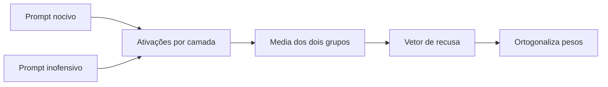
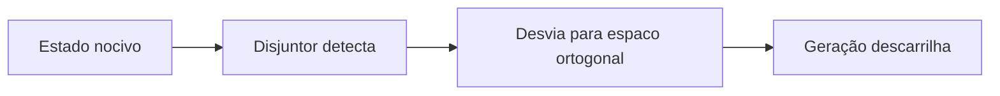

Todo mundo que usa um modelo de linguagem já bateu neste comportamento: você faz um pedido, e o modelo responde que não pode ajudar com isso. Depois você reformula a pergunta de outro jeito, e ele responde. A mesma informação, negada uma vez e entregue na outra.

A explicação habitual é que existe um filtro. Uma camada de guardrails, um classificador que lê o seu texto antes do modelo, ou uma regra escrita no prompt do sistema. Essa explicação é conveniente porque sugere que dá para consertar a coisa trocando o filtro.

A realidade que a pesquisa em interpretabilidade revelou nos últimos dois anos é mais estranha. A recusa não é um filtro. É uma direção no espaço interno do modelo. E quando você entende que ela é uma direção, uma consequência desagradável aparece: remover uma direção é uma operação de álgebra linear muito barata, e foi exatamente isso que a comunidade de modelos abertos passou a fazer em escala.

Este artigo explica o mecanismo, mostra as fórmulas envolvidas, descreve a técnica de remoção e depois olha para o outro lado: o que se constrói para defender, e o que se descobriu sobre os efeitos colaterais de mexer ali.

## O que a recusa tem a ver com alinhamento

Um modelo de base, treinado só para prever o próximo token, não recusa nada. Ele continua qualquer texto, inclusive texto perigoso, porque continuação plausível é tudo que ele aprendeu a fazer.

A recusa entra depois, na etapa de pós-treinamento, e vem de três lugares diferentes que costumam ser confundidos. O ajuste supervisionado ensina o formato da recusa, mostrando ao modelo muitos exemplos de pergunta nociva seguida de resposta educada de negativa. O RLHF e o DPO ensinam a preferência, mostrando pares de respostas e dizendo qual é a melhor. E as abordagens constitucionais, como o Constitutional AI da Anthropic, trocam a anotação humana de nocividade por um conjunto de princípios escritos em linguagem natural, com o próprio modelo avaliando as respostas segundo esses princípios.

O detalhe que importa para este artigo é o que esses métodos compartilham. Todos eles treinam a recusa **na superfície do texto**. O sinal de aprendizado vem dos tokens que o modelo gera: as palavras "não posso ajudar com isso". O que acontece dentro do modelo para produzir esses tokens nunca foi supervisionado de forma direta.

**Tipos de recusa que aparecem na prática:**

**Recusa de segurança**, quando o pedido viola uma política. É o caso que este artigo trata.

**Recusa de conhecimento**, quando o modelo alega não saber algo que está fora do seu alcance ou do seu corte de treinamento.

**Recusa de capacidade**, quando o modelo diz não conseguir executar uma tarefa que ele de fato não executa bem, como acessar a internet ou ler um arquivo que ninguém forneceu.

Um estudo de 2026 analisou os dois primeiros tipos em conjunto e encontrou um resultado que ajuda a entender o desenho interno. Os dois compartilham uma direção de recusa comum, mas com uma assimetria: a recusa de segurança transfere melhor para a de conhecimento do que o contrário. E as diferenças entre elas aparecem apenas nas camadas mais altas. A leitura dos autores é que o modelo primeiro se compromete a recusar, usando o componente compartilhado, e só depois especifica o motivo, seja falta de informação ou restrição de política. Eles chamam isso de comprometer e depois especificar.

## A descoberta da direção única

Em 2024, um grupo de pesquisadores publicou o trabalho que mudou o assunto. O título é direto: a recusa em modelos de linguagem é mediada por uma única direção. Eles testaram 13 modelos de chat abertos, de 1,8 bilhão a 72 bilhões de parâmetros, de famílias diferentes como Qwen, Yi, Gemma, Llama 2 e Llama 3.

A conclusão foi que existe, em cada um desses modelos, uma direção tal que:

**Apagar essa direção faz o modelo parar de recusar** instruções nocivas, mesmo as que ele recusava em cem por cento dos casos antes.

**Adicionar essa direção faz o modelo recusar pedidos inofensivos**, coisas banais que ele responderia normalmente.

Um experimento faz o modelo dizer não para tudo, o outro faz ele dizer não para nada. O mesmo vetor nos dois sentidos. Isso é evidência forte de que a recusa ocupa um subespaço de uma dimensão só dentro do espaço de ativações, que nos modelos testados tem milhares de dimensões.

**Por que a recusa virou uma direção única.** A explicação mais aceita é eficiência. Recusar é sempre a mesma jogada, independentemente do tema: se o pedido é sobre química, sobre segurança da informação ou sobre outra coisa qualquer, a resposta é a mesma frase de negativa. Quando uma tarefa tem sempre a mesma saída, o modelo tende a aprender um único caminho interno para chegar lá. Já o trabalho de responder bem cada pergunta é diferente em cada camada: uma resolve gramática, outra busca fatos, outra organiza o raciocínio. São vetores que apontam para lados diferentes. É por isso que a recusa se destaca como uma direção limpa enquanto o resto do comportamento se espalha.

Vale registrar o cenário mais recente, porque ele qualifica a descoberta. Trabalhos posteriores mostram que a representação da recusa é mais rica do que uma direção só. Um deles identifica cones poliédricos multidimensionais de conceitos, e outro encontra uma direção dominante acompanhada de vários recursos secundários com significados distintos. A descoberta de 2024 continua válida como aproximação prática, e é ela que sustenta a técnica. Mas tratar a recusa como uma linha única é uma simplificação, e isso vai importar na parte sobre defesas.

## Como a direção é extraída

O método se chama diferença de médias, ou difference-in-means. É simples de descrever e é o coração de tudo que vem depois.

Você precisa de dois conjuntos de instruções. Um com pedidos nocivos, outro com pedidos inofensivos. Os dois conjuntos têm que ser parecidos em formato e tamanho, para que a única diferença entre eles seja a nocividade.

Roda o modelo nos dois conjuntos e guarda as ativações internas. A posição que importa é o último token da instrução, e o motivo é a atenção causal: cada token só enxerga o que vem antes dele, então o último token da instrução é o único que já viu o pedido inteiro. As camadas importantes são as do meio para o fim do modelo, embora o método calcule candidatos em todas.

Com as ativações guardadas, o cálculo é uma subtração de médias.

$$
r = \mu_{\text{nocivo}} - \mu_{\text{inofensivo}}
$$

**Como ler essa fórmula em palavras.** Some as ativações de todos os pedidos nocivos e divida pela quantidade, o que dá o ponto médio do que o modelo representa quando recebe um pedido nocivo. Faça o mesmo com os inofensivos. Subtraia um ponto do outro. O vetor que sobra aponta na direção em que os dois grupos se separam.

Esse vetor tem duas leituras. A **direção** dele diz ao longo de qual eixo os pedidos nocivos e inofensivos diferem. O **tamanho** dele, ou norma, mede a distância entre as duas médias, ou seja, o quanto os dois grupos estão separados naquele eixo.

Você faz isso para cada camada e para cada posição de token, o que gera uma lista grande de vetores candidatos. Agora precisa escolher um. A seleção avalia cada candidato em três critérios, e é aqui que a técnica passa de observação para engenharia.

**A taxa de contorno**, que mede quanto apagar aquele vetor reduz a recusa nos pedidos nocivos. É o que se quer maximizar.

**A taxa de indução**, que mede quanto adicionar aquele vetor faz o modelo recusar pedidos inofensivos. Serve para confirmar que o vetor carrega mesmo a recusa.

**A divergência de distribuição**, que mede o quanto a intervenção mexe no comportamento geral do modelo em tarefas comuns. É o custo, e se quer minimizar.

Quando um vetor é bom nos três, ele é a direção de recusa daquele modelo. Depois se normaliza para tamanho um, porque a partir daí o que importa é só a direção, e a intensidade vai ser controlada à parte.

## Como a direção é removida

Aqui entra o vocabulário do título. "Abliteration" é uma palavra inventada, uma mistura de ablação com obliteração, cunhada na comunidade de modelos abertos e popularizada por um tutorial muito influente publicado no blog do Hugging Face. O procedimento tem duas versões, e a diferença entre elas é o que define se a mudança é temporária ou permanente.

**A intervenção em tempo de inferência** funciona como um desvio no meio do caminho. Toda vez que alguma parte do modelo escreve no fluxo residual, que é o canal por onde a informação atravessa as camadas, você calcula o quanto daquele pedaço aponta na direção de recusa e subtrai essa parte.

$$
x' \leftarrow x - \hat{r}\,\hat{r}^{\top} x
$$

**Como ler em palavras.** O `r_chapeu` é a direção de recusa já normalizada, de tamanho um. O produto entre ele e a ativação `x` dá um número, que mede quanta recusa existe naquela ativação. Multiplicar esse número pela direção devolve um vetor: a parcela da ativação que é puramente recusa. Subtrair isso de `x` devolve a ativação sem essa parcela. É a operação de projetar a ativação no eixo de recusa e depois tirar essa projeção do total.

Isso é feito em todas as camadas e em todas as posições de token, o que garante que a direção não apareça em lugar nenhum. A vantagem é ser reversível: os pesos do modelo não mudam, o desvio vive na memória e desaparece quando você remove o gancho. A desvantagem é não servir para distribuir um modelo alterado.

**A ortogonalização de pesos** é a versão permanente, e é ela que produz os checkpoints que você encontra publicados. Em vez de corrigir a ativação na saída, você altera as matrizes que escrevem no fluxo residual, de forma que elas nunca consigam apontar na direção de recusa.

$$
W_{\text{out}}' \leftarrow W_{\text{out}} - \hat{r}\,\hat{r}^{\top} W_{\text{out}}
$$

**O que muda em relação à fórmula anterior.** A forma é a mesma, mas agora `W` é uma matriz de pesos e não uma ativação. Antes você limpava a saída de cada conta. Agora você limpa a capacidade de fazer a conta. Depois dessa alteração, o modelo não tem como escrever nada na direção de recusa, em nenhuma camada, por construção.

**Quais matrizes são alteradas:**

**A matriz de embeddings**, que transforma tokens em vetores na entrada do modelo.

**As matrizes de saída da atenção**, que escrevem o resultado de cada camada de atenção no fluxo residual.

**As matrizes de saída do bloco denso**, que fazem o mesmo com o resultado da camada de transformação.

Essas três são as que escrevem no fluxo residual. As outras matrizes do transformador leem dele, mas não escrevem, então alterá-las não teria o efeito desejado.

**Sobre o custo.** O trabalho original relata que o ataque supera em eficácia métodos de ataque por prompt muito mais caros, e que o custo computacional fica abaixo de cinco dólares para um modelo de 70 bilhões de parâmetros. E relata também que o efeito sobre as capacidades gerais é pequeno: as avaliações em benchmarks padrão mostram desempenho praticamente idêntico ao modelo de base, com variações dentro do ruído estatístico. É essa combinação de barato e aparentemente indolor que fez a técnica se espalhar, e existem milhares de modelos com "abliterated" no nome publicados em repositórios públicos.

## O vocabulário de quem defende

Até aqui o artigo descreveu um ataque. A partir daqui, ele vira sobre defesa, porque a resposta da pesquisa a esse problema é a parte mais interessante e menos divulgada.

**Circuit Breakers**, ou disjuntores, é a abordagem mais conhecida, apresentada também em 2024. A ideia parte de uma crítica ao treinamento de recusa que vale a pena entender bem.

O argumento é este: métodos tradicionais como RLHF e treinamento adversarial dão supervisão no nível da saída. Eles ensinam o modelo a produzir uma resposta segura, mas o estado interno que representa o conteúdo nocivo continua lá, apenas escondido atrás de uma recusa. Assim que um ataque contorna a recusa, o estado nocivo está acessível de novo. A recusa é uma porta, e atrás da porta o conteúdo perigoso nunca saiu do lugar.

Os disjuntores atacam isso em outro ponto. Em vez de tentar tappar as brechas de ataques específicos, eles ligam a representação do processo nocivo a um interruptor. Quando o modelo começa a produzir uma resposta perigosa, o estado interno é desviado para um espaço ortogonal, e a geração descarrilha antes de chegar ao conteúdo.

**A função de perda que faz o desvio:**

$$
\mathcal{L} = \mathrm{ReLU}\!\left( \frac{\mathrm{rep}_{\text{c/b}} \cdot \mathrm{rep}_{\text{orig}}}{\lVert \mathrm{rep}_{\text{c/b}} \rVert_2 \, \lVert \mathrm{rep}_{\text{orig}} \rVert_2} \right)
$$

**Como ler em palavras.** A similaridade de cosseno entre dois vetores mede o quanto eles apontam para o mesmo lado, num intervalo que vai de menos um a mais um. Valores perto de um significam vetores alinhados, valores perto de zero significam vetores independentes. A função ReLU zera tudo que for negativo e deixa passar o que for positivo. O objetivo do treinamento é empurrar essa conta para zero, ou seja, forçar a representação sob ataque a ficar ortogonal à representação original de perigo. Aplicar o ReLU evita que o modelo seja otimizado para ficar alinhado ao contrário, o que não teria utilidade.

Os autores testaram várias formulações da mesma perda, incluindo desviar para um vetor aleatório de norma grande e desviar para um vetor aleatório de norma unitária, e relatam que a versão por similaridade de cosseno é a mais intuitiva e a que melhor equilibra resistência e capacidade preservada.

**Por que essa abordagem interessa.** A representação que produz a saída nociva é independente do ataque específico que a eliciou. Isso torna o método agnóstico em relação ao ataque, ou seja, ele não precisa ter visto o ataque antes para resistir a ele. É a diferença fundamental entre tapar buracos conhecidos e tornar a produção do dano impossível. Os autores relatam resistência a uma variedade de ataques não vistos, com capacidades preservadas.

O mesmo grupo também trabalha a variante multimodal, em que um ataque por imagem tentava sequestrar o modelo para produzir conteúdo nocivo, e o resultado é que o disjuntor protege o sistema mesmo quando o classificador de imagem isolado é vulnerável.

**O que sobrevive à abliteração.** Um estudo de 2026 testou diretamente essa pergunta em uma sequência de checkpoints de pré-treinamento com intervenções de segurança diferentes. A conclusão prática é direta: intervenções que concentram o sinal de segurança em um único lugar são fáceis de neutralizar, enquanto intervenções que espalham o sinal por várias características são mais resistentes.

As etapas que combinam vários sinais de dados foram as que melhor resistiram, especialmente quando incluem reformulação do conteúdo nocivo em formato educativo e marcação por metadados que descrevem a finalidade do exemplo. Isso conversa diretamente com a descoberta da direção única: se o seu alinhamento ensina apenas o estilo da recusa, você produziu uma característica compacta e portanto removível. Espalhar o sinal é o que muda o jogo.

**A defesa contra a extração.** Uma linha de trabalho mais recente ataca o problema em um ponto anterior. Se a dificuldade está na facilidade de extrair a direção, então talvez seja melhor dificultar a extração. A proposta é editar os pesos aplicando correções de posto maior do que um, enquanto as ativações que induzem recusa são substituídas por valores aleatórios e as matrizes que leem essas ativações são corrigidas para preservar o comportamento original. O efeito relatado é um aumento mensurável na taxa de recusa depois da abliteração, com perda de capacidade pequena em um dos modelos testados e maior no outro.

## O que a remoção da recusa quebra além da recusa

Esta é a parte que eu considero mais importante do artigo, e é a mais recente.

A promessa comercial da abliteração é cirúrgica: remova a recusa, mude nada além disso. Um estudo de 2026 testou essa promessa de um jeito engenhoso. Em vez de medir capacidade em benchmarks, que é o que os trabalhos anteriores fizeram, ele mediu **disposição**. Usou 21.600 decisões sob incerteza, chamadas semanais de alta e baixa sobre 60 ações em 18 semanas, passadas por um pipeline de múltiplos agentes congelado, de forma que a única variável fosse o modelo de decisão.

O ponto fino do desenho: a tarefa não elicia recusa nenhuma. Os modelos de base completaram as 10.800 decisões sem recusar uma única vez. Então não havia comportamento de recusa para remover, e qualquer diferença entre os grupos é efeito colateral puro.

Os resultados replicaram em duas famílias de modelos diferentes. Os modelos abliterados ficaram sistematicamente mais otimistas, apostando na alta em uma proporção maior dos casos. Passaram a justificar as próprias decisões com mais texto. E reduziram o uso de palavras explícitas de incerteza, trocando-as por retórica concessiva. Um quarto efeito inverteu de sinal entre as famílias: a mesma operação deixou um modelo menos confiante e o outro mais. Ou seja, remover a mesma direção interage de forma diferente com a representação de cada modelo de base.

A conclusão dos autores vale citar quase literalmente, porque resume o problema: um modelo "sem censura" não é o modelo de base menos as recusas, é um tomador de decisão diferente.

**O que isso significa na prática, para quem opera modelos.** Se você usa um modelo abliterado como agente, você não está usando o modelo original com menos restrições. Você está usando um modelo cuja disposição diante de risco, de informação incompleta e de decisão foi medida e mudou. Em um cenário de agente autônomo, onde o modelo toma decisões em cadeia, esse desvio de otimismo é exatamente o tipo de efeito que não aparece em nenhum benchmark de capacidade e aparece no resultado real.

Fica registrada também uma nota metodológica do mesmo estudo que vale para quem lê pesquisa: o trabalho detectou dois canais de contaminação nos experimentos iniciais, um par de checkpoints quantizados de forma diferente e um template de chat desatualizado em um checkpoint da comunidade que corrompia o prompt silenciosamente. A lição é que em estudos com modelos modificados pela comunidade, artefato de ferramenta é regra, não exceção.

## Como verificar se um modelo foi abliterado

Esta seção é prática, e cabe inteira em um parágrafo de contexto mais uma tabela.

Um checkpoint publicado com "abliterated", "uncensored", "uncut" ou algo parecido no nome quase certamente passou por esse processo. Mas a modificação também pode ser feita sem aviso, e o seu efeito não aparece nas métricas que as fichas de modelo costumam mostrar.

**O que muda no comportamento do modelo:**

**A resposta a um pedido que o modelo original recusaria.** É o teste mais direto, e o mais difícil de avaliar de forma objetiva, porque depende de julgamento.

**A taxa de recusa em um conjunto de prompts nocivos.** Se você tem um conjunto de referência, a diferença entre o modelo publicado e o original é o tamanho do efeito.

**A taxa de recusa em prompts inofensivos.** A recusa excessiva deve ser baixa nos dois, mas um modelo muito abliterado pode também ficar com o comportamento alterado aqui.

**A perplexidade em texto comum.** É a medida mais barata de dano de coerência. Um aumento acima de dez por cento já indica que a intervenção foi agressiva demais.

**A divergência entre as distribuições de saída.** Mede o quanto o modelo se afastou do original em tarefas gerais, e é mais sensível do que a perplexidade.

**A disposição em tarefas que não envolvem recusa.** É a métrica que os benchmarks tradicionais não capturam, e é onde os efeitos colaterais aparecem. Se você tem um conjunto de decisões repetidas com resposta verificável, comparar os dois modelos ali conta mais do que comparar acurácia em prova.

## O quadro ético e regulatório, sem drama

A técnica é legal na maior parte do mundo, e o modelo é seu, então alterar os pesos é uma decisão técnica como outra qualquer. Mas há três pontos que não são drama, são consequência.

**A licença é o primeiro limite.** Muitos modelos abertos vêm com termos de uso que proíbem usar o modelo para fins nocivos e proíbem distribuir derivados que removam as proteções. A licença da Meta para a família Llama tem cláusulas nesse sentido. A abliteração técnica é uma operação de álgebra linear, mas distribuir o resultado pode violar o contrato. Isso é uma questão jurídica, não técnica.

**A responsabilidade transfere para quem publica.** Se você publica um modelo sem recusa e alguém usa para produzir dano, a análise de responsabilidade começa por quem distribuiu o artefato. Um modelo de pesos abertos com as proteções removidas de forma documentada é fácil de rastrear até a origem.

**A área de segurança cibernética é um caso legítimo e não resolvido.** Existe um problema real e reconhecido: o alinhamento de segurança não distingue domínios nem níveis de risco, e isso atrapalha quem precisa do modelo para operações autorizadas. Um profissional de segurança que pede ajuda para analisar código malicioso dentro de um contrato de trabalho legítimo esbarra no mesmo mecanismo que impede um pedido genuinamente malicioso. A linha de pesquisa em abliteração por domínio, que remove apenas a parte da recusa que corresponde a um assunto específico, existe exatamente para tentar resolver isso, e é um trabalho em aberto.

**Minha posição, declarada como posição.** Para quem estuda o assunto, entender a mecânica é o que permite construir defesa melhor. Este artigo foi escrito nessa direção, e de propósito ele descreve o mecanismo sem entregar uma receita pronta de execução. A técnica já está publicada, documentada e implementada em bibliotecas abertas, então não há sigilo a preservar aqui. O que eu escolhi não fazer é reduzir a barreira ainda mais.

## Conclusão

O que começou como um resultado de interpretabilidade, uma direção no espaço de ativações que media a recusa, virou em menos de dois anos uma técnica de engenharia com milhares de derivados publicados. A razão é a economia da coisa: uma edição de posto um, que custa alguns dólares, altera o comportamento de segurança de um modelo cujo treinamento custou muito mais.

O aprendizado técnico que eu levo deste estudo é sobre onde colocar o esforço de segurança. Concentrar a segurança em um sinal único, ainda que esse sinal seja bem aprendido, produz uma característica compacta e portanto removível. Espalhar o sinal por várias características, e monitorar as representações em vez das saídas, é o que muda a economia do ataque. E a lição metodológica é que medir capacidade não é medir disposição. Um modelo pode continuar igual em todas as provas e tomar decisões diferentes na vida real.

### Próximos passos

Se você quer continuar, a ordem que faz sentido é esta:

- **Comece pela interpretabilidade.** Entender o fluxo residual, as camadas de atenção e o que significa projetar um vetor é pré-requisito para ler qualquer um dos trabalhos citados. O material do Neel Nanda sobre o assunto é a melhor porta de entrada.
- **Leia o trabalho original completo.** A seção que analisa como sufixos adversariais suprimem a propagação da direção de recusa, sem usar o método de remoção em si, conecta este assunto com os ataques por prompt que você provavelmente já conhece.
- **Estude os disjuntores antes das técnicas de remoção.** A ideia de monitorar e desviar representação é mais geral do que remover direção, e é a que rende defesa em outros comportamentos além da recusa.
- **Replique a medição de disposição com os seus próprios dados.** Se você opera modelos, montar um conjunto de decisões repetidas com resposta verificável vale mais do que qualquer benchmark público para detectar alteração de comportamento.
- **Acompanhe a linha de abliteração por domínio.** Ela é a que tem aplicação legítima mais clara, em segurança cibernética e em pesquisa, e a que ainda não tem resposta fechada.

## Fontes e leitura recomendada

Todos os números, nomes de datasets e datas citados neste artigo saem das referências abaixo. Os trabalhos técnicos são as fontes primárias.

- [Refusal in Language Models Is Mediated by a Single Direction](https://arxiv.org/abs/2406.11717): o trabalho de Arditi e colaboradores, publicado no NeurIPS 2024, que estabeleceu a descoberta da direção única e propôs o ataque por ortogonalização de pesos. Código disponível em [github.com/andyrdt/refusal_direction](https://github.com/andyrdt/refusal_direction)
- [Improving Alignment and Robustness with Circuit Breakers](https://arxiv.org/abs/2406.04313): o trabalho de Zou e colaboradores, também no NeurIPS 2024, que propõe o desvio de representação como alternativa ao treinamento de recusa. Código em [github.com/GraySwanAI/circuit-breakers](https://github.com/GraySwanAI/circuit-breakers)
- [Uncensor any LLM with abliteration](https://huggingface.co/blog/mlabonne/abliteration): o tutorial do Maxime Labonne no blog do Hugging Face, que popularizou o termo e o procedimento na comunidade de modelos abertos
- [A Granular Study of Safety Pretraining under Model Abliteration](https://arxiv.org/html/2510.02768v1): o estudo que compara quais intervenções de dados de segurança sobrevivem à abliteração, e mostra que combiná-las é mais resistente
- [Abliteration Is Not a Scalpel: Off-Target Effects of Refusal Removal](https://arxiv.org/pdf/2607.17427): o estudo de 2026 sobre os efeitos colaterais na disposição do modelo, com o desenho experimental de decisões sob incerteza
- [Not All Refusals Are Equal: How Safety Alignment Fails Cybersecurity at Scale](https://arxiv.org/pdf/2607.02714): o estudo em 24 modelos abertos sobre abliteração por domínio e sobre a estrutura multidimensional da recusa
- [A Unified Mechanistic Analysis of Knowledge- and Safety-Based Refusals](http://arxiv.org/pdf/2609.00760): a análise que separa recusa de segurança e recusa de conhecimento, com a leitura de comprometer e depois especificar
- [Abliteration Mitigation via Refusal Aliases](https://arxiv.org/abs/2608.18093): a defesa que dificulta a extração da própria direção
- [Constitutional AI: Harmlessness from AI Feedback](https://arxiv.org/abs/2212.08073): o trabalho da Anthropic que substituiu a anotação humana de nocividade por princípios escritos
- [Representation Engineering: A Top-Down Approach to AI Transparency](https://arxiv.org/abs/2310.01405): o trabalho que estabeleceu o campo de engenharia de representações, base tanto da extração de direções quanto dos disjuntores
- [Steering Llama 2 via Contrastive Activation Addition](https://arxiv.org/abs/2312.06681): a técnica de adição de ativação por contraste, precursora direta do método de diferença de médias

Se você trabalha com modelos locais e quer entender como rodar e avaliar um modelo no seu próprio hardware, vale ler também o artigo sobre o [custo real de rodar um LLM localmente](/artigos/custo-real-llm-local/), que trata das decisões práticas dessa operação.