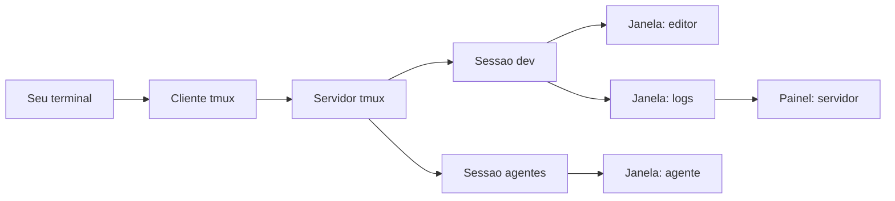

Você está no meio de uma tarefa longa no servidor. Um build, um download, um agente de IA trabalhando há quarenta minutos. A conexão SSH cai. Você reconecta, e o processo morreu junto com o terminal.

Essa cena é velha, e a solução também. O Unix tem um programa para isso desde 1987, o GNU Screen. Em 2007, um programador chamado Nicholas Marriott decidiu escrever o próprio Screen porque não aguentava mais a configuração dele. O resultado se chama tmux e se tornou o multiplexer de terminal padrão do mundo Unix, presente por padrão no OpenBSD e em praticamente toda distribuição Linux.

Se você leu o post sobre o [Herdr](/artigos/2026-09-17-herdr-agent-multiplexer-terminal/), o multiplexer desenhado para agentes de IA, já conhece o papel do tmux na história: ele é o alicerce sobre o qual as ferramentas mais novas foram construídas. Neste post, o assunto é o tmux em si: o que ele faz, como usa, como administra e por que continua indispensável.


## O que é um multiplexer de terminal

Um terminal roda um programa por vez. Abra três janelas do emulador de terminal e você tem três programas. O problema aparece quando o terminal fecha: cada programa que estava rodando ali recebe um sinal de desligamento e morre junto.

O multiplexer resolve isso invertendo a dona do processo. Quem executa os programas não é mais a janela do terminal, e sim um servidor que vive separado dela. O terminal vira apenas um cliente que assiste e digita. Feche o terminal, derrube o SSH, desligue o laptop. O servidor continua rodando tudo, e quando você volta, reconecta o cliente à mesma sessão, no mesmo lugar.

É daí que vem o nome: multiplexer de terminal é um dispositivo que permite vários terminais em um só. Um único emulador de terminal passa a comportar dezenas de sessões, cada uma com suas janelas, cada janela com seus painéis.

### A linhagem: Screen, tmux e o que veio depois

O GNU Screen é o avô da categoria, lançado em 1987. Ele ainda existe e funciona, mas o próprio autor do tmux o descreveu como um programa com muita bagagem acumulada: documentação ruim, arquivo de configuração esquisito e código difícil de estender.

O tmux nasceu em 2007 como uma reescrita limpa dessas ideias. O protótipo de Nicholas Marriott se chamava `nscr`, uma referência direta ao Screen. Em julho de 2009 ele entrou na base do OpenBSD, substituindo o utilitário `window` que vinha de fábrica, e daí se espalhou para o resto do mundo Unix. Hoje a versão estável é a 3.6a, de dezembro de 2025, e o projeto segue ativo.

## Como o tmux funciona por dentro

A arquitetura é cliente e servidor. Quando você digita `tmux` pela primeira vez, três coisas acontecem:

- **Um servidor inicia em background**, dono de todos os processos daqui para frente
- **Uma sessão é criada**, com uma janela e um painel rodando seu shell
- **Um cliente conecta** essa sessão ao terminal onde você está

Nas chamadas seguintes, o comando `tmux` é só um cliente leve conversando com o servidor por um socket Unix. As sessões vivem no servidor. Os shells que você abre dentro delas são filhos do servidor, não da sua conexão SSH. É esse detalhe que muda tudo: quando a conexão cai, o que morre é o cliente. O servidor, as sessões e tudo que estava rodando nelas seguem vivos.



A hierarquia tem três níveis. A **sessão** é o contêiner maior, o projeto em que você está trabalhando. Dentro dela há **janelas**, que ocupam a tela inteira, como abas. Dentro de cada janela há **painéis**, divisões retangulares da tela, cada uma com um programa próprio.

### O prefixo, a chave do teclado

Quase todo o controle do tmux passa por um atalho chamado prefixo. O padrão é `Ctrl+b`. Você aperta o prefixo, solta, e depois aperta a tecla do comando. `Ctrl+b` seguido de `d`, por exemplo, desconecta a sessão.

O prefixo existe para que os atalhos do tmux não colidam com os atalhos dos programas que rodam dentro dele. É também o maior obstáculo de quem começa, porque substitui a musculatura de Ctrl+c e Ctrl+v que o resto do sistema usa. Depois de algumas semanas, o prefixo vira reflexo.

## Sessões: a unidade que importa

A sessão é a peça central do tmux e onde mora a promessa do multiplexer: seu trabalho continua vivo mesmo quando você não está olhando.

### Criar, listar e reconectar

O comando que vale a pena memorizar é um só:

```bash title="Criar ou reconectar em um passo"
# Conecta se a sessao existe, cria se nao existe
tmux new -A -s dev
```

A flag `-A` faz o comando funcionar nos dois cenários: sessão inexistente, ele cria. Sessão existente, ele conecta. É o comando perfeito para colocar como hábito no primeiro minuto depois de logar em um servidor.

```bash title="O dia a dia das sessoes"
# Listar sessoes vivas
tmux ls

# Criar uma sessao com nome
tmux new -s build

# Conectar a uma sessao especifica
tmux attach -t build

# Conectar e expulsar outros clientes
tmux attach -d -t build
```

`tmux ls` mostra o estado de cada sessão, incluindo quantas janelas tem e se há algum cliente conectado. A sessão aparece como `attached` quando alguém está olhando, e `detached` quando está rodando às escuras.

### Sair sem matar

Dentro de uma sessão, o desligamento educado é o prefixo seguido de `d`, de detach. O terminal devolve o prompt normal e a sessão segue rodando em background com tudo dentro dela. Esse é o momento mais contraintuitivo para quem está chegando: sair do tmux não encerra nada, apenas desliga o monitor.

Já fechar o painel com `exit` ou `Ctrl+d` termina o shell daquele painel. Quando o último painel da última janela morre, a sessão acaba. São dois gestos com destinos bem diferentes, e a diferença entre eles é a diferença entre perder e não perder o trabalho.


### Compartilhar uma sessão

Duas pessoas podem se conectar à mesma sessão ao mesmo tempo, cada uma de um lugar diferente. O que uma digita, a outra vê, e o que a outra digita, você vê. É a base do pair programming remoto e do suporte técnico guiado, sem compartilhamento de tela, só com SSH e tmux.

## Janelas e painéis no dia a dia

Dentro de uma sessão, a combinação de janelas e painéis é o que transforma um terminal em um posto de trabalho.

### Janelas

- **`Ctrl+b c`**: cria uma janela nova
- **`Ctrl+b n`** e **`Ctrl+b p`**: avança e volta entre janelas
- **`Ctrl+b w`**: abre um navegador com a árvore de janelas e sessões
- **`Ctrl+b ,`**: renomeia a janela atual

A barra de status na base da tela lista as janelas da sessão com o número de cada uma. `Ctrl+b` seguido do número pula direto para ela.

### Painéis

- **`Ctrl+b %`**: divide a janela verticalmente
- **`Ctrl+b "`**: divide horizontalmente
- **`Ctrl+b seta`**: move o foco entre painéis
- **`Ctrl+b Ctrl+seta`**: redimensiona o painel atual
- **`Ctrl+b z`**: zoom, expande o painel para a tela toda e volta

O zoom do painel merece destaque. `Ctrl+b z` é o balanço entre visão geral e foco: expande o painel quando você precisa ler uma saída longa, e volta ao layout quando termina. Alternar entre o todo e a parte é o gesto mais frequente de quem vive no tmux.

### Histórico e cópia

Cada painel guarda seu próprio histórico, configurável pelo número de linhas. Para navegar nele, `Ctrl+b [` entra no modo de cópia, em que as setas e `PageUp` rolam o buffer e a busca funciona com `?`. `q` sai do modo.

Com `set -g mouse on` na configuração, o scroll do mouse rola o histórico e a seleção copia, o que suaviza muito a entrada para quem vem do terminal comum. A partir da versão 3.6a, o comportamento do mouse com aplicativos de tela cheia ficou mais previsível também.

## Administrando o tmux

O uso cotidiano é teclas de atalho. A administração é um arquivo de texto e um punhado de comandos.

### O arquivo de configuração

Tudo que o tmux é, você encontrará em `~/.tmux.conf`. Um arquivo enxuto já cobre o essencial:

```bash title="~/.tmux.conf basico"
# Histórico maior por painel
set -g history-limit 100000

# Mouse: rolagem e seleção
set -g mouse on

# Barra de status mais longa
set -g status-interval 5

# Reload da config sem sair da sessão
# (prefixo r, definido abaixo)
bind r source-file ~/.tmux.conf \; display "Config recarregada"
```

Muita gente troca o prefixo de `Ctrl+b` para `Ctrl+a`, herdando o hábito do Screen. É uma linha: `unbind C-b` seguido de `set -g prefix C-a`. Outra personalização comum é o tema da barra de status, que suporta cores e formatação própria.

### Administrar sessões por comando

Nem tudo acontece dentro da sessão. Do lado de fora, os comandos de administração:

```bash title="Administracao de sessoes"
# Renomear uma sessao
tmux rename-session -t dev frontend

# Encerrar uma sessao especifica
tmux kill-session -t dev

# Encerrar todas de uma vez
tmux kill-server

# Ver quem esta conectado
tmux list-clients
```

O `tmux kill-session` encerra a sessão e tudo que roda nela, processos incluídos. É o comando de limpeza depois de uma tarefa terminada. O `tmux kill-server` derruba tudo de uma vez, útil quando a lista de sessões virou um depósito.

Um detalhe de administração que pega muita gente: variáveis de ambiente. Ao reconectar uma sessão que nasceu em outra máquina, o `$SSH_AUTH_SOCK` antigo pode estar morto, e o git falha em silêncio ao pedir chave SSH. O remédio é atualizar o ambiente da sessão com `tmux set-environment` ou abrir um painel novo, que herda o ambiente atualizado.

### Plugins: TPM, resurrect e continuum

O ecossistema de plugins gira em torno do TPM, o Tmux Plugin Manager. Instalado com um `git clone` para `~/.tmux/plugins/tpm`, ele busca e carrega plugins a partir de linhas no `.tmux.conf`.

```bash title="Plugins de persistencia no .tmux.conf"
set -g @plugin 'tmux-plugins/tpm'
set -g @plugin 'tmux-plugins/tmux-resurrect'
set -g @plugin 'tmux-plugins/tmux-continuum'

# Restaurar o ambiente sozinho quando o servidor iniciar
set -g @continuum-restore 'on'

# Inicializar o TPM (ultima linha do arquivo)
run '~/.tmux/plugins/tpm/tpm'
```

A dupla `tmux-resurrect` e `tmux-continuum` ataca a maior limitação do tmux. Por padrão, as sessões vivem na memória, e um reboot do sistema derruba tudo. O `tmux-resurrect` salva o ambiente completo, sessões, janelas, painéis, layouts e diretórios de trabalho, e o restaura depois. O `tmux-continuum` automatiza o ciclo, salvando a cada 15 minutos e restaurando sozinho quando o servidor do tmux volta.

Com essa combinação, a sessão sobrevive até a um reboot. Com uma ressalva honesta: o que o plugin restaura são os layouts e uma lista conservadora de programas, como `vim` e `htop`. Um processo arbitrário no meio de uma tarefa não volta de onde parou.

## Tmux na era dos agentes de IA

Aqui o contexto se conecta com o post do [Herdr](/artigos/2026-09-17-herdr-agent-multiplexer-terminal/). Quando falamos daquele multiplexer, o problema de partida era o seguinte: rodar um agente de IA no terminal é fácil, mas rodar vários, em máquinas diferentes, sabendo qual deles está esperando você, é um problema que o terminal tradicional não resolve.

O tmux é a metade fundamental dessa solução. Um agente de IA é um programa de terminal interativo, e programas interativos não sobrevivem a um `nohup`: o processo fica vivo, mas sem terminal para desenhar nada, e não há como voltar. Dentro de uma sessão de tmux, o agente segue trabalhando quando você desconecta, e o `tmux attach` devolve a visão do que ele fez enquanto você esteve fora.

É por isso que boa parte das ferramentas de orquestração de agentes do momento é, no fundo, um wrapper de tmux. Projetos como o `ccmux` e o `fleetmux` não inventaram nada na camada de persistência: criam sessões de tmux com nomes previsíveis por projeto, fazem o reconnect automático e adicionam controle sobre várias sessões ao mesmo tempo. O tmux é a infraestrutura; eles são a camada de conveniência.

### O que o tmux não faz

A limitação que abre espaço para o Herdr é a que já conhecemos: o tmux trata todos os processos como anônimos. Para ele, um agente de IA é igual a um `htop` ou um `tail`. Não existe noção nativa de que aquele painel está trabalhando, bloqueado esperando sua resposta, ou terminado. Descobrir o estado exige olhar cada painel, um a um.

É exatamente essa lacuna que o Herdr endereça, com detecção de estado por painel, API para os próprios agentes se coordenarem e comando de conexão remota em um passo. As duas ferramentas não competem: o Herdr inclusive roda dentro do próprio tmux. A sequência natural é aprender o tmux primeiro, porque o modelo mental de sessões, janelas e painéis é o mesmo nos dois, e adicionar o Herdr quando a colheita de agentes crescer.

## Vantagens e limitações

**Vantagens**

- **Persistência**: sessões sobrevivem a desconexões, troca de máquina e queda de SSH
- **Densidade**: dezenas de programas em um terminal, organizados em sessões, janelas e painéis
- **Portabilidade**: está no OpenBSD base e no repositório de qualquer distribuição Linux, e serve no macOS via Homebrew
- **Leveza**: um binário pequeno em C, sem dependência de ambiente gráfico
- **Scriptabilidade**: toda operação tem um comando de shell, o que permite automação completa do terminal
- **Compartilhamento**: sessões compartilhadas para pair programming e suporte, só com SSH
- **Comunidade**: dezenas de anos de configurações, temas e plugins prontos

**Limitações**

- **Curva de aprendizado**: o modelo de prefixo exige memorização, e os atalhos padrão não são intuitivos
- **Configuração própria**: o `.tmux.conf` é uma mini linguagem, e personalizações profundas custam tempo
- **Processos anônimos**: nenhum entendimento do que roda em cada painel, o que o Herdr resolve
- **Memória apenas**: sessões morrem em reboot, e os plugins de persistência restauram layouts, não processos arbitrários
- **Sem cliente remoto nativo**: conectar a uma sessão em outro servidor exige envolver tudo em SSH à mão

## Instalação e primeiros passos

Nas distribuições Debian e Ubuntu:

```bash title="Instalacao no Debian ou Ubuntu"
sudo apt update
sudo apt install tmux
tmux -V
```

No macOS, com Homebrew:

```bash title="Instalacao no macOS"
brew install tmux
```

No OpenBSD, o tmux já vem de fábrica, desde 2009. Nada para instalar.

O primeiro minuto, o roteiro completo:

```bash title="Roteiro do primeiro minuto"
# Criar a sessao do projeto (ou reconectar, se ela ja existe)
tmux new -A -s dev

# Dividir a tela em dois painéis
# Ctrl+b %  (vertical)
# Ctrl+b "  (horizontal)

# Criar uma janela nova
# Ctrl+b c

# Sair sem encerrar nada
# Ctrl+b d

# Ver o que ficou rodando
tmux ls

# Voltar
tmux attach -t dev
```

Com isso você já tem o valor central da ferramenta em cinco comandos. O resto, modos de cópia, popups, temas, plugins, pode entrar conforme a necessidade aparecer.

## Links e documentação

- Página do projeto e manual: [tmux.app](https://tmux.app) e [man.openbsd.org/tmux](https://man.openbsd.org/tmux)
- Repositório oficial: [github.com/tmux/tmux](https://github.com/tmux/tmux)
- Gerenciador de plugins: [github.com/tmux-plugins/tpm](https://github.com/tmux-plugins/tpm)
- Persistência de sessões: [github.com/tmux-plugins/tmux-resurrect](https://github.com/tmux-plugins/tmux-resurrect) e [github.com/tmux-plugins/tmux-continuum](https://github.com/tmux-plugins/tmux-continuum)
- O passo seguinte na linhagem, com detecção de agentes: o post sobre o [Herdr](/artigos/2026-09-17-herdr-agent-multiplexer-terminal/)

## Conclusão

O tmux resolve um problema que o terminal nunca resolveu sozinho: manter o trabalho vivo enquanto você não está olhando. A arquitetura de cliente e servidor, criada em 2007 como reação limpa ao GNU Screen, se provou tão correta que virou fundação: os orquestradores de agentes de IA de hoje são camadas construídas sobre sessões de tmux, e não substituições delas.

Para quem administra servidores, é a ferramenta que transforma uma conexão instável em um detalhe sem importância. Para quem roda agentes, é a camada que mantém o trabalho acontecendo quando ninguém está assistindo. E para quem aprende agora, o caminho é curto: um comando para criar, um prefixo para navegar, um detach para sair. O resto vem com o uso.