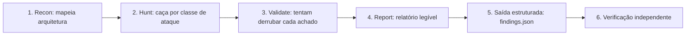
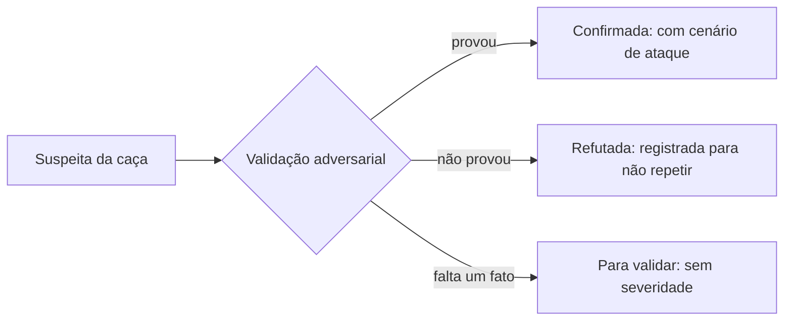

Seu agente de código escreve centenas de linhas por dia. Ele cria rotas, consulta bancos de dados, recebe requisições de usuários e cuida de credenciais. Quem audita tudo isso? Revisar segurança é a tarefa que ninguém sobra para fazer com calma, e o próprio agente de IA é péssimo em julgar o próprio trabalho: quando você pede para ele revisar o código que ele acabou de escrever, ele aprova quase tudo.

Em junho de 2026, a Cloudflare publicou um artigo chamado [Build your own vulnerability harness](https://blog.cloudflare.com/build-your-own-vulnerability-harness/) contando como resolveu esse problema internamente. No mesmo dia, abriu o repositório com a peça central do sistema: a skill [security-audit-skill](https://github.com/cloudflare/security-audit-skill), sob licença MIT. Em setembro, a ferramenta chegou ao topo do GitHub Trending e à capa do Hacker News.

A ideia em uma frase: você instala um pacote de instruções no seu agente de código e ele passa a conduzir uma auditoria de segurança estruturada no seu projeto, com métodos de verdade e achados que você consegue verificar.

## Primeiro, o que é uma "skill"

O nome pode soar estranho, então vale destravar o jargão antes de continuar. Uma skill de agente é simplesmente um conjunto de instruções em texto que o agente carrega quando o pedido tem a ver com o assunto. No caso desta skill, o pacote são arquivos Markdown com a metodologia completa de uma auditoria: como mapear a aplicação, onde procurar fraquezas, como checar cada achado e como escrever o relatório.

É como entregar ao seu estagiário de TI o manual de procedimentos de um auditor de segurança veterano. O estagiário continua sendo o estagiário, mas agora trabalha seguindo um método testado, em vez de improvisar.

Isso resolve um defeito conhecido: um agente solto, sem guardrails, audita mal. A documentação da própria Cloudflare dá os exemplos. O agente modifica o código para que o ataque dele funcione e depois anuncia a vitória. Ou escreve um teste que prova que `eval()` executa código e conclui, orgulhoso, que achou uma vulnerabilidade crítica. Com a skill, o processo deixa de ser improviso e vira procedimento.

## De onde ela veio: o harness de 7.245 achados

A skill não nasceu para o público. Ela foi a semente de um sistema interno da Cloudflare, o vulnerability harness, que cresceu até varrer 128 repositórios da empresa. Os números divulgados no artigo dão a dimensão do funil:

1. 20.799 suspeitas brutas geradas pelos agentes de caça
2. 12.057 sobreviveram à primeira validação
3. 5.442 eram duplicatas e foram descartadas
4. 7.245 achados chegaram até as equipes de engenharia para correção

O que a Cloudflare liberou é a semente, limpa e portátil. Os autores afirmam que a maior parte do valor está nas instruções, e que elas praticamente não mudaram quando viraram o sistema interno. A versão que você instala hoje tem seis fases, cerca de 600 linhas de arquivos de metodologia e dois validadores em JavaScript sem nenhuma dependência externa.

## As seis fases da auditoria

Quando você pede uma auditoria, o agente não sai varrendo o código na sorte. Ele segue um pipeline em seis etapas, cada uma com um objetivo claro.



Cada fase merece uma analogia para fixar o que ela faz.

**Recon.** Agentes de pesquisa mapeiam a aplicação: quem são os atores, onde estão as fronteiras de confiança, quais superfícies recebem dados de fora. O resultado é um arquivo `architecture.md`. É o mapa da cidade antes da investigação começar.

**Hunt.** Vários agentes caçadores, cada um isolado dos outros, atacam o código por ângulos diferentes: injeção, controle de acesso, lógica de negócio, criptografia, abuso de funcionalidade e ataques encadeados. Existem arquivos dedicados a famílias de alvo: código nativo e binários, aplicações com LLM, protocolo HTTP e autenticação, e o lado do navegador. Cada caçador pode criar subagentes para escavar.

**Validate.** Aqui está o pulo do gato. Para cada suspeita encontrada, um agente novo, que não participou da caça, recebe a tarefa de tentar refutá-la. Quem acusa não é quem julga. Isso mata os falsos positivos antes que eles cheguem até você.

**Report.** O sistema produz o `REPORT.md`, legível para humanos, e o `FINDINGS-DETAIL.md` com os rastros técnicos dos achados de severidade média para cima.

**Saída estruturada.** Os achados viram um `findings.json` que obedece a um esquema JSON publicado no próprio repositório. Um validador sem dependências, o `validate-findings.cjs`, checa a estrutura do arquivo. Você pode ler esse JSON com qualquer ferramenta, alimentar um painel ou abrir issues automaticamente.

**Verificação independente.** Agentes frescos conferem, um por um, se cada afirmação do relatório é verdadeira no código-fonte real. Só depois disso o ciclo fecha.

## Instalando a skill

A instalação é um comando, usando a CLI de skills da Vercel Labs. No diretório do seu projeto:

```bash
npx skills add https://github.com/cloudflare/security-audit-skill --skill security-audit
```

Para instalar no nível do usuário, disponível em qualquer projeto da máquina, acrescente a flag global:

```bash
npx skills add https://github.com/cloudflare/security-audit-skill --skill security-audit --global
```

São dois requisitos:

1. **Um agente de código com suporte a ferramentas e subagentes paralelos.** Claude Code e Codex são os casos reportados pela comunidade. O modelo precisa conseguir delegar tarefas em paralelo, porque as fases de caça dependem disso.
2. **Node.js**, apenas para o validador de esquema da fase 5.

A CLI detecta o agente que você usa e instala os arquivos no lugar certo, tipicamente uma pasta `skills/` dentro da configuração do agente. A partir dali, as instruções estão disponíveis para qualquer pedido que combine com o assunto.

## Usando na prática

Não existe subcomando especial para memorizar. Você abre o agente no projeto e faz um pedido em linguagem natural:

```text
security audit this codebase
```

```text
find security vulnerabilities in ./src
```

```text
do a security review, output to ~/audits/meu-projeto
```

A skill ativa sozinha quando o pedido menciona auditoria de segurança, busca de vulnerabilidades ou pen-test do código. Se você não indicar um diretório de saída, ela pergunta, e o padrão é gravar fora do repositório, em `~/security-audit-skill/`. Essa decisão é proposital: o relatório não suja o projeto, e uma pasta de auditoria não vai parar no commit por descuido.

O tamanho da rodada é controlado por perfis. O perfil `quick` serve para uma primeira olhada. O `standard` é o padrão. O `deep` existe para sistemas grandes e críticos, e é o tipo de rodada que, na Cloudflare, chega a consumir 14 horas em um repositório grande. Você também pode fixar um orçamento em número de chamadas de agente. Se o orçamento não der nem para o reconhecimento e a validação, a skill recusa a rodada e explica o motivo, em vez de entregar um relatório sem verificação.

Um detalhe de segurança que merece destaque: a skill se recusa a executar o código auditado se não existir um sandbox no nível do sistema operacional, com rede cortada, alvo somente leitura e limites de CPU e memória. Sem sandbox, os achados que exigem execução ficam marcados para validação manual, em vez de o agente sair rodando código de produção na sua máquina.

## Um exemplo real: 24 minutos e 24 agentes

O blog da One executou a skill contra o NodeGoat, um aplicativo deliberadamente vulnerável mantido pela OWASP, o projeto aberto de referência em segurança de aplicações web. O alvo definido foi o lado do servidor, 1.527 linhas de código. O resultado da rodada:

1. 24 agentes trabalharam por 24 minutos
2. 8 suspeitas passaram pelo funil completo
3. 5 confirmadas, 2 marcadas para validação manual, 1 refutada

Entre as confirmadas estava uma vulnerabilidade crítica de injeção: o handler de uma rota passava campos do corpo da requisição direto para o `eval()` do Node.js, antes de qualquer validação. O relatório veio com o rastro completo, desde a rota registrada até a linha exata em que a entrada do atacante vira código executado. Uma rodada em um app pequeno e malicioso de propósito achou o que era para achar, com evidência verificável.

## Os três veredictos possíveis

Todo achado sai do funil com um dos três selos, e a diferença entre eles é a parte mais didática da ferramenta.



**Confirmada** exige cenário de ataque concreto e resultado observado, com rastro no código. **Refutada** não é desperdício: fica registrada para que a próxima rodada não perca tempo de novo. **Para validar** indica exatamente qual fato está faltando, e não pode carregar severidade alguma, para não assustar ninguém com um número de gravidade sem prova.

Essa disciplina vem de um princípio declarado no manual: só reporte o que você consegue explorar. "Um atacante poderia teoricamente..." não vale como achado. E severidade não é distância de um checklist: é probabilidade multiplicada por impacto.

## O que ela entrega de bom

1. **Custo zero e código aberto.** MIT, arquivos Markdown e dois validadores JavaScript. Não há serviço para assinar, chave para cadastrar ou conta para criar.
2. **Método de verdade, não revisão de código comum.** O agente sai do modo "reviewer" e entra no modo auditor, com cobertura organizada por classes de ataque.
3. **Falsos positivos ficam sob controle.** A validação adversarial, com agente novo tentando derrubar cada suspeita, é o mecanismo que separa barulho de achado.
4. **Saída legível por máquina.** O `findings.json` segue esquema publicado e validado por script, então dá para conectar em issues, painéis e CI sem escrever parser.
5. **Rodadas se somam.** Cada rodada lê os relatórios anteriores, evita repetir achados conhecidos e mira nos buracos que restaram. Segundo os autores, uma única rodada encontra cerca de metade do total, então rodar mais de uma vez é parte do método, não desperdício.
6. **Guardrails embutidos.** Recusa executar código sem sandbox, recusa orçamento insuficiente para verificar, e mantém a saída fora do repositório.
7. **Agnóstica de agente.** As instruções falam de "agente pai", "ferramenta de delegação" e papéis de pesquisa e caça, sem amarrar em um produto. O instalador se adapta ao agente que você já usa.

## Limitações que você precisa saber

**Não é varredura de dependências.** Ferramentas como `npm audit` cruzam suas bibliotecas com bancos de CVE conhecidas. A skill não olha esse mundo: ela procura falhas no SEU código. As duas coisas são complementares, não concorrentes.

**Não é checkpoint de pull request.** Uma auditoria completa consome tempo e tokens; na Cloudflare, rodadas longas chegam a 14 horas. O uso saudável é periódico, não a cada PR. Para revisar diffs a cada PR, a própria Anthropic mantém um security reviewer separado do Claude Code.

**Uma rodada é metade da história.** O próprio manual avisa: rode mais de uma vez. Cada rodada explora caminhos diferentes e lê o que as anteriores acharam.

**A independência do verificador é instruída, não forçada.** O manual exige que o agente validador seja diferente do caçador, mas quem garante o isolamento é o orquestrador do seu agente, e a Cloudflare não publicou o dela. Em agentes sem bom suporte a subagentes, a promessa fica mais fraca.

**Precisa de sandbox para a parte executável.** Sem o isolamento no nível do sistema operacional, achados que exigem rodar código ficam pendentes de validação manual.

## Para começar hoje

O roteiro mínimo, do zero ao primeiro relatório:

1. Instale a skill com o comando `npx skills add` na raiz do projeto
2. Abra o agente de código no projeto
3. Peça uma auditoria em perfil `quick` com escopo no que mais importa, por exemplo a camada de autenticação ou exportação
4. Leia o `REPORT.md` e o `FINDINGS-DETAIL.md` com a mesma atenção
5. Rode uma segunda vez depois de corrigir, e compare os achados

O ponto de partida ideal é um projeto que você já conhece: assim você consegue julgar se os achados fazem sentido, que é exatamente a habilidade que nenhuma ferramenta substitui.

## Links oficiais

- Repositório da skill: [github.com/cloudflare/security-audit-skill](https://github.com/cloudflare/security-audit-skill)
- Artigo de origem: [Build your own vulnerability harness](https://blog.cloudflare.com/build-your-own-vulnerability-harness/)
- CLI de instalação: [skills.sh](https://skills.sh)
- Caso real com NodeGoat: [blog da One](https://www.withone.ai/blog/cloudflare-security-audit-skill-one-cli)
- Análise independente: [korben.info](https://korben.info/en/cloudflare-launches-ai-security-audit-skill.html)

Contato da equipe de pesquisa da Cloudflare para o assunto: `security-ai-research@cloudflare.com`.

## Conclusão

A Security Audit Skill da Cloudflare empacota uma lição que os últimos meses de agentes de IA reforçaram: um agente não pode ser juiz e réu do próprio trabalho. A validação adversarial, com um agente novo tentando derrubar cada suspeita, transforma a famosa revisão de código por IA em algo com método, evidência e veredicto.

Para quem mantém aplicações, o custo de entrada é baixo: um comando de instalação e um pedido em português ou inglês. O retorno é um mapa das fraquezas exploráveis do seu projeto, em formato que dá para verificar, registrar e reexecutar. Não substitui as varreduras de dependências nem o vigilância a cada PR, mas preenche a lacuna que nenhuma dessas cobre: o buraco no seu próprio código, encontrado por um método de auditoria de verdade.
