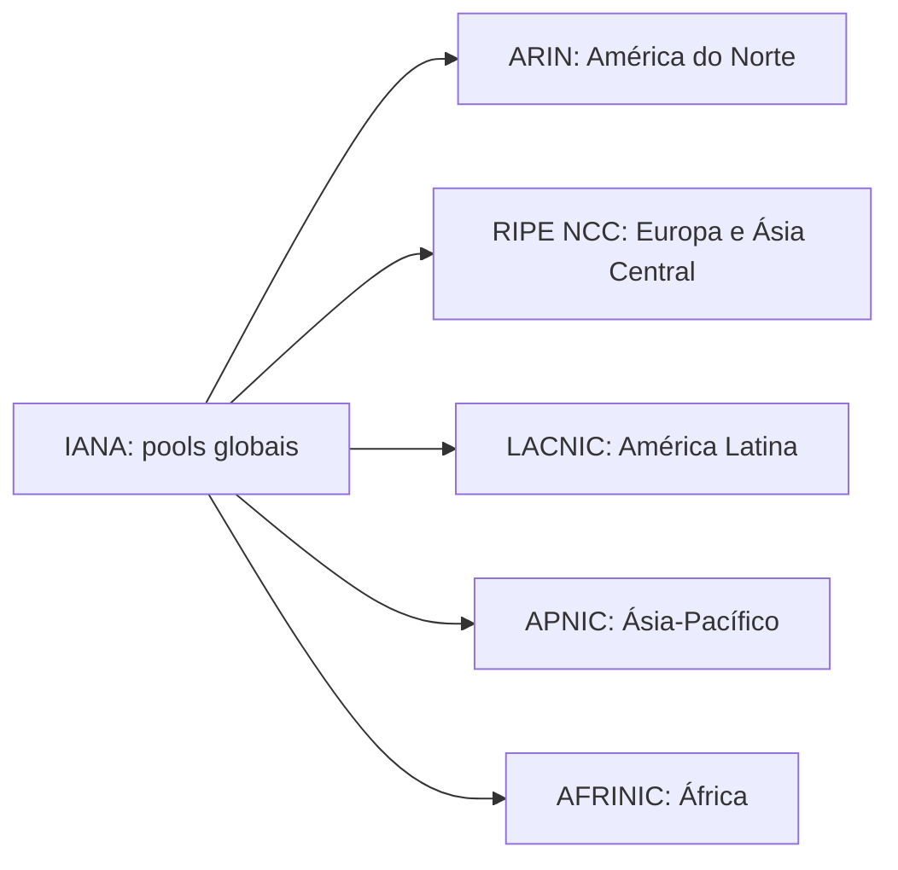
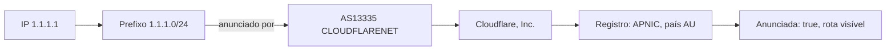

Todo serviço de segurança na web faz a mesma promessa: "este IP vem do Brasil", "este login veio de outro país". Ferramentas de bloqueio geográfico, detecção de VPN e antifraude dependem dessa informação. Mas de onde ela sai? Quem decide que um endereço pertence a um país? E como descobrir qual empresa opera um IP qualquer?

A resposta é uma cadeia de registros que sustenta a internet desde antes dela existir para o público: IANA, RIRs, blocos CIDR, ASNs e anúncios BGP. Este guia percorre a cadeia inteira, com comandos que você pode rodar agora no seu terminal. Na parte 2, usamos essa base para entender como a detecção de VPN funciona de verdade.

## "Pertence" significa três coisas diferentes

A primeira descoberta é que a pergunta "de quem é esse IP?" tem três respostas, e misturá-las é a origem de quase todo erro de interpretação.

1. **Registro.** Quem está no cadastro oficial como detentor da faixa. É público, é verificável, é a fonte deste artigo.
2. **Rota.** Quem está anunciando a faixa na tabela global de roteamento, ou seja, quem responde por ela na prática.
3. **Localização.** Onde está a máquina que usa o IP. Ninguém registra isso; é estimativa.

Quando um sistema diz "IP do Brasil", ele está geralmente falando da resposta 3, um palpite construído em cima da resposta 1. Entender a diferença é o que separa quem usa bases de geolocalização de quem entende o que elas fazem.

## A árvore da distribuição: IANA e os cinco RIRs

No topo da cadeia está a IANA (Internet Assigned Numbers Authority), a autoridade que administra os pools globais de endereços. No modelo atual, a IANA normalmente não entrega endereços diretamente a empresas ou usuários finais: ela distribui grandes blocos para cinco organizações regionais, os RIRs (Regional Internet Registries), cada uma cobrindo uma parte do mundo.



Cada RIR mantém o cadastro da sua região e entrega faixas para provedores, empresas e governos, que podem repassar blocos menores para clientes. Os endereços que você vai usar no laboratório:

1. [IANA](https://www.iana.org/assignments/ipv4-address-space) mantém o mapa completo do espaço IPv4
2. [ARIN](https://www.arin.net), [RIPE NCC](https://www.ripe.net), [LACNIC](https://www.lacnic.net), [APNIC](https://www.apnic.net) e [AFRINIC](https://www.afrinic.net) publicam seus registros públicos
3. O Brasil está na região da LACNIC, mas atenção: faixas brasileiras também aparecem nos arquivos de outros RIRs, por transferências e registros históricos

Entre o RIR e o cliente final costuma existir um degrau: o LIR (Local Internet Registry), tipicamente o provedor que recebe faixas do RIR e as redistribui entre os seus clientes. A distinção aparece nos próprios arquivos: status `allocated` marca blocos entregues a um provedor para distribuir, e `assigned` marca blocos que a própria organização usa diretamente.

## CIDR: a notação que descreve blocos

Endereços não são distribuídos um por um. Chegam em blocos, descritos pela notação CIDR (Classless Inter-Domain Routing). O número depois da barra diz quantos bits, contando da esquerda, estão fixos no endereço.

Um `/24` fixa os primeiros 24 bits e deixa os últimos 8 livres: 256 endereços. Um `/20` deixa 12 bits livres: 4.096 endereços. Um `/16` deixa 16: 65.536. O espaço IPv4 inteiro é um `/0`: cerca de 4,3 bilhões de endereços.

Os dois blocos mais famosos da internet servem de exemplo:

1. `8.8.8.0/24` e `8.8.4.0/24`, os prefixos que contêm os resolvedores DNS públicos do Google (`8.8.8.8` e `8.8.4.4`)
2. `1.1.1.0/24` e `1.0.0.0/24`, os prefixos que contêm os da Cloudflare (`1.1.1.1` e `1.0.0.1`)

Guarde um detalhe que engana muita gente nos arquivos dos RIRs: o significado do campo de tamanho depende do tipo de recurso. Para IPv4, ele registra a quantidade de endereços; para IPv6, o comprimento do prefixo; para ASN, a quantidade de números que o registro abrange. A linha `1.0.16.0|4096` descreve um `/20`, porque 4.096 é 2 elevado a 12.

## O cadastro oficial: os arquivos delegated

Cada RIR publica, como arquivo de texto puro, a lista completa de tudo que delegou: faixas IPv4, IPv6 e números de ASN. São os arquivos "delegated", atualizados continuamente, no formato padrão acordado entre os RIRs. Cada linha é um registro:

```text
apnic|JP|ipv4|1.0.16.0|4096|20110412|allocated|A92D9378
```

A leitura da linha, separada por barras verticais:

1. Registro de origem (`apnic`)
2. Código do país de registro (`JP`)
3. Tipo (`ipv4`, `ipv6` ou `asn`)
4. Endereço inicial do bloco
5. Quantidade, com significado que depende do tipo: número de endereços em IPv4, comprimento do prefixo em IPv6, quantidade de números em ASN
6. Data do registro
7. Status (`allocated`, `assigned` ou outros)
8. Identificador opaco do registro

Para o Brasil, as faixas estão espalhadas principalmente no arquivo da LACNIC. E um exemplo de linha brasileira no arquivo da RIPE, comum em transferências recentes entre regiões:

```text
ripencc|BR|ipv4|93.158.236.0|1024|20080530|allocated|6515cb6f-...
```

É esse conjunto de cinco arquivos que responde, na fonte, à pergunta "quais faixas estão registradas em cada país". Esses registros são uma das principais fontes públicas para associar endereços a organizações e países, e as bases de geolocalização os complementam com outras fontes e medições.

## IP → ASN: descobrindo quem anuncia

Um ASN (Autonomous System Number) é o número de uma rede autônoma: um conjunto de faixas operado sob uma mesma política de roteamento. Provedores, clouds, universidades e grandes empresas têm o seu. É o primeiro atalho para responder "quem opera este IP".

O Team Cymru mantém um serviço whois especializado nessa tradução. O macOS já vem com o cliente `whois`, então o comando funciona sem instalar nada:

```bash
whois -h whois.cymru.com " -v 8.8.8.8"
```

Saída real deste comando, rodada durante a preparação deste artigo:

```text
AS      | IP      | BGP Prefix   | CC | Registry | Allocated  | AS Name
15169   | 8.8.8.8 | 8.8.8.0/24   | US | arin     | 2023-12-28 | GOOGLE - Google LLC, US
```

Uma linha responde tudo: o ASN (15169), o prefixo anunciado, o país de registro (US), o RIR (arin) e a organização. O mesmo caminho via API JSON, sem chave e sem instalar nada, é o RIPEstat, o serviço público de dados do RIPE NCC:

```bash
curl -s "https://stat.ripe.net/data/network-info/data.json?resource=8.8.8.8"
```

```json
{
  "data": {
    "asns": ["15169"],
    "prefix": "8.8.8.0/24"
  }
}
```

## Prefixos delegados e prefixos anunciados

Aqui está a distinção que fecha o ciclo do roteamento. Ter uma faixa registrada e anunciar a faixa são eventos diferentes, feitos por sistemas diferentes.

O registro é papel: diz que a faixa pertence a uma organização. O anúncio é prática: em BGP (Border Gateway Protocol), o protocolo que conecta as redes autônomas da internet, cada ASN anuncia os prefixos que atende, e essas declarações se espalham de roteador em roteador até formarem a tabela global. Serviços como o RIPE RIS e o Route Views observam essa propagação, e o [bgp.tools](https://bgp.tools) apresenta o resultado em formato navegável.

O RIPEstat devolve os dois estados juntos. Consultando o prefixo da Cloudflare:

```bash
curl -s "https://stat.ripe.net/data/prefix-overview/data.json?resource=1.1.1.0/24"
```

```json
{
  "data": {
    "announced": true,
    "asns": [
      { "asn": 13335, "holder": "CLOUDFLARENET - Cloudflare, Inc." }
    ]
  }
}
```

O campo `announced: true` é a prova prática: a faixa está registrada na APNIC **e** anunciada na tabela global pelo AS13335. O vínculo correto é este: o ASN **origina** o prefixo, isto é, o anuncia como seu. Anunciar não implica titularidade do registro, e uma mesma faixa pode até ser originada por mais de um ASN, configuração conhecida como MOAS. O inverso também existe e é comum: faixas registradas que nunca são anunciadas, seja por estarem paradas, reservadas para expansão ou simplesmente esquecidas. Sem uma rota propagada até determinada rede, essa rede não tem caminho BGP para alcançar o prefixo: o cadastro sozinho não roteia nada.

## ASN → Organização

Do ASN até o nome da empresa, o caminho é o cadastro do RIR. O `holder` que o RIPEstat devolve já é um resumo, e o whois do RIR entrega o registro completo, com contato administrativo e endereço. A interface moderna do whois é o RDAP, o protocolo de resposta em JSON que substitui progressivamente o texto antigo, acessível por qualquer cliente HTTP.

Para redes de infraestrutura, o [PeeringDB](https://www.peeringdb.com) complementa com contexto operacional: onde a rede tem presença, em quais pontos de troca de tráfego participa e qual a sua política de peering. Não é fonte oficial de registro de recursos IP. É um diretório colaborativo amplamente usado pela indústria para publicar exatamente essas informações.

## País de registro não é localização física

Agora o desmistificante que justifica este artigo. O código de país nos arquivos delegated está associado à alocação administrativa do recurso: o país onde a organização estava registrada quando recebeu a faixa. Não é onde o servidor está. Não é onde o usuário está. E transferências internacionais de recursos deixam o cadastro ainda mais distante da realidade operacional.

Os dois resolvedores mais famosos do mundo provam o ponto em par.

O `8.8.8.8` está registrado no ARIN, nos Estados Unidos, como vimos. Mas ele usa anycast: diferentes instalações anunciam o mesmo endereço, e o roteamento BGP conduz o seu pedido a uma delas segundo políticas e caminhos disponíveis, frequentemente uma instalação próxima na topologia da rede, nem sempre a mais próxima geograficamente. Quem responde pode estar num ponto de presença relativamente perto de você; o IP, por si só, não revela qual instalação atendeu.

O `1.1.1.1` agrava o caso. O whois da APNIC descreve o bloco assim:

```text
inetnum:    1.1.1.0 - 1.1.1.255
netname:    APNIC-LABS
descr:      APNIC and Cloudflare DNS Resolver project
descr:      Routed globally by AS13335/Cloudflare
country:    AU
source:     APNIC
```

O país de registro é `AU`, Austrália, porque o registro administrativo do bloco está na APNIC. Foi um prefixo de pesquisa reservado pela política regional da APNIC (a proposta prop-109, de 2014) e cedido em regime de cooperação para o projeto com a Cloudflare lançado em 2018. O serviço é operado globalmente pela rede americana Cloudflare, e o servidor que responde à sua consulta está, com alta probabilidade, mais perto de você do que do Pacífico.

As bases de geolocalização, como a GeoLite2 da MaxMind, tentam estimar a localização física combinando esses registros com outras pistas. Elas herdaram exatamente essa limitação: quando alguém diz que um IP "é do Brasil", a afirmação pode significar que a empresa dona da faixa está registrada aqui, que o anúncio BGP vem daqui ou que alguma medição sugeriu a presença física. São três evidências de qualidade diferente.

## Laboratório: a cadeia inteira no seu terminal

Nenhum comando desta seção exige instalação no macOS: `curl`, `whois`, `dig` e `grep` já vêm no sistema. A cadeia completa de perguntas, na ordem:

```bash
# 1. País de registro e faixas: baixe o arquivo delegated da sua região
curl -s "https://ftp.apnic.net/stats/apnic/delegated-apnic-extended-latest" | grep "|JP|ipv4|" | head -5

# 2. IP -> ASN, prefixo, país de registro e organização
whois -h whois.cymru.com " -v 8.8.8.8"

# 3. O mesmo, em JSON, via RIPEstat
curl -s "https://stat.ripe.net/data/network-info/data.json?resource=8.8.8.8"

# 4. O prefixo está anunciado? Por qual ASN?
curl -s "https://stat.ripe.net/data/prefix-overview/data.json?resource=1.1.1.0/24"

# 5. Quem responde por esse IP? O DNS reverso dá a primeira pista
dig -x 8.8.8.8 +short

# 6. O registro oficial, no formato JSON moderno (RDAP)
curl -s "https://rdap.arin.net/registry/ip/8.8.8.8"
```

O DNS reverso do comando 5 devolve `dns.google.`, e essa pista é mais poderosa do que parece: nomes reversos costumam revelar a função da máquina, não só a empresa, o que é o primeiro degrau da classificação de infraestrutura que exploramos na parte 2. O RDAP do comando 6 devolve o registro do recurso em JSON. Campos reais da resposta:

```json
{
  "name": "GOGL",
  "type": "DIRECT ALLOCATION",
  "startAddress": "8.8.8.0",
  "endAddress": "8.8.8.255",
  "handle": "NET-8-8-8-0-2"
}
```

Compare as três fontes da cadeia: o **RDAP** mostra o registro do recurso, o **RIPEstat e o BGP** mostram o roteamento observado, e o **GeoIP** só estima localização. Cada pergunta tem a sua ferramenta.

## A cadeia completa em um endereço real

Fechamos com o endereço `1.1.1.1`, atravessando todos os degraus com dados reais.



Na ordem da leitura:

1. O IP cai em um prefixo, `1.1.1.0/24`, descrito na notação CIDR
2. O prefixo é anunciado, ou originado, pelo AS13335, operado pela Cloudflare
3. O ASN está associado a uma organização, Cloudflare, Inc.
4. O registro do prefixo está na APNIC, com país de registro AU
5. O prefixo está anunciado em BGP e a sua rota é visível na internet; a conectividade efetiva depende de como cada rede propaga e aceita essa rota

Cinco perguntas, cinco respostas verificáveis, três fontes diferentes que se confirmam mutuamente. É essa engrenagem, e não uma base mágica, que sustenta toda classificação de IP.

## Qual fonte responde qual pergunta

A cadeia inteira cabe numa lista de perguntas e fontes, para consultar depois:

1. **Quem recebeu o bloco?** O registro do RIR, via whois ou RDAP
2. **Qual país está associado ao registro?** O arquivo delegated do RIR
3. **Qual prefixo contém este IP?** O RIR, o RIPEstat ou a tabela BGP
4. **Qual ASN origina o prefixo?** O BGP observado, via RIPEstat ou bgp.tools
5. **Qual organização está associada ao ASN?** O RIR, via RDAP, com o PeeringDB como complemento
6. **Onde está fisicamente o usuário ou o servidor?** GeoIP e medições: sempre estimativa
7. **Este IP é de VPN, proxy ou Tor?** IP intelligence e reputação, o assunto da parte 2

## Links oficiais

- Mapa completo do espaço IPv4: [IANA](https://www.iana.org/assignments/ipv4-address-space)
- Arquivos delegated: [APNIC](https://ftp.apnic.net/stats/apnic/), [RIPE NCC](https://ftp.ripe.net/pub/stats/ripencc/), [ARIN](https://ftp.arin.net/pub/stats/arin/), [LACNIC](https://ftp.lacnic.net/pub/stats/lacnic/), [AFRINIC](https://ftp.afrinic.net/pub/stats/afrinic/)
- API de dados do RIPE NCC: [stat.ripe.net](https://stat.ripe.net)
- Serviço de ASN do Team Cymru: [whois.cymru.com](https://www.team-cymru.com/ip-asn-mapping)
- Tabela de roteamento navegável: [bgp.tools](https://bgp.tools)
- Atlas operacional de redes: [PeeringDB](https://www.peeringdb.com)
- Base de geolocalização gratuita: [GeoLite2 da MaxMind](https://dev.maxmind.com/geoip/docs/databases/geoip2/)

## Conclusão

A cadeia é curta de contar e profunda de consequências: a IANA divide o espaço entre cinco RIRs, os RIRs registram faixas por país em arquivos públicos, os ASNs anunciam essas faixas em BGP e as organizações assinam tudo com seus cadastros. "Pertence" vira três perguntas separadas, registro, rota e localização, e cada uma tem a sua fonte própria.

E a cadeia ainda tem um próximo degrau. Saber qual ASN origina um prefixo leva a outra pergunta: esse ASN tem autorização do detentor do recurso para originá-lo? É o território do RPKI (Resource Public Key Infrastructure), a infraestrutura de chaves que assina anúncios BGP, e merece um artigo próprio.

Na parte 2, essa base vai para o campo: por que VPNs moram em ASNs de hospedagem, por que o ASN da sua VPN não é o nome dela, e como os sistemas de detecção combinam registros, rotas e reputação para adivinhar o que você está usando. A cadeia que você acabou de aprender é exatamente o que esses sistemas consultam.
