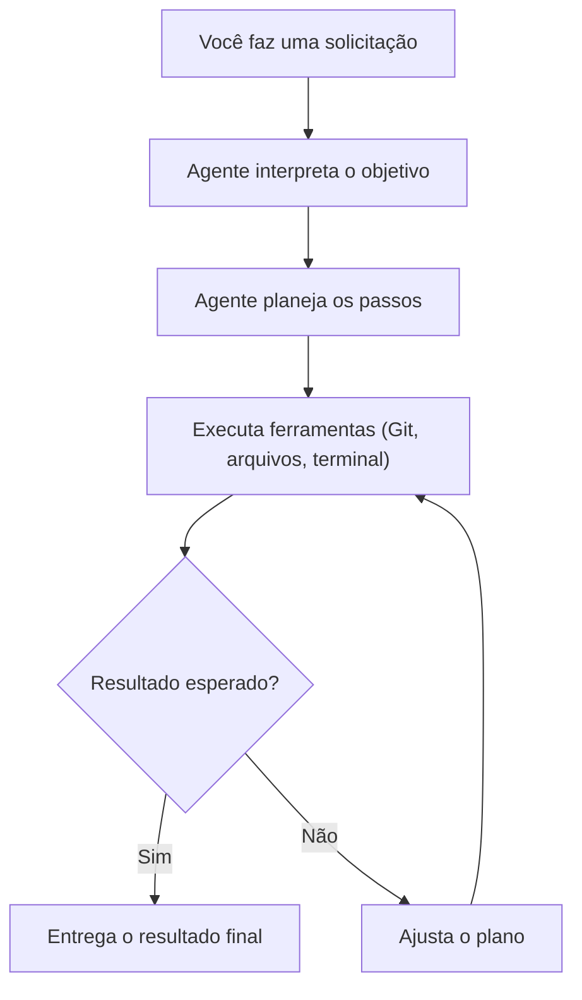
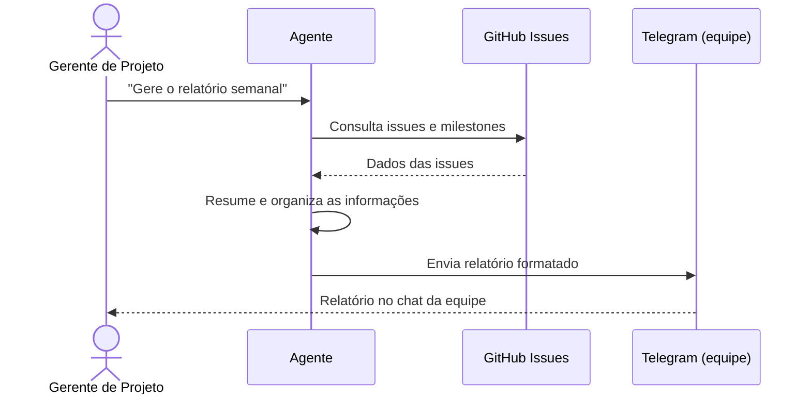
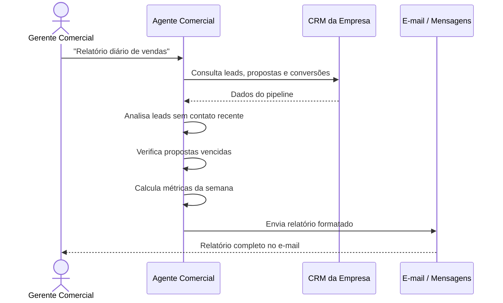

## O que são agentes de IA autônomos

Imagine que você pudesse contratar um assistente que nunca dorme, não pede férias e executa tarefas repetitivas sem supervisão constante. Um agente de IA autônomo é exatamente isso: um programa que usa modelos de linguagem (LLMs) para raciocinar, planejar e agir sem depender de comandos humanos a cada passo.

Diferente de um chatbot que apenas responde perguntas, um agente opera em ciclos. Ele recebe um objetivo, analisa o contexto, decide quais ferramentas usar, executa a ação, observa o resultado e ajusta o plano se necessário. Esse loop de pensamento, ação e observação é o que dá autonomia a ele.

## Por que você precisa de agentes

O trabalho moderno exige atenção constante a tarefas repetitivas. Um desenvolvedor passa horas abrindo pull requests e rodando testes. Um gerente de projeto monitora prazos e escreve relatórios manualmente. Um profissional de administração comercial acompanha planilhas de vendas, organiza contatos com clientes, gera propostas e analisa números de desempenho.

Cada uma dessas tarefas consome tempo que poderia ser usado em problemas mais complexos. Agentes de IA não substituem pessoas. Eles assumem o trabalho tedioso e repetitivo. Assim você pode focar no que realmente exige julgamento humano.

Abaixo estão três exemplos práticos. Cada um mostra como criar agentes para papéis diferentes.

---

## Caso 1: O agente técnico de código

### O problema

Um desenvolvedor precisa revisar código, rodar testes, criar ramos Git e abrir pull requests várias vezes por semana. Cada PR segue o mesmo processo: criar branch, fazer commit, fazer push, abrir o PR e aguardar revisão. Esse fluxo manual se repete e é fácil de automatizar.

### A solução

Um agente que recebe descrições de tarefas em linguagem natural, cria ramos Git, escreve código, executa testes e abre pull requests sozinho. Ele usa o terminal para comandos Git, um editor para modificar arquivos e a API do GitHub para criar PRs.

### Exemplo prático com Hermes Agent

O Hermes Agent (a ferramenta que estou usando agora para escrever este artigo) é um exemplo real de agente autônomo para código. Você pode fazer um pedido como este:

```
Atualize o repositório local, crie um artigo sobre
agentes de IA e abra um pull request.
```

O agente executa cada etapa. Ele busca as alterações mais recentes do GitHub, cria o arquivo do artigo com frontmatter válido, valida o build do projeto Astro, faz commit em uma nova branch e abre o PR. Tudo em segundos. O desenvolvedor não precisa lembrar de cada comando Git.

### Como isso funciona na prática

Observe que você não precisa saber programar para usar um agente assim. Você dá a instrução em português, e o modelo de linguagem por trás do agente interpreta, planeja e executa cada passo sozinho. O Hermes Agent, por exemplo, é construído com ferramentas prontas que você pode instalar e configurar sem escrever código.

Os blocos de código que aparecem a seguir servem apenas para ilustrar a lógica que o modelo de linguagem segue internamente. Não é você quem precisa criar esse código. O próprio modelo gera e executa instruções equivalentes para realizar as tarefas. Pense neles como uma demonstração do que acontece "dentro da caixa".

### Componentes do agente

Para construir um agente de código como esse, você precisa de:

1. **Um modelo de linguagem**: a inteligência que entende o que você pede e planeja os passos.
2. **Ferramentas**: acesso ao sistema de arquivos, terminal, Git e API do GitHub.
3. **Ciclo de execução**: o agente pensa, age, observa o resultado e repete até concluir.
4. **Memória**: ele sabe o que fez nos passos anteriores para não repetir ações.



### Ilustração do código que o modelo gera internamente

Quando você pede para o agente "liste os arquivos do diretório atual", o modelo de linguagem, nos bastidores, usa um mecanismo parecido com o código abaixo para decidir qual comando executar:

```python
# Este código é gerado e executado pelo modelo de linguagem,
# não por você. Ele ilustra como o agente decide o que fazer.
import subprocess
import json

def executar_comando(comando):
    resultado = subprocess.run(
        comando, shell=True, capture_output=True, text=True
    )
    return resultado.stdout

# O modelo recebe a instrução e identifica que precisa
# executar "ls" ou "dir" para responder
comando = "ls -la"
print(executar_comando(comando))
```

O exemplo acima é simplificado. Na prática, o modelo escolhe entre várias ferramentas disponíveis, executa a mais adequada, analisa o resultado e decide se precisa de mais ações ou se já pode entregar a resposta. Todo esse raciocínio acontece automaticamente.

---

## Caso 2: O agente do gerente de projeto

### O problema

Um gerente de projeto acompanha prazos, envia relatórios de progresso, organiza reuniões e delega tarefas. Essas atividades seguem padrões previsíveis e consomem horas toda semana.

### A solução

Um agente que consulta ferramentas de projeto como GitHub Issues, Jira ou Trello. Ele resume o progresso da semana, identifica tarefas atrasadas e envia relatórios automaticamente para a equipe.

### Exemplo prático de uso

Um gerente de projeto pode configurar um agente que roda toda segunda-feira de manhã. Ele faz o seguinte:

1. Consulta todas as issues abertas do repositório.
2. Verifica quais prazos estão próximos do vencimento.
3. Conta quantos pull requests aguardam revisão.
4. Gera um resumo e envia para o canal da equipe no Telegram.

O comando seria algo como:

```
Agente, gere o relatório semanal do projeto.
Resuma as issues em aberto, prazos próximos
e PRs pendentes. Envie o resumo para o time.
```

### Fluxo do agente de projeto



### Estrutura do relatório gerado

O agente produz algo como:

```
Relatório Semanal - Projeto X
Período: 11 a 18 de agosto

Issues em aberto: 12
  - 3 com prazo até esta sexta
  - 2 bloqueadas aguardando revisão
  - 7 em progresso dentro do prazo

Pull requests pendentes: 4
  - 2 aguardando revisão há mais de 2 dias
  - 1 em revisão
  - 1 aguardando testes

Tarefas concluídas esta semana: 8
Próxima milestone: Sprint 24 (entrega 25/08)
```

Isso elimina a necessidade de abrir várias abas no navegador, fazer consultas manuais e formatar texto. O agente consolida tudo em segundos.

### Ferramentas necessárias

Para criar um agente de projeto, você precisa de integrações com:

- **GitHub API** ou **GitLab API**: para ler issues, milestones e merge requests.
- **API do calendário**: para verificar feriados e prazos.
- **Plataforma de mensagens**: Telegram, Slack ou e-mail para entregar relatórios.

E o mais importante: você não precisa integrar nada manualmente. Basta descrever o que precisa em linguagem natural que o agente descobre quais APIs consultar e como formatar a resposta.

---

## Caso 3: O agente do administrador comercial

### O problema

Um profissional de administração comercial gerencia contatos com clientes, acompanha o funil de vendas, organiza propostas e analisa números de desempenho. Ele atualiza planilhas manualmente, envia e-mails de follow-up um a um e gasta horas compilando relatórios de vendas que poderiam ser gerados em segundos.

Uma oportunidade de venda pode passar despercebida porque ninguém percebeu que um lead qualificado não foi contatado há semanas. Um cliente importante pode ficar sem resposta porque o acompanhamento ficou perdido em meio a dezenas de e-mails.

### A solução

Um agente que se conecta ao CRM da empresa, acompanha o funil de vendas, identifica leads que precisam de contato, envia lembretes de follow-up e gera relatórios de desempenho comercial automaticamente.

### Exemplo prático de uso

Imagine que o agente é configurado para verificar diariamente o pipeline de vendas. Ele executa as seguintes ações:

1. Consulta o CRM e lista todos os leads em cada estágio do funil.
2. Identifica leads que não tiveram contato há mais de 7 dias.
3. Verifica propostas enviadas há mais de 5 dias sem retorno.
4. Calcula a taxa de conversão da semana.
5. Envia um resumo matinal para o gerente comercial.

O comando seria algo como:

```
Agente, gere o relatório diário de vendas.
Liste leads sem contato há mais de 7 dias,
propostas pendentes de retorno e a taxa
de conversão da semana. Envie para o meu e-mail.
```

### Fluxo do agente comercial



### Exemplo do relatório gerado

O agente entrega algo como:

```
Relatório Comercial Diário - 18 de agosto

Pipeline de vendas:
  - Leads novos: 5 (3 qualificados, 2 para nutrição)
  - Em negociação: 12
  - Propostas enviadas: 8 (3 aguardando retorno há +5 dias)
  - Fechados esta semana: 4 (R$ 47.500,00)

Ações recomendadas:
  - Lead "Empresa X": sem contato há 9 dias - enviar follow-up
  - Proposta "Projeto Y": enviada há 7 dias sem retorno
  - Lead "Empresa Z": demonstração agendada para amanhã

Taxa de conversão da semana: 22%
Meta mensal: 62% atingida
```

### Benefício para o administrador comercial

O agente não substitui o julgamento comercial. Ele elimina o trabalho braçal de abrir o CRM, exportar planilhas, aplicar filtros, copiar dados e formatar relatórios. O profissional recebe a informação pronta toda manhã e pode focar no que realmente importa: conversar com clientes e fechar negócios.

---

## Como tudo se conecta: o papel do modelo de linguagem

Nos três exemplos, há algo em comum: o usuário nunca precisa escrever código. Em nenhum dos casos o profissional precisa saber Python, APIs ou comandos de terminal para usar o agente.

O modelo de linguagem (LLM) que está no centro de cada agente é quem:

- Interpreta o pedido em linguagem natural.
- Decide quais ferramentas usar (terminal, API, sistema de arquivos).
- Gera o código ou comando necessário para cada etapa.
- Executa, observa o resultado e ajusta se algo deu errado.
- Entrega o resultado final formatado para o usuário.

Os exemplos de código que aparecem neste artigo servem apenas para mostrar a lógica que o modelo segue internamente. Se você é uma pessoa técnica, eles ajudam a entender o mecanismo. Se não é, pode ignorá-los completamente. O modelo cuida de tudo.

---

## Pontos de atenção ao criar agentes

### Segurança e permissões

Um agente autônomo tem acesso a ferramentas que podem causar danos. Um comando errado pode apagar arquivos, derrubar servidores ou gerar custos inesperados em APIs pagas.

Sempre restrinja as permissões do agente:

- Não dê acesso irrestrito ao terminal sem supervisão.
- Use ambientes isolados (containers Docker) para ações destrutivas.
- Para ações críticas, exija confirmação humana antes de executar.
- Defina limites de uso para APIs com custo.

### Custos de API

Agentes que fazem muitas chamadas a LLMs podem ficar caros. Um agente que verifica servidores a cada 5 minutos e faz 12 chamadas por hora pode consumir mais crédito do que parece no fim do mês.

Estratégias para controlar custos:

- Use modelos menores e mais baratos para tarefas simples.
- Agregue dados antes de enviar para o LLM.
- Defina um orçamento diário ou mensal de chamadas.

### Qualidade do planejamento

Agentes são bons em executar tarefas bem definidas. Eles ainda são limitados em tarefas que exigem contexto amplo ou decisões subjetivas. Um agente que planeja mal pode ficar preso em loops ou executar passos desnecessários.

Teste o agente com tarefas controladas antes de deixá-lo operar sem supervisão.

---

## Conclusão

Agentes de IA autônomos mudam a forma como lidamos com ferramentas digitais. Eles não substituem o trabalho intelectual. Eles eliminam o trabalho mecânico que existe entre uma ideia e sua execução.

Um desenvolvedor não precisa mais lembrar de cada comando Git para abrir um PR. Um gerente de projeto não precisa mais abrir abas e copiar dados para gerar um relatório. Um administrador comercial não precisa mais perder tempo compilando planilhas de vendas manualmente.

Cada agente apresentado aqui pode ser construído com ferramentas que já existem. O Hermes Agent, a API da OpenAI com function calling, as integrações com GitHub e Telegram e os sistemas de CRM são componentes reais que você pode usar hoje. E em todos os casos, quem faz o trabalho pesado de programação é o modelo de linguagem, não você.

O mais importante é começar com um problema pequeno e bem definido. Automatize uma única tarefa que você faz toda semana. Depois outra. Em alguns meses, você terá um time de agentes trabalhando enquanto você foca no que realmente importa.