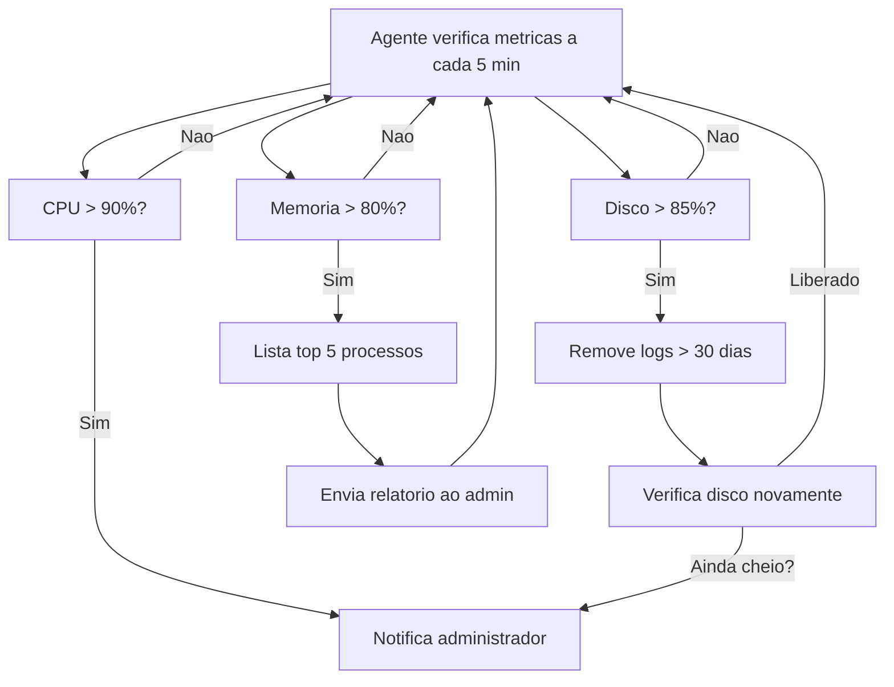

## O que sao agentes de IA autonomos

Imagine que voce pudesse contratar um assistente que nunca dorme, nao pede ferias e executa tarefas repetitivas sem supervisao constante. Um agente de IA autonomo e exatamente isso: um programa que usa modelos de linguagem (LLMs) para raciocinar, planejar e agir sem depender de comandos humanos a cada passo.

Diferente de um chatbot que apenas responde perguntas, um agente opera em ciclos. Ele recebe um objetivo, analisa o contexto, decide quais ferramentas usar, executa a acao, observa o resultado e ajusta o plano se necessario. Esse loop de pensamento, acao e observacao e o que da autonomia a ele.

## Por que voce precisa de agentes

O trabalho moderno exige atencao constante a tarefas repetitivas. Um desenvolvedor passa horas abrindo pull requests e rodando testes. Um gerente de projeto monitora prazos e escreve relatorios manualmente. Um administrador de sistemas verifica logs e reinicia servicos tarde da noite.

Cada uma dessas tarefas consome tempo que poderia ser usado em problemas mais complexos. Agentes de IA nao substituem pessoas. Eles assumem o trabalho tedioso e repetitivo. Assim voce pode focar no que realmente exige julgamento humano.

Abaixo estao tres exemplos praticos. Cada um mostra como criar agentes para papeis diferentes.

---

## Caso 1: O agente tecnico de codigo

### O problema

Um desenvolvedor precisa revisar codigo, rodar testes, criar ramos Git e abrir pull requests varias vezes por semana. Cada PR segue o mesmo processo: criar branch, fazer commit, fazer push, abrir o PR e aguardar revisao. Esse fluxo manual se repete e e facil de automatizar.

### A solucao

Um agente que recebe descricoes de tarefas em linguagem natural, cria ramos Git, escreve codigo, executa testes e abre pull requests sozinho. Ele usa o terminal para comandos Git, um editor para modificar arquivos e a API do GitHub para criar PRs.

### Exemplo pratico com Hermes Agent

O Hermes Agent (a ferramenta que estou usando agora para escrever este artigo) e um exemplo real de agente autonomo para codigo. Voce pode fazer um pedido como este:

```
Atualize o repositorio local, crie um artigo sobre agentes de IA e abra um pull request.
```

O agente executa cada etapa. Ele busca as alteracoes mais recentes do GitHub, cria o arquivo do artigo com frontmatter valido, valida o build do projeto Astro, faz commit em uma nova branch e abre o PR. Tudo em segundos. O desenvolvedor nao precisa lembrar de cada comando Git.

### Componentes do agente

Para construir um agente de codigo como esse, voce precisa de:

1. **Um modelo de linguagem**: a inteligencia que entende o que voce pede e planeja os passos.
2. **Ferramentas**: acesso ao sistema de arquivos, terminal, Git e API do GitHub.
3. **Ciclo de execucao**: o agente pensa, age, observa o resultado e repete ate concluir.
4. **Memoria**: ele sabe o que fez nos passos anteriores para nao repetir acoes.


### Codigo minimo de um agente

Um exemplo simples em Python usando a biblioteca `openai` para criar um agente que executa comandos no terminal:

```python
import subprocess
import json
from openai import OpenAI

client = OpenAI()

def executar_comando(comando):
    resultado = subprocess.run(
        comando, shell=True, capture_output=True, text=True
    )
    return resultado.stdout

tools = [
    {
        "type": "function",
        "function": {
            "name": "executar_comando",
            "description": "Executa um comando no terminal",
            "parameters": {
                "type": "object",
                "properties": {
                    "comando": {
                        "type": "string",
                        "description": "Comando shell para executar"
                    }
                },
                "required": ["comando"]
            }
        }
    }
]

def agente_executa(mensagem_usuario):
    messages = [{"role": "user", "content": mensagem_usuario}]

    while True:
        resposta = client.chat.completions.create(
            model="gpt-4o",
            messages=messages,
            tools=tools
        )

        choice = resposta.choices[0]

        if choice.finish_reason == "tool_calls":
            for tool_call in choice.message.tool_calls:
                args = json.loads(tool_call.function.arguments)
                resultado = executar_comando(args["comando"])
                messages.append(choice.message)
                messages.append({
                    "role": "tool",
                    "tool_call_id": tool_call.id,
                    "content": resultado
                })
        else:
            return choice.message.content

# Uso
resultado = agente_executa("Liste os arquivos do diretorio atual")
print(resultado)
```

Esse codigo cria um ciclo de autonomia basico. O agente recebe um pedido, decide se precisa executar um comando, analisa o resultado e continua ate ter a resposta final.

---

## Caso 2: O agente do gerente de projeto

### O problema

Um gerente de projeto acompanha prazos, envia relatorios de progresso, organiza reunioes e delega tarefas. Essas atividades seguem padroes previsiveis e consomem horas toda semana.

### A solucao

Um agente que consulta ferramentas de projeto como GitHub Issues, Jira ou Trello. Ele resume o progresso da semana, identifica tarefas atrasadas e envia relatorios automaticamente para a equipe.

### Exemplo pratico de uso

Um gerente de projeto pode configurar um agente que roda toda segunda-feira de manha. Ele faz o seguinte:

1. Consulta todas as issues abertas do repositorio.
2. Verifica quais prazos estao proximos do vencimento.
3. Conta quantos pull requests aguardam revisao.
4. Gera um resumo e envia para o canal da equipe no Telegram.

O comando seria algo como:

```
Agente, gere o relatorio semanal do projeto.
Resuma as issues em aberto, prazos proximos
e PRs pendentes. Envie o resumo para o time.
```

### Fluxo do agente de projeto


### Estrutura do relatorio gerado

O agente produz algo como:

```
Relatorio Semanal - Projeto X
Periodo: 11 a 18 de agosto

Issues em aberto: 12
  - 3 com prazo ate esta sexta
  - 2 bloqueadas aguardando revisao
  - 7 em progresso dentro do prazo

Pull requests pendentes: 4
  - 2 aguardando revisao ha mais de 2 dias
  - 1 em revisao
  - 1 aguardando testes

Tarefas concluidas esta semana: 8
Proxima milestone: Sprint 24 (entrega 25/08)
```

Isso elimina a necessidade de abrir varias abas no navegador, fazer consultas manuais e formatar texto. O agente consolida tudo em segundos.

### Ferramentas necessarias

Para criar um agente de projeto, voce precisa de integracoes com:

- **GitHub API** ou **GitLab API**: para ler issues, milestones e merge requests.
- **API do calendario**: para verificar feriados e prazos.
- **Plataforma de mensagens**: Telegram, Slack ou e-mail para entregar relatorios.

---

## Caso 3: O agente do administrador de infraestrutura

### O problema

Um administrador de sistemas monitora servidores, verifica uso de disco e memoria, analisa logs de erro e reinicia servicos. Essas tarefas sao criticas mas repetitivas. Um servidor com disco cheio as 3h da manha pode causar uma indisponibilidade que so sera descoberta no dia seguinte.

### A solucao

Um agente que monitora a saude dos servidores em tempo real, executa diagnosticos, aplica correcoes para problemas conhecidos e envia alertas quando algo exige intervencao humana.

### Exemplo pratico de uso

O agente pode ser configurado para verificar a cada 5 minutos o uso de CPU, memoria e disco. Se o disco atingir 90%, ele executa uma limpeza automatica de logs antigos. Se a memoria estiver acima de 80%, ele identifica o processo mais pesado e notifica o administrador.

Comando de configuracao:

```
Agente, monitore os servidores de producao.
Se o disco passar de 85%, limpe logs com mais
de 30 dias. Se a CPU ficar acima de 90% por
mais de 5 minutos, me notifique.
```

### Logica do agente de infraestrutura



### Script de exemplo para monitoria

Um agente simples que monitora recursos do sistema:

```python
import psutil
import subprocess
import datetime

def verificar_disco():
    uso = psutil.disk_usage('/')
    percentual = uso.percent
    if percentual > 85:
        subprocess.run([
            'find', '/var/log', '-name', '*.log',
            '-mtime', '+30', '-delete'
        ])
        return f"Disco em {percentual}%. Logs antigos removidos."
    return f"Disco em {percentual}%. OK."

def verificar_cpu():
    percentual = psutil.cpu_percent(interval=5)
    if percentual > 90:
        return f"ALERTA: CPU em {percentual}%"
    return f"CPU em {percentual}%. OK."

def verificar_memoria():
    memoria = psutil.virtual_memory()
    if memoria.percent > 80:
        processos = sorted(
            psutil.process_iter(['pid', 'name', 'memory_percent']),
            key=lambda p: p.info['memory_percent'] or 0,
            reverse=True
        )[:5]
        top = [
            f"{p.info['name']} - {p.info['memory_percent']:.1f}%"
            for p in processos
        ]
        return f"Memoria em {memoria.percent}%. Top: {', '.join(top)}"
    return f"Memoria em {memoria.percent}%. OK."

if __name__ == '__main__':
    print(datetime.datetime.now())
    print(verificar_disco())
    print(verificar_cpu())
    print(verificar_memoria())
```

### Beneficio para o administrador

O agente nao elimina a necessidade de um administrador. Ele elimina a necessidade de o administrador estar acordado as 3h da manha para verificar um disco cheio. Problemas conhecidos sao corrigidos automaticamente. Problemas novos ou que exigem decisao sao escalados com contexto completo.

---

## Pontos de atencao ao criar agentes

### Seguranca e permissoes

Um agente autonomo tem acesso a ferramentas que podem causar danos. Um comando errado pode apagar arquivos, derrubar servidores ou gerar custos inesperados em APIs pagas.

Sempre restrinja as permissoes do agente:

- Nao de acesso irrestrito ao terminal sem supervisao.
- Use ambientes isolados (containers Docker) para acoes destrutivas.
- Para acoes criticas, exija confirmacao humana antes de executar.
- Defina limites de uso para APIs com custo.

### Custos de API

Agentes que fazem muitas chamadas a LLMs podem ficar caros. Um agente que verifica servidores a cada 5 minutos e faz 12 chamadas por hora pode consumir mais credito do que parece no fim do mes.

Estrategias para controlar custos:

- Use modelos menores e mais baratos para tarefas simples.
- Agregue dados antes de enviar para o LLM.
- Defina um orcamento diario ou mensal de chamadas.

### Qualidade do planejamento

Agentes sao bons em executar tarefas bem definidas. Eles ainda sao limitados em tarefas que exigem contexto amplo ou decisoes subjetivas. Um agente que planeja mal pode ficar preso em loops ou executar passos desnecessarios.

Teste o agente com tarefas controladas antes de deixa-lo operar sem supervisao.

---

## Conclusao

Agentes de IA autonomos mudam a forma como lidamos com ferramentas digitais. Eles nao substituem o trabalho intelectual. Eles eliminam o trabalho mecanico que existe entre uma ideia e sua execucao.

Um desenvolvedor nao precisa mais lembrar de cada comando Git para abrir um PR. Um gerente de projeto nao precisa mais abrir abas e copiar dados para gerar um relatorio. Um administrador nao precisa mais perder o sono monitorando servidores.

Cada agente apresentado aqui pode ser construido com ferramentas que ja existem. O Hermes Agent, a API da OpenAI com function calling, a biblioteca psutil para monitoramento e as integracoes com GitHub e Telegram sao componentes reais que voce pode usar hoje.

O mais importante e comecar com um problema pequeno e bem definido. Automatize uma unica tarefa que voce faz toda semana. Depois outra. Em alguns meses, voce tera um time de agentes trabalhando enquanto voce foca no que realmente importa.