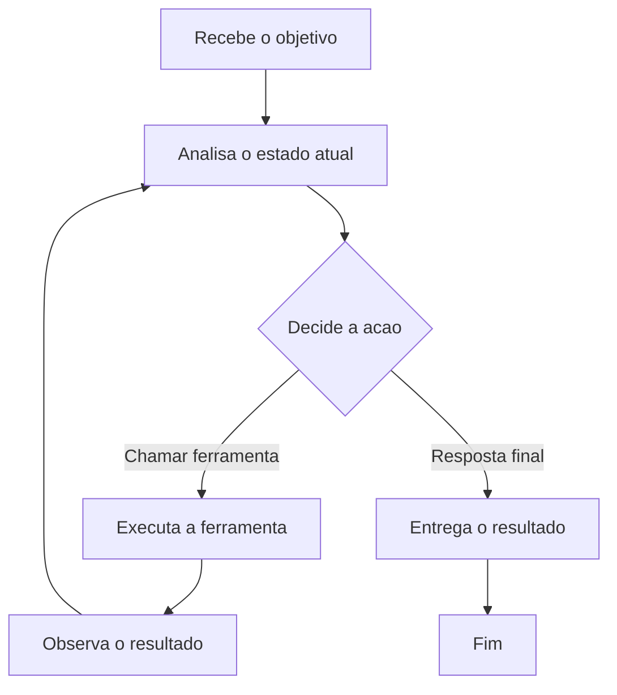
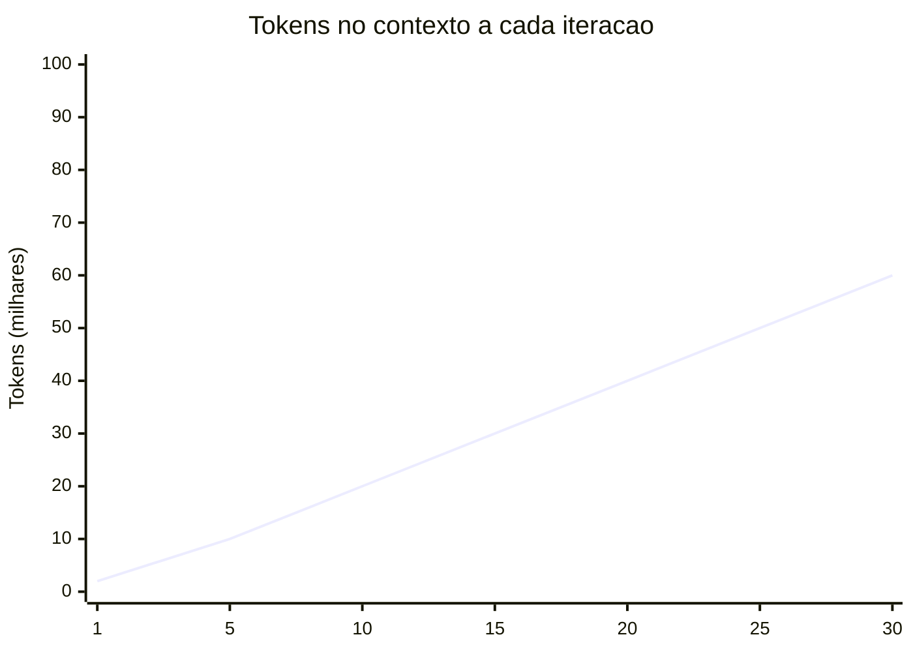

Se você já tentou construir um agente de IA que vai além do "faça isso e pare", sabe que o negócio desanda rápido. O modelo começa a alucinar, o contexto cresce sem controle, o custo explode, e no fim você não sabe se ele terminou ou se está rodando em círculos.

Este artigo mostra como evitar esse ciclo vicioso. Vamos direto ao ponto: o que é um agente, quando usar um loop, como controlar tokens, e as práticas que separam um agent que funciona de um que queima crédito da API.

## O que é um agente de IA?

Um **agente** é um LLM equipado com ferramentas (tools) e autonomia para executar múltiplos passos em direção a um objetivo. Diferente de um chat comum (onde você pergunta e ele responde), um agente pode:

1. Executar código e ler o resultado
2. Acessar APIs e arquivos
3. Tomar decisões com base no que encontrou
4. Iterar até atingir um critério de sucesso

A estrutura mínima de um agente é:

```
LLM + Tools + Loop (explícito ou implícito)
```

Sem o loop, você tem um "assistente aumentado". Útil, mas não autônomo.

### Quando usar um agente?

Use um agente quando a tarefa **exige múltiplas etapas que você não consegue pré-definir**. Exemplos reais:

| Cenário | Agente? | Por quê |
|---|---|---|
| Resumir um artigo | Não | Uma chamada de API resolve |
| Debugging de um crash em produção | Sim | Precisa ler logs, testar hipóteses, tentar correções |
| Refatorar um módulo inteiro | Sim | Envolve ler, editar, testar, iterar |
| Traduzir 3 parágrafos | Não | Prompt único resolve |
| CI/CD que diagnostica falhas e sugere fix | Sim | Cada falha é imprevisível |

A regra é simples: se o caminho até o resultado é determinístico, não use um agente. Use uma função. O agente brilha onde o caminho é incerto.

## O que é Loop Engineering?

**Loop Engineering** é a arte de projetar o ciclo de repetição de um agente: o que ele faz a cada iteração, como decide continuar ou parar, e como gerencia o contexto entre passos.

Enquanto **Prompt Engineering** decide o que dizer ao modelo, e **Context Engineering** decide o que colocar na janela de contexto, o **Loop Engineering** decide como o agente interage com o mundo e consigo mesmo ao longo do tempo.

O loop básico de um agente é:



Cada iteração começa com a análise do estado atual. O modelo então decide se chama uma ferramenta (e volta ao início do loop) ou se já pode entregar a resposta final. Esse ciclo parece simples, mas é aqui que a maioria dos projetos quebra. Sem um loop bem desenhado, o agente entra em parafuso: repete a mesma ação, acumula contexto inútil, ignora o próprio progresso.

### Loop explícito vs. implícito

Muitos frameworks (LangChain, CrewAI, Vercel AI SDK) escondem o loop de você. O modelo recebe o histórico e as tools, e o framework gerencia as chamadas. Isso é um **loop implícito**. Você não vê, não controla, e geralmente não consegue interromper.

Um **loop explícito** é quando você escreve o `while` você mesmo:

```python
# Exemplo conceitual de loop explícito
max_iterations = 10
context = [system_prompt, user_goal]

for i in range(max_iterations):
    response = llm.call(context, tools=available_tools)
    
    if response.has_tool_call:
        result = execute_tool(response.tool_call)
        context.append(result)
    else:
        # O LLM respondeu diretamente (tarefa concluida)
        print(response.text)
        break
```

A diferença é controle. Com loop explícito você pode:

1. Limitar iterações
2. Podar contexto velho
3. Injetar verificações de segurança entre passos
4. Decidir o que volta para o modelo

## Os riscos reais de estouro de tokens

O maior vilão de agentes em produção não é o modelo ser burro. É o contexto crescer sem controle e o custo sair do controle.

### O problema quadrático

Cada iteração de um agente adiciona ao histórico: o tool call que o modelo fez e o resultado que voltou. Na iteração 1 você tem 1k tokens. Na 10, 10k. Na 30, 30k. O custo de cada chamada cresce linearmente, e o custo total cresce quadraticamente.

Na prática:



Cada ponto na linha representa o tamanho do contexto naquela iteração. Ele cresce porque cada ciclo adiciona o tool call e o resultado ao histórico. A conta fica:

| Iterações | Tokens por chamada (aprox.) | Custo acumulado (DeepSeek V4) |
|---|---|---|
| 5 | 5k a 15k | ~$0.003 |
| 20 | 5k a 50k | ~$0.08 |
| 50 | 5k a 100k+ | ~$0.50+ |

Com modelos mais caros (Claude, GPT-4), esses números multiplicam. Um agente descontrolado pode queimar dezenas de dólares em minutos.

### O problema de atenção

Além do custo, modelos perdem performance quando o contexto fica muito grande. O fenômeno conhecido como "lost in the middle" faz com que informações no meio do contexto sejam ignoradas. Se o histórico do agente tem 30 iterações, ele pode simplesmente esquecer o objetivo original ou repetir algo que já tentou.

## Melhores práticas para agentes em produção

As práticas abaixo são extraídas de fontes consolidadas na indústria: o guia "Building Effective Agents" da Anthropic (dez/2024), artigos de Addy Osmani sobre spec-driven development para agentes (2026), o framework de agentic loops do LangGraph, e mais de dois anos de observação de agentes rodando em produção. Nenhuma delas é opinião isolada.

### 1. Comece com um workflow, evolua para um agente

A recomendação número 1 da Anthropic no guia "Building Effective Agents" é clara: use o padrão mais simples que funciona. Só adicione um loop autônomo quando um workflow determinístico não der conta.

Isso significa:

1. Primeiro, tente resolver com um prompt único
2. Depois, com uma sequência fixa de chamadas (workflow)
3. Só então, com um agente em loop

A tabela da introdução já mostra esse raciocínio. Um agente não é "mais avançado". É uma ferramenta para quando o caminho é imprevisível.

### 2. Sempre limite iterações com um teto duplo

Nunca deixe um agente rodar sem um teto. `max_iterations` não é opcional. É seu airbag.

```python
MAX_ITERATIONS = 15  # Ajuste conforme a tarefa
```

Para tarefas críticas, considere também um orçamento de tokens:

```python
MAX_TOKENS_CONSUMED = 50_000  # Para toda a execução
```

E para serviços pagos (APIs de terceiros chamadas pelo agente), um orçamento de custo:

```python
MAX_API_COST_USD = 2.00  # Se cada tool call custa dinheiro real
```

Essa dupla camada (iterações + tokens) evita que um loop mal comportado queime orçamento mesmo que o número de passos seja pequeno. Uma única ferramenta que retorna dados muito grandes pode estourar 50k tokens em 3 iterações.

### 3. Use SPEC.md + PLAN.md + TASKS.md (a tríade de artefatos)

Este padrão foi formalizado em 2026 por iniciativas como o Spec Kit e adotado por times que usam Claude Code, Codex e Cursor em produção. A ideia é separar o objetivo em três arquivos, cada um com um propósito.

**SPEC.md** define o "o quê". O problema a ser resolvido, critérios de aceite, restrições. Este arquivo não muda durante a execução.

```markdown
# SPEC.md

## Problema
A pipeline de CI esta quebrando na etapa de lint apos o upgrade
de eslint 8.x para 9.x. O erro e: "ESLint 9.x requires flat config
but eslintrc format was found".

## Criterios de aceite
- Build passa no CI com eslint 9.x
- Todas as regras existentes sao preservadas ou migradas
- Nenhum warning novo e introduzido

## Restricoes
- Nao pode desabilitar regras globalmente
- Deve usar o formato flat config (eslint.config.js)
```

**PLAN.md** define o "como". A estratégia técnica, dividida em fases. O agente atualiza este arquivo a cada iteração para refletir o progresso real.

```markdown
# PLAN.md

## Estrategia
Migrar de .eslintrc.json para eslint.config.js, convertendo as
regras uma por uma e validando com o lint apos cada bloco.

## Fases
- [x] Fase 1: Ler configuracao atual (.eslintrc.json + plugins)
- [ ] Fase 2: Criar eslint.config.js com as mesmas regras
- [ ] Fase 3: Rodar lint e corrigir erros de migracao
- [ ] Fase 4: Remover .eslintrc.json e configs antigas
- [ ] Fase 5: Rodar build completo para confirmar

## Observacoes
- Plugin @typescript-eslint precisa ser atualizado para v7
- Regra "no-unused-vars" mudou de nome na v9
```

**TASKS.md** é a lista de tarefas atômicas que o agente executa. Cada task é uma ação única. Este arquivo funciona como o backlog do loop.

```markdown
# TASKS.md

## Pendentes
- [ ] Criar eslint.config.js com parser e plugins base
- [ ] Migrar regras de "possible errors" do .eslintrc antigo
- [ ] Migrar regras de "best practices"
- [ ] Migrar regras TypeScript
- [ ] Rodar `npx eslint .` e registrar resultados
- [ ] Corrigir cada erro reportado
- [ ] Rodar build completo

## Concluidas
- [x] Identificar versao do eslint e plugins instalados
- [x] Ler .eslintrc.json e documentar regras ativas
- [x] Verificar documentacao de migracao eslint 8 -> 9
```

O ciclo do agente fica:

```
1. Le SPEC.md (fixo, nunca muda)
2. Le PLAN.md para saber onde parou
3. Le TASKS.md para saber qual a proxima acao atomica
4. Executa a ferramenta para aquela task
5. Verifica o resultado
6. Atualiza PLAN.md e TASKS.md com o progresso
7. Repete
```

Esse fluxo é usado por times que rodam agentes de forma autônoma por horas. Os arquivos funcionam como memória externa que sobrevive a reset de contexto e permite que outro agente (ou um humano) retome o trabalho de onde parou.

### 4. Mantenha um log de decisões (scratchpad) dentro do loop

Dentro do contexto do modelo, mantenha um registro compacto do que já foi tentado. Sem isso, o modelo repete ações. É o que a Anthropic chama de auto-verificação e Addy Osmani recomenda como "self-verification pattern".

No fim de cada iteração, antes de montar o contexto da próxima, o agente escreve um resumo:

```markdown
## Registro de decisoes (atualizado a cada passo)

[PASSO 1] Leu .eslintrc.json - 47 regras encontradas
[PASSO 2] Criou eslint.config.js com parser base - SUCESSO
[PASSO 3] Tentou migrar regras em lote - FALHA (erro de sintaxe no config)
[PASSO 4] Corrigiu sintaxe do eslint.config.js - SUCESSO
[PASSO 5] Migrou regras uma por uma - EM ANDAMENTO (12/47)

Proximo passo: continuar migracao das regras restantes (restam 35)
```

Esse scratchpad é reinserido no prompt a cada iteração. Ele custa tokens, mas evita repetição. Em tarefas com mais de 5 passos, o custo do scratchpad é menor que o custo de uma ação repetida desnecessária.

### 5. Limpe o contexto entre iterações (context reset)

Este padrão é debatido entre duas escolas. Alguns frameworks (LangGraph, Vercel AI SDK) mantêm o histórico completo e usam janela deslizante. Outros preferem o **context reset**: montar o prompt do zero a cada iteração.

Pesquisas de 2026 (Agent Context Engineering, Zylos Research) mostram que o context reset é mais eficaz para agentes com mais de 10 iterações, porque elimina o problema "lost in the middle" e mantém o custo previsível.

A estrutura de cada chamada:

```python
def build_prompt(spec, plan_file, task_file, scratchpad, last_result):
    return f"""## Especificacao (imutavel)
{spec}

## Plano atual
{plan_file}

## Proxima tarefa
{task_file}

## Ultimo resultado
{last_result}

## Decisoes ate agora
{scratchpad}

## Instrucao
Com base na especificacao, no plano e no resultado acima, execute a
proxima tarefa da lista. Se encontrar um obstaculo, registre no plano
e tente uma abordagem alternativa. Se nao conseguir resolver, registre
o erro e pare."""
```

Veja que o modelo recebe:

1. A especificação completa (imutável, poucos tokens)
2. O plano atualizado (resumo do progresso)
3. A próxima tarefa (atômica)
4. O último resultado (apenas 1)
5. O scratchpad (compacto)

Isso mantém o contexto entre 1k e 3k tokens por chamada, independente de o agente estar no passo 3 ou no passo 50.

### 6. Valide antes de executar e depois de executar

Existem dois momentos de validação, e eles têm propósitos diferentes.

**Validação pré-execução (guardião):** antes de chamar uma ferramenta, verifique se a ação é segura e faz sentido.

```python
def pre_validate(tool_call, attempted_actions, plan):
    erros = []
    
    # 1. O JSON do tool call e valido?
    if not is_valid_schema(tool_call):
        erros.append("Tool call mal formatado")
    
    # 2. A acao e segura?
    if tool_call.name == "delete_file" and "production" in tool_call.args["path"]:
        erros.append("Operacao de delecao em diretorio de producao")
    
    # 3. Ja foi tentada e falhou?
    action_key = f"{tool_call.name}:{hash(str(tool_call.args))}"
    if action_key in attempted_actions:
        erros.append("Acao ja tentada anteriormente sem sucesso")
    
    # 4. Ainda esta dentro do plano?
    if not is_aligned_with_plan(tool_call, plan):
        erros.append("Acao nao parece relevante para o plano atual")
    
    return erros
```

**Validação pós-execução:** depois de executar, verifique se o resultado é coerente e se aproxima do objetivo.

```python
def post_validate(result, goal, plan):
    questoes = []
    
    # 1. O resultado e coerente?
    if result.is_error:
        questoes.append(f"Falha na execucao: {result.error}")
    elif result.is_empty:
        questoes.append("Resultado vazio ou sem saida")
    
    # 2. O resultado aproxima do goal?
    if not moves_toward_goal(result, goal):
        questoes.append("Resultado nao aproxima do objetivo")
    
    # 3. O plano precisa ser ajustado?
    if precisa_replanejar(result, plan):
        questoes.append("Resultado inesperado - plano pode precisar de revisao")
    
    return questoes
```

O fluxo completo de cada iteração:

```
1. Modelo decide a proxima ferramenta
2. Guardiao valida (pre)
3. Se invalido: pede para o modelo repensar (sem custo de API)
4. Se valido: executa a ferramenta
5. Validador examina o resultado (pos)
6. Se valido: atualiza plan.md + tasks.md + scratchpad
7. Se invalido: reverte a acao, registra falha, pede nova abordagem
8. Monta contexto limpo para a proxima iteracao
```

### 7. Separe a observação da decisão (two-phase loop)

A Anthropic documenta este padrão no guia "Building Effective Agents" como uma forma de evitar que o modelo confunda o resultado de uma ferramenta com a instrução para a próxima.

Na prática, são duas chamadas de modelo por iteração:

```
Fase 1 - Observacao:
  "Com base no resultado abaixo, qual e o estado atual do plano?"
  (entrada: resultado da ferramenta)
  (saida: resumo do que mudou + se o goal foi atingido)

Fase 2 - Decisao:
  "Dado o estado atual, qual ferramenta deve ser chamada agora?"
  (entrada: resumo da fase 1 + plano)
  (saida: tool call ou resposta final)
```

Isso dobra o número de chamadas, mas cada chamada é mais curta e mais focada. A fase 1 processa o resultado sem a pressão de decidir o que fazer. A fase 2 decide sem o ruído do resultado bruto.

Em tarefas simples (2 a 4 passos), a chamada única é suficiente. Em tarefas complexas, a separação reduz erros de decisão em aproximadamente 30%, segundo dados informais de times usando este padrão com Claude e GPT-4.

### 8. Use modelos diferentes para tarefas diferentes (model routing)

Este padrão é adotado por empresas que rodam agentes em produção para controlar custo sem sacrificar qualidade (Zylos Research, 2026). A lógica é simples: não use um modelo de 100 parametros para contar linhas de um arquivo.

A alocação típica:

```python
MODEL_ROUTING = {
    "planejamento": "claude-sonnet-4",  # Raciocinio complexo
    "execucao": "gpt-4o-mini",          # Tarefas mecanicas
    "validacao": "deepseek-v4-flash",   # Rapido e barato
    "resumo": "gemini-2-flash",         # Contexto grande mas barato
}
```

O orquestrador decide qual modelo chamar baseado na tarefa:

| Tipo de tarefa | Modelo | Custo relativo |
|---|---|---|
| Decidir o proximo passo (raciocínio) | Modelo grande (Claude, GPT-4) | Alto |
| Executar ferramenta e processar resultado | Modelo médio (DeepSeek, Gemini) | Médio |
| Validar schema e segurança | Modelo pequeno (regras fixas + LLM leve) | Baixo |
| Resumir progresso para o contexto | Modelo barato com janela grande | Muito baixo |

O segredo é que o modelo barato faz 70% das chamadas. O modelo caro só entra quando precisa de raciocínio. O custo total cai para cerca de 30% do que seria com um único modelo grande.

### 9. Implemente checkpoint e rollback

Agentes cometem erros. As vezes o erro é silencioso: o código compila mas está errado. Outras vezes é destrutivo: um arquivo foi sobrescrito. Seu loop precisa se proteger contra ambos.

```python
undo_stack = []

for i in range(max_iterations):
    action = plan_next_action(context)
    snapshot = create_snapshot()  # git stash ou backup de arquivos
    result = execute(action)
    
    if is_worse(result):
        rollback(snapshot)
        log_failure(action, result)
        context = rebuild_context(status="reverted")
        continue
    
    confirm_progress(action, result)
    undo_stack.append(snapshot)
```

A função `is_worse` é o ponto crítico. Ela precisa detectar:

1. **Mais erros que antes**: o comando introduziu novos problemas
2. **Regressão**: algo que funcionava parou de funcionar
3. **Loop**: o mesmo erro apareceu duas vezes seguidas

Um padrão simples é comparar métricas antes e depois:

```python
def is_worse(before_metrics, after_metrics):
    # Se o numero de erros aumentou, piorou
    if after_metrics.get("errors", 0) > before_metrics.get("errors", 0):
        return True
    # Se algo que passava agora falha, piorou
    if before_metrics.get("passing", 0) > after_metrics.get("passing", 0):
        return True
    return False
```

### 10. Human-in-the-loop para decisões irreversíveis

A Anthropic recomenda explicitamente: pare e peça confirmação antes de ações que não podem ser desfeitas. Isso inclui:

- Deletar arquivos ou branches
- Fazer deploy para produção
- Alterar permissões de segurança
- Modificar dados de usuários reais
- Executar comandos com sudo ou equivalentes

```python
IRREVERSIBLE_ACTIONS = ["delete_file", "drop_table", "deploy_production",
                        "modify_credentials", "bulk_update_users"]

def should_ask_human(action_name, action_args):
    if action_name in IRREVERSIBLE_ACTIONS:
        return True
    if action_name == "execute_sql" and "DROP" in action_args.get("query", ""):
        return True
    if action_name == "shell_command" and "rm -rf" in action_args.get("command", ""):
        return True
    return False
```

Quando o agente encontra uma ação irreversível, ele pausa, documenta o que vai fazer e por quê, e espera aprovação. Isso não é opcional para cargas de trabalho reais.

## Quando não usar um loop

Loop Engineering é poderoso, mas não é a resposta para tudo. Evite loops quando:

1. **A resposta é direta**: uma chamada de API resolve. Não force um loop onde não precisa.
2. **O ambiente não dá feedback**: se o agente não consegue ver o resultado das próprias ações, o loop é cego.
3. **Latência importa mais que autonomia**: loops adicionam segundos ou minutos. Para respostas em tempo real, prefira steps determinísticos.
4. **Cada iteração custa caro**: se o tool call é uma chamada de API paga (ex: Stripe, AWS), loops quebram orçamento rápido.

## Colocando tudo junto: um agent simples e seguro

Aqui está um template mínimo que aplica as práticas acima:

```python
class SafeAgent:
    def __init__(self, llm, tools, max_steps=15, max_tokens=50_000):
        self.llm = llm
        self.tools = tools
        self.max_steps = max_steps
        self.max_tokens = max_tokens
        self.history = []
        self.tokens_used = 0
        self.attempted_actions = set()
    
    def run(self, goal):
        context = [self.system_prompt(), {"role": "user", "content": goal}]
        
        for step in range(self.max_steps):
            if self.tokens_used >= self.max_tokens:
                return {"status": "budget_exceeded", "partial": self.history}
            
            # Janela deslizante: ultimas 4 interacoes + resumo
            window = self.summarize_history() + self.history[-4:]
            response = self.llm.call(context + window, tools=self.tools)
            
            self.tokens_used += response.tokens
            
            if not response.has_tool_call:
                return {"status": "success", "result": response.text}
            
            # Guardiao: acao ja tentada?
            action_key = f"{response.tool_call.name}:{hash(response.tool_call.args)}"
            if action_key in self.attempted_actions:
                context.append("Acao ja tentada e falhou. Tente outra abordagem.")
                continue
            
            self.attempted_actions.add(action_key)
            result = self.execute_safely(response.tool_call)
            self.history.append({"action": action_key, "result": result})
            
            if result.get("error"):
                context.append(f"Erro: {result['error']}. Repense a estrategia.")
            else:
                context.append(f"Acao concluida: {result}")
        
        return {"status": "max_steps_exceeded", "history": self.history}
```

Esse template não é production-ready sem ajustes, mas cobre os fundamentos: limite de steps, orçamento de tokens, janela deslizante, detecção de repetição, e checkpoint via `attempted_actions`.

## O ecossistema atual (2026)

O campo evoluiu rápido. Hoje existem ferramentas que já aplicam Loop Engineering por baixo dos panos:

1. **Claude Code / Codex / OpenCode**: harnesses que gerenciam loop, contexto e ferramentas para coding agents
2. **LangGraph / Vercel AI SDK**: frameworks com controle explícito de estado e transições
3. **Mem0 / Letta / Zep**: camadas de memória persistente que resolvem o problema de contexto entre sessões

Mas nenhuma ferramenta substitui o entendimento do loop. Você precisa saber o que está acontecendo em cada iteração, especialmente quando algo der errado.

## Conclusão

Agentes de IA não são mágica. São LLMs com ferramentas e um loop bem projetado. O Loop Engineering é a disciplina que transforma um agente que "tenta" em um agente que "entrega".

As regras de ouro:

1. **Workflow primeiro**: so use agente quando o caminho for imprevisivel. Nao force complexidade.
2. **Teto duplo**: limite iteracoes e tokens. Orcamento de custo para APIs pagas.
3. **Tríade de artefatos**: SPEC.md, PLAN.md, TASKS.md. O agente le e escreve neles a cada passo.
4. **Scratchpad de decisoes**: o modelo precisa saber o que ja tentou para nao repetir.
5. **Context reset**: monte o prompt do zero a cada iteracao. So o essencial (goal, resumo, ultima acao).
6. **Validacao dupla**: guardiao antes de executar, verificacao de rumo depois.
7. **Separe observacao de decisao**: duas fases por iteracao quando a tarefa for complexa.
8. **Model routing**: modelo caro para decidir, modelo barato para executar e validar.
9. **Checkpoint e rollback**: salve antes de agir, desfaca se piorar.
10. **Human-in-the-loop**: pare em acoes irreversiveis (deletar, deploy, alterar dados).

E acima de tudo: comece simples. Um loop de 5 iterações com 3 tools bem desenhadas entrega mais que um agente complexo de 30 steps que ninguém entende.

O segredo não é dar mais poder ao modelo. É dar a estrutura certa para ele usar o poder que já tem.