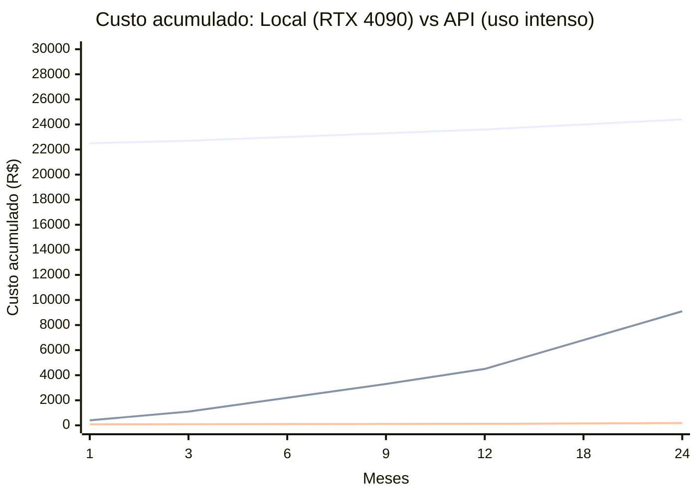

## A promessa e a realidade dos LLMs locais

Rodar modelos de linguagem localmente tem um apelo forte. Você não paga por token, não depende de internet, não envia seus dados para terceiros e tem liberdade total para usar o modelo que quiser. Empresas que lidam com dados sensíveis veem nisso uma solução para manter informações dentro do próprio ambiente.

Mas existe um custo real que muitas vezes é ignorado nas discussões. Não estou falando apenas do preço do hardware. Estou falando de energia elétrica, refrigeração, tempo de setup e manutenção contínua.

Este artigo compara o custo total de rodar LLMs localmente com o custo de usar APIs comerciais, com números reais de 2026. O objetivo é ajudar você a decidir qual caminho faz sentido para o seu caso.

---

## O que você precisa para rodar localmente

Antes de falar de custos, é preciso entender o hardware necessário. Modelos de linguagem são medidos em bilhões de parâmetros. Quanto maior o número, mais memória de vídeo (VRAM) o modelo precisa.

A tabela abaixo mostra uma estimativa do hardware mínimo para cada faixa de modelo:

| Modelo | Parâmetros | VRAM necessária (Q4) | Hardware sugerido |
|---|---|---|---|
| Llama 3.2 3B / Gemma 2 2B | 3B | ~3 GB | Mac M1+ 8GB, PC com GPU 6GB |
| Gemma 3 12B / Llama 3.1 8B | 8-12B | ~7-10 GB | RTX 3060 12GB, Mac M4 24GB |
| Llama 3.3 70B / Qwen 2.5 72B | 70B | ~40-48 GB | 2x RTX 3090, RTX 5090, Mac Ultra 64GB+ |
| DeepSeek V3 / Llama 4 120B | 120B+ | ~70+ GB | 4x RTX 3090, Mac Ultra 192GB, cloud GPU |

Esses números consideram quantização Q4, que reduz o tamanho do modelo com pouca perda de qualidade. Sem quantização, o modelo 70B precisa de aproximadamente 140 GB de VRAM, o que inviabiliza o uso em hardware de consumo.

## Custo de hardware

O investimento inicial varia muito conforme a configuração escolhida.

| Configuração | Modelos suportados | Custo estimado (2026) |
|---|---|---|
| Mac Mini M4 Pro (24 GB unificado) | 7B a 14B (Q4) | ~R$ 9.000 |
| PC com RTX 4060 (12 GB) | 7B a 14B (Q4) | ~R$ 7.000 |
| PC com RTX 4090 (24 GB) | 14B a 34B (Q4) | ~R$ 18.000 |
| PC com RTX 5090 (32 GB) | 34B a 70B (Q4) | ~R$ 28.000 |
| Mac Studio M3 Ultra (192 GB) | 70B a 120B (Q4) | ~R$ 50.000 |
| Servidor com 2x RTX 3090 (48 GB) | 70B (Q4) | ~R$ 25.000 |

Se você já tem um computador com GPU razoável, o custo incremental pode ser zero. Muita gente começa testando com uma RTX 3060 ou um Mac M1 e descobre que já consegue rodar modelos pequenos de forma aceitável.

Se precisa comprar algo dedicado, o investimento começa em R$ 7.000 e pode chegar a R$ 50.000 para modelos maiores.

## Custo de energia elétrica

Este é o custo que quase ninguém calcula antes de montar um sistema local. Uma GPU de alto consumo ligada 24 horas por dia 7 dias por semana tem um impacto real na conta de luz.

Para uma RTX 4090 consumindo 450W em inferência contínua, o cálculo é o seguinte:

- 450 W x 24 h = 10,8 kWh por dia
- 10,8 kWh x R$ 0,75 (média Brasil) = R$ 8,10 por dia
- R$ 8,10 x 30 dias = **R$ 243 por mês**

Isso é apenas a GPU. Somando CPU, memória, fans e perda na fonte, o consumo total do sistema fica entre 550W e 650W, elevando o custo mensal para aproximadamente **R$ 300 a R$ 350**.

Abaixo uma comparação entre hardware comum:

| Hardware | Consumo inferência | Consumo ocioso | Custo elétrico/mês (24h, R$ 0,75/kWh) |
|---|---|---|---|
| Mac Mini M4 Pro | ~40 W | ~15 W | ~R$ 22 |
| PC com RTX 4060 | ~200 W | ~60 W | ~R$ 108 |
| PC com RTX 4090 | ~550 W | ~100 W | ~R$ 297 |
| PC com RTX 5090 | ~700 W | ~120 W | ~R$ 378 |
| Mac Studio Ultra | ~150 W | ~50 W | ~R$ 81 |

O Mac se destaca pelo consumo baixíssimo. Um Mac Mini rodando 24 horas por dia custa cerca de R$ 22 por mês de energia. Uma RTX 4090 custa mais de R$ 290.

Se você planeja usar apenas durante o horário comercial (8 horas por dia), os valores caem pela metade ou menos ainda.

## Custo de APIs comerciais

O custo de APIs varia conforme o modelo e a quantidade de tokens processados.

Preços de referência de agosto de 2026 (por milhão de tokens):

| Provedor | Modelo | Input (por 1M tokens) | Output (por 1M tokens) |
|---|---|---|---|
| OpenAI | GPT-4o mini | US$ 0,15 | US$ 0,60 |
| OpenAI | GPT-4o | US$ 2,50 | US$ 10,00 |
| Anthropic | Claude Haiku 3.5 | US$ 0,80 | US$ 4,00 |
| Anthropic | Claude Sonnet 4 | US$ 3,00 | US$ 15,00 |
| DeepSeek | DeepSeek V3 | US$ 0,27 | US$ 1,10 |
| Google | Gemini 2.0 Flash | US$ 0,10 | US$ 0,40 |
| Google | Gemini 2.0 Pro | US$ 2,00 | US$ 8,00 |
| xAI | Grok 3 | US$ 1,50 | US$ 6,00 |

Para quem usa modelos menores ou de código aberto via provedores como OpenRouter, os preços são ainda mais baixos. Modelos como Llama 3.1 8B custam centavos por milhão de tokens em várias provedoras.

### Quanto custa o uso diário típico

Para calcular o custo real, considere um cenário de uso moderado:

- 10 consultas por dia
- 2.000 tokens de input + 500 tokens de output por consulta
- Total diário: 20.000 tokens de input + 5.000 tokens de output
- Total mensal: 600.000 tokens de input + 150.000 tokens de output

Com GPT-4o mini:

- Input: 0,6M x US$ 0,15 = US$ 0,09
- Output: 0,15M x US$ 0,60 = US$ 0,09
- **Total mensal: ~US$ 0,18** (cerca de R$ 1,00)

Com Claude Sonnet 4:

- Input: 0,6M x US$ 3,00 = US$ 1,80
- Output: 0,15M x US$ 15,00 = US$ 2,25
- **Total mensal: ~US$ 4,05** (cerca de R$ 22,00)

Para uso intenso, como um agente que processa centenas de requisições por dia, os valores crescem proporcionalmente.

## Comparação direta: local versus API

Para fazer uma comparação honesta, é preciso considerar o custo do hardware amortizado ao longo do tempo.

Vou considerar um cenário de uso moderado (20 mil tokens de input e 5 mil de output por dia) com uma RTX 4090 rodando modelos localmente.

### Custo total local (primeiro ano)

| Item | Valor |
|---|---|
| PC com RTX 4090 | R$ 18.000 (uma vez) |
| Energia elétrica (12 meses) | R$ 3.564 (R$ 297/mês) |
| Manutenção estimada | R$ 500 |
| **Total primeiro ano** | **R$ 22.064** |

### Custo total API (primeiro ano)

Usando GPT-4o mini para tarefas simples e Claude Sonnet 4 para tarefas complexas (divisão 70% mini / 30% sonnet):

| Item | Valor mensal | Valor anual |
|---|---|---|
| GPT-4o mini (70% do uso) | ~R$ 0,70 | R$ 8,40 |
| Claude Sonnet 4 (30% do uso) | ~R$ 6,60 | R$ 79,20 |
| **Total** | **~R$ 7,30** | **~R$ 87,60** |

### E se o uso for intenso?

Para uso intenso, como 1 milhão de tokens de input e 250 mil de output por dia, os números mudam drasticamente.

**Custo total local (primeiro ano):**

Mesmo hardware. O consumo de energia não muda porque a GPU já está ligada. A RTX 4090 entrega cerca de 100 tokens por segundo, e para processar 1,25 milhão de tokens por dia seriam necessárias algumas horas de processamento intenso. O custo energético praticamente não se altera.

**Custo total API (primeiro ano):**

Com GPT-4o mini (70%) e Claude Sonnet 4 (30%):

- GPT-4o mini: 21M tokens input/mês x US$ 0,15 + 5,25M output/mês x US$ 0,60 = US$ 6,30/mês
- Claude Sonnet 4: 9M tokens input/mês x US$ 3,00 + 2,25M output/mês x US$ 15,00 = US$ 60,75/mês
- **Total API mensal: US$ 67,05 (cerca de R$ 370)**
- **Total API anual: ~R$ 4.440**

### Tabela resumo

| Cenário | Local (1º ano) | API (1º ano) |
|---|---|---|
| Uso leve (20k tokens/dia) | R$ 22.064 | R$ 88 |
| Uso moderado (200k tokens/dia) | R$ 22.064 | R$ 800 |
| Uso intenso (1,25M tokens/dia) | R$ 22.064 | R$ 4.440 |
| Uso intenso apenas DeepSeek V3 | R$ 22.064 | R$ 356 |

O local perde no primeiro ano por causa do investimento inicial de hardware. A partir do segundo ano, o custo operacional fixo é apenas energia elétrica (R$ 297/mês para RTX 4090).

O ponto de equilíbrio depende do seu volume de uso. Para uso leve, a API é infinitamente mais barata. Para uso intenso, a partir do segundo ano o local pode compensar se você escolheu modelos livres.

---

## Fatores que vão além do dinheiro

### Privacidade e soberania de dados

O argumento mais forte para rodar localmente é a privacidade. Quando você usa uma API, seus dados saem do seu ambiente. Provedores como OpenAI e Anthropic afirmam que não treinam modelos com dados de API, mas os termos de serviço mudam. E para empresas reguladas (LGPD, HIPAA, SOX), enviar dados para fora pode simplesmente ser proibido.

Com um modelo local, seus dados nunca saem da sua máquina.

### Latência e disponibilidade

APIs têm latência de rede entre 500ms e 3 segundos tipicamente. Modelos locais começam a responder em milissegundos, sem depender de conexão com internet.

Em contrapartida, modelos locais menores são menos capazes. Um Llama 3.1 8B local não resolve problemas complexos com a mesma qualidade de um GPT-4o via API. Para tarefas que exigem raciocínio sofisticado, a API ainda leva vantagem.

### Manutenção e complexidade

Rodar um modelo localmente exige conhecimento técnico para configurar, atualizar e diagnosticar problemas. Você precisa gerenciar versões de modelo, drivers de GPU, quantização e bibliotecas de inferência.

Uma API funciona direto. Você paga e usa.

---

## Quando cada opção faz sentido

O local nunca fica mais barato que a API no curto prazo. Ele só começa a fazer sentido financeiro depois de muitos meses de uso intenso com energia barata e sem precisar trocar de hardware.

Se você já tem o hardware, a conta muda completamente. Nesse caso, o custo marginal de rodar localmente é apenas a energia elétrica, e para uso intenso o local frequentemente sai mais barato.

A recomendação prática é:

- **Uso leve (até 100 mil tokens/dia):** API é mais barato e prático. Use GPT-4o mini ou DeepSeek V3.
- **Uso moderado (100 mil a 500 mil tokens/dia):** API ainda ganha, mas vale considerar um Mac Mini para testes locais.
- **Uso intenso (mais de 500 mil tokens/dia) + privacidade:** Local pode compensar, especialmente no segundo ano.
- **Exigência de privacidade ou regulação:** Local é o único caminho viável.
- **Você já tem uma GPU boa:** Use local para tarefas rotineiras e API para tarefas que exigem modelos maiores.

---

## Considerações finais

Rodar LLMs localmente não é a escolha mais barata na maioria dos casos, especialmente se você está começando. O hardware é caro, a energia elétrica pesa na conta e a manutenção exige conhecimento técnico.

Mas existe um cenário onde o local faz todo o sentido: privacidade absoluta, uso intenso e continuado, ou quando você já possui o hardware necessário.

Para a maioria das pessoas e empresas, a combinação ideal é usar APIs para tarefas complexas e um modelo local pequeno para tarefas rotineiras que envolvem dados sensíveis. Você não precisa escolher um ou outro. Dá para usar os dois.

### Fontes

- [OpenAI API Pricing](https://openai.com/api/pricing/)
- [Anthropic API Pricing](https://www.anthropic.com/pricing)
- [DeepSeek API Pricing](https://api-docs.deepseek.com/quick_start/pricing)
- [PromptQuorum - Local LLM Power Consumption 2026](https://www.promptquorum.com/local-llms/local-llm-power-consumption)
- [Geo Toolbox - How to Run an LLM Locally (2026 Guide)](https://geotoolbox.ai/blog/run-llm-locally)
- [GetDeploying - Cloud GPU Price Comparison](https://getdeploying.com/)
- Preço do kWh Brasil: ANEEL 2026 (média residencial R$ 0,75/kWh com impostos)