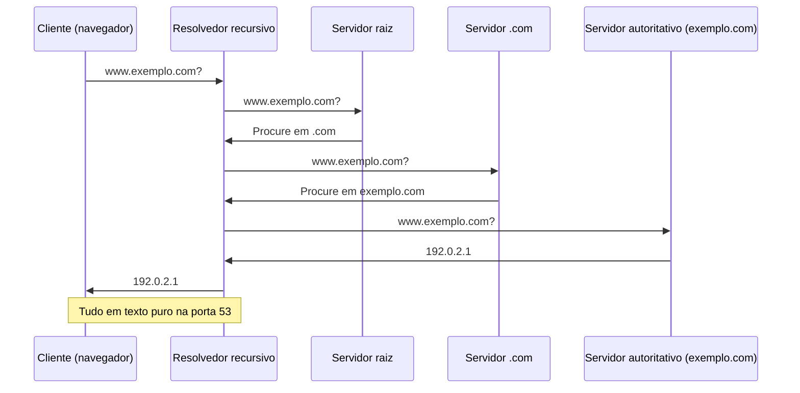

O DNS foi criado nos anos 80 sem nenhuma preocupação com segurança. As consultas viajam em texto puro. Qualquer um no caminho entre você e o resolvedor pode ver quais sites você está visitando, modificar respostas, ou redirecionar seu tráfego.

Resolver isso não é trivial. Cada protocolo de DNS seguro resolve um problema diferente e tem seus próprios trade-offs. Este artigo explica os 8 principais: como funcionam, em que portas rodam, quais RFCs os definem, quando usar cada um, e onde a Cloudflare se encaixa nesse ecossistema.

## Como o DNS funciona (o que estamos protegendo)

Antes de falar de segurança, vale entender o fluxo básico de uma consulta DNS. Quando você digita `www.exemplo.com` no navegador, acontece algo como:



Cada pergunta e cada resposta viaja em texto puro pela porta 53 UDP. Não há criptografia. Não há autenticação. O resolvedor recursivo (geralmente operado pelo seu ISP) vê todos os domínios que você consulta. Um atacante no meio do caminho pode forjar respostas. E seu ISP pode redirecionar suas consultas para resolvedores próprios.

Os protocolos que veremos a seguir protegem diferentes partes desse fluxo.

## O problema que todos eles resolvem

Uma consulta DNS tradicional (proto original, RFC 1035) envia um pacote UDP para a porta 53 do resolvedor. O pacote não é criptografado nem autenticado. Isso abre três vulnerabilidades:

1. **Eavesdropping**: qualquer um no caminho vê quais domínios você está consultando
2. **Spoofing / cache poisoning**: um atacante pode forjar uma resposta DNS antes da resposta legítima chegar
3. **Hijacking**: seu ISP ou um intermediário pode redirecionar consultas para resolvedores próprios, ignorando o que você configurou

Os protocolos abaixo resolvem um ou mais desses problemas. Entender a diferença entre eles é essencial para escolher a combinação certa.

## Tabela comparativa

| Protocolo | RFC | Porta | Transporte | Criptografia | Autenticação do resolvedor | Esconde IP do cliente |
|---|---|---|---|---|---|---|
| DoH | 8484 | 443 (TCP) | HTTP/1.1, HTTP/2, HTTP/3 | TLS 1.3 | Sim (certificado TLS) | Não |
| DoT | 7858 / 8310 | 853 (TCP) | TLS direto | TLS 1.3 | Sim (certificado TLS) | Não |
| DoQ | 9250 | 853 (UDP) | QUIC direto | TLS 1.3 | Sim (certificado TLS) | Não |
| DoH3 | 8484 + 9113 | 443 (UDP) | HTTP/3 sobre QUIC | TLS 1.3 | Sim (certificado TLS) | Não |
| ODoH | 9230 | 443 (TCP/UDP) | HTTP sobre proxy | TLS 1.3 + dupla cripta | Sim (via proxy + target) | Sim |
| OHTTP | 9458 | 443 (TCP/UDP) | HTTP sobre proxy | HPKE + TLS | Sim (via proxy + target) | Sim |
| DNSCrypt v2 | (não é RFC) | 443 (UDP/TCP) | UDP/TCP com envelope cripto | X25519 + XSalsa20-Poly1305 | Sim (certificado DNSCrypt) | Não |
| DNSSEC | 4033 / 4034 / 4035 | 53 (UDP/TCP) | UDP/TCP (mesmo do DNS) | Não criptografa | Sim (assinatura digital) | Não |

Vamos a cada um em detalhe.

## DNS over HTTPS (DoH)

**RFC 8484** | **Porta 443 TCP** | **MIME type: application/dns-message**

DoH encapsula consultas DNS dentro de requisições HTTPS comuns. A query DNS vai no corpo da requisição HTTP (POST) ou na URL (GET), e a resposta volta no corpo da resposta HTTP.

```
GET /dns-query?dns=ABEiMAAABAAABAAABAAABAAABAAABAAABAAABAAABAAABAAABAAABAA...
Host: cloudflare-dns.com
Accept: application/dns-message
```

A grande vantagem do DoH é que ele se mistura com o tráfego HTTPS normal. Na porta 443, usando o mesmo protocolo da navegação web, é difícil para um firewall ou ISP bloquear DoH sem bloquear a web inteira. Essa mesma característica torna DoH controverso em ambientes corporativos, onde a equipe de rede quer inspecionar ou redirecionar o tráfego DNS.

DoH funciona sobre qualquer versão do HTTP. A maioria das implementações usa HTTP/2 ou HTTP/3, mas o protocolo em si não exige.

**Quando usar:**

* Navegação no dia a dia, especialmente em redes restritivas
* Dispositivos móveis (Android, iOS) que já suportam nativamente
* Navegadores (Firefox, Chrome, Edge) que têm DoH embutido

**Cloudflare:** `https://cloudflare-dns.com/dns-query` (também `https://one.one.one.one/dns-query`)

## DNS over TLS (DoT)

**RFC 7858 / RFC 8310** | **Porta 853 TCP**

DoT cria uma conexão TLS dedicada para o tráfego DNS. Diferente do DoH, não tem HTTP no meio. É DNS puro dentro de um túnel TLS.

```
Cliente: conexao TLS na porta 853
         -> Handshake TLS 1.3
         -> Consulta DNS wire format
         <- Resposta DNS wire format
```

Por usar uma porta dedicada (853), DoT é mais fácil de identificar e bloquear do que DoH. Isso pode ser uma vantagem ou desvantagem dependendo da perspectiva. Para o usuário doméstico, é mais um protocolo que o ISP pode filtrar. Para o administrador de rede, é mais fácil de auditar.

DoT tem dois perfis de privacidade definidos no RFC 8310:

1. **Strict**: o cliente verifica o nome DNS do servidor no certificado TLS. Se falhar, a consulta não é enviada.
2. **Opportunistic**: o cliente tenta TLS, mas se falhar, cai para texto puro. Útil em redes que não suportam DoT, mas oferece segurança menor.

A implementação strict é a recomendada para produção.

**Quando usar:**

* Roteadores e firewalls que suportam DoT nativamente (mais comum que DoH em equipamentos de rede)
* Ambientes onde você controla o resolvedor e quer um protocolo mais simples que HTTP
* Servidores DNS recursivos conversando entre si

**Cloudflare:** `1.1.1.1` na porta 853, com certificado para `cloudflare-dns.com`

## DNS over QUIC (DoQ)

**RFC 9250** | **Porta 853 UDP**

DoQ é o DNS rodando diretamente sobre QUIC, sem HTTP no meio. Pense nele como um "DoT sobre QUIC": mesma porta 853, mesma criptografia TLS 1.3, mas usando QUIC em vez de TCP.

A diferença fundamental é que QUIC elimina o head-of-line blocking do TCP. Em conexões TCP, um pacote perdido segura a fila inteira. QUIC é multiplexado: uma stream não bloqueia a outra. Para DNS, onde cada consulta é pequena e independente, isso reduz latência.

QUIC também elimina o round-trip extra do handshake TLS. Em TCP + TLS 1.3, você precisa de 2 RTTs (round-trip times) antes de enviar a primeira consulta. Com QUIC (que embute TLS 1.3 no handshake de transporte), são 0 ou 1 RTT na prática, e 0 RTT para consultas repetidas para o mesmo servidor.

DoQ é o protocolo mais rápido entre os que oferecem criptografia dedicada.

**Quando usar:**

* Cenários onde latência é crítica (aplicações em tempo real, jogos, trading)
* Dispositivos móveis (QUIC lida melhor com mudanças de rede, como Wi-Fi para celular)
* Quando você quer criptografia sem a sobrecarga do HTTP

**Cloudflare:** suporta DoQ no endpoint `1.1.1.1` porta 853 UDP (e `cloudflare-dns.com`)

## DNS over HTTP/3 (DoH3)

**RFC 8484 + RFC 9113** | **Porta 443 UDP**

DoH3 é DoH rodando sobre HTTP/3, que por sua vez roda sobre QUIC. É uma pilha de três camadas:

```
DNS (wire format)
  -> HTTP (application/dns-message)
    -> HTTP/3 (QUIC)
      -> UDP (porta 443)
```

Na prática, DoH3 oferece as mesmas vantagens do DoQ (0 RTT, sem head-of-line blocking, migração de conexão) mas com a flexibilidade do HTTP: headers customizados, autenticação, cookies, caching HTTP, e proxies HTTP.

A diferença entre DoQ e DoH3 é sutil mas importante:

* **DoQ**: DNS direto sobre QUIC. Mais leve, sem overhead de HTTP. Ideal para resolvedores dedicados.
* **DoH3**: DNS sobre HTTP/3 sobre QUIC. Mais flexível, aproveita infraestrutura HTTP existente (CDNs, proxies, balanceadores).

**Cloudflare:** suporta DoH3 no mesmo endpoint `https://cloudflare-dns.com/dns-query` (negociação automática de HTTP/3 via Alt-Svc)

## Oblivious DNS over HTTPS (ODoH)

**RFC 9230** | **Porta 443 (TCP/UDP)**

ODoH resolve um problema que DoH e DoT não resolvem: o resolvedor ainda vê seu IP. Mesmo com a consulta criptografada, o resolvedor sabe quem perguntou. ODoH separa essas duas informações usando um proxy intermediário.

O fluxo é:

```
Cliente -> Proxy (criptografa consulta com chave publica do Target)
Proxy  -> Target (Target descriptografa, mas nao ve IP do cliente)
Target -> Proxy (resposta criptografada)
Proxy  -> Cliente (Cliente descriptografa)
```

O cliente criptografa a consulta DNS com a chave pública do Target (resolvedor). O proxy recebe o pacote, vê o IP do cliente, mas não consegue ler a consulta. O proxy repassa para o Target, que descriptografa a consulta, processa, e criptografa a resposta de volta. O proxy só encaminha.

Nenhum dos dois tem a informação completa. O proxy sabe quem perguntou mas não o quê. O Target sabe o que foi perguntado mas não quem perguntou.

O custo é latência adicional (um hop extra) e complexidade de operar o proxy. Em troca, você ganha privacidade forte: nem seu ISP, nem o resolvedor, nem o proxy conseguem montar o quadro completo.

**ODoH vs. DoH comum:**

* DoH: Target vê IP + consulta. Um ponto único de falha de privacidade.
* ODoH: Proxy vê IP, Target vê consulta. Separação de conhecimento.

**Cloudflare:** opera como Target (resolvedor ODoH) em `odoh.cloudflare-dns.com` e também como proxy para quem quiser usar.

## Oblivious HTTP (OHTTP)

**RFC 9458** | **Porta 443 (TCP/UDP)**

Oblivious HTTP é a generalização do ODoH. Em vez de ser específico para DNS, OHTTP define um mecanismo genérico para qualquer requisição HTTP ser enviada de forma "oblivious" (sem que o servidor veja o IP do cliente).

OHTTP usa o mesmo princípio do ODoH: criptografia HPKE (Hybrid Public Key Encryption) em duas camadas, com um proxy intermediário que não consegue ler o conteúdo.

ODoH é, na prática, uma aplicação específica de OHTTP para DNS. A relação entre eles:

```
OHTTP (RFC 9458) -> protocolo generico para HTTP oblivious
  |
  +--> ODoH (RFC 9230) -> aplicacao especifica para DNS
```

Se você já entendeu ODoH, entendeu OHTTP. A diferença é que OHTTP pode ser usado para qualquer API, não apenas DNS.

**Quando usar OHTTP (fora de DNS):**

* Consultas a APIs onde o servidor não precisa saber seu IP
* Submissão de métricas ou telemetria anônima
* Qualquer cenário onde privacidade de origem importa

## DNSCrypt

**Protocolo versão 2 (não é RFC IETF)** | **Porta 443 UDP/TCP**

DNSCrypt é anterior a DoH e DoT. Foi criado em 2008 como uma alternativa para criptografar tráfego DNS sem depender de TLS. Hoje está na versão 2 do protocolo.

Diferente dos protocolos baseados em TLS, DNSCrypt usa seu próprio mecanismo de troca de chaves (X25519) e cifra assimétrica (XSalsa20-Poly1305). A porta padrão é 443 (UDP e TCP), a mesma do HTTPS, o que dificulta o bloqueio.

DNSCrypt autentica o resolvedor (o cliente verifica uma assinatura digital na resposta) e criptografa o tráfego. No entanto, ele não é um padrão IETF e tem adoção muito menor que DoH e DoT.

**Vantagens:**

* Porta 443, difícil de bloquear
* Funciona sobre UDP (menos overhead que TCP)
* Mais leve que TLS em cenários de alto volume

**Desvantagens:**

* Não é um padrão IETF (ad-hoc, sem revisão ampla)
* Menos suporte em clientes e servidores
* Ecossistema pequeno (poucos resolvedores públicos)
* Não oferece as mesmas garantias de forward secrecy que TLS 1.3

**Quando usar:**

* Cenários legados ou embarcados onde TLS é pesado demais
* Redes onde DoH/DoT são bloqueados mas porta 443 está aberta
* Em combinação com DNSCrypt-proxy como proxy DNS local

**Cloudflare:** não suporta DNSCrypt nativamente. Os principais resolvedores que suportam são do ecossistema DNSCrypt (como os listados no dnscrypt.info).

## DNSSEC

**RFC 4033 / RFC 4034 / RFC 4035** | **Porta 53 UDP/TCP (DNS tradicional)**

DNSSEC não criptografa o tráfego DNS. Ele adiciona assinaturas digitais às respostas DNS para que o cliente possa verificar se a resposta é autêntica e não foi modificada no caminho.

Enquanto DoH, DoT e DoQ protegem o transporte, DNSSEC protege os dados. Os dois resolvem problemas diferentes e são complementares. A combinação ideal é DNSSEC + DoT/DoQ: você sabe que os dados são autênticos (DNSSEC) e que ninguém bisbilhotou o transporte (DoT/DoQ).

### Como DNSSEC funciona

Cada zona DNS que implementa DNSSEC publica registros adicionais:

* **DNSKEY**: contém a chave pública da zona
* **RRSIG**: assinatura digital de cada conjunto de registros (RRset)
* **DS** (Delegation Signer): hash da DNSKEY da zona filha, publicado na zona pai
* **NSEC / NSEC3**: negação autenticada (prova que um registro não existe)

O processo de validação:

```
1. Cliente pergunta por www.exemplo.com
2. Resolvedor autoritativo responde com www.exemplo.com A + RRSIG
3. Resolvedor recursivo pega a DNSKEY de exemplo.com
4. Verifica o RRSIG com a DNSKEY (ZSK)
5. Sobe para .com, pega o DS de exemplo.com
6. Verifica se o hash da DNSKEY de exemplo.com bate com o DS
7. Continua subindo ate a ancora de confianca (trust anchor) da zona raiz
8. Se toda a cadeia for valida, marca a resposta como Authentic Data (AD flag)
```

O resolvedor configura manualmente a chave pública da zona raiz (root trust anchor). A partir dela, todo o resto é verificado em cadeia.

### Limitações importantes

1. **DNSSEC não criptografa**: as consultas e respostas continuam visíveis para qualquer intermediário
2. **Complexidade operacional**: gerenciar chaves, rotação, e assinaturas dá trabalho. Um erro como expirar uma RRSIG quebra a resolução do domínio
3. **Tamanho das respostas**: os registros adicionais aumentam o payload, o que pode causar fragmentação em UDP e exigir fallback para TCP

**Quando usar DNSSEC:**

* Em zonas que você administra: configure DNSSEC para proteger seus domínios contra spoofing
* Em resolvedores recursivos: ative a validação DNSSEC (todos os resolvedores públicos fazem isso)
* Em combinação com DoT/DoQ: o melhor dos dois mundos

**Cloudflare:** suporta DNSSEC para todos os domínios gerenciados. A Cloudflare gera e gerencia as chaves automaticamente.

## Como os protocolos se complementam

A principal confusão sobre DNS seguro é tratar todos os protocolos como substitutos. Eles não são. Eles resolvem camadas diferentes do problema:

```
Autenticacao dos dados (o registro DNS e legitimo?)
  -> DNSSEC

Criptografia do transporte (ninguem ve minhas consultas?)
  -> DoT / DoQ / DoH / DoH3

Ocultacao do IP de origem (o resolvedor nao sabe quem perguntou?)
  -> ODoH / OHTTP

Compatibilidade com redes restritivas (o firewall nao bloqueia?)
  -> DoH / DNSCrypt (porta 443)
```

Um cenário ideal combina:

1. **DNSSEC** na zona que você administra (para que ninguém forje respostas do seu domínio)
2. **Validação DNSSEC** no resolvedor que você usa (para que respostas falsas sejam rejeitadas)
3. **DoT ou DoQ** entre seu dispositivo e o resolvedor (para criptografar o transporte)
4. **ODoH** se você não quer que o resolvedor saiba seu IP

Na prática, a maioria das pessoas usa apenas DoH ou DoT, e o DNSSEC fica a cargo do resolvedor. É um trade-off aceitável para o dia a dia.

## Configuração prática com Cloudflare 1.1.1.1

A Cloudflare oferece todos os protocolos criptografados no mesmo resolvedor (1.1.1.1). Aqui estão os endpoints:

| Protocolo | Endereço | Porta | Exemplo de URL/config |
|---|---|---|---|
| DoH | cloudflare-dns.com | 443 | `https://cloudflare-dns.com/dns-query` |
| DoT | 1.1.1.1 | 853 | `tls://1.1.1.1` |
| DoQ | 1.1.1.1 | 853 UDP | `quic://1.1.1.1` |
| DoH3 | cloudflare-dns.com | 443 UDP | `https://cloudflare-dns.com/dns-query` (negocia H3 automaticamente) |
| ODoH | odoh.cloudflare-dns.com | 443 | via proxy ODoH + target Cloudflare |

No Windows 11, você configura DoT em:

```
Configuracoes > Rede e Internet > DNS > Editar 
  -> DNS sobre HTTPS: Ativar (automatico)
```

No Linux com systemd-resolved:

```
# /etc/systemd/resolved.conf
[Resolve]
DNS=1.1.1.1#cloudflare-dns.com
DNSOverTLS=yes
```

No Android (9+):

```
Configuracoes > Rede > DNS Privado
  -> Nome do provedor: cloudflare-dns.com
```

## Qual protocolo escolher?

A resposta depende do seu cenário:

| Se você... | Use |
|---|---|
| Quer o mais simples e universal | DoH (porta 443, funciona em qualquer rede) |
| Quer a melhor performance | DoQ (0 RTT, sem head-of-line blocking) |
| Usa roteador ou firewall | DoT (suporte nativo em equipamentos de rede) |
| Quer performance + flexibilidade de HTTP | DoH3 (DoH sobre QUIC) |
| Não confia no resolvedor | ODoH (proxy separa IP da consulta) |
| Tem rede que bloqueia porta 853 | DoH ou DNSCrypt (ambos na porta 443) |
| Quer autenticar os dados, não o transporte | DNSSEC (complementar, não substituto) |
| Precisa de um padrão leve e não-IETF | DNSCrypt (v2, porta 443) |

E lembre-se: você pode (e deve) usar mais de um ao mesmo tempo. DNSSEC + DoQ + ODoH é uma combinação válida e segura. Cada um resolve uma parte diferente do problema.

## Conclusão

O DNS dos anos 80 não foi projetado para um mundo onde sua operadora de telefonia, seu ISP, e o governo do seu país têm interesse no que você acessa. Felizmente, o ecossistema evoluiu muito nos últimos anos.

Os 8 protocolos que vimos aqui formam um conjunto completo de ferramentas. Nenhum resolve tudo sozinho. A escolha certa depende do seu modelo de ameaça: você está se protegendo de um ISP curioso? De um firewall corporativo? De um atacante na mesma rede? De um resolvedor malicioso?

Para o usuário doméstico, a configuração mais simples e eficaz é habilitar DoH/DoT no sistema operacional e deixar o DNSSEC a cargo do resolvedor (a Cloudflare e o Google já validam por padrão). Para quem quer mais privacidade, adicionar ODoH é o próximo passo. Para operações críticas, um resolvedor próprio com DoQ + validação DNSSEC é o estado da arte.