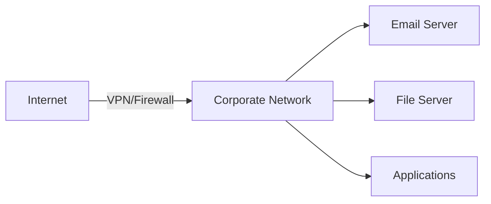
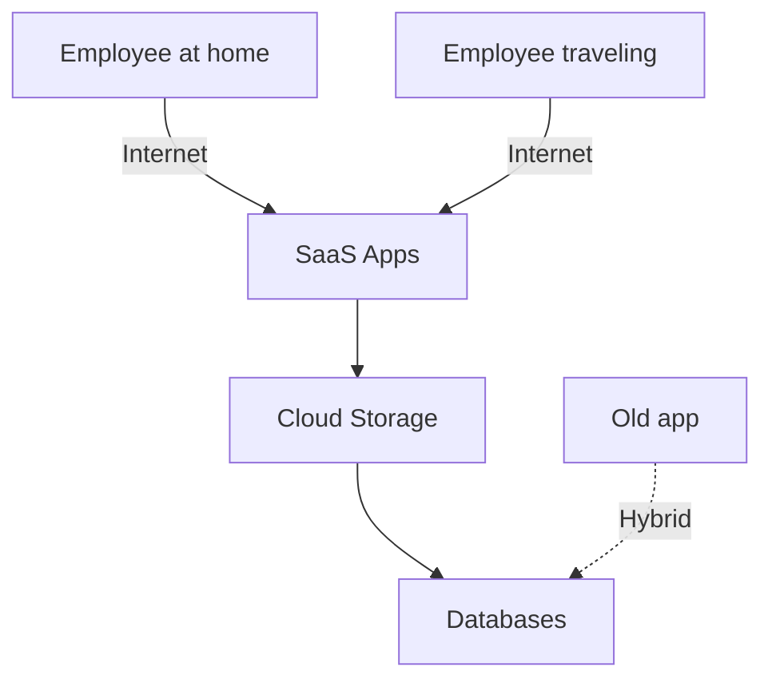

The old network security model is dead. It was built on the assumption that threats come from the internet and everything inside your corporate firewall is safe. So you put up walls, set up a VPN, created a DMZ, and called it secure.

But in 2026 there is no perimeter anymore. Your applications live in AWS, Azure, and Google Cloud. Your employees work from home, from cafes, from wherever. Data lives across multiple cloud providers. The old "trust inside, block outside" model doesn't work when there is no inside anymore.

Welcome to Zero Trust and SASE. This is how security works now.

## Why the old model is broken

Five years ago, the security strategy was simple: build walls around the office network.



This worked when employees sat at desks and applications ran on servers you owned.

Today:



There's nothing to put a firewall in front of. Employees access cloud apps directly. There's no perimeter.

## Zero Trust means what it says

Zero Trust is simple in theory: don't trust anyone by default. Always verify.

Instead of: allow everything inside the firewall
Now: allow only authenticated and authorized access to specific resources

The core principles are straightforward. Verify identity every time. Verify the device itself. Give people only what they actually need to do their job. Assume someone is already inside trying to cause trouble. Log and monitor everything.

## What is SASE

SASE stands for Secure Access Service Edge. It's an architecture that implements Zero Trust at scale. It combines security functions (firewall, DLP, threat prevention), network functions (routing, SD-WAN), and delivers it all as a cloud service.

Instead of routing all traffic through an on-premises firewall, you connect to a distributed network of security checkpoints. The checkpoint closest to you inspects your traffic, checks your permissions, and routes you to your destination.

Simple formula: SASE equals Zero Trust plus cloud plus performance.

## Traditional versus modern

Old way: User goes through internet, connects to VPN, VPN server sends traffic to your data center.

Problems: high latency because everything routes through one place, single point of failure, expensive bandwidth.

New way: User goes through internet, gets routed to the nearest security checkpoint, checkpoint sends traffic directly to where it needs to go.

Benefits: low latency because traffic stays local, high availability because checkpoints are distributed, scalable because you're not building your own infrastructure.

## What SASE actually includes

Identity verification is first. When someone tries to access something, you check: Are they really who they say? Multi-factor authentication. Biometric. Security key. Whatever you need.

A Secure Web Gateway inspects everything going over HTTP/HTTPS. Blocks malware. Stops phishing. Prevents data leaks. Logs who did what.

A Cloud Access Security Broker watches your SaaS usage. Finds shadow IT (apps people are using that IT doesn't know about). Enforces policies. Blocks risky actions.

A Firewall as a Service provides network-level protection. Stateful inspection. Intrusion prevention. Application control. Threat intelligence.

## Implementing Zero Trust step by step

Month zero to three: figure out what you have. What systems need protection? Which SaaS apps? On-prem apps? Databases? APIs? Who accesses what? From where? On what devices?

Tools for this phase: CASB platforms like Okta or Microsoft Defender for Cloud Apps, network monitoring like Splunk, device inventory through your MDM.

Month three to nine: deploy core controls. Mandate multi-factor authentication. Everyone. Non-negotiable. Enroll devices into management. Enforce security baseline. Require encryption. Set up single sign-on so there's one central place managing permissions.

Example policy might look like:

```json
{
  "name": "access-salesforce",
  "conditions": {
    "resource": "salesforce.com",
    "user_groups": ["sales_team"],
    "device_must_be_compliant": true,
    "mfa_required": true,
    "location_allowed": ["US"],
    "time_window": "business_hours"
  },
  "action": "grant"
}
```

Month nine to eighteen: replace VPN with SASE. Start with non-critical users. Monitor everything. Gradually move more users over. Complete migration in 6 to 12 months.

Ongoing: monitor constantly. Collect logs from everything. Detect anomalies. Alert on suspicious activity.

## Cost comparison

Let me be direct about money.

| Item | VPN | SASE |
|---|---|---|
| Server hardware | $50k to $200k | Nothing (cloud hosted) |
| Annual maintenance | $20k to $50k | Included |
| Cost per user per month | $10 to $20 | $5 to $15 |
| Bandwidth for 1TB | $500 to $1000 | $50 to $200 |
| Can you scale easily | No | Yes |
| Performance | High latency | Low latency |
| 5 year cost for 100 users | $350k to $800k | $100k to $250k |

SASE is cheaper and faster. The only reason to stick with VPN is legacy applications that require it.

## Real scenario

User wants to access a confidential database.

Traditional security fails like this: User is on the network. Firewall: "You're inside, welcome." Database: "You're here, access granted." User downloads the entire database to personal cloud. Nobody notices for weeks.

Zero Trust prevents it: User tries to access database. Check identity: MFA good. Check authorization: Not in the data-admin group. Access denied. If they somehow get in: Everything is logged. Attempt to bulk export triggers an alert. Security team is notified immediately.

## Vendor options

Cloudflare Zero Trust is easy to use. Palo Alto Networks has the most features. Fortinet performs well. Cisco Umbrella has good threat intelligence. Zscaler has global coverage. Pick based on your needs.

## Real challenges with Zero Trust

Legacy applications don't support modern authentication. Solution: put a proxy in front of them or retire the app.

More authentication steps means users are slower. Solution: adaptive policies. Trust nearby users more, verify remote users strictly.

Implementing it all costs money up front. Solution: phase it in. Start with the riskiest systems.

Managing policies is complex. Solution: start simple, add rules as you go.

## The point

Zero Trust and SASE represent where security is going. The perimeter is gone. "Trust inside, block outside" is dead.

If you're still relying on a VPN and firewall, you're behind. Start implementing Zero Trust: MFA, device management, SASE. Not luxuries. Necessities.

The question isn't whether to adopt Zero Trust. It's how fast.
