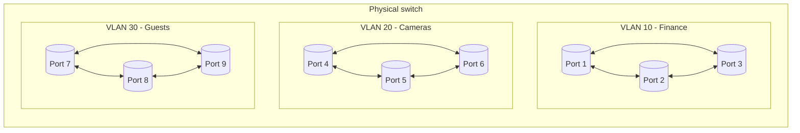
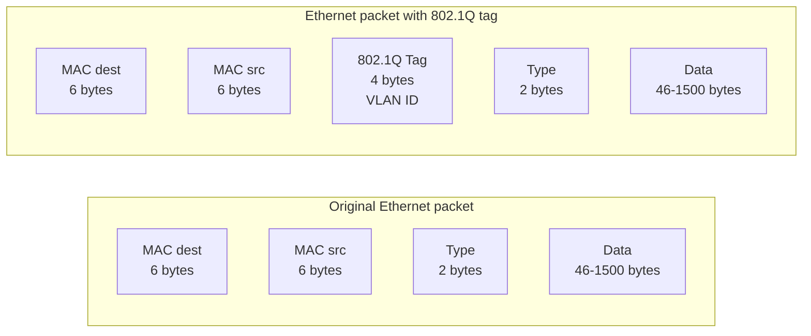
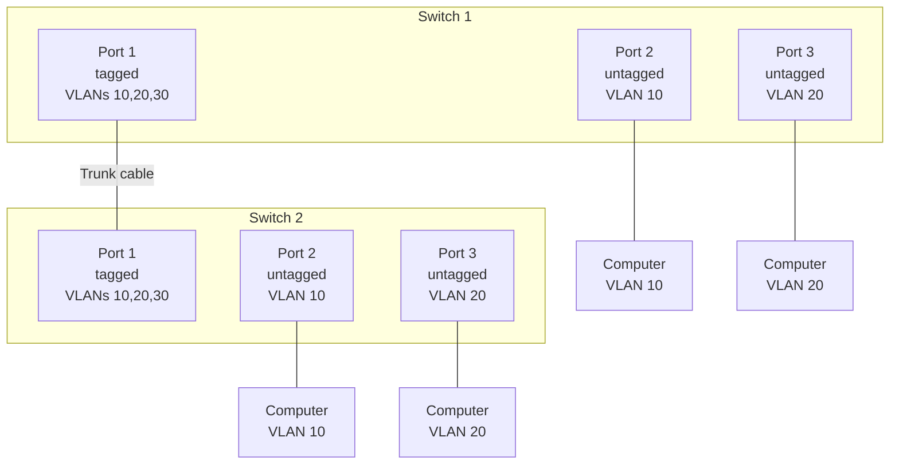
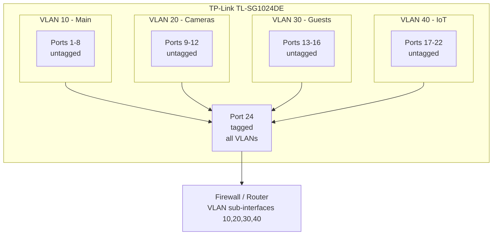

Imagine an office building with three different companies. They share the same physical space, but each has its own rooms, employees, and files. An employee from company A cannot simply walk into company B's room and grab a document.

Now imagine that building is your computer network. All devices are connected to the same cables and switches. But you want the financial file server to be unreachable from the security camera at the entrance. You want the intern's laptop to have no access to the production database. And you want the conference room TV, which keeps asking for updates, to talk to nothing but the internet.

Without separation, everything communicates with everything. And in networks, unwanted communication is both a security and a performance problem.

That is exactly what VLANs solve.

## What is a VLAN

VLAN stands for Virtual Local Area Network. It is a mechanism that lets you divide a single physical switch into multiple logical switches, isolating groups of devices from each other.

Devices on VLAN 10 can talk to each other, but they cannot see devices on VLAN 20 or 30. It is as if they were on separate switches, even though they are inside the same equipment.

The standard that defines how VLANs work is **IEEE 802.1Q**, created in 1998 and present in any manageable switch you buy today.

## Why use VLANs

The reasons come down to three:

**Security.** A compromised device on one VLAN cannot reach devices on other VLANs without going through a router or firewall, where you can apply blocking rules. If an IoT camera is breached, it stays trapped in its VLAN.

**Performance.** Large networks suffer from broadcast storms. Every time a device sends a broadcast packet (like an ARP request to discover another device's MAC address), that packet spreads to all ports on the switch. With VLANs, broadcast traffic stays contained within the VLAN. Fewer devices per VLAN means less broadcast traffic for each device to process.

**Organization.** You can group devices by function instead of physical location. A server on the second floor can be on the same VLAN as a server on the fifth floor, while the printer next to the server is on a different VLAN. Everything is defined by software, with no need to move cables.

## VLAN types: port-based vs 802.1Q

There are two main ways to configure VLANs on manageable switches.

**Port-Based VLAN.** You manually define which switch ports belong to each VLAN. A computer plugged into port 1 is on VLAN 10. One on port 5 is on VLAN 20. Simple and straightforward. The problem is that each port can only belong to one VLAN. If you need a port to participate in multiple VLANs (like a port connecting two switches), the port-based model does not work.

**802.1Q Tagged VLAN.** The IEEE 802.1Q standard solves this limitation by adding a marker, called a tag, inside the Ethernet packet itself. This tag is a 4-byte field inserted between the source MAC address and the type field, containing the VLAN ID (VID), a number between 1 and 4094 that identifies which VLAN the packet belongs to.

When the switch receives an untagged packet from a computer (which knows nothing about VLANs), it adds the tag using the **PVID** (Port VLAN ID) configured on that port. The PVID is the default VLAN number for the port. By default, all ports have PVID 1.

When the switch sends a packet to a computer, it can either remove the tag (untagged) or keep it (tagged), depending on how the port is configured. Regular computers do not understand 802.1Q tagged packets, so ports connecting to end devices should be configured as untagged.

## Tagged, Untagged, and Trunk

These three concepts are the heart of understanding VLANs.

**Untagged.** The port removes the VLAN tag before delivering the packet to the connected device. This is used for connecting computers, printers, servers, and any device that does not understand VLANs. The device receives the packet as if it were on a regular network.

**Tagged.** The port keeps the VLAN tag on the packet. This is used for connecting devices that understand VLANs, such as other switches, routers, firewalls, or servers with VLAN-aware network interfaces.

**Trunk.** In practice, a trunk port is a port that carries **tagged** packets from multiple VLANs simultaneously. The term trunk originally comes from "Port Trunking" or "Link Aggregation" in some equipment (like the TP-Link TL-SG1024DE), where multiple ports are combined to increase bandwidth. But in the context of VLANs, "trunk" has become synonymous with "a port that carries multiple tagged VLANs."

In the diagram above, port 1 of each switch is configured as **tagged** for VLANs 10, 20, and 30. This allows the cable between the two switches to carry packets from all three VLANs. Computers connected to ports 2 and 3 receive **untagged** packets only from their specific VLAN.

## VLAN, Subnet, and VNet: what is the difference?

It is common to see these terms used interchangeably. They are not the same. Each operates at a different OSI layer and solves different problems.

**Subnet.** A layer 3 (network) concept. A subnet divides an IP address space into smaller blocks. Instead of using the entire 192.168.0.0/16 range, you create 192.168.10.0/24 for one department and 192.168.20.0/24 for another. Two different subnets cannot talk directly without a router.

Subnets organize **IP addresses**. They exist with or without VLANs. You can have two subnets on the same switch without VLANs, but then they would be on the same broadcast domain, and the separation would be logical only, not physical. A device could change subnets by changing its IP, without changing ports.

**VLAN.** A layer 2 (data link) concept. A VLAN isolates traffic at the switch level. Devices on different VLANs do not exchange Ethernet frames with each other. The separation is real, at the hardware level: the switch treats each VLAN as a separate MAC address table.

**VNet (Virtual Network in the cloud).** A cloud infrastructure concept. AWS VPC, Azure VNet, and GCP VPC are isolated virtual networks you create inside the provider's datacenter. They combine subnet and VLAN concepts into a single managed service: you define IP blocks, create subnets, configure routing tables, and set security groups, all without touching hardware.

| | VLAN | Subnet | VNet |
|---|---|---|---|
| OSI layer | 2 (Data Link) | 3 (Network) | 2 + 3 (cloud abstraction) |
| What it isolates | Switch ports and Ethernet frames | IP addresses and routing | Entire cloud network |
| Identifier | VLAN ID (1-4094) | CIDR (e.g. 192.168.10.0/24) | VNet name + CIDR |
| Configured on | Manageable switches | Routers and DHCP servers | Cloud provider console |
| Needs hardware | Yes (manageable switch) | No (any router can do it) | No (everything virtualized) |
| Example | TL-SG1024DE port config | 192.168.10.0/24 in DHCP | aws_vpc in Terraform |

In practice, you use VLANs and Subnets together. The best practice is **one VLAN = one Subnet**. The VLAN isolates at layer 2, the subnet organizes at layer 3, and the router (or firewall) bridges them while applying security rules.

## Practical example with TP-Link TL-SG1024DE

The TP-Link TL-SG1024DE is a 24-port "Easy Smart" manageable switch with 802.1Q VLAN support at an affordable price. It is a great example because it represents the entry point for anyone wanting to move from unmanageable switches to network segmentation.

### Scenario

You have at home or in the office:

- Main network with computers, servers, and printers (VLAN 10)
- IP security cameras (VLAN 20)
- Guest network (VLAN 30)
- IoT devices (smart lights, smart plugs, TVs) (VLAN 40)

You want everything to share the same physical switch, but without seeing each other. The configuration on the TL-SG1024DE would be:

**Step 1:** Access the switch web interface and enable 802.1Q VLAN mode.

**Step 2:** Create the VLANs:

| VLAN ID | Name | Ports |
|---|---|---|
| 10 | Main | 1-8 (untagged), 24 (tagged) |
| 20 | Cameras | 9-12 (untagged), 24 (tagged) |
| 30 | Guests | 13-16 (untagged), 24 (tagged) |
| 40 | IoT | 17-22 (untagged), 24 (tagged) |

**Step 3:** Configure the PVID for each port:

| Port | PVID | Associated VLAN |
|---|---|---|
| 1-8 | 10 | Main |
| 9-12 | 20 | Cameras |
| 13-16 | 30 | Guests |
| 17-22 | 40 | IoT |
| 24 | 1 | Trunk (port receives packets from all VLANs) |

**Step 4:** Connect port 24 to the router or firewall, which should have a sub-interface configured for each VLAN.

## The limitation: inter-VLAN communication

VLANs isolate, but at some point different groups need to talk. The file server on VLAN 10 needs to be accessed by computers on VLAN 30 (guests)? Probably not. But computers on VLAN 10 need internet access, and that is on another network.

To allow inter-VLAN communication, you need a device that performs routing:

**Router-on-a-stick.** A router with a single physical interface connected to the switch via a trunk port. The router creates virtual sub-interfaces, one for each VLAN, each with its own IP address. Traffic between VLANs passes through the router, which decides whether to allow or block.

**Layer 3 switch (SVI).** More advanced switches can perform routing internally using Switch Virtual Interfaces (SVIs). You create a virtual interface for each VLAN, assign an IP, and the switch routes between them in hardware, without needing an external router.

**Firewall.** A firewall (like pfSense, OPNsense, or a physical appliance) connected to the switch via trunk can route between VLANs and apply granular security policies. This is the most secure option.

## Useful links

- **IEEE 802.1Q standard:** [ieee802.org](https://www.ieee802.org/1/pages/802.1Q.html)
- **TP-Link TL-SG1024DE:** [tp-link.com](https://www.tp-link.com/us/business-networking/easy-smart-switch/tl-sg1024de/)
- **TP-Link 802.1Q VLAN configuration guide:** [tp-link.com/support/faq/328/](https://www.tp-link.com/us/support/faq/328/)
- **pfSense (firewall for inter-VLAN routing):** [pfsense.org](https://www.pfsense.org/)

## Conclusion

VLANs are the fundamental tool for organizing networks that have grown beyond a handful of devices. They allow everything to share the same cable without mixing, improving security, performance, and organization.

The beauty of the concept lies in its simplicity: an entry-level manageable switch, combined with some 802.1Q configuration, transforms a flat, insecure network into a segmented, controlled one.

The next step, after mastering VLANs, is to place a firewall between them to decide what can and cannot pass. But the foundation is understanding that at layer 2, the switch can separate what the cable unites. And with VLANs, you do exactly that: everything together, but nothing mixed.