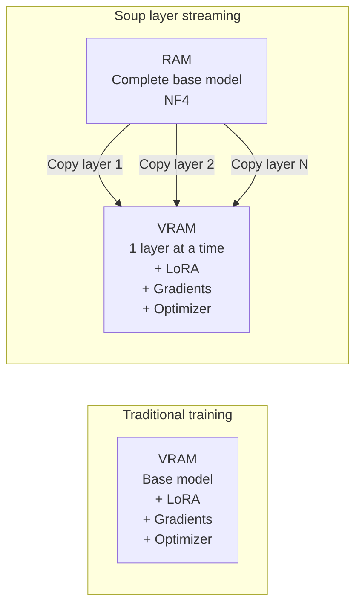

You have a graphics card with 4, 6, or 8 GB of VRAM. Maybe a gaming laptop, maybe a desktop with an RTX 2060 Super, or even a Mac Mini M4 with 32 GB of unified memory. You want to train a large language model, but when you check the memory requirements, you realize the model doesn't fit on your GPU.

The usual answers all suck. Quantize more and lose quality. Rent a GPU in the cloud and bleed money. Or just give up.

Soup CLI offers a fourth option: never load the entire model into VRAM at all.

## What is Soup

Soup is an open source toolkit for fine-tuning LLMs, built by MePlay, Inc. and available under the Apache-2.0 license. You can find it at trysoup.dev and github.com/MakazhanAlpamys/Soup.

It's not just another wrapper around fine-tuning. Soup does two things that matter.

First, it automates the post-training workflow. You write one YAML file where you define your base model, the task (SFT, DPO, ORPO, KTO, and 19 other methods), your training data, and your hyperparameters. Soup detects your GPU, picks a reasonable batch size, applies quantization, and starts training. One command. That's it.

Second, and this is the innovative part, it uses layer streaming. This is a technique that lets you train models that normally wouldn't fit on your GPU by keeping the base model frozen in regular RAM and copying just one layer at a time to VRAM.

The current version is v0.73.2, and layer streaming has been in BETA since v0.72.0.

## How layer streaming actually works

Layer streaming solves a real problem with fine-tuning on consumer hardware. When you train with LoRA, only the LoRA adapters need gradients and optimizer state. The base model stays frozen. But the base model still needs to be in VRAM for the forward and backward passes to happen. Or does it?

The key insight is simple: if the base model is frozen, why does it all have to live in VRAM?

Here's what Soup does: it converts the base model into shards, one per decoder layer, and keeps them in system RAM or on NVMe. During training, each decoder layer gets copied from RAM to a small pool of pre-allocated VRAM buffers, one at a time. The next layer loads while the current one is processing (double-buffering). So the VRAM peak is limited to the size of a single layer, not the entire model.

With NF4 quantization, which reduces storage by about 4x, a Llama-3.1-8B fits in 3.32 GB of VRAM.



## Real-world numbers for your hardware

Layer streaming was developed on an RTX 3050 Laptop with 4 GB. Your hardware is probably different, so what changes is how much breathing room you have. Let me give you three scenarios that cover most cases.

### The RTX 3050 Laptop scenario (4 GB)

This is what Soup's documentation was built on. These are the real benchmarks from Windows:

| Model | Quantization | Throughput | Peak VRAM | RAM |
|---|---|---|---|---|
| Llama-3.1-8B-Instruct | NF4 | 119.6 tok/s | 3.32 GB | 3.60 GB |
| Qwen2.5-3B | NF4 | 264.2 tok/s | 1.76 GB | 1.43 GB |
| Qwen2.5-3B | bf16 | 143.1 tok/s | 2.15 GB | 5.55 GB |
| Qwen2.5-1.5B | bf16 | 525.0 tok/s | 1.82 GB | — |
| Qwen2.5-0.5B | bf16 | 978.6 tok/s | 1.47 GB | — |

With 4 GB of VRAM and NF4 layer streaming, you can fine-tune a Llama-3.1-8B at 119.6 tokens per second. The model fits comfortably, and you're paying 1.43x slower than resident training, which is honestly reasonable.

### The RTX 2060 Super scenario (8 GB)

This is a solid mid-range card from 2019. It has 8 GB of GDDR6 VRAM, 2176 CUDA cores, and Turing architecture. It can absolutely handle Soup.

With 8 GB you get two reasonable options.

**Option one: train without streaming.** Models up to 3B parameters fit entirely in VRAM with NF4 quantization. A Qwen2.5-3B takes about 1.76 GB, leaving you plenty of room for bigger batch sizes and longer sequences. Training runs at the card's full speed.

**Option two: use layer streaming.** You can fine-tune 8B models like Llama-3.1, Qwen3, and Mistral in NF4 with tons of headroom. The peak is 3.32 GB for an 8B, which leaves more than half your VRAM available. This lets you increase batch size without worrying. The throughput will be limited by the host-to-device transfer, not the GPU itself, so the RTX 2060 Super won't be significantly faster than a 3050 Laptop when streaming. But you get to use bigger batch sizes and that's the real win.

| Load | VRAM occupied | What to do |
|---|---|---|
| Qwen2.5-3B resident NF4 | ~1.8 GB | No streaming, crank up batch |
| Llama-3.1-8B streaming NF4 | ~3.3 GB | Streaming with batch 8+ |
| Qwen3-14B streaming NF4 | ~4.5 GB | Streaming, watch your batch |
| DPO/ORPO on 8B streaming | ~3.7 GB | Streaming with preference optimization |

### The Mac Mini M4 scenario (32 GB)

The M4 has 32 GB of unified memory and 120 GB/s bandwidth. The big win with Apple Silicon is that CPU and GPU share memory, so there's no host-to-device transfer overhead that layer streaming tries to hide.

Soup supports Apple Silicon via MPS (Metal Performance Shaders), but it's marked experimental. There's also an MLX backend via `pip install "soup-cli[mlx]"`, but layer streaming doesn't work with MLX. It's a CUDA mechanism.

Here's the practical reality: if you use Soup on Mac Mini M4, layer streaming doesn't apply. Soup will run via MPS or MLX, and a full 8B model fits in your unified memory without any streaming anyway. A Llama-3.1-8B in bf16 takes about 16 GB, leaving 16 GB free for the system. With NF4 it's more like 5 GB.

If you want the best experience on Apple Silicon, use MLX directly. With mlx-lm you fine-tune 8B models in bf16 without streaming, and it fits nicely in 32 GB. Inference throughput is about 30-40 tok/s for 8B models in bf16, and LoRA fine-tuning runs comfortably.

| Approach | Maximum model | Notes |
|---|---|---|
| Soup + MPS (experimental) | 3B-8B NF4 | Without streaming, performance not guaranteed |
| Soup + MLX backend | 8B-14B NF4 | Streaming not available, but model fits |
| MLX direct (mlx-lm) | 8B bf16 | Native LoRA fine-tuning, fits great |
| Ollama + MLX preview | Inference 8B-30B | Runs Qwen3.6 35B-A3B in 22 GB with NF4 |

In August 2026, layer streaming was validated externally on an 8x H100 cluster. They confirmed the forward pass is bit-exact up to 72B parameters and found a gradient defect in NF4 above 165 MB per decoder layer. That got fixed in v0.73.0.

## What you can actually train

Soup supports 23 different training methods. The big ones are SFT, DPO, ORPO, SimPO, and KTO. These all work with layer streaming. You can't use GRPO or PPO with streaming because those need to generate text during training, which would require reading all layers for every token. That defeats the whole point of streaming.

Nine model architectures are officially supported and verified: Llama (all versions), Qwen2, Qwen3, Mistral, Gemma (all versions), and Phi. They've all been tested in both bf16 and NF4, with maximum logits difference of 0.000. Streaming produces exactly the same result as loading the entire model.

## Getting started

Soup needs Python 3.10 to 3.12, and a CUDA GPU is recommended (though MPS and CPU are experimental options).

```bash
# Basic installation for training
pip install "soup-cli[train]"

# Add Unsloth for 2-5x speedup on compatible GPUs
pip install "soup-cli[fast]"

# For Apple Silicon
pip install "soup-cli[mlx]"

# To serve the finished model as an API
pip install "soup-cli[serve]"
pip install "soup-cli[serve-fast]"
```

## Configuring layer streaming

Soup uses a single YAML file for everything. Here's a working example for Llama-3.1-8B on a 4 GB GPU:

```yaml
base: meta-llama/Llama-3.1-8B-Instruct
task: sft
backend: transformers

data:
  train: ./dados.jsonl
  format: alpaca
  max_length: 512

training:
  epochs: 3
  lr: 2e-5
  batch_size: 4
  gradient_accumulation_steps: 2
  quantization: 4bit
  gradient_checkpointing: true
  stream_layers: true
  stream_source: auto
  stream_buffers: 2

lora:
  r: 64
  alpha: 16

output: ./output
```

The important streaming parameters: stream_layers activates streaming (only use if the model won't fit resident). stream_source auto means use RAM if it fits, fall back to NVMe if not. stream_buffers is your buffer pool size. 2 is double-buffering and that's a good default.

Batch size has to be a concrete number. Auto doesn't work because batch size probing needs a resident model, which you don't have in streaming.

One thing I learned: increasing actual batch size is about 2.52x faster than increasing gradient accumulation steps for the same effective batch. That's because a real batch amortizes the layer read over more tokens, while accumulation just re-reads the entire model for each micro-batch. So increase batch_size while VRAM allows, then use gradient_accumulation_steps for the rest.

## What your data looks like

Alpaca format is simplest for SFT. Each line is JSON:

```json
{
  "instruction": "Explain what layer streaming is.",
  "output": "Layer streaming is a technique that keeps..."
}
```

For DPO add chosen and rejected responses:

```json
{
  "instruction": "Explain what layer streaming is.",
  "chosen": "Layer streaming keeps the base model in RAM...",
  "rejected": "Layer streaming is when you buy more GPUs."
}
```

## Running the actual training

```bash
soup train --config soup.yaml
```

Soup does the plumbing: downloads the model, converts the checkpoint into layer shards, applies NF4 offline, runs VRAM pre-flight to make sure it fits, trains with LoRA and streaming, and saves the adapters.

Before training starts, Soup calculates the VRAM peak and refuses if it won't fit. This matters because streaming limits the weights but not the activations and logits tensor. Those scale with batch_size times max_length. On models with large vocabularies like Qwen (151,936 tokens), the logits tensor alone can hit 8.71 GB at batch 8.

For hardware prerequisites: you need at least 4 GB of VRAM for an 8B model in NF4, at least 5.1 GB of free RAM (the NF4 store is 3.6 GB and pre-flight refuses below store divided by 0.7), and ideally paged RAM so the system can pin memory. If it can't pin, throughput drops because host-to-device transfer becomes synchronous. Closing other programs helps. If the model won't fit in RAM, NVMe is optional but SATA SSD and HDD are rejected because the seek patterns make training impractical.

Soup has a diagnostic command:

```bash
soup doctor --disk
```

It tells you if your disk is NVMe, SATA SSD, HDD, or unknown.

## After you're done

Once training finishes, you have several options:

```bash
# Chat with the model
soup chat --model ./output

# Run as an OpenAI-compatible API
soup serve --model ./output --backend vllm

# Merge the LoRA adapter into the base model
soup merge --adapter ./output

# Export to GGUF for Ollama or llama.cpp
soup export --model ./output --format gguf --quant q4_k_m

# Push to Hugging Face
soup push --model ./output --repo your-username/your-model
```

## Being honest about the limitations

Layer streaming is BETA and it has real limits. It's about 1.43x slower than resident training in the best case. Only use it when the model actually won't fit. It only works with transformers backend, text modality, and standard LoRA. No Unsloth in streaming, no multimodal, no DoRA.

GRPO and PPO don't work with streaming because generation rollouts need all layers for every token. The VRAM peak still depends on batch size and sequence length because streaming only limits weights, not activations and logits. Models with huge vocabularies need low batch sizes.

NVMe is required if RAM isn't enough. SATA and HDD won't work. And nothing above 8B was measured on 4 GB GPUs. The 14B, 32B, and 72B tests were on 8x H100 clusters. A 4 GB machine doesn't have enough host RAM for the 32B store (14.99 GB pinned).

## The research behind it

There's an academic preprint on Zenodo: "Exact Layer Streaming: LoRA Fine-Tuning of an 8B Model on a 4 GB Laptop GPU" (v3) by Makazhan. DOI 10.5281/zenodo.21918325. The paper documents the correctness protocol, verifying streamed execution against resident execution, and includes the discovery of a gradient defect that only bit-exact comparison would catch.

## Final thoughts

Soup is the first toolkit that makes it practical to train 8B-parameter models on 4 GB GPUs without losing gradient accuracy. The layer streaming technique is clever, the preprint is transparent about tradeoffs, and the tool works with one YAML file.

If you have modest hardware and want to fine-tune real models without paying for cloud GPUs, Soup is worth an afternoon of testing.

Check it out at trysoup.dev, trysoup.dev/docs, github.com/MakazhanAlpamys/Soup, or the layer streaming docs at trysoup.dev/docs/layer-streaming.
