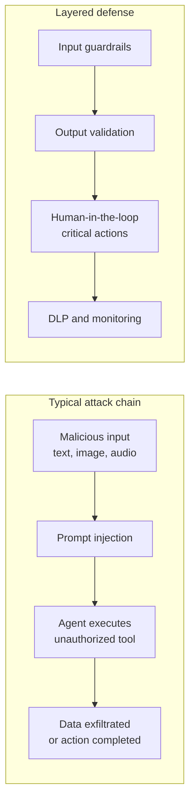

In August 2026, the OWASP GenAI Security Project published the third edition of its Top 10 for large language model applications. For the first time, the ranking was built on real incident data, not just expert opinion.

The project analyzed 7,714 reported AI-related security incidents. Of those, 6,639 carried enough detail to be classified against the risk taxonomy. The result is a ranking that combines 75% community voting with 25% incident evidence.

This article explains the ten risks, why some moved up or down, and what you can do to protect your applications.

## Why this edition matters now

The 2026 update is not just a reshuffling of the list. It reflects three structural changes in the market:

1. **Agents are no longer experiments.** Systems that call APIs, execute code, and access corporate systems are in production. The risk left the whiteboard.
2. **The attack surface changed.** Prompt injection is no longer just text. Images, audio, documents, and persistent memory are all attack vectors.
3. **The defense focus changed.** OWASP's core message is no longer "build a model that cannot be fooled." It is "build a system that stays safe when the model is fooled."

## The complete 2026 ranking

| Rank | Risk | 2025 | Movement |
|---|---|---|---|
| LLM01 | Prompt Injection | 1st | Stable |
| LLM02 | Sensitive Information Disclosure | 2nd | Stable |
| LLM03 | Excessive Agency | 6th | Up 3 |
| LLM04 | Supply Chain | 3rd | Down 1 |
| LLM05 | Data and Model Poisoning | 4th | Down 1 |
| LLM06 | Unbounded Consumption | 10th | Up 4 |
| LLM07 | Misinformation | 9th | Up 2 |
| LLM08 | Hidden Context Exposure | 7th | Down 1 |
| LLM09 | Vector and Embedding Weaknesses | 8th | Down 1 |
| LLM10 | Improper Output Handling | 5th | Down 5 |

The largest climb belonged to Unbounded Consumption, which jumped four places. The largest fall was Improper Output Handling, dropping five positions, not because the risk decreased, but because other risks became more urgent.

## LLM01: Prompt Injection

Prompt injection holds the top spot for the third consecutive year. The 2026 definition expanded: the input that alters model behavior does not need to be human-readable, does not need to come from a user, and does not need to be visible in the rendered interface.

What this means in practice:

**Attack vectors in 2026:**
- Direct text in the chat interface
- Images with hidden instructions (steganography)
- Audio transcribed before reaching the model
- Uploaded documents
- Content retrieved from web pages
- Persistent memory carried across sessions
- Tool output or messages from other agents

**Why traditional defenses fail:** Language models make no architectural distinction between instructions and data. Both are tokens on the same stream. There is no equivalent to parameterized queries for LLMs.

**What works:**
- Input guardrails that classify prompts before they reach the model
- Structural separation of external content: mark data as untrusted in a separate channel
- Output validation in trusted code, not by another LLM
- Stripping of invisible characters (zero-width, variation-selectors)
- Human-in-the-loop for irreversible actions
- Rule of Two: if an agent has (A) untrusted input + (B) sensitive data + (C) state-changing capability, require per-action human approval

## LLM03: Excessive Agency

The most significant climb in the ranking, Excessive Agency jumped from sixth to third place. The reason: agentic systems in production have shown that poorly calibrated autonomy causes real damage.

The definition is straightforward: the agent has permission to do more than it should. The consequence is that when the model is fooled (by prompt injection or hallucination), the damage is not limited to generated text.

**Three root causes:**
1. **Excessive functionality:** the tool does more than the task requires (e.g., an email reading tool can also send messages)
2. **Excessive permissions:** the agent accesses systems with an identity that holds more privileges than needed
3. **Excessive autonomy:** the agent performs irreversible actions without human confirmation

**OWASP recommended mitigations:**
- Minimize tools: only expose what is strictly necessary
- Minimize each tool's functionality
- Avoid open-ended tools (shell, generic URL fetch)
- Execute actions in the user's authentication context
- Require human approval for high-impact actions
- Rate limiting and circuit breakers per tool
- Continuous monitoring of invocation patterns

## Guardrails: the first line of defense

Guardrails are mechanisms that filter what enters and leaves the model. They fall into three categories:

**Input guardrails:** analyze prompts, attached documents, and retrieved content before they reach the model. They catch jailbreak attempts, hidden instructions in images, and malicious encoding characters.

**Output guardrails:** validate the model's response before delivering it to the user or a downstream system. They block PII leaks, generated malicious code, and factual misinformation.

**Action guardrails:** in agentic systems, evaluate each proposed tool call against the original user intent. A guardrail that sees only the original task and the action the agent wants to take (without the untrusted intermediate context) will refuse actions that drifted because of an injected instruction.

## RAG: the hidden risk

RAG (Retrieval-Augmented Generation) systems add an extra layer of risk. Retrieved content from vector databases or external documents enters the model's context without architectural distinction between data and instructions.

This means:
- A malicious document in a vector database can hijack model behavior on every query that retrieves it
- Hidden metadata in PDFs or spreadsheets can carry attack instructions
- Persistent memory across sessions can be poisoned and affect future users

**Mitigations:**
- Mark retrieved content as untrusted in a separate channel
- Sanitize documents before indexing
- Validate retrieved content before passing it to the model
- Apply the same input guardrails to RAG material

## DLP and sensitive data protection

LLM02 (Sensitive Information Disclosure) remains in second place. Sensitive data can leak through multiple channels:

- In the final model response
- In tool call arguments
- In reasoning traces (chain-of-thought)
- In logs and telemetry
- In stored vector embeddings

DLP (Data Loss Prevention) for generative AI must consider all these channels. Traditional DLP tools monitor network traffic. For AI, you must also monitor what enters and leaves the model's context.

**Recommended practices:**
- Map data flow before implementation
- Minimize the fields sent to the model
- Redact sensitive information before passing it to the model
- Apply the same redaction rules to logs and traces
- Validate model output against DLP policies before release

## Human-in-the-loop in 2026

OWASP is clear: irreversible or high-impact actions require human confirmation. But the details matter:

**What requires human approval:**
- Financial actions (transfers, payments)
- Data deletion
- Content publishing
- Security configuration changes
- Access to other users' data

**How to avoid approval fatigue:**
- Show the exact action that will be executed, not a summary
- Hidden characters can make the displayed action differ from the executed one
- Use dry-run or diff preview before approval
- Graduated policy: audit for low-impact actions, approval for high-impact ones

## What this means for your security team

If you work in security or infrastructure and your organization is using AI agents, here are practical steps:

1. **Rebaseline your risk register** against the 2026 ranking. If you are still using the 2025 version, Excessive Agency and Unbounded Consumption are under-represented.
2. **Inventory your agents.** Map which tools each agent can call, with what permissions, and on which downstream systems.
3. **Implement guardrails.** Input, output, and action guardrails are not optional for production agents.
4. **Review open-ended tools.** Any tool that runs shell, generic URL fetch, or write operations without confirmation should be replaced or require human approval.
5. **Monitor invocation patterns.** A sudden increase in tool calls or token volume is a sign that something may be wrong.
6. **Separate authorization decisions from the LLM.** The model may suggest an action, but the final decision should be made by deterministic code.

## Useful links

- [OWASP GenAI LLM Top 10 2026 (official publication)](https://genai.owasp.org/resource/owasp-genai-llm-top-10-2026/)
- [GitHub repository with category details](https://github.com/GenAI-Security-Project/GenAI-LLM-Top10)
- [CSA Research Note: incident data meets judgment](https://labs.cloudsecurityalliance.org/research/csa-research-note-owasp-llm-top10-2026-incident-weighted-202/)
- [Versa Networks: why network security matters for GenAI](https://versa-networks.com/blog/owasp-genai-top-10-network-security/)
- [OWASP Top 10 for Agentic Applications (dec 2025)](https://genai.owasp.org/download/52117)

## Conclusion

The OWASP GenAI Top 10 2026 is not just a list of vulnerabilities. It reflects a paradigm shift: AI security is leaving the lab and entering production, and the controls need to keep up.

The most important message is also the simplest: stop trying to build a model that cannot be fooled. Build a system that stays safe when the model is fooled. Guardrails, least privilege, human-in-the-loop, and continuous monitoring are the tools for that.