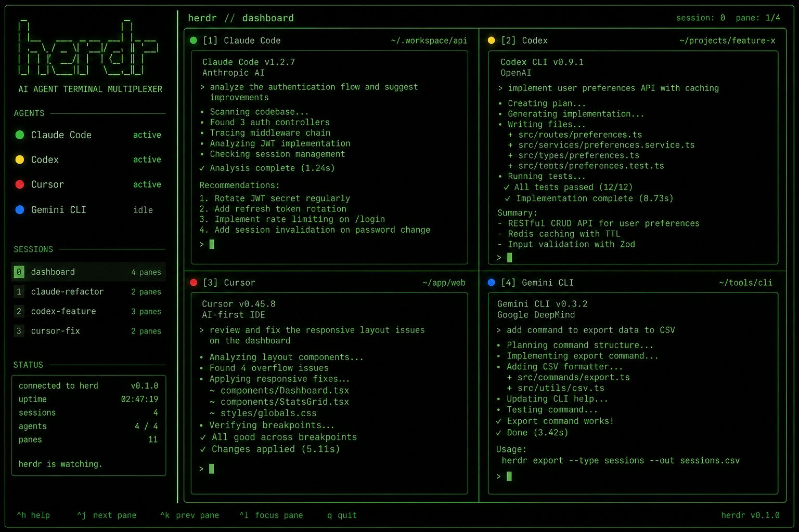
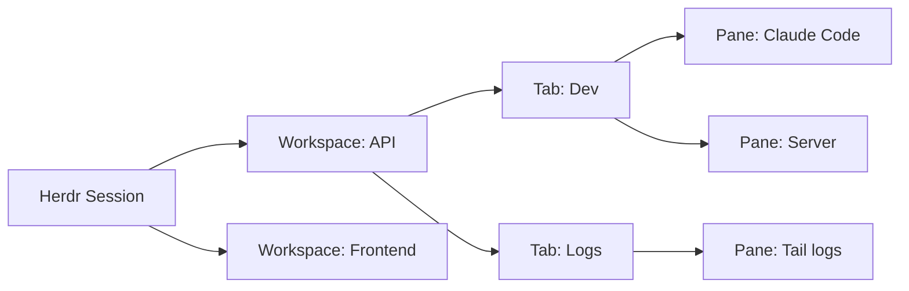

Running one AI agent in a terminal is simple. Running five, on different machines, and knowing what each one is doing without opening a window for each is a problem that traditional terminals do not solve.

tmux keeps sessions alive when you close the laptop. Zellij adds a more modern interface. But neither knows that inside that terminal there is an AI agent that could be processing, waiting for your input, or just idle.

Herdr was built to fill exactly that gap.



## What is Herdr

Herdr is a terminal multiplexer written in Rust, created by Can Celik and incubated at Y Combinator. The name comes from "herder," because the tool was designed to herd multiple AI agents running in parallel.

The core idea is simple: instead of managing several terminals or tmux tabs looking for the agent that finished or got stuck, Herdr shows the state of each one in a sidebar. Green for idle, yellow for working, red for blocked waiting for input. You see everything at once and click to enter the terminal you need.

## What makes it different

Unlike tmux, which treats all terminals as anonymous, Herdr identifies which process is running in each pane. It recognizes Claude Code, Codex, Cursor, OpenCode, and several other agents automatically, with no configuration needed.

It also runs as a background server. You close the laptop, the agents keep running. Come back later, reconnect from any terminal or over SSH, and the layout is exactly as you left it.

### Herdr vs tmux: what changes

It is easy to think Herdr and tmux do the same thing. Both are terminal multiplexers. Both keep sessions alive after you disconnect. Both let you split the screen into panes. The similarities end there.

tmux was created in 2007, at a time when nobody imagined AI agents running inside terminals. It treats all processes as anonymous. To tmux, a running Claude Code is the same thing as `htop` or `vim`. There is no way to tell, by looking at the pane list, which one finished a task and which one is waiting for your input.

Herdr was built seventeen years later, with a different problem in mind. It knows that inside a pane there might be an AI agent. It shows the state of each one with colored dots in the sidebar. It exposes an API so agents can coordinate with each other. And it has a plugin system that lets you extend behavior without recompiling the binary.

Another practical difference: tmux has no built-in command for connecting to remote sessions. You have to wrap everything in SSH manually. Herdr has a `--remote` command that does this in a single step, installing the binary on the remote server if needed and preserving your key bindings and clipboard.

The summary is simple. tmux multiplexes anonymous terminals. Herdr multiplexes terminals that can contain AI agents and gives you visibility and control over them.

## How it works in practice

Installation is a single command:

```bash
curl -fsSL https://herdr.dev/install.sh | sh
```

Or via Homebrew:

```bash
brew install herdr
```

After installation, start Herdr:

```bash
herdr
```

The interface opens with an empty workspace and a sidebar. You create workspaces with the `n` key, split panes with `v` (vertical) or `-` (horizontal), and inside each pane you run your agents normally.

The default prefix is `ctrl+b`, the same as tmux. `ctrl+b q` detaches, and `herdr` reattaches. Everything you know from tmux works, but with agent state detection and mouse support.

### Agent states

The Herdr sidebar shows each agent's state with colored dots:

- **Green**: agent idle, you have seen the result
- **Yellow**: agent working
- **Red**: agent blocked, waiting for your input
- **Blue**: agent finished but you have not looked yet

Detection works through heuristics. Herdr identifies the foreground process in each pane and reads the terminal output in real time, looking for patterns like spinners, "waiting for input" messages, and tool execution indicators. All of this happens without the agent needing to report its own state.

For agents with official integration, Herdr goes further: it can recover the agent session even after a full server restart.

#### Supported agents

Herdr detects 20 different agents automatically with no configuration. Detection works through three mechanisms:

- Screen manifests: Herdr reads terminal output and recognizes spinners, approval prompts, and waiting messages for each agent
- Lifecycle hooks: some agents report state directly (idle, working, blocked) with full accuracy
- Session identity: Herdr recovers the session after a server restart

**Agents with automatic detection:**

- Claude Code: session and state via screen manifest
- Codex CLI: session and state via screen manifest
- Cursor Agent CLI: session and state via screen manifest
- OpenCode: lifecycle hooks and screen manifest
- Grok CLI: session and state via screen manifest
- GitHub Copilot CLI: session via integration
- Pi: lifecycle hooks (full state)
- OMP: lifecycle hooks (full state)
- Droid: session via integration
- Kimi Code CLI: lifecycle hooks (full state)
- Kilo Code CLI: lifecycle hooks and screen manifest
- Hermes Agent: session via integration
- Devin CLI: session via integration
- Qoder CLI: session via integration
- Qwen Code: session via integration
- MastraCode: lifecycle hooks (full state)
- Amp: screen manifest (no integration)
- Antigravity CLI: session via integration
- Kiro CLI: screen manifest (no integration)
- Maki: screen manifest (no integration)

Additionally, Gemini CLI and Cline have partial detection. Unlisted agents run normally as terminal processes. Herdr works as a workspace manager for any CLI, but without automatic state detection.

To report state manually from any process, there is a lifecycle hook system. A script or plugin can call `herdr agent report-agent` to inform that a pane is idle, working, or blocked.

## Advanced features

### Full Socket API

Herdr exposes an API over a local socket with dozens of methods. Beyond the CLI commands already mentioned, the API allows:

- Subscribing to real-time events: when an agent changes state, when a pane receives new output, when a workspace is created or closed
- Controlling plugins: install, enable, disable, and invoke actions
- Managing Git worktrees: creating checkouts as Herdr workspaces
- Exporting and importing full session layouts
- Controlling popups and notifications programmatically

### Session restore

Herdr saves the session layout to disk. If the server restarts, it restores workspaces, tabs, panes, and working directories. For agents with official integration, it also resumes the agent session using each one's native ID. This means a running Claude Code or Codex comes back to its previous state without losing history.

### Notifications

Herdr notifies you when a background agent finishes or needs attention. Three notification levels:

- `herdr`: notification inside the Herdr interface
- `terminal`: notification in the outer terminal, works over SSH too
- `system`: operating system notification (macOS, Linux, Windows)

### Mouse support

Unlike tmux, which treats mouse as a secondary feature, Herdr is mouse-native. You can:

- Click panes to select them
- Drag borders to resize
- Right-click for context menu
- Drag tabs to reorder
- Scroll the sidebar to navigate workspaces
- Select text with the mouse and copy it automatically to the clipboard

Mouse support also works over SSH and on mobile clients.

### Plugins and marketplace

Herdr has a plugin system where each plugin is an executable with a `herdr-plugin.toml` manifest. There is no separate SDK: the Herdr CLI is the plugin API. The official marketplace lists over 700 plugins, installable via GitHub shorthand:

```bash
herdr plugin install ogulcancelik/herdr-plugin-examples/tree-bootstrap
```

Plugins can create new panes, add event hooks, run server actions, and extend any part of the interface.

### Herdr M (desktop app)

Besides the terminal TUI, Herdr has a native macOS app called Herdr M. It wraps the same sessions in a conventional interface with windows, file access, and remote connections. Since the device is linked to the same session, you can close the terminal mid-task and continue where you left off in the app.

### Themes and configuration

Herdr works without a configuration file. When you need customization, the file lives at `~/.config/herdr/config.toml`. You can configure:

- Full keybindings (prefix, shortcuts, resize mode)
- Sidebar layout (width, auto-collapse, sections)
- Notifications (type, position, delay)
- Color theme
- Scrollback behavior
- Pane history limits

## Device adaptation

Herdr works on laptops, desktops, tablets, and phones. The adaptation is automatic.

### Desktop and laptop

On desktop, Herdr shows the full interface with an expanded sidebar, side-by-side panes, and context menus. The layout is the same as tmux, but with agent detection and mouse support.

### Tablet and phone

On mobile devices, Herdr can be accessed in two ways:

**Direct SSH:** install any SSH client on your phone (Moshi on iOS, Termux on Android, Blink, Termius). Connect to the server where your agents run and run `herdr`. The TUI adapts automatically to narrow screens. The sidebar is hidden and replaced by a switcher menu. Pane layout changes to single column. Mouse and touch support work over SSH.

```bash
# From a phone, via SSH
ssh user@server
herdr
```

The official site recommends the Moshi app (iOS), which has native Herdr support. You manage agents from an iPhone as if you were on the desktop.

**Via Herdr M (desktop app):** on macOS, Herdr M works as an alternative to the TUI interface for those who prefer conventional windows.

**Via herdr-web:** there is a community-maintained project that runs the real Herdr TUI in the browser as an installable PWA. It uses xterm.js to stream the terminal over WebSocket. It works on any device with a browser, including phones.

### Remote thin client

The `--remote` command turns local Herdr into a lightweight client for a remote session:

```bash
herdr --remote ssh://user@server
```

This is more responsive than raw SSH on slow connections because only rendering data travels through the socket. The local clipboard works, including for images. Locally configured key bindings are preserved even on the remote session.

### Known limitation with multi-client

When a mobile client (narrow window) connects to a session that already has a desktop client attached, the shared session adjusts to the smallest size among clients. This can make desktop panes temporarily narrow. The Herdr team is considering per-client resizing in the future.

Herdr organizes work in three levels.

A workspace corresponds to a project or context. Inside each workspace you can have multiple tabs. Each tab can have multiple panes side by side, like in tmux.

A workspace can contain a backend agent, a frontend agent, a terminal for server logs, and another for tests. The sidebar shows the summarized state of each workspace, so you can see at a glance if something is blocked without entering each one.



## Persistence and remote access

Herdr runs as a background server. You can disconnect and the session stays alive. You can reconnect from anywhere.

```bash
# From another computer, over SSH
ssh user@server
herdr
```

The session is exactly as you left it. The agents kept working while you were offline.

To use Herdr remotely more directly:

```bash
herdr --remote ssh://user@server
```

This command connects your local Herdr to a remote session, installing the binary on the server if needed. Your local clipboard works, including for images, and your configured key bindings are preserved.

## Agents can use Herdr too

One of the most interesting features of Herdr is that agents themselves can interact with it. The tool exposes an API over a local socket that allows creating workspaces, splitting panes, sending commands, and waiting for another agent to finish.

```bash
# An agent can create a workspace
herdr workspace create --cwd ~/project --label backend

# Split a pane
herdr pane split 1-1 --direction right

# Wait for another agent to finish
herdr wait agent-status 1-1 --status done

# Read a pane's output
herdr pane read 1-2 --source recent-unwrapped
```

This turns Herdr from a passive manager into an orchestration platform. A coordinating agent can launch parallel tasks, monitor the progress of each, and only proceed when all have finished.

## Plugins

Herdr supports plugins that extend panes and workflows. A plugin is any executable with a `herdr-plugin.toml` manifest. It can be written in Bash, JavaScript, Lua, Rust, or any language the machine can run.

There is no separate SDK. Everything you can do with the Herdr CLI, a plugin can also do, usually through the `HERDR_BIN_PATH` variable. The official marketplace already lists over 700 plugins.

## Supported agents

Herdr detects the following agents automatically with no configuration:

- Claude Code
- Codex CLI
- Cursor Agent
- OpenCode
- Grok
- GitHub Copilot CLI
- Pi
- Droid
- Kimi

For any other CLI agent, Herdr still works as a workspace manager. You just do not get automatic state detection, but you can use the hook system to report state manually.

## Comparison with alternatives

| Feature | tmux | Zellij | Herdr |
|---|---|---|---|
| Persistent sessions | Yes | Yes | Yes |
| Remote access via SSH | Yes | Yes | Yes |
| Agent state detection | No | No | Yes |
| API for agents | Scriptable | Limited | Native |
| Mouse support | Limited | Yes | Yes |
| Plugin marketplace | No | Partial | 700+ plugins |
| Installation | System | Brew/Binary | Brew/Binary |
| License | BSD | MIT | Apache 2.0 / AGPL |

## Who should use Herdr

Herdr is useful if you run multiple AI agents in parallel and need to know, without opening each terminal, which one is waiting for you. It is also useful if you want your agents to coordinate with each other.

It is not a tool to replace your terminal. Herdr runs inside Ghostty, Alacritty, Kitty, WezTerm, and even inside tmux itself. It is an additional layer, not a new environment.

It is also not an agent manager in the sense of an "app that runs agents for you." It manages the terminals where your agents run. The agents are the same ones you already use.

## Useful links

- Official site: [herdr.dev](https://herdr.dev)
- GitHub repository: [github.com/herdrdev/herdr](https://github.com/herdrdev/herdr)
- Documentation: [herdr.dev/docs](https://herdr.dev/docs)
- Installation: [herdr.dev/install](https://herdr.dev/install)

## Conclusion

Herdr solves a problem that tmux and Zellij never faced because they were created before AI agents became common work tools. A traditional terminal multiplexer treats all processes as anonymous. Herdr knows that inside a pane there could be an agent that is processing, waiting for a response, or just idle, and it shows you that without you having to guess.

The combination of remote persistence, state detection, and agent API makes it a piece of infrastructure that goes beyond a simple window manager. For anyone working with multiple agents in parallel, especially on different machines, Herdr fills a gap that no other tool covers.