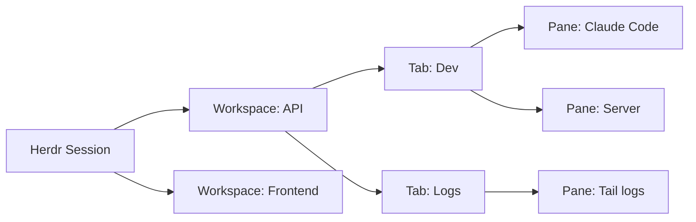

Running one AI agent in a terminal is simple. Running five, on different machines, and knowing what each one is doing without opening a window for each is a problem that traditional terminals do not solve.

tmux keeps sessions alive when you close the laptop. Zellij adds a more modern interface. But neither knows that inside that terminal there is an AI agent that could be processing, waiting for your input, or just idle.

Herdr was built to fill exactly that gap.

## What is Herdr

Herdr is a terminal multiplexer written in Rust, created by Can Celik and incubated at Y Combinator. The name comes from "herder," because the tool was designed to herd multiple AI agents running in parallel.

The core idea is simple: instead of managing several terminals or tmux tabs looking for the agent that finished or got stuck, Herdr shows the state of each one in a sidebar. Green for idle, yellow for working, red for blocked waiting for input. You see everything at once and click to enter the terminal you need.

## What makes it different

Unlike tmux, which treats all terminals as anonymous, Herdr identifies which process is running in each pane. It recognizes Claude Code, Codex, Cursor, OpenCode, and several other agents automatically, with no configuration needed.

It also runs as a background server. You close the laptop, the agents keep running. Come back later, reconnect from any terminal or over SSH, and the layout is exactly as you left it.

## How it works in practice

Installation is a single command:

```bash
curl -fsSL https://herdr.dev/install.sh | sh
```

Or via Homebrew:

```bash
brew install herdr
```

After installation, start Herdr:

```bash
herdr
```

The interface opens with an empty workspace and a sidebar. You create workspaces with the `n` key, split panes with `v` (vertical) or `-` (horizontal), and inside each pane you run your agents normally.

The default prefix is `ctrl+b`, the same as tmux. `ctrl+b q` detaches, and `herdr` reattaches. Everything you know from tmux works, but with agent state detection and mouse support.

### Agent states

The Herdr sidebar shows each agent's state with colored dots:

- **Green**: agent idle, you have seen the result
- **Yellow**: agent working
- **Red**: agent blocked, waiting for your input
- **Blue**: agent finished but you have not looked yet

Detection works through heuristics. Herdr identifies the foreground process in each pane and reads the terminal output in real time, looking for patterns like spinners, "waiting for input" messages, and tool execution indicators. All of this happens without the agent needing to report its own state.

For agents with official integration (Claude Code, Codex, Cursor), Herdr goes further: it can recover the agent session even after a full server restart.

## Workspaces, tabs, and panes

Herdr organizes work in three levels.

A workspace corresponds to a project or context. Inside each workspace you can have multiple tabs. Each tab can have multiple panes side by side, like in tmux.

A workspace can contain a backend agent, a frontend agent, a terminal for server logs, and another for tests. The sidebar shows the summarized state of each workspace, so you can see at a glance if something is blocked without entering each one.



## Persistence and remote access

Herdr runs as a background server. You can disconnect and the session stays alive. You can reconnect from anywhere.

```bash
# From another computer, over SSH
ssh user@server
herdr
```

The session is exactly as you left it. The agents kept working while you were offline.

To use Herdr remotely more directly:

```bash
herdr --remote ssh://user@server
```

This command connects your local Herdr to a remote session, installing the binary on the server if needed. Your local clipboard works, including for images, and your configured key bindings are preserved.

## Agents can use Herdr too

One of the most interesting features of Herdr is that agents themselves can interact with it. The tool exposes an API over a local socket that allows creating workspaces, splitting panes, sending commands, and waiting for another agent to finish.

```bash
# An agent can create a workspace
herdr workspace create --cwd ~/project --label backend

# Split a pane
herdr pane split 1-1 --direction right

# Wait for another agent to finish
herdr wait agent-status 1-1 --status done

# Read a pane's output
herdr pane read 1-2 --source recent-unwrapped
```

This turns Herdr from a passive manager into an orchestration platform. A coordinating agent can launch parallel tasks, monitor the progress of each, and only proceed when all have finished.

## Plugins

Herdr supports plugins that extend panes and workflows. A plugin is any executable with a `herdr-plugin.toml` manifest. It can be written in Bash, JavaScript, Lua, Rust, or any language the machine can run.

There is no separate SDK. Everything you can do with the Herdr CLI, a plugin can also do, usually through the `HERDR_BIN_PATH` variable. The official marketplace already lists over 700 plugins.

## Supported agents

Herdr detects the following agents automatically with no configuration:

- Claude Code
- Codex CLI
- Cursor Agent
- OpenCode
- Grok
- GitHub Copilot CLI
- Pi
- Droid
- Kimi

For any other CLI agent, Herdr still works as a workspace manager. You just do not get automatic state detection, but you can use the hook system to report state manually.

## Comparison with alternatives

| Feature | tmux | Zellij | Herdr |
|---|---|---|---|
| Persistent sessions | Yes | Yes | Yes |
| Remote access via SSH | Yes | Yes | Yes |
| Agent state detection | No | No | Yes |
| API for agents | Scriptable | Limited | Native |
| Mouse support | Limited | Yes | Yes |
| Plugin marketplace | No | Partial | 700+ plugins |
| Installation | System | Brew/Binary | Brew/Binary |
| License | BSD | MIT | Apache 2.0 / AGPL |

## Who should use Herdr

Herdr is useful if you run multiple AI agents in parallel and need to know, without opening each terminal, which one is waiting for you. It is also useful if you want your agents to coordinate with each other.

It is not a tool to replace your terminal. Herdr runs inside Ghostty, Alacritty, Kitty, WezTerm, and even inside tmux itself. It is an additional layer, not a new environment.

It is also not an agent manager in the sense of an "app that runs agents for you." It manages the terminals where your agents run. The agents are the same ones you already use.

## Useful links

- Official site: [herdr.dev](https://herdr.dev)
- GitHub repository: [github.com/herdrdev/herdr](https://github.com/herdrdev/herdr)
- Documentation: [herdr.dev/docs](https://herdr.dev/docs)
- Installation: [herdr.dev/install](https://herdr.dev/install)

## Conclusion

Herdr solves a problem that tmux and Zellij never faced because they were created before AI agents became common work tools. A traditional terminal multiplexer treats all processes as anonymous. Herdr knows that inside a pane there could be an agent that is processing, waiting for a response, or just idle, and it shows you that without you having to guess.

The combination of remote persistence, state detection, and agent API makes it a piece of infrastructure that goes beyond a simple window manager. For anyone working with multiple agents in parallel, especially on different machines, Herdr fills a gap that no other tool covers.