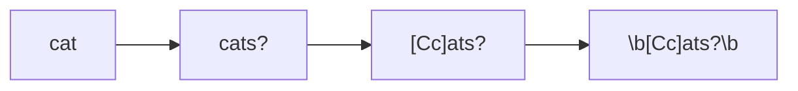
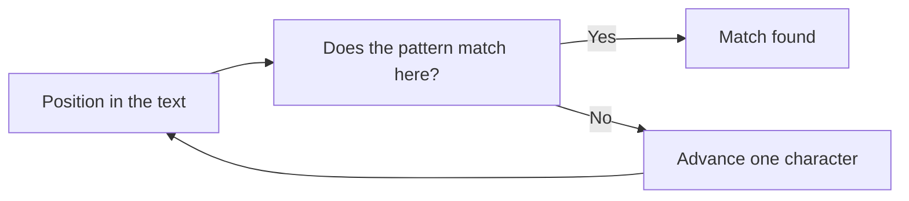
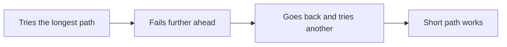

<style>
  /*
    Styles scoped to the regex article.
    The global.css does not style <details>/<summary> nor provide a callout,
    and the design tokens below are the ones already defined globally.
    Every rule is scoped under .artigo-regex so it cannot leak into other articles.
  */
  .artigo-regex .nota {
    margin: var(--space-6) 0;
    padding: var(--space-4) var(--space-5);
    border-radius: var(--radius-sm);
    border-left: 3px solid var(--color-accent);
    background: var(--color-surface-muted);
    font-size: 0.98rem;
  }

  .artigo-regex .nota p {
    margin: 0;
  }

  .artigo-regex .nota p + p {
    margin-top: var(--space-3);
  }

  .artigo-regex .nota-rotulo {
    display: block;
    font-family: var(--font-ui);
    font-size: 0.78rem;
    font-weight: 600;
    text-transform: uppercase;
    letter-spacing: 0.04em;
    color: var(--color-text-muted);
    margin-bottom: var(--space-2);
  }

  .artigo-regex .nota-atencao {
    border-left-color: #b45309;
  }

  .artigo-regex .nota-erro {
    border-left-color: #b91c1c;
  }

  .artigo-regex .nota-dica {
    border-left-color: #15803d;
  }

  :root[data-theme='dark'] .artigo-regex .nota-atencao {
    border-left-color: #f59e0b;
  }

  :root[data-theme='dark'] .artigo-regex .nota-erro {
    border-left-color: #f87171;
  }

  :root[data-theme='dark'] .artigo-regex .nota-dica {
    border-left-color: #4ade80;
  }

  /* <details> for the exercise answers (not styled by global.css). */
  .artigo-regex details {
    margin: var(--space-4) 0;
    padding: var(--space-3) var(--space-4);
    border: 1px solid var(--color-border);
    border-radius: var(--radius-sm);
    background: var(--color-surface-muted);
  }

  .artigo-regex details summary {
    cursor: pointer;
    font-family: var(--font-ui);
    font-weight: 600;
    font-size: 0.95rem;
  }

  .artigo-regex details[open] summary {
    margin-bottom: var(--space-3);
  }

  .artigo-regex details p {
    margin-bottom: var(--space-3);
  }

  .artigo-regex details p:last-child {
    margin-bottom: 0;
  }

  /* Cheat sheet table: scrolls horizontally on mobile instead of squeezing. */
  .artigo-regex .tabela-rolavel {
    overflow-x: auto;
    margin: var(--space-6) 0;
  }

  .artigo-regex .tabela-rolavel table {
    margin: 0;
    min-width: 34rem;
  }
</style>

<div class="artigo-regex">


The first time you face a regular expression, it looks like someone fell asleep on the keyboard. A soup of backslashes, braces, parentheses, and asterisks with no obvious entry point.

The second time, you copy a regex from Stack Overflow, it works, and you move on without understanding what it does. That solves today's problem and creates tomorrow's.

Regex is not hard. It is **dense**. Every symbol carries a lot of meaning, and that is exactly why it intimidates. But there is a small vocabulary behind all that punctuation, and once it clicks, reading a regular expression becomes ordinary reading, left to right.

This guide builds that vocabulary in order. It starts with a literal word and ends with lookaround and backtracking. Each new concept sits on top of the previous one, and no expression appears without an explanation.

If you work with Linux, networking, development, or security, regex stops being optional at some point. It is inside `grep`, `sed`, `nginx`, `journalctl`, your editor's search box, your WAF, and the first day of any script that processes text.

## What a regular expression is

A regular expression is a **description of a text pattern**. Nothing more than that.

Instead of saying "find the word cat", you say "find the word cat, but accept cats in the plural, with a capital C or lowercase c, and only when it stands alone as a word". The regex is the written form of that description.

The engine then scans the text and answers one simple question: **is there any piece of text here that matches this description?** If so, where does it start and where does it end.

One distinction shows up throughout the whole article, so it is worth fixing early:

- **Searching** means finding pieces of the pattern inside a larger text. The log has 40,000 lines and you want the 12 that matter.
- **Validating** means confirming that the entire text follows the pattern exactly, from the first character to the last. The user typed a postal code into a field and you want to know whether it is correct.

These are different goals and they use different anchors. We will come back to this several times.

## What regex is used for

The use cases fall into four families.

**Extracting information from messy text.** Log lines, command output, scraped HTML, malformed CSV. You only want the IP address, the timestamp, the status code.

**Validating input.** Postal code format, license plate, internal hostname, software version. Accept or reject quickly.

**Transforming text.** Replacing every IP address with `[REDACTED]` before sharing a log. Reordering fields in a line. Renaming files in bulk.

**Filtering large volumes.** `grep` across gigabytes of logs, `journalctl` on a misbehaving server, search inside your editor. Finding the needle without opening the haystack.

## How to read a regex without panicking

Here is an expression that looks intimidating:

```regex title="Looks hard, isn't" showLineNumbers
^(?<ip>\d{1,3}(?:\.\d{1,3}){3}) - - \[(?<date>[^\]]+)\] "(?<method>[A-Z]+) (?<route>[^"]*)
```

It is 90 characters long and does exactly one thing: split an nginx log line into named parts.

The key to reading regex is **slicing**. You do not read the whole expression at once. You look for the structural break points, which are the symbols with structural meaning:

1. **Anchors** mark start and end. The `^` at the beginning.
2. **Groups** in parentheses are subexpressions. Every `(` opens a new slice.
3. **Inside each slice**, there is a short pattern: a character class, a quantifier, a literal.

Slicing that expression turns it into this:

| Slice | What it is |
|---|---|
| `^` | start of the line |
| `(?<ip>...)` | group named "ip" |
| `\d{1,3}` | one to three digits |
| `(?:\.\d{1,3}){3}` | that group of a dot followed by digits, repeated three times |
| ` - - \[` | literal: space, hyphen, space, hyphen, space, bracket |
| `[^\]]+` | anything that is not `]`, one or more times |
| `"` | literal: quote |
| `[A-Z]+` | one or more uppercase letters |

Out of nine mysterious symbols you are left with concepts you will learn in the next fifteen minutes. That is the point: **regex is built from small, readable pieces**.

## Literal characters

The simplest regex is an ordinary word. With no special symbol, each character means exactly itself.

```regex title="A literal word"
cat
```

Tested against this text:

```text title="Test text"
The cat slept on the sofa.
My cats are loud.
A dog walked by.
The CAT woke up.
```

The search finds **only** the first line. Does `cat` exist inside "cats"? No, because the sequence there is `c-a-t-s`, with an `s` after the `t`. And `CAT` does not match because regex is case sensitive by default.

Literals are the starting point, but they are rigid. That is where metacharacters come in.

## The dot metacharacter

The dot is the wildcard. It means **any single character**, with one important exception: by default it does not match a line break.

```regex title="The dot stands in for one character"
cat.
```

Against the same text:

```text title="Test text"
The cat slept on the sofa.
My cats are loud.
A dog walked by.
The CAT woke up.
```

Now there are four matches instead of one:

- `cat ` on line 1 (the dot matched the space)
- `cats` on line 2 (the dot matched the `s`)
- `CAT ` on line 4
- line 3 stays out, because there is no `cat` in `A dog walked by`

One detail that is easy to forget: the dot **consumes** a character. It is not optional. To match `cat`, the text needs exactly one character after `ca`. It does not match `ca` alone, nor would it match `cats` if you wrote `cats.` instead.

<div class="nota nota-atencao">
  <span class="nota-rotulo">Watch out</span>
  <p>Using the dot to match a literal dot is the most common beginner mistake. To find IP addresses, `192.168.1.1` also matches `192x168y1z1`, because every dot became a wildcard. The correct form escapes it: `192\.168\.1\.1`.</p>
</div>

## Character classes

Square brackets define a **set of acceptable characters** for a single position. Instead of demanding "exactly an `a`", you say "any vowel".

```regex title="Brackets: one of several options"
[Cc]ats?
```

Let us take it apart, because this expression already has three new symbols:

- `[Cc]` means **one character: uppercase `C` or lowercase `c`**
- `at` are literals
- `s?` means **an optional `s`**

The result matches `cat`, `Cat`, `cats`, `Cats`.

Now a comparison worth pausing on:

| Expression | Matches | Does not match |
|---|---|---|
| `cat.` | `cats`, `cat `, `catx`, `cat!` | `cat` alone |
| `cat[sc]` | `cats`, `catc` | `catx`, `cat!` |
| `cat[^sc]` | `catx`, `cat!` | `cats`, `catc` |

Inside square brackets almost every symbol loses its special power and becomes a literal. `[.]` is a literal dot, no escape needed. The hyphen needs care: `[a-z]` is the range from `a` to `z`, while `[a-]` is `a` and `-`.

| Class | Meaning |
|---|---|
| `[abc]` | one of the characters `a`, `b`, or `c` |
| `[a-z]` | one lowercase letter from `a` to `z` |
| `[A-Z]` | one uppercase letter from `A` to `Z` |
| `[0-9]` | one digit from 0 to 9 |
| `[a-zA-Z0-9]` | one letter or digit, upper or lower case |
| `[a-zA-Z0-9_.-]` | the same, plus underscore, dot, and literal hyphen |

## Shorthand classes

Writing `[0-9]` every time is tiring, and `[a-zA-Z0-9_]` is worse. So there is a shortcut for the most common sets.

| Shorthand | Equivalent to | Meaning |
|---|---|---|
| `\d` | `[0-9]` | one digit |
| `\w` | `[a-zA-Z0-9_]` | a letter, digit, or underscore |
| `\s` | space, tab, line break | one whitespace character |
| `.` | anything except a line break | any single character |

Mnemonic: **d** for *digit*, **w** for *word*, **s** for *space*.

```regex title="Shorthand classes in practice"
\w+@\w+
```

Against this text:

```text title="Test text"
alice@example
bruno@company.com
route /api/v1/users was called
```

That expression matches `alice@example` and `bruno@company`. Notice `.com` stayed out, because the dot is not in the accepted classes. It is a good example of a regex that "almost works", and it shows why validating a format is a more serious subject than it looks.

<div class="nota nota-dica">
  <span class="nota-rotulo">Tip</span>
  <p>Use `\d` and `\w` when readability matters, and `[0-9]` when you want the range spelled out. Both are equivalent in practice, but the shorthand is easier to read inside a long expression.</p>
</div>

## Negation

Placing `^` **inside** the brackets flips the meaning of the set: it now accepts everything that is **not** listed.

```regex title="Everything except what is listed"
[^"]+
```

That means **one or more characters that are not quotes**. It is a classic piece for capturing the value inside a string.

Watch out for one detail: `^` has two completely different meanings depending on where it sits.

| Position | Meaning | Example |
|---|---|---|
| Outside brackets, at the start | start of the text or line | `^cat` |
| Inside brackets | negation of the set | `[^cat]` |

`[^cat]` does not mean "does not start with cat". It means "one character that is not `c`, `a`, or `t`. That is why `[^abc]` matches the `d` in "candle".

## Quantifiers

So far everything matched **one** character. Quantifiers say **how many times** to repeat.

| Quantifier | Meaning | Example matches |
|---|---|---|
| `*` | zero or more | `` (empty), `a`, `aaa` |
| `+` | one or more | `a`, `aaa` (never empty) |
| `?` | zero or one | `` (empty), `a` |
| `{3}` | exactly 3 | `aaa` |
| `{2,5}` | 2 to 5 | `aa`, `aaaaa` |
| `{3,}` | 3 or more | `aaa`, `aaaaaaa` |

Let us build the expression from the beginning of the article in stages, so you can see each piece go in.

```regex title="Step 1: literal word"
cat
```

Matches `cat`, exactly, and nothing else.

```regex title="Step 2: optional plural"
cats?
```

The `?` applies to the `s` immediately before it and makes it optional. Now it matches `cat` and `cats`.

```regex title="Step 3: accept a capital letter"
[Cc]ats?
```

The `[Cc]` replaces the literal `c` and accepts both forms. Matches `cat`, `Cat`, `cats`, `Cats`.

```regex title="Step 4: whole word only"
\b[Cc]ats?\b
```

The `\b` guarantees there is no letter or digit stuck to either side. Now `catsup` is out, while `Cats!` is in, because punctuation is not a word character.

Each step added one condition, and the final expression is already quite specific:



Read the diagram left to right: every arrow is a restriction you added.

The four versions side by side:

| Expression | Matches | Leaves out |
|---|---|---|
| `cat` | `cat` | `Cat`, `cats`, `catsup` |
| `cats?` | `cat`, `cats` | `Cat`, `catsup` |
| `[Cc]ats?` | `cat`, `Cat`, `cats`, `Cats` | `catsup` |
| `\b[Cc]ats?\b` | `cat`, `Cat`, `cats`, `Cats`, `Cats!` | `catsup`, `bobcat` |

<div class="nota nota-dica">
  <span class="nota-rotulo">Tip</span>
  <p>A quantifier acts on <strong>one</strong> element, the one immediately before it. In `\d{3}` it applies to the `\d`. And `\d{3}` means "three digits", not "the number 3 three times".</p>
</div>

To read a repetition range:

| Notation | Reading |
|---|---|
| `{m}` | exactly m repetitions |
| `{m,}` | m repetitions or more, no upper limit |
| `{m,n}` | at least m and at most n repetitions |

<div class="nota nota-erro">
  <span class="nota-rotulo">Common mistake</span>
  <p>Forgetting the `+` and using `*` as if they were the same. `\d*` matches <strong>nothing</strong>, so an expression like `^\d*$` accepts an empty string. That passes validation and becomes a production bug.</p>
</div>

## Anchors

Anchors do not consume characters. They say **where** the match has to be.

| Anchor | Meaning |
|---|---|
| `^` | start of the text (or of the line, with the `m` flag) |
| `$` | end of the text (or of the line, with the `m` flag) |
| `\b` | word boundary |
| `\B` | the opposite: inside a word, with no boundary |

```regex title="Anchor + class + quantifier, no floating matches"
^\d{3}-\d{4}$
```

That expression validates the `123-4567` format strictly:

| Input | Result | Why |
|---|---|---|
| `123-4567` | matches | exact format |
| `123-45678` | no match | five digits at the end, the `$` blocks it |
| `a123-4567` | no match | the `^` blocks it |
| ` 123-4567` | no match | leading space, the `^` blocks it |

Note that, **without the anchors**, the same expression would match inside `123-456789`. That is the core difference between searching and validating.

<div class="nota nota-atencao">
  <span class="nota-rotulo">Watch out</span>
  <p>In JavaScript, `$` matches the end of the text but also accepts a trailing line break. In practice, <code>/^\d{3}-\d{4}$/</code> accepts <code>"123-4567\n"</code>. If validation has to be absolute, strip the line break before testing, or use a stricter anchor when the flavor offers one: Python has <code>\Z</code>, and PCRE and Java have <code>\z</code>.</p>
</div>

## Capture groups

Parentheses do two things: they group a subexpression and they **capture** whatever matched inside, so you can use it later.

```regex title="Groups capture each part"
^(\d{4})-(\d{2})-(\d{2})$
```

Against `2026-09-23`, the result is:

| Group | Content | How to reference it |
|---|---|---|
| 1 | `2026` | `$1` or `\1` |
| 2 | `09` | `$2` or `\2` |
| 3 | `23` | `$3` or `\3` |

That ability to isolate parts is what turns regex from "finding text" into "processing text".

There is also the named group, which makes intent readable and saves you from counting parentheses:

```regex title="Named groups"
^(?<year>\d{4})-(?<month>\d{2})-(?<day>\d{2})$
```

In Python and PCRE the syntax is `(?P<year>...)`. In JavaScript, from ES2018 onward, it is `(?<year>...)`. Names solve the real problem of reading `$6` and having no idea what group 6 is.

## Noncapturing groups

Grouping without capturing is useful when you only need to apply a quantifier to a sequence, without storing the result.

```regex title="Capturing versus non-capturing"
(\d{1,3}\.){3}\d{1,3}
```

That pattern looks like an IPv4 address, and the structure reads: "three times (one to three digits followed by a dot), then one to three digits".

The noncapturing version looks like this:

```regex title="A group that does not capture"
(?:\d{1,3}\.){3}\d{1,3}
```

The `(?:...)` groups so the `{3}` works, but it creates no numbered group and consumes no `$1`, `$2` position. In long expressions that keeps the numbering of the groups that actually matter.

<div class="nota nota-atencao">
  <span class="nota-rotulo">Watch out</span>
  <p>That pattern does <strong>not validate IPv4</strong>. It accepts <code>999.999.999.999</code> and <code>256.1.1.1</code>, because <code>\d{1,3}</code> accepts any number of up to three digits without checking whether it sits between 0 and 255. Validating for real would require constraining each octet. The pattern above is for <strong>finding candidates</strong> in a log, not for confirming validity.</p>
</div>

## Alternation

The `|` character means **or**. It chooses between the expression on the left and the one on the right.

```regex title="Simple alternation"
error|failure|critical
```

Mind the precedence: `|` has the lowest priority of all, so `cat|dog` reads as "the whole word cat **or** the whole word dog". To restrict the reach of `|`, use groups:

```regex title="Alternation with controlled reach"
(?:cat|kitten)s?
```

Without the parentheses, `cat|kittens?` would mean "`cat`" **or** "`kitten` followed by an optional s". With the group, the `s?` applies to both options.

| Expression | Matches |
|---|---|
| `cat|kittens?` | `cat`, `kitten`, `kittens` |
| `(?:cat|kitten)s?` | `cat`, `cats`, `kitten`, `kittens` |

<div class="nota nota-dica">
  <span class="nota-rotulo">Tip</span>
  <p>Order matters when the alternatives can match the same text. In alternation, most engines try left to right and keep the first that succeeds. Put the more specific options first: <code>(?:jpeg|jpg)</code> before <code>(?:jp|jpeg)</code>.</p>
</div>

## Backreferences

This is where regex stops being search and becomes a text refactoring tool.

A classic case: your log uses the American date format and you need ISO.

```bash
sed -E 's/([0-9]{2})\/([0-9]{2})\/([0-9]{4})/\3-\2-\1/g' access.log
```

What happens with the input line `09/23/2026`:

| Piece | What it does |
|---|---|
| `([0-9]{2})` | captures `09` as group 1 |
| `\/` | matches the literal slash |
| `([0-9]{2})` | captures `23` as group 2 |
| `([0-9]{4})` | captures `2026` as group 3 |
| `\3-\2-\1` | reorders: `2026`, `23`, `09` |
| `g` | applies to every occurrence on the line |

Result: `2026-09-23`.

In a replacement, the reference syntax changes from tool to tool. This is a frequent source of confusion:

| Tool | Reference to group 1 |
|---|---|
| `sed`, `grep` (POSIX) | `\1` |
| modern `sed` with `-E` | `\1` |
| JavaScript | `$1` |
| Python | `\1` or `\g<1>` |
| PCRE, Perl | `\1` or `$1` |
| VS Code, ripgrep | `$1` |

## Flags

Flags change the global behavior of the expression. There are few of them, and each solves a specific problem.

| Flag | Name | What it changes |
|---|---|---|
| `g` | global | does not stop at the first match, keeps searching |
| `i` | insensitive | ignores upper and lower case |
| `m` | multiline | `^` and `$` match per line, not only in the whole text |
| `s` | dotall | the dot also matches a line break |
| `x` | extended | ignores whitespace and allows comments in the expression |

The `g` flag shows up constantly in JavaScript, and the difference is large:

```js
// Without the g flag: returns the first match and stops.
const first = 'a1 b2 c3'.match(/\d/);
console.log(first[0]); // '1'

// With the g flag: returns every match, without the groups.
const all = 'a1 b2 c3'.match(/\d/g);
console.log(all); // ['1', '2', '3']
```

The `m` flag is the one that surprises most:

```regex title="Without the m flag: only start and end of the whole text"
^error
```

```regex title="With the m flag: the start of every line"
^error
```

With `m` enabled, `^` matches at the beginning of each line of the text. That is what makes a filter run line by line as expected.

## Greedy versus lazy

By default, quantifiers are **greedy**. They try to consume as much as possible and only give back what is needed for the rest of the expression to match.

```regex title="Greedy: takes the maximum"
<.*>
```

Against this text:

```html title="Test text"
<p>first</p> and <b>second</b>
```

The result is the entire `<p>first</p> and <b>second</b>` as a single match. The `.*` swallowed everything up to the last `>`.

Now with a `?` after the quantifier, it becomes **lazy**:

```regex title="Lazy: stops at the first"
<.*?>
```

Same text, four independent matches:

| Match | Fragment |
|---|---|
| 1 | `<p>` |
| 2 | `</p>` |
| 3 | `<b>` |
| 4 | `</b>` |

The `?` after `*` or `+` flips the preference: instead of "as much as possible", it becomes "as little as necessary".

| Expression | Behavior | Match in `<p>a</p><b>c</b>` |
|---|---|---|
| `<.*>` | greedy | `<p>a</p><b>c</b>` |
| `<.*?>` | lazy | `<p>` |

<div class="nota nota-erro">
  <span class="nota-rotulo">Common mistake</span>
  <p>Using <code>.*</code> for "anything between two markers" and capturing far more than intended. The answer is almost always to switch to <code>.*?</code>, or to replace the dot with a negated class such as <code>[^"]*</code>, which is more predictable and faster.</p>
</div>

## Lookahead and lookbehind

Lookaround lets you require that something exists (or does not exist) around the match, **without including that something in the result**.

| Syntax | Name | Meaning |
|---|---|---|
| `(?=...)` | positive lookahead | this must exist ahead |
| `(?!...)` | negative lookahead | this must not exist ahead |
| `(?<=...)` | positive lookbehind | this must exist behind |
| `(?<!...)` | negative lookbehind | this must not exist behind |

A practical case: extract only the number from a metric value, without bringing the label along.

```regex title="Lookbehind: take the number, drop the label"
(?<=latency_ms=)\d+
```

Against:

```text title="Test text"
latency_ms=42
cpu_pct=87
latency_ms=310
```

The result is `42` and `310`, without the `latency_ms=`. The condition "`latency_ms=` exists on the left" was satisfied, but it did not enter the match.

And the negative lookahead, to find something that is **not** followed by something else:

```regex title="Negative lookahead"
\bAPI\b(?!_KEY)
```

That finds `API` when it is not followed by `_KEY`, avoiding a hit on `API_KEY` during a secret scan.

<div class="nota nota-atencao">
  <span class="nota-rotulo">Watch out</span>
  <p>Lookbehind has the <strong>worst support of any construct</strong>. Safari only supported it in 2023, and some engines accept lookbehind only with a fixed length. Always test it in the tool you will actually run.</p>
</div>

## Backtracking and performance

This is the part that separates people who use regex from people who understand it.

The matching engine works like this: it advances through the text trying to match, and when it reaches a point where the next piece fails, it **goes back** and tries another alternative. That going back is backtracking.

In normal cases this is fast. In a few bad cases, it is catastrophic.

The engine advances one position at a time and tries to match from there. If it fails, it shifts one character to the right and tries again. That shifting is the engine of any search.



It is worth understanding the mechanism before seeing the bad case. It is reasonable when the number of possible splits is small:



The cost appears when there are **many** alternative splits for the same input. Then every failure multiplies the previous attempts.

A pattern like this, common in data validation:

```regex title="Pattern with catastrophic backtracking risk" mark={1}
^(\w+)+$
```

The problem is the combination of a quantifier inside another quantifier. Against a long string that **almost** matches (`"aaaaaaaaaaaaaaaaaaaaaaaaaaaa!"`), the engine tries an exponential number of splits before giving up.

The progression is alarming:

| Input length | Approximate time |
|---|---|
| 15 characters | instant |
| 20 characters | noticeable |
| 25 characters | seconds |
| 30 characters | minutes |
| 40 characters | effectively forever |

This has a name: **ReDoS**, Regular expression Denial of Service. The attacker needs nothing more than an input that forces the worst case.

<div class="nota nota-erro">
  <span class="nota-rotulo">Common mistake</span>
  <p>Putting a quantifier inside a quantifier with no need: <code>(\w+)+</code>, <code>(a*)*</code>, <code>(.*)*</code>. In almost every case the outer group is redundant. <code>(\w+)+</code> is equivalent to <code>\w+</code>, and the second one runs in linear time.</p>
</div>

How to recognize the risk before running anything:

- Two nested quantifiers, one inside a group that is itself quantified
- Alternations with equal prefixes, such as `(a|ab)+`
- Input controlled by someone else (a form, an HTTP header, an upload)
- The expression applied to very long text with no size limit

What to do: simplify the expression, cap the input size, or use an engine without backtracking. Go and Rust have libraries that run in linear time. WAF and CDN tools, such as Cloudflare's, apply time limits to regex precisely because of this.

<div class="nota nota-dica">
  <span class="nota-rotulo">Tip</span>
  <p>When testing regex, always use a realistic input size and one that almost matches. A test with <code>"abc"</code> never reveals a performance problem, because backtracking only shows up on long inputs that almost match.</p>
</div>

## Practical examples

The examples below come from everyday work with logs, networking, and the terminal. Each one includes the full command, not just the expression.

### Finding IPv4 addresses in logs

```bash
# -E enables extended expressions: +, ?, {}, and () work unescaped.
# -o prints only the matching piece, not the whole line.
grep -oE '\b([0-9]{1,3}\.){3}[0-9]{1,3}\b' /var/log/nginx/access.log | sort -u
```

The `\b` on both ends prevents matching pieces of longer numbers. The `sort -u` gives you the unique list of IPs that showed up. Remember the caveat: this finds, it does not validate. A value like `999.1.1.1` would pass.

### Identifying HTTP status codes

```bash
# The status code sits where $status is in the nginx combined format.
# \s+ absorbs the variable amount of whitespace.
grep -oE '"\s[0-9]{3}\s' access.log | grep -oE '[0-9]{3}' | sort | uniq -c | sort -rn
```

The first expression locates the section of the line containing the status, and the second extracts just the three digits. Chaining `sort | uniq -c | sort -rn` gives the count per code, most frequent first.

### Extracting date and time from a log line

```bash
# Groups capture day, month, year, hour, minute, and second separately.
sed -nE 's/.*\[([0-9]{2})\/([a-zA-Z]{3})\/([0-9]{4}):([0-9]{2}):([0-9]{2}):([0-9]{2}).*/\3-\2-\1 \4:\5:\6/p' error.log
```

Input line:

```text
[23/Sep/2026:14:35:07 +0000] failed to connect to backend
```

Output:

```text
2026-Sep-23 14:35:07
```

The `.*` at the beginning and end discards the rest of the line. The `-n` with `p` makes `sed` print only the transformed lines.

### Validating a simple internal hostname

```regex title="Hostname of the form service-env.country"
^[a-z][a-z0-9-]{1,61}(\.[a-z][a-z0-9-]{1,61}){0,3}$
```

| Part | Explanation |
|---|---|
| `^` | starts here |
| `[a-z]` | the first character must be a letter |
| `[a-z0-9-]{1,61}` | one to 61 allowed characters (63 total, the limit for each label) |
| `(\.[a-z][a-z0-9-]{1,61}){0,3}` | up to three additional labels separated by dots |
| `$` | ends here |

That validates the format of an internal hostname. It is not DNS validation: a name with a trailing hyphen may still pass depending on your adjustment, and validating a real public domain requires querying the zone.

### Identifying e-mail addresses (with a caveat)

```regex title="Didactic e-mail: covers the common case"
^[a-zA-Z0-9._%+-]+@[a-zA-Z0-9.-]+\.[a-zA-Z]{2,}$
```

That expression accepts `alice@company.com` and `bruno.silva+tag@sub.domain.org`.

It does **not** implement the e-mail specification. Real e-mail can contain quotes, comments in parentheses, literal IP addresses in brackets, and IDN domains. RFC 5321 and RFC 5322 allow things that terrify any regex.

The correct practice is twofold:

1. Use a simple regex like that one to **reject obviously wrong formats** and avoid unnecessary work.
2. Confirm the address exists by sending a verification e-mail.

Regex is never the definitive e-mail validation. It is only the first filter.

### Using regex with grep and sed

```bash
# Find failed authentication attempts per user
grep -E 'Failed password for (invalid user )?[a-zA-Z0-9_-]+' /var/log/auth.log

# Mask IPs before sharing the log
sed -E 's/\b([0-9]{1,3}\.){3}[0-9]{1,3}\b/[IP-REDACTED]/g' access.log > access-clean.log

# Convert the date format on every line of a file
sed -i -E 's/([0-9]{4})-([0-9]{2})-([0-9]{2})/\3\/\2\/\1/g' report.csv
```

| Command | Flag | What it is for |
|---|---|---|
| `grep` | `-E` | enables extended expressions |
| `grep` | `-o` | prints only the match |
| `grep` | `-i` | ignores case |
| `sed` | `-E` | extended expressions |
| `sed` | `-n` + `p` | prints only changed lines |
| `sed` | `-i` | edits the file in place |

<div class="nota nota-atencao">
  <span class="nota-rotulo">Watch out</span>
  <p>Plain <code>grep</code> uses basic expressions, where <code>+</code>, <code>?</code>, <code>{}</code>, and <code>()</code> need escaping. Use <code>grep -E</code> to avoid that pain. <code>sed</code> has the same problem and the same fix: <code>sed -E</code>.</p>
</div>

### Search and replace in an editor

In VS Code, `Ctrl+H` opens replace. Tick the `.*` icon to enable regex. Groups go into the replacement as `$1`, `$2`.

A common case: converting a `key=value` log into JSON.

```text title="Before"
user=alice role=admin last_seen=2026-09-23
```

```text title="After"
"user":"alice" "role":"admin" "last_seen":"2026-09-23"
```

| Field | Value |
|---|---|
| Find | `(\w+)=(\S+)` |
| Replace | `"$1":"$2"` |

The `\S+` means "characters that are not whitespace, one or more times", so the value stops before the next space.

### Capturing parts of a string in JavaScript

```js
const line = '23/Sep/2026:14:35:07 +0000 upstream timeout error';

// Named groups make the reading obvious and avoid counting parentheses.
const pattern = /^(?<day>\d{2})\/(?<month>[A-Za-z]{3})\/(?<year>\d{4}):(?<hour>\d{2}):(?<min>\d{2})/;

const m = line.match(pattern);

if (m) {
  // m.groups holds the named groups; m[0] is the whole match.
  console.log(m.groups.year);  // '2026'
  console.log(m.groups.hour);  // '14'
  console.log(m[0]);           // '23/Sep/2026:14:35:07'
}
```

The `if (m)` check is mandatory. `match` returns `null` when there is no match, and reading `m.groups` directly crashes the program. That is the mistake that shows up most in real code.

To scan every occurrence instead of stopping at the first, use `matchAll` with the `g` flag:

```js
const ips = 'from 10.0.0.1 to 192.168.1.50'.matchAll(/\b\d{1,3}(?:\.\d{1,3}){3}\b/g);
console.log([...ips].map((m) => m[0])); // ['10.0.0.1', '192.168.1.50']
```

### Processing file name patterns

```bash
# Find backups with a date in the name
find . -type f | grep -E 'backup-[0-9]{4}-[0-9]{2}-[0-9]{2}\.tar\.gz$'

# Bulk rename: 2026-09-23-report.pdf becomes report-2026-09-23.pdf
for f in [0-9][0-9][0-9][0-9]-[0-9][0-9]-[0-9][0-9]-*.pdf; do
  new=$(echo "$f" | sed -E 's/^([0-9]{4}-[0-9]{2}-[0-9]{2})-(.*)$/\2-\1/')
  mv -- "$f" "$new"
done
```

The `--` before the names prevents a file starting with `-` from being read as an option. A small detail that has saved a lot of folders.

## Regex is not a universal language

This section saves hours of debugging.

There is no such thing as "the regex". There are **dialects**, and the technical term is *flavor*. The same expression can work in one tool and fail in another, without warning.

| Flavor | Where it appears | Characteristics |
|---|---|---|
| POSIX Basic (BRE) | `grep`, `sed` without flags | `+`, `?`, `{}`, `()` need escaping |
| POSIX Extended (ERE) | `grep -E`, `sed -E`, `awk` | the symbols work directly |
| PCRE | Perl, PHP, nginx, WAF | full lookaround, named groups, the most powerful |
| JavaScript | browser, Node | very complete today, with differences in `$` and lookbehind |
| Python (`re`) | Python scripts | `(?P<name>)` instead of `(?<name>)` |
| RE2 | Go, Rust, RE2 | no backtracking, linear time, but **no** backreferences |

The most confusing difference in practice is group referencing:

| Engine | Named group | Reference in a replacement |
|---|---|---|
| JavaScript | `(?<name>)` | `$1`, `$<name>` |
| Python | `(?P<name>)` | `\1`, `\g<name>` |
| sed | none | `\1` |
| PCRE | `(?<name>)` or `(?P<name>)` | `$1` or `\1` |

And there are constructs that simply do not exist everywhere. Backreferences and lookbehind, for instance, do not exist in RE2. If your service uses RE2 for safety (precisely to avoid ReDoS), an expression with a backreference will fail.

**Practical rule**: before writing a complicated regex, find out which engine your tool uses. Testing on the usual website and pasting into `sed` is the recipe for a lost afternoon.

## Exercises

Eight exercises, from the simplest to the most open. Try to solve them before opening the answer, even if it takes a few minutes. The goal is to build the reflex of slicing the problem.

**1.** Find every number (sequence of digits) in a text.

<details>
<summary>Show commented answer</summary>

```regex title="Exercise 1"
[0-9]+
```

`[0-9]` is the digit range and `+` guarantees the sequence is not empty. `\d+` works too, is equivalent, and is shorter.

Mind one detail: this expression also matches the `3` in `v3` and splits a date into parts. If you wanted only standalone numbers, you would need `\b[0-9]+\b`.

In a tool with the `g` flag enabled (or `grep -oE`), the expression returns every occurrence instead of only the first.

</details>

**2.** Find words that start with a capital letter.

<details>
<summary>Show commented answer</summary>

```regex title="Exercise 2"
\b[A-Z][a-z]*
```

The `\b` guarantees we are at the start of a word, so we do not pick up the capital in the middle of `camelCase`. The `[A-Z]` requires the capital and `[a-z]*` allows zero or more lowercase letters after it.

If the text has accents, `[A-Z]` will not match `Á` or `Ç`. In that case the class needs to include the accented characters: `[A-ZÁÉÍÓÚÇ]`.

The variation `\b[[:upper:]][[:lower:]]*` works in POSIX tools, such as `grep` without `-P`.

</details>

**3.** Identify an HTTP status code in the nginx log format.

<details>
<summary>Show commented answer</summary>

```regex title="Exercise 3"
"\s[0-9]{3}\s
```

In the nginx combined format the status code appears between quotes, surrounded by spaces. The leading `\s` absorbs the space and the trailing `\s` guarantees we captured three isolated digits, not the start of a longer number.

If you prefer to restrict to plausible codes instead of accepting any number with three digits:

```regex title="Restricted variant"
"\s[1-5][0-9]{2}\s
```

That accepts `100` through `599` and leaves `999` out. It still accepts `199`, which does not exist in practice, but the complete list would not be worth the trouble.

</details>

**4.** Capture date, time, and status from a log line.

<details>
<summary>Show commented answer</summary>

```regex title="Exercise 4"
\[(?<date>[^\]]+)\].*?\s(?<status>[1-5][0-9]{2})\s
```

The input line looks like:

```text
[23/Sep/2026:14:35:07 +0000] GET /api/v1/users 200 1523
```

How it works:

| Piece | Role |
|---|---|
| `\[` | literal opening bracket |
| `(?<date>[^\]]+)` | captures everything that is not `]`, the timestamp content |
| `\]` | literal closing bracket |
| `.*?` | advances the minimum needed to reach the status |
| `(?<status>[1-5][0-9]{2})` | captures a plausible HTTP code |

The `[^\]]+` is safer than `.+?`, because a `]` never appears inside a timestamp. Using a negated class instead of a lazy dot is almost always the more predictable choice.

</details>

**5.** Validate a hostname in the `.company.local` domain.

<details>
<summary>Show commented answer</summary>

```regex title="Exercise 5"
^[a-z][a-z0-9-]*\.(company)\.local$
```

The `^` and `$` are what make this a validation rather than a search. Without them, `malicious-company.local.attacker.com` would pass.

The `[a-z][a-z0-9-]*` requires the label to start with a letter, following the hostname rule. The `\.` escapes the dots.

One important adjustment: use a negated class for the label instead of something overly loose, because neither form accepts spaces:

```regex title="More permissive variant with the domain anchored"
^[a-z0-9-]+\.company\.local$
```

The second version accepts a leading hyphen in the label, which is technically invalid but common in internal names. Choose according to the reality of your network.

</details>

**6.** Use capture groups to perform a replacement.

<details>
<summary>Show commented answer</summary>

Task: turn `IP: 10.0.0.1 port: 8080` into `port 8080 at 10.0.0.1`.

```bash
echo 'IP: 10.0.0.1 port: 8080' | sed -E 's/IP: ([0-9.]+) port: ([0-9]+)/port \2 at \1/'
```

| Piece | Role |
|---|---|
| `([0-9.]+)` | captures the IP as group 1 |
| `([0-9]+)` | captures the port as group 2 |
| `\2 at \1` | reorders using the captures |

The same thing in JavaScript:

```js
const text = 'IP: 10.0.0.1 port: 8080';
const output = text.replace(/IP: ([0-9.]+) port: ([0-9]+)/, 'port $2 at $1');
console.log(output); // 'port 8080 at 10.0.0.1'
```

Note the syntax difference: `\1` in `sed`, `$1` in JavaScript. That is exactly the point of the section on flavors.

</details>

**7.** Fix this greedy regex: `"<.*>"` against `"<a>x</a><b>y</b>"`.

<details>
<summary>Show commented answer</summary>

The current version returns a single match with the whole string, `<a>x</a><b>y</b>`, because `.*` is greedy and looks for the last available `>`.

Two possible fixes:

```regex title="Option 1: making the dot lazy"
<.*?>
```

```regex title="Option 2: replacing the dot with a negated class"
<[^>]*>
```

The first returns `<a>`, `</a>`, `<b>`, and `</b>` with the `g` flag. The second does the same and is **faster**, because it does not need to test and go back: `[^>]*` stops at the first `>` naturally.

Prefer the negated class whenever one exists. It expresses the intent ("everything except the closing tag") and avoids backtracking.

</details>

**8.** Analyze the backtracking risk of this expression: `^(\w+\s?)*$`.

<details>
<summary>Show commented answer</summary>

The problem is structural: a `\w+` inside a group that is itself quantified with `*`. There are many ways to split the same string across the group's repetitions, and the engine has to test all of them when the input fails at the end.

Against `"word word word ... !"` (with an invalid character at the end), the time grows exponentially with the number of words.

To confirm in practice, measure with growing inputs:

```bash
# Measures the time for 10, 20, and 30 words followed by an invalid character.
for n in 10 20 30; do
  input=$(printf 'a %.0s' $(seq $n))!
  /usr/bin/time -f "$n words: %e s" bash -c "echo '$input' | grep -qE '^(\w+\s?)*\$'" 2>&1 | tail -1
done
```

Why it is dangerous: that input can come from a form, an HTTP header, or a file uploaded by someone else. That is ReDoS.

How to fix it. The outer group is redundant, because `(\w+\s?)*` matches exactly the same set as a simple class:

```regex title="Risk-free version: linear time"
^\w+(?:\s+\w+)*$
```

Here every space is required explicitly, so there are no alternative splits for the engine to test. For inputs that do not match, the failure is immediate.

As extra defense: cap the input size before applying the expression, and consider an engine without backtracking (RE2, in Go and Rust) when the input comes from outside.

</details>

## Quick reference sheet

| Syntax | Meaning | Example | Compatibility |
|---|---|---|---|
| `.` | any character except a line break | `a.c` | universal, `s` changes it |
| `\d` | one digit `[0-9]` | `\d{3}` | universal |
| `\w` | letter, digit, or `_` | `\w+` | universal |
| `\s` | space, tab, or line break | `\s+` | universal |
| `\b` | word boundary | `\bcat\b` | universal |
| `[abc]` | one of `a`, `b`, or `c` | `[aeiou]` | universal |
| `[^abc]` | a character that is not `a`, `b`, or `c` | `[^"]` | universal |
| `[a-z]` | range | `[0-9a-fA-F]` | universal |
| `*` | zero or more | `ab*` | BRE needs escaping |
| `+` | one or more | `ab+` | BRE needs escaping |
| `?` | zero or one, or makes it lazy | `ab?` | BRE needs escaping |
| `{3}` | exactly 3 | `\d{3}` | BRE needs escaping |
| `{2,5}` | 2 to 5 | `\w{2,5}` | BRE needs escaping |
| `^` | start of the text or line | `^error` | `m` changes the reach |
| `$` | end of the text or line | `error$` | in JS it accepts a trailing `\n` |
| `(...)` | capturing group | `(\d+)` | universal |
| `(?:...)` | noncapturing group | `(?:\d+\.)` | universal |
| `(?<name>...)` | named group | `(?<year>\d{4})` | JS: ES2018+, Python uses `(?P<name>)` |
| `\|` | alternation | `error\|failure` | universal |
| `\1`, `$1` | group reference | `(\w) \1` | syntax varies by engine |
| `(?=...)` | positive lookahead | `\d+(?=ms)` | universal |
| `(?!...)` | negative lookahead | `API(?!_KEY)` | universal |
| `(?<=...)` | positive lookbehind | `(?<=ip=)\d+` | Safari 16.4+, fixed length in some |
| `(?<!...)` | negative lookbehind | `(?<!-)\d+` | same case as above |
| `\d+?` | lazy quantifier | `<.*?>` | universal |

## Conclusion

Regex is a compact description language, and the compaction is exactly what intimidates at first. The good news is that the vocabulary is small. Anchors, classes, quantifiers, groups, and lookaround cover most of what you will write at work, and each piece stacks onto the previous one.

If you keep five ideas from this guide, let them be these:

**Build in stages.** Start with `cat`. Make the plural optional with `?`. Accept the capital with `[Cc]`. Require a whole word with `\b`. A long expression you understand beats a short one you copied.

**Anchor before validating.** Searching and validating are different goals. If it is validation, `^` and `$` are not optional, and the format has to be checked across the entire text.

**Prefer a negated class over a lazy dot.** `[^"]*` is almost always clearer and faster than `.*?`.

**Distrust quantifiers inside quantifiers.** `(\w+)+` and friends are the road to ReDoS when the input comes from outside.

**Confirm the flavor before copying.** `grep`, `sed`, `PCRE`, JavaScript, Python, and RE2 have differences that do not produce errors, they produce wrong behavior. Test in the tool you will actually run.

A practice routine that pays off: take your own logs and write the expression that extracts exactly the field you need. After two weeks of that, reading someone else's regex becomes ordinary reading.

### Next steps

To go deeper, these are the best starting points, all with real specifications, not just tutorials:

- [MDN, Regular Expressions](https://developer.mozilla.org/en-US/docs/Web/JavaScript/Guide/Regular_expressions): the most didactic reference for the JavaScript flavor, with a complete syntax table
- [PCRE2 Pattern Syntax](https://www.pcre.org/current/doc/html/pcre2syntax.html): the official reference for the flavor used by nginx, PHP, and a good share of system tools
- [Python `re` documentation](https://docs.python.org/3/library/re.html): official documentation, with the section on backtracking explained in detail
- [RFC 5321](https://www.rfc-editor.org/rfc/rfc5321) and [RFC 5322](https://www.rfc-editor.org/rfc/rfc5322): if you got here thinking about validating e-mail, it is worth reading why that is harder than it looks
- [OWASP: Regular expression Denial of Service (ReDoS)](https://owasp.org/www-community/attacks/Regular_expression_Denial_of_Service_-_ReDoS): an explanation of the attack with timing examples
- [regex101](https://regex101.com/): a tester that shows the match step by step and warns about backtracking risk. Pick the flavor in the left menu before pasting
- [regexcrossword](https://regexcrossword.com/): a crossword puzzle game with regex. It looks like a toy and it is, but it trains pattern reading in a way no tutorial does

If you deal with logs and infrastructure every day, I also suggest the article on [the tools I actually use every day](/en/articles/ferramentas-que-uso-todo-dia/), where `grep` and `sed` show up in real context.

</div>
