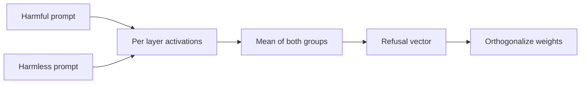
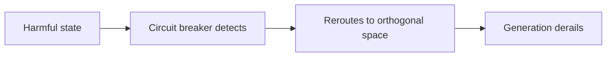

Everyone who uses a language model has hit this behavior: you make a request, and the model replies that it cannot help with that. Then you rephrase the question a different way, and it answers. The same information, denied once and delivered the next time.

The usual explanation is that a filter exists. A guardrail layer, a classifier that reads your text before the model does, or a rule written into the system prompt. That explanation is convenient because it suggests the problem can be fixed by swapping the filter.

What interpretability research revealed over the past two years is stranger. Refusal is not a filter. It is a direction in the model's internal space. And once you understand it is a direction, an uncomfortable consequence appears: removing a direction is a very cheap linear algebra operation, and that is exactly what the open weights community started doing at scale.

This article explains the mechanism, shows the formulas involved, describes the removal technique, and then looks at the other side: what gets built to defend, and what has been discovered about the side effects of touching that space.

## What refusal has to do with alignment

A base model, trained only to predict the next token, refuses nothing. It continues any text, dangerous text included, because plausible continuation is all it ever learned to do.

Refusal enters later, in post-training, and it comes from three different places that often get conflated. Supervised fine-tuning teaches the shape of refusal, showing the model many examples of a harmful question followed by a polite refusal. RLHF and DPO teach preference, showing pairs of responses and saying which one is better. And constitutional approaches, such as Anthropic's Constitutional AI, replace human harmfulness labels with a set of principles written in natural language, with the model itself evaluating responses against those principles.

The detail that matters for this article is what those methods have in common. All of them train refusal **at the surface of the text**. The learning signal comes from the tokens the model generates: the words "I cannot help with that". What happens inside the model to produce those tokens was never directly supervised.

**Types of refusal that show up in practice:**

**Safety refusal**, when a request violates a policy. That is the case this article deals with.

**Knowledge refusal**, when the model claims not to know something that falls outside its reach or its training cutoff.

**Capability refusal**, when the model says it cannot perform a task it genuinely does not perform well, such as browsing the internet or reading a file nobody provided.

A 2026 study examined the first two types together and found a result that helps explain the internal design. The two share a common refusal direction, but with an asymmetry: safety refusal transfers better to knowledge refusal than the reverse. And the differences between them appear only in the upper layers. The authors read this as the model first committing to refuse, using the shared component, and only then specifying the reason, whether missing information or policy restriction. They call it commit then specify.

## The discovery of a single direction

In 2024, a group of researchers published the work that changed the subject. The title is blunt: refusal in language models is mediated by a single direction. They tested 13 open chat models, from 1.8 billion to 72 billion parameters, across different families such as Qwen, Yi, Gemma, Llama 2, and Llama 3.

The conclusion was that a direction exists in each of those models such that:

**Erasing that direction makes the model stop refusing** harmful instructions, even ones it refused in one hundred percent of cases before.

**Adding that direction makes the model refuse harmless requests**, ordinary things it would normally answer.

One experiment makes the model say no to everything, the other makes it say no to nothing. The same vector in both directions. That is strong evidence that refusal occupies a one dimensional subspace inside activation space, which in the models tested has thousands of dimensions.

**Why refusal became a single direction.** The most accepted explanation is efficiency. Refusing is always the same move, regardless of topic: whether the request is about chemistry, about information security, or anything else, the response is the same refusal phrase. When a task always has the same output, the model tends to learn a single internal path to get there. Actually answering each question well, by contrast, is different at each layer: one resolves grammar, another retrieves facts, another organizes reasoning. Those are vectors pointing in different directions. That is why refusal stands out as a clean direction while the rest of the behavior spreads out.

It is worth noting the more recent picture, because it qualifies the discovery. Later work shows the representation of refusal is richer than a single direction. One line identifies multidimensional polyhedral concept cones, and another finds a dominant direction accompanied by several semantically distinct secondary features. The 2024 finding remains valid as a practical approximation, and it is what underpins the technique. But treating refusal as a single line is a simplification, and that will matter in the defense section.

## How the direction is extracted

The method is called difference in means. It is simple to describe and it is the heart of everything that follows.

You need two sets of instructions. One with harmful requests, another with harmless ones. The two sets must be similar in format and size, so that the only difference between them is harmfulness.

Run the model on both sets and store the internal activations. The position that matters is the last token of the instruction, and the reason is causal attention: each token only sees what comes before it, so the last token of the instruction is the only one that has already seen the whole request. The important layers are the middle to late ones, though the method computes candidates at every layer.

With the activations stored, the calculation is a subtraction of means.

$$
r = \mu_{\text{harmful}} - \mu_{\text{harmless}}
$$

**How to read that formula in words.** Add up the activations of all harmful requests and divide by the count, which gives the midpoint of what the model represents when it receives a harmful request. Do the same with the harmless ones. Subtract one point from the other. The remaining vector points along the direction in which the two groups separate.

That vector has two readings. Its **direction** says along which axis harmful and harmless requests differ. Its **size**, or norm, measures the distance between the two means, that is, how far apart the groups sit on that axis.

You do this for every layer and every token position, which produces a large list of candidate vectors. Now you need to pick one. Selection evaluates each candidate on three criteria, and this is where the technique goes from observation to engineering.

**The bypass rate**, which measures how much erasing that vector reduces refusal on harmful requests. This is what you want to maximize.

**The induce rate**, which measures how much adding that vector makes the model refuse harmless requests. It confirms the vector really does carry refusal.

**The divergence**, which measures how much the intervention disturbs the model's general behavior on ordinary tasks. This is the cost, and you want to minimize it.

When a vector is good on all three, it is that model's refusal direction. Then it gets normalized to unit length, because from that point on only the direction matters, and strength is controlled separately.

## How the direction is removed

Here is where the vocabulary from the title comes in. Abliteration is an invented word, a blend of ablation and obliteration, coined in the open weights community and popularized by a very influential tutorial published on the Hugging Face blog. The procedure has two versions, and the difference between them defines whether the change is temporary or permanent.

**The inference time intervention** works like a detour along the way. Every time some part of the model writes to the residual stream, which is the channel information travels through across layers, you compute how much of that piece points along the refusal direction and subtract that part.

$$
x' \leftarrow x - \hat{r}\,\hat{r}^{\top} x
$$

**How to read it in words.** The `r_hat` is the refusal direction already normalized to unit length. The product between it and the activation `x` gives a number, which measures how much refusal sits inside that activation. Multiplying that number by the direction returns a vector: the portion of the activation that is purely refusal. Subtracting that from `x` returns the activation without that portion. It is the operation of projecting the activation onto the refusal axis and then taking that projection out of the total.

This is done at every layer and every token position, which guarantees the direction never shows up anywhere. The advantage is being reversible: the model's weights do not change, the detour lives in memory and disappears when you remove the hook. The disadvantage is that it cannot produce a modified model you can distribute.

**Weight orthogonalization** is the permanent version, and it is what produces published checkpoints. Instead of correcting the activation on the way out, you alter the matrices that write to the residual stream, so they can never point along the refusal direction.

$$
W_{\text{out}}' \leftarrow W_{\text{out}} - \hat{r}\,\hat{r}^{\top} W_{\text{out}}
$$

**What changes relative to the previous formula.** The shape is the same, but now `W` is a weight matrix rather than an activation. Before, you cleaned the output of every computation. Now you clean the ability to perform the computation. After that change, the model has no way to write anything along the refusal direction, at any layer, by construction.

**Which matrices get altered:**

**The embedding matrix**, which turns tokens into vectors at the model's entrance.

**The attention output matrices**, which write the result of each attention layer into the residual stream.

**The dense block output matrices**, which do the same with the result of the transformation layer.

Those three are the ones that write to the residual stream. The other matrices in a transformer read from it but do not write, so altering them would not produce the intended effect.

**On the cost.** The original work reports that the attack outperforms far more expensive prompt based attack methods, and that compute cost stays under five dollars for a 70 billion parameter model. It also reports that the effect on general capabilities is small: evaluations on standard benchmarks show performance practically identical to the base model, with variation inside statistical noise. It is that combination of cheap and apparently painless that made the technique spread, and there are thousands of models with abliterated in the name published in public repositories.

## The vocabulary of those who defend

So far this article described an attack. From here on it becomes about defense, because the research response to this problem is the most interesting and least publicized part.

**Circuit Breakers** is the best known approach, also presented in 2024. The idea starts from a critique of refusal training that is worth understanding well.

The argument goes like this: traditional methods such as RLHF and adversarial training provide supervision at the output level. They teach the model to produce a safe response, but the internal state representing the harmful content is still there, merely hidden behind a refusal. As soon as an attack bypasses the refusal, the harmful state is accessible again. Refusal is a door, and behind the door the dangerous content never went anywhere.

Circuit breakers attack this at a different point. Instead of trying to plug the gaps of specific attacks, they connect the representation of the harmful process to a switch. When the model starts producing a dangerous response, the internal state is rerouted to an orthogonal space, and generation derails before reaching the content.

**The loss function that performs the rerouting:**

$$
\mathcal{L} = \mathrm{ReLU}\!\left( \frac{\mathrm{rep}_{\text{c/b}} \cdot \mathrm{rep}_{\text{orig}}}{\lVert \mathrm{rep}_{\text{c/b}} \rVert_2 \, \lVert \mathrm{rep}_{\text{orig}} \rVert_2} \right)
$$

**How to read it in words.** The cosine similarity between two vectors measures how much they point the same way, on a scale from minus one to plus one. Values near one mean aligned vectors, values near zero mean independent vectors. The ReLU function zeroes out anything negative and lets positive values through. The training objective is to push that value to zero, that is, to force the representation under attack to become orthogonal to the original representation of danger. Applying ReLU prevents the model from being optimized to align the opposite way, which would serve no purpose.

The authors tested several formulations of the same loss, including rerouting to a random vector with a large norm and rerouting to a unit norm random vector, and they report that the cosine similarity version is the most intuitive and the one that best balances robustness against preserved capability.

**Why this approach matters.** The representation that produces the harmful output is independent of the specific attack that elicited it. That makes the method attack agnostic, meaning it does not need to have seen the attack before to resist it. It is the fundamental difference between plugging known holes and making the production of harm impossible. The authors report robustness against a variety of unseen attacks, with capabilities preserved.

The same group also works on the multimodal variant, where an image based attack tried to hijack the model into producing harmful content, and the result is that the circuit breaker protects the system even when the standalone image classifier is vulnerable.

**What survives abliteration.** A 2026 study tested that question directly across a sequence of pretraining checkpoints with different safety interventions. The practical conclusion is blunt: interventions that concentrate the safety signal in one place are easy to neutralize, while interventions that spread the signal across several features are more resistant.

The stages combining several data signals were the ones that held up best, especially when they include reformulating harmful content into an educational format and tagging examples with metadata describing their purpose. That speaks directly to the single direction finding: if your alignment teaches only the style of refusal, you produced a compact and therefore removable feature. Spreading the signal is what changes the game.

**Defense against extraction.** A more recent line of work attacks the problem one step earlier. If the difficulty lies in how easy the direction is to extract, then perhaps extraction itself should be made harder. The proposal is to edit the weights by applying updates of rank higher than one, while activations that induce refusal are replaced with random values and the matrices that read those activations are corrected to preserve the original behavior. The reported effect is a measurable increase in the refusal rate after abliteration, with small capability loss on one tested model and larger on the other.

## What removing refusal breaks beyond refusal

This is the part I consider most important in this article, and it is the most recent.

The marketing promise of abliteration is surgical: remove refusal, change nothing else. A 2026 study tested that promise ingeniously. Instead of measuring capability on benchmarks, which is what earlier work did, it measured **disposition**. It used 21,600 decisions under uncertainty, weekly up and down calls on 60 stocks over 18 weeks, run through a frozen multi agent pipeline, so that the only variable was the decision model.

The subtle part of the design: the task elicits no refusal at all. The base models completed all 10,800 decisions without refusing once. So there was no refusal behavior to remove, and any difference between the arms is pure side effect.

The results replicated across two different model families. The abliterated models turned systematically more optimistic, betting on the upside in a larger share of cases. They started justifying their decisions with more text. And they reduced their use of explicit uncertainty words, replacing them with concessive rhetoric. A fourth effect flipped sign between families: the same operation left one model less confident and the other more. In other words, removing the same direction interacts differently with each base model's representation.

The authors' conclusion is worth quoting almost literally, because it sums up the problem: an uncensored model is not the base model minus refusals, it is a different decision maker.

**What that means in practice, for anyone operating models.** If you use an abliterated model as an agent, you are not using the original model with fewer restrictions. You are using a model whose disposition toward risk, incomplete information, and decision making has been measured and has shifted. In an autonomous agent setting, where the model makes decisions in chains, that optimism shift is exactly the kind of effect that shows up in no capability benchmark and does show up in real outcomes.

Worth noting as well a methodological point from the same study, for anyone reading research: the work detected two contamination channels in its initial experiments, a pair of differently quantized checkpoints and a stale chat template in a community checkpoint that silently corrupted the prompt. The lesson is that in studies of community modified models, toolchain artifact is the rule, not the exception.

## How to check whether a model was abliterated

This section is practical, and it fits entirely into a paragraph of context plus a list.

A checkpoint published with abliterated, uncensored, uncut, or something similar in the name almost certainly went through this process. But the modification can also be made without notice, and its effect does not show up in the metrics model cards usually display.

**What changes in the model's behavior:**

**The response to a request the original model would refuse.** It is the most direct test, and the hardest to evaluate objectively, because it depends on judgment.

**The refusal rate on a set of harmful prompts.** If you have a reference set, the difference between the published model and the original is the size of the effect.

**The refusal rate on harmless prompts.** Over refusal should be low in both, but a heavily abliterated model may also show altered behavior here.

**Perplexity on ordinary text.** It is the cheapest measure of coherence damage. An increase above ten percent already indicates the intervention was too aggressive.

**Divergence between output distributions.** This measures how far the model drifted from the original on general tasks, and it is more sensitive than perplexity.

**Disposition on tasks with no refusal involved.** This is the metric traditional benchmarks do not capture, and it is where side effects appear. If you have a set of repeated decisions with a verifiable answer, comparing the two models there tells you more than comparing accuracy on an exam.

## The ethical and regulatory picture, without drama

The technique is legal in most of the world, and the model is yours, so altering the weights is a technical decision like any other. But there are three points that are not drama, they are consequence.

**The license is the first limit.** Many open models ship with terms of use that forbid using the model for harmful purposes and forbid distributing derivatives that remove protections. Meta's license for the Llama family has clauses to that effect. Abliteration as a technical operation is linear algebra, but distributing the result may violate the contract. That is a legal question, not a technical one.

**Responsibility transfers to whoever publishes.** If you publish a model without refusal and someone uses it to produce harm, the liability analysis starts with whoever distributed the artifact. An open weights model with protections documented as removed is easy to trace back to its origin.

**Cybersecurity is a legitimate and unresolved case.** There is a real, acknowledged problem: safety alignment does not distinguish domains or levels of risk, and that gets in the way of people who need the model for authorized operations. A security professional asking for help analyzing malicious code under a legitimate work contract runs into the same mechanism that blocks a genuinely malicious request. The line of research into domain specific abliteration, which removes only the part of refusal corresponding to a particular subject, exists precisely to try to solve that, and it is open work.

**My position, stated as a position.** For anyone studying the subject, understanding the mechanics is what enables better defense. This article was written in that direction, and on purpose it describes the mechanism without handing over a ready to run recipe. The technique is already published, documented, and implemented in open libraries, so there is no secret to protect here. What I chose not to do is lower the barrier further.

## Conclusion

What began as an interpretability result, a direction in activation space that mediated refusal, became an engineering technique with thousands of published derivatives in under two years. The reason is the economics of it: a rank one edit, costing a few dollars, alters the safety behavior of a model whose training cost far more.

The technical lesson I take from this study is about where to put safety effort. Concentrating safety in a single signal, however well learned, produces a compact and therefore removable feature. Spreading the signal across several features, and monitoring representations rather than outputs, is what changes the economics of the attack. And the methodological lesson is that measuring capability is not measuring disposition. A model can stay identical on every exam and make different decisions in real life.

### Next steps

If you want to keep going, this is the order that makes sense:

- **Start with interpretability.** Understanding the residual stream, attention layers, and what it means to project a vector is a prerequisite for reading any of the cited work. Neel Nanda's material on the subject is the best entry point.
- **Read the original work in full.** The section analyzing how adversarial suffixes suppress propagation of the refusal direction, without using the removal method itself, connects this subject to the prompt based attacks you probably already know.
- **Study circuit breakers before removal techniques.** The idea of monitoring and rerouting representations is more general than removing a direction, and it is the one that yields defense for behaviors beyond refusal.
- **Replicate disposition measurement with your own data.** If you operate models, building a set of repeated decisions with a verifiable answer is worth more than any public benchmark for detecting behavior change.
- **Follow the domain specific abliteration line.** It has the clearest legitimate application, in cybersecurity and research, and it is the one still without a settled answer.

## Sources and further reading

Every number, dataset name, and date cited in this article comes from the references below. The technical papers are the primary sources.

- [Refusal in Language Models Is Mediated by a Single Direction](https://arxiv.org/abs/2406.11717): the work by Arditi and colleagues, published at NeurIPS 2024, which established the single direction finding and proposed the weight orthogonalization attack. Code available at [github.com/andyrdt/refusal_direction](https://github.com/andyrdt/refusal_direction)
- [Improving Alignment and Robustness with Circuit Breakers](https://arxiv.org/abs/2406.04313): the work by Zou and colleagues, also at NeurIPS 2024, proposing representation rerouting as an alternative to refusal training. Code at [github.com/GraySwanAI/circuit-breakers](https://github.com/GraySwanAI/circuit-breakers)
- [Uncensor any LLM with abliteration](https://huggingface.co/blog/mlabonne/abliteration): Maxime Labonne's tutorial on the Hugging Face blog, which popularized the term and the procedure in the open weights community
- [A Granular Study of Safety Pretraining under Model Abliteration](https://arxiv.org/html/2510.02768v1): the study comparing which safety data interventions survive abliteration, showing that combining them is more resistant
- [Abliteration Is Not a Scalpel: Off-Target Effects of Refusal Removal](https://arxiv.org/pdf/2607.17427): the 2026 study on side effects in model disposition, with the decision under uncertainty experimental design
- [Not All Refusals Are Equal: How Safety Alignment Fails Cybersecurity at Scale](https://arxiv.org/pdf/2607.02714): the study across 24 open models on domain specific abliteration and the multidimensional structure of refusal
- [A Unified Mechanistic Analysis of Knowledge- and Safety-Based Refusals](http://arxiv.org/pdf/2609.00760): the analysis separating safety refusal from knowledge refusal, with the commit then specify reading
- [Abliteration Mitigation via Refusal Aliases](https://arxiv.org/abs/2608.18093): the defense that makes extraction of the direction itself harder
- [Constitutional AI: Harmlessness from AI Feedback](https://arxiv.org/abs/2212.08073): the Anthropic work that replaced human harmfulness labels with written principles
- [Representation Engineering: A Top-Down Approach to AI Transparency](https://arxiv.org/abs/2310.01405): the work that established the field of representation engineering, the basis for both direction extraction and circuit breakers
- [Steering Llama 2 via Contrastive Activation Addition](https://arxiv.org/abs/2312.06681): the contrastive activation addition technique, a direct precursor to the difference in means method

If you work with local models and want to understand how to run and evaluate a model on your own hardware, the article on [the real cost of running a local LLM](/en/articles/custo-real-llm-local/) covers the practical decisions in that operation.