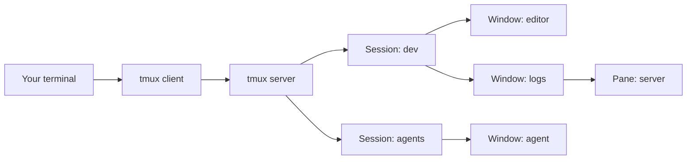
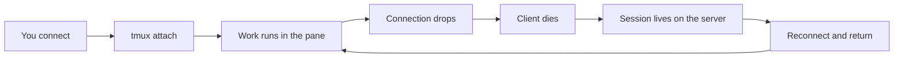

You are in the middle of a long task on a server. A build, a download, an AI agent that has been working for forty minutes. The SSH connection drops. You reconnect, and the process died with the terminal.

That scene is old, and so is the solution. Unix has had a program for this since 1987, GNU Screen. In 2007, a programmer named Nicholas Marriott decided to write his own Screen because he could no longer stand its configuration. The result is called tmux, and it became the standard terminal multiplexer of the Unix world, shipped by default on OpenBSD and in practically every Linux distribution.

If you read the post about [Herdr](/en/articles/2026-09-17-herdr-agent-multiplexer-terminal/), the multiplexer designed for AI agents, you already know the role tmux plays in that story: it is the foundation the newer tools were built on. In this post, the subject is tmux itself: what it does, how to use it, how to manage it, and why it remains essential.


## What a terminal multiplexer is

A terminal runs one program at a time. Open three emulator windows and you get three programs. The problem appears when the terminal closes: every program running there receives a hangup signal and dies with it.

The multiplexer fixes this by inverting process ownership. The program executing your commands is no longer the terminal window. It is a server that lives apart from it. The terminal becomes just a client that watches and types. Close the terminal, kill the SSH connection, shut the laptop. The server keeps everything running, and when you come back, you reconnect the client to the same session, in the same place.

That is where the name comes from: a terminal multiplexer lets many terminals live inside one. A single emulator window starts holding dozens of sessions, each with its own windows, each window with its own panes.

### The lineage: Screen, tmux and what came after

GNU Screen is the ancestor of the category, launched in 1987. It still exists and works, but the author of tmux himself described it as a program with a lot of accumulated baggage: poor documentation, a strange configuration file, and code that was hard to extend.

tmux was born in 2007 as a clean rewrite of those ideas. Nicholas Marriott's prototype was called `nscr`, a direct nod to Screen. In July 2009 it entered the OpenBSD base system, replacing the bundled `window` utility, and from there it spread across the rest of the Unix world. Today the stable version is 3.6a, from December 2025, and the project remains active.

## How tmux works inside

The architecture is client and server. The first time you type `tmux`, three things happen:

- **A server starts in the background**, owning every process from then on
- **A session is created**, with one window and one pane running your shell
- **A client connects** that session to the terminal you are in

On later calls, the `tmux` command is just a lightweight client talking to the server over a Unix socket. Sessions live on the server. The shells you open inside them are children of the server, not of your SSH connection. That detail changes everything: when the connection drops, what dies is the client. The server, the sessions, and everything running inside them stay alive.



The hierarchy has three levels. The **session** is the biggest container, the project you are working on. Inside it live **windows**, which occupy the whole screen, like tabs. Inside each window live **panes**, rectangular divisions of the screen, each running its own program.

### The prefix, the key that unlocks everything

Almost all tmux control flows through a shortcut called the prefix. The default is `Ctrl+b`. You press the prefix, release it, and then press the command key. `Ctrl+b` followed by `d`, for example, detaches the session.

The prefix exists so that tmux shortcuts do not collide with the shortcuts of the programs running inside it. It is also the biggest obstacle for beginners, because it replaces the Ctrl+c and Ctrl+v muscle memory the rest of the system uses. After a few weeks, the prefix becomes reflex.

## Sessions: the unit that matters

The session is the heart of tmux, and where the multiplexer's promise lives: your work stays alive even when nobody is watching.

### Create, list and reconnect

The one command worth memorizing:

```bash title="Create or reconnect in one step"
# Attaches if the session exists, creates it if it does not
tmux new -A -s dev
```

The `-A` flag makes the command work in both scenarios: missing session, it creates one. Existing session, it attaches. It is the perfect command to turn into a habit in your first minute after logging into a server.

```bash title="The daily life of sessions"
# List live sessions
tmux ls

# Create a named session
tmux new -s build

# Attach to a specific session
tmux attach -t build

# Attach and kick out other clients
tmux attach -d -t build
```

`tmux ls` shows the state of each session, including how many windows it has and whether any client is attached. A session shows as `attached` when someone is watching, and `detached` when it is running in the dark.

### Leave without killing

Inside a session, the polite exit is the prefix followed by `d`, for detach. The terminal hands you back a normal prompt, and the session keeps running in the background with everything inside it. This is the most counterintuitive moment for newcomers: leaving tmux does not end anything, it only switches off the monitor.

Closing the pane with `exit` or `Ctrl+d`, on the other hand, terminates that pane's shell. When the last pane of the last window dies, the session is gone. Two gestures with very different outcomes, and the difference between them is the difference between losing and not losing your work.



### Sharing a session

Two people can attach to the same session at the same time, each from a different place. What one types, the other sees, and vice versa. It is the basis of remote pair programming and guided technical support, with no screen sharing, just SSH and tmux.

## Windows and panes in daily use

Inside a session, the combination of windows and panes is what turns a terminal into a workstation.

### Windows

- **`Ctrl+b c`**: creates a new window
- **`Ctrl+b n`** and **`Ctrl+b p`**: move forward and back through windows
- **`Ctrl+b w`**: opens a browser with the window and session tree
- **`Ctrl+b ,`**: renames the current window

The status bar at the bottom of the screen lists the session's windows with their numbers. `Ctrl+b` followed by a number jumps straight to it.

### Panes

- **`Ctrl+b %`**: splits the window vertically
- **`Ctrl+b "`**: splits it horizontally
- **`Ctrl+b arrow`**: moves focus between panes
- **`Ctrl+b Ctrl+arrow`**: resizes the current pane
- **`Ctrl+b z`**: zoom, expands the pane to the full screen and back

Pane zoom deserves a highlight. `Ctrl+b z` is the balance between overview and focus: expand the pane when you need to read long output, and return to the layout when you are done. Alternating between whole and part is the most frequent gesture of tmux daily life.

### History and copying

Each pane keeps its own scrollback, configurable by line count. To navigate it, `Ctrl+b [` enters copy mode, where the arrows and `PageUp` scroll the buffer and `?` searches. `q` leaves the mode.

With `set -g mouse on` in the configuration, mouse wheel scrolling reads the history and selection copies, which softens the learning curve a lot for people coming from an ordinary terminal. From version 3.6a on, mouse behavior with full screen applications became more predictable as well.

## Managing tmux

Daily use is keyboard shortcuts. Management is a text file plus a handful of commands.

### The configuration file

Everything tmux is lives in `~/.tmux.conf`. A lean file already covers the essentials:

```bash title="A basic ~/.tmux.conf"
# Bigger scrollback per pane
set -g history-limit 100000

# Mouse: scrolling and selection
set -g mouse on

# Status bar refresh interval
set -g status-interval 5

# Reload config without leaving the session
# (prefix r, defined below)
bind r source-file ~/.tmux.conf \; display "Config reloaded"
```

Many people switch the prefix from `Ctrl+b` to `Ctrl+a`, inheriting the Screen habit. It is one line: `unbind C-b` followed by `set -g prefix C-a`. Another common customization is the status bar theme, which supports colors and its own formatting.

### Managing sessions by command

Not everything happens inside the session. From the outside, the management commands:

```bash title="Session administration"
# Rename a session
tmux rename-session -t dev frontend

# Kill a specific session
tmux kill-session -t dev

# Kill all sessions at once
tmux kill-server

# See who is attached
tmux list-clients
```

`tmux kill-session` ends the session and everything running in it, processes included. It is the cleanup command after a finished task. `tmux kill-server` brings everything down at once, useful when your session list has become a warehouse.

One management detail that catches many people: environment variables. When you reconnect to a session that was born on another machine, the old `$SSH_AUTH_SOCK` may be dead, and git fails silently when it asks for your SSH key. The fix is to refresh the session environment with `tmux set-environment`, or open a new pane, which inherits the updated environment.

### Plugins: TPM, resurrect and continuum

The plugin ecosystem revolves around TPM, the Tmux Plugin Manager. Installed with a `git clone` into `~/.tmux/plugins/tpm`, it fetches and loads plugins from lines in the `.tmux.conf`.

```bash title="Persistence plugins in .tmux.conf"
set -g @plugin 'tmux-plugins/tpm'
set -g @plugin 'tmux-plugins/tmux-resurrect'
set -g @plugin 'tmux-plugins/tmux-continuum'

# Restore the environment by itself when the server starts
set -g @continuum-restore 'on'

# Initialize TPM (last line of the file)
run '~/.tmux/plugins/tpm/tpm'
```

The pair `tmux-resurrect` and `tmux-continuum` attacks tmux's biggest limitation. By default, sessions live in memory, and a system reboot takes everything down. `tmux-resurrect` saves the full environment, sessions, windows, panes, layouts and working directories, and restores it afterwards. `tmux-continuum` automates the cycle, saving every 15 minutes and restoring by itself when the tmux server comes back.

With that combination, the session survives even a reboot. With one honest caveat: what the plugin restores are layouts and a conservative list of programs, like `vim` and `htop`. An arbitrary process in the middle of a task does not resume where it stopped.

## Tmux in the age of AI agents

Here the context connects with the post about [Herdr](/en/articles/2026-09-17-herdr-agent-multiplexer-terminal/). When we covered that multiplexer, the starting problem was this: running one AI agent in a terminal is easy, but running several, on different machines, knowing which one is waiting for you, is a problem the ordinary terminal does not solve.

tmux is the fundamental half of that solution. An AI agent is an interactive terminal program, and interactive programs do not survive `nohup`: the process stays alive, but with no terminal to draw on, and there is no way back in. Inside a tmux session, the agent keeps working when you disconnect, and `tmux attach` returns the view of everything it did while you were away.

That is why a large share of today's agent orchestration tools are, at their core, tmux wrappers. Projects like `ccmux` and `fleetmux` invented nothing in the persistence layer: they create tmux sessions with predictable names tied to each project, automate the reconnect, and add control over many sessions at once. tmux is the infrastructure; they are the convenience layer.

### What tmux does not do

The limitation that opens room for Herdr is the one we already know: tmux treats every process as anonymous. To it, an AI agent is the same as `htop` or `tail`. There is no native notion that this pane is working, or blocked waiting for your answer, or finished. Discovering the state means looking into each pane, one by one.

That is exactly the gap Herdr addresses, with state detection for each pane, an API that lets agents coordinate themselves, and a one step remote connect command. The two tools do not compete: Herdr even runs inside tmux itself. The natural path is to learn tmux first, because the mental model of sessions, windows and panes is the same in both, and add Herdr when your collection of agents grows.

## Advantages and limitations

**Advantages**

- **Persistence**: sessions survive disconnects, machine switches and SSH drops
- **Density**: dozens of programs in one terminal, organized into sessions, windows and panes
- **Portability**: it is in the OpenBSD base system and in every Linux distribution repository, and serves macOS via Homebrew
- **Lightweight**: a small binary written in C, with no graphical environment dependency
- **Scriptability**: every operation has a shell command, which makes full terminal automation possible
- **Sharing**: shared sessions for pair programming and support, with just SSH
- **Community**: decades of ready made configurations, themes and plugins

**Limitations**

- **Learning curve**: the prefix model demands memorization, and the default shortcuts are not intuitive
- **Its own configuration language**: the `.tmux.conf` is a mini language, and deep customization costs time
- **Anonymous processes**: no understanding of what runs in each pane, which is what Herdr solves
- **Memory only**: sessions die on reboot, and the persistence plugins restore layouts, not arbitrary processes
- **No native remote client**: connecting to a session on another server means wrapping everything in SSH by hand

## Installation and first steps

On Debian and Ubuntu distributions:

```bash title="Installing on Debian or Ubuntu"
sudo apt update
sudo apt install tmux
tmux -V
```

On macOS, with Homebrew:

```bash title="Installing on macOS"
brew install tmux
```

On OpenBSD, tmux ships with the system, since 2009. Nothing to install.

The first minute, the full script:

```bash title="The first minute script"
# Create the project session (or reconnect if it exists)
tmux new -A -s dev

# Split the screen into two panes
# Ctrl+b %  (vertical)
# Ctrl+b "  (horizontal)

# Create a new window
# Ctrl+b c

# Leave without ending anything
# Ctrl+b d

# See what kept running
tmux ls

# Come back
tmux attach -t dev
```

With that you already have the core value of the tool in five commands. The rest, copy modes, popups, themes, plugins, can come in as the need appears.

## Links and documentation

- Project page and manual: [tmux.app](https://tmux.app) and [man.openbsd.org/tmux](https://man.openbsd.org/tmux)
- Official repository: [github.com/tmux/tmux](https://github.com/tmux/tmux)
- Plugin manager: [github.com/tmux-plugins/tpm](https://github.com/tmux-plugins/tpm)
- Session persistence: [github.com/tmux-plugins/tmux-resurrect](https://github.com/tmux-plugins/tmux-resurrect) and [github.com/tmux-plugins/tmux-continuum](https://github.com/tmux-plugins/tmux-continuum)
- The next step in the lineage, with agent detection: the post about [Herdr](/en/articles/2026-09-17-herdr-agent-multiplexer-terminal/)

## Conclusion

tmux solves a problem the terminal never solved on its own: keeping work alive while you are not watching. The client and server architecture, created in 2007 as a clean reaction to GNU Screen, proved so right that it became a foundation: today's AI agent orchestrators are layers built on tmux sessions, not replacements for them.

For anyone managing servers, it is the tool that turns an unstable connection into a footnote. For anyone running agents, it is the layer that keeps work happening when nobody is watching. And for anyone learning it now, the path is short: one command to create, a prefix to navigate, one detach to leave. The rest comes with use.