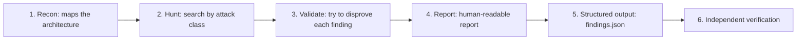
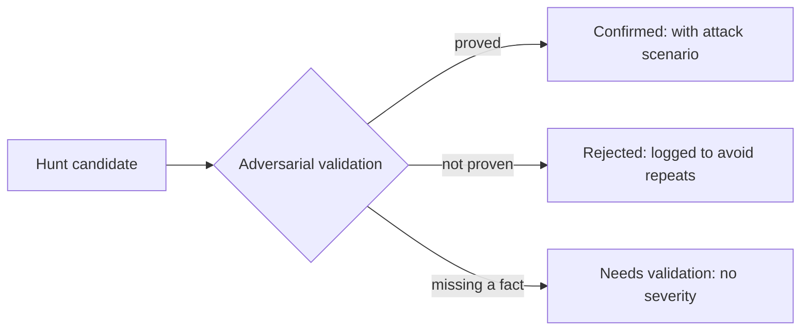

Your coding agent writes hundreds of lines a day. It creates routes, queries databases, receives user requests, and handles credentials. Who audits all that? Security review is the task nobody gets to do calmly, and the AI agent itself is terrible at judging its own work: when you ask it to review the code it just wrote, it approves almost everything.

In June 2026, Cloudflare published a post called [Build your own vulnerability harness](https://blog.cloudflare.com/build-your-own-vulnerability-harness/) describing how it solved this internally. On the same day, it opened the repository with the system's core piece: the [security-audit-skill](https://github.com/cloudflare/security-audit-skill) skill, under the MIT license. In September, the tool reached the top of GitHub Trending and the Hacker News front page.

The idea in one sentence: you install a package of instructions into your coding agent, and it starts running a structured security audit on your project, with real methodology and findings you can actually verify.

## First, what is a "skill"

The name may sound odd, so let's unlock the jargon before moving on. An agent skill is simply a set of text instructions the agent loads when a request relates to the topic. In this skill's case, the package is a set of Markdown files containing a complete audit methodology: how to map the application, where to hunt for weaknesses, how to check every finding, and how to write the report.

It is like handing your IT intern the procedural manual of a veteran security auditor. The intern is still an intern, but now works following a proven method instead of improvising.

This fixes a known defect: a loose agent without guardrails audits badly. Cloudflare's own documentation gives the examples. The agent modifies the code so its attack works, then announces victory. Or it writes a test proving that `eval()` executes code and proudly concludes it found a critical vulnerability. With the skill, the process stops being improvisation and becomes procedure.

## Where it came from: the harness with 7,245 findings

The skill was not born for the public. It was the seed of an internal Cloudflare system, the vulnerability harness, which grew to sweep 128 company repositories. The numbers disclosed in the post show the funnel:

1. 20,799 raw candidates generated by the hunting agents
2. 12,057 survived the first validation
3. 5,442 were duplicates and got discarded
4. 7,245 findings reached the engineering teams for fixing

What Cloudflare released is the seed, cleaned up and portable. The authors state that most of the value lives in the instructions, and that they barely changed when they became the internal system. The version you install today has six phases, about 600 lines of methodology files, and two validators in JavaScript with no external dependencies.

## The six phases of the audit

When you request an audit, the agent does not scan the code on a whim. It follows a pipeline in six steps, each with a clear goal.



Each phase deserves an analogy to make it stick.

**Recon.** Research agents map the application: who the actors are, where the trust boundaries sit, which surfaces receive external data. The result is an `architecture.md` file. It is the city map before the investigation starts.

**Hunt.** Several hunter agents, each isolated from the others, attack the code from different angles: injection, access control, business logic, cryptography, feature abuse, and chained attacks. There are dedicated files per target family: native code and binaries, applications backed by an LLM, HTTP protocol and authentication, and the browser side. Each hunter may spawn subagents to dig deeper.

**Validate.** Here lies the masterstroke. For every candidate found, a fresh agent that took no part in the hunt receives the task of trying to refute it. The one who accuses is not the one who judges. This kills false positives before they reach you.

**Report.** The system produces `REPORT.md`, readable for humans, and `FINDINGS-DETAIL.md` with technical traces for MEDIUM and above findings.

**Structured output.** Findings become a `findings.json` that conforms to a JSON schema published in the repository itself. A validator with no dependencies, `validate-findings.cjs`, checks the file's structure. You can read this JSON with any tool, feed a dashboard, or open issues automatically.

**Independent verification.** Fresh agents check, one by one, whether every claim in the structured output is true against the actual source code. Only then does the cycle close.

## Installing the skill

Installation is one command, using the Vercel Labs skills CLI. In your project's directory:

```bash
npx skills add https://github.com/cloudflare/security-audit-skill --skill security-audit
```

For an install at the user level, available in any project on the machine, add the global flag:

```bash
npx skills add https://github.com/cloudflare/security-audit-skill --skill security-audit --global
```

There are two requirements:

1. **A coding agent with tool support and parallel subagents.** Claude Code and Codex are the cases reported by the community. The model must be able to delegate tasks in parallel, because the hunting phases depend on it.
2. **Node.js**, only for the phase 5 schema validator.

The CLI detects which agent you use and installs the files in the right place, typically a `skills/` folder inside the agent's configuration. From then on, the instructions are available to any request that matches the topic.

## Using it in practice

There is no special subcommand to memorize. You open the agent in the project and make a request in natural language:

```text
security audit this codebase
```

```text
find security vulnerabilities in ./src
```

```text
do a security review, output to ~/audits/my-project
```

The skill activates on its own when the request mentions a security audit, a search for vulnerabilities, or a pen-test of the code. If you do not name an output directory, it asks, and the default is to write outside the repository, into `~/security-audit-skill/`. That decision is deliberate: the report does not dirty the project, and an audit folder never lands in a commit by accident.

Run size is controlled by profiles. The `quick` profile is for a first look. `standard` is the default. `deep` exists for large and critical systems, the kind of run that at Cloudflare can consume 14 hours on a large repository. You can also set a budget in agent calls. If the budget cannot even cover reconnaissance and validation, the skill refuses the run and explains why, instead of delivering an unverified report.

A security detail deserves the spotlight: the skill refuses to execute the audited code without a sandbox at the OS level, with the network cut off, the target protected against writes, and CPU and memory limits. Without a sandbox, findings that require execution stay flagged for manual validation, instead of the agent running production code on your machine.

## A real example: 24 minutes and 24 agents

The One blog ran the skill against NodeGoat, an intentionally vulnerable application maintained by OWASP, the open reference project for web application security. The defined target was the server side, 1,527 lines of code. The run's result:

1. 24 agents worked for 24 minutes
2. 8 candidates went through the full funnel
3. 5 confirmed, 2 flagged for manual validation, 1 rejected

Among the confirmed was a critical injection vulnerability: a route handler passed request body fields straight into Node.js `eval()` before any validation. The report came with the complete trace, from the registered route to the exact line where attacker input becomes executed code. A run on a small, intentionally vulnerable app found what it was supposed to find, with verifiable evidence.

## The three possible verdicts

Every finding leaves the funnel with one of three seals, and the difference between them is the most instructive part of the tool.



**Confirmed** requires a concrete attack scenario and an observed result, with a trace in the code. **Rejected** is not waste: it stays logged so the next run does not waste time again. **Needs validation** names exactly which fact is missing, and it cannot carry any severity, so nobody gets scared by a gravity number without proof.

This discipline comes from a declared principle in the manual: only report what you can exploit. "An attacker could theoretically..." does not count as a finding. And severity is not distance from a checklist: it is likelihood multiplied by impact.

## What it delivers that is good

1. **Zero cost and open source.** MIT, Markdown files, and two JavaScript validators. No service to subscribe to, no key to register, no account to create.
2. **Real methodology, not a common code review.** The agent leaves "reviewer" mode and enters auditor mode, with coverage organized by attack classes.
3. **False positives stay under control.** Adversarial validation, with a fresh agent trying to disprove each candidate, is the mechanism that separates noise from finding.
4. **Output readable by machines.** `findings.json` follows a published schema validated by a script, so you can hook it into issues, dashboards, and CI without writing a parser.
5. **Runs add up.** Each run reads previous reports, avoids repeating known findings, and aims at the remaining gaps. According to the authors, a single run finds roughly half the total, so running more than once is part of the method, not waste.
6. **Guardrails included.** It refuses to execute code without a sandbox, refuses an insufficient budget to verify, and keeps output outside the repository.
7. **Agent agnostic.** The instructions talk about a "parent agent", a "delegation tool", and research and hunt roles, without locking to one product. The installer adapts to the agent you already use.

## Limitations you need to know

**It is not a dependency scanner.** Tools like `npm audit` cross your libraries against databases of known CVEs. The skill does not look at that world: it hunts flaws in YOUR code. The two are complementary, not competitors.

**It is not a pull request checkpoint.** A full audit consumes time and tokens; at Cloudflare, long runs reach 14 hours. Healthy use is periodic, not every PR. To review diffs on every PR, Anthropic itself maintains a separate security reviewer for Claude Code.

**One run is half the story.** The manual itself warns: run more than once. Each run explores different paths and reads what previous ones found.

**Verifier independence is instructed, not enforced.** The manual requires the validating agent to differ from the hunter, but what enforces isolation is your agent's orchestrator, and Cloudflare did not publish theirs. On agents without solid subagent support, the promise gets weaker.

**It needs a sandbox for the executable part.** Without isolation at the OS level, findings that require running code stay pending manual validation.

## To start today

The minimum roadmap, from zero to the first report:

1. Install the skill with the `npx skills add` command at the project root
2. Open the coding agent in the project
3. Request a `quick` profile audit scoped to what matters most, for example the authentication or export layer
4. Read `REPORT.md` and `FINDINGS-DETAIL.md` with the same care
5. Run a second time after fixing, and compare the findings

The ideal starting point is a project you already know: that way you can judge whether the findings make sense, which is exactly the skill no tool replaces.

## Official links

- Skill repository: [github.com/cloudflare/security-audit-skill](https://github.com/cloudflare/security-audit-skill)
- Source post: [Build your own vulnerability harness](https://blog.cloudflare.com/build-your-own-vulnerability-harness/)
- Installation CLI: [skills.sh](https://skills.sh)
- Real case with NodeGoat: [One blog](https://www.withone.ai/blog/cloudflare-security-audit-skill-one-cli)
- Independent coverage: [korben.info](https://korben.info/en/cloudflare-launches-ai-security-audit-skill.html)

The Cloudflare research team's contact for the topic: `security-ai-research@cloudflare.com`.

## Conclusion

The Cloudflare Security Audit Skill packages a lesson the last few months of AI agents have reinforced: an agent cannot be both judge and defendant of its own work. Adversarial validation, with a fresh agent trying to disprove every candidate, turns the famous AI code review into something with method, evidence, and verdict.

For application maintainers, the entry cost is low: one install command and one request in English or Portuguese. The return is a map of your project's exploitable weaknesses, in a format you can verify, register, and rerun. It does not replace dependency scans or vigilance on every PR, but it fills the gap none of those cover: the hole in your own code, found by a real audit method.
