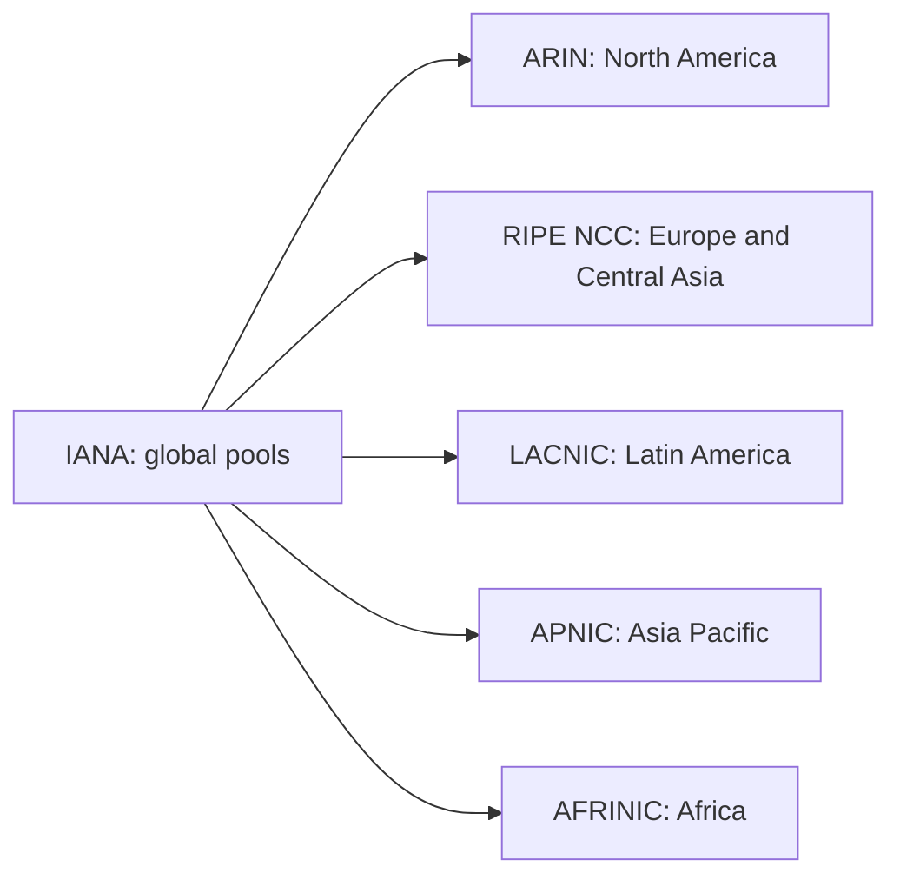
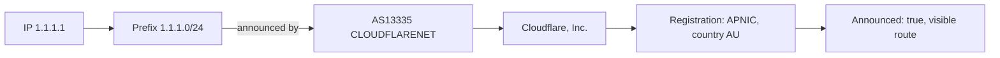

Every web security service makes the same promise: "this IP comes from Brazil", "this login came from another country". Blocking by geography, VPN detection and fraud prevention all depend on that information. But where does it come from? Who decides that an address belongs to a country? And how do you find out which company operates any given IP?

The answer is a chain of records that has sustained the internet since before it went public: IANA, RIRs, CIDR blocks, ASNs and BGP announcements. This guide walks the whole chain, with commands you can run in your terminal right now. In part 2, we build on this foundation to understand how VPN detection actually works.

## "Belongs" means three different things

The first discovery is that the question "who owns this IP?" has three answers, and mixing them up is the source of almost every misinterpretation.

1. **Registration.** Who the official registry lists as the holder of the range. It is public, verifiable, and the source this article is built on.
2. **Route.** Who is announcing the range in the global routing table, that is, who actually answers for it in practice.
3. **Location.** Where the machine using the IP sits. Nobody registers that; it is an estimate.

When a system says "IP from Brazil", it is usually speaking of answer 3, a guess built on top of answer 1. Understanding the difference is what separates people who use geolocation databases from people who understand what those databases do.

## The distribution tree: IANA and the five RIRs

At the top of the chain sits the IANA (Internet Assigned Numbers Authority), the authority that administers the global address pools. In the current model, IANA normally does not hand out addresses directly to companies or end users: it distributes large blocks to five regional organizations, the RIRs (Regional Internet Registries), each covering a part of the world.



Each RIR keeps the registry for its region and hands ranges to ISPs, companies and governments, which may delegate smaller blocks to customers. The addresses you will use in the lab:

1. [IANA](https://www.iana.org/assignments/ipv4-address-space) keeps the complete map of the IPv4 space
2. [ARIN](https://www.arin.net), [RIPE NCC](https://www.ripe.net), [LACNIC](https://www.lacnic.net), [APNIC](https://www.apnic.net) and [AFRINIC](https://www.afrinic.net) publish their public registries
3. Brazil belongs to the LACNIC region, but note: Brazilian ranges also appear in other RIRs' files, from transfers and historical registrations

Between the RIR and the final customer there is often one more step: the LIR (Local Internet Registry), typically the ISP that receives ranges from the RIR and redistributes them among its customers. The distinction shows up in the files themselves: status `allocated` marks blocks handed to a provider to distribute, and `assigned` marks blocks the receiving organization uses directly.

## CIDR: the notation that describes blocks

Addresses are not handed out one by one. They come in blocks, described by CIDR notation (Classless Inter-Domain Routing). The number after the slash says how many bits, counting from the left, are fixed in the address.

A `/24` fixes the first 24 bits and leaves the last 8 free: 256 addresses. A `/20` leaves 12 free: 4,096 addresses. A `/16` leaves 16: 65,536. The whole IPv4 space is a `/0`: about 4.3 billion addresses.

The two most famous blocks on the internet serve as examples:

1. `8.8.8.0/24` and `8.8.4.0/24`, the prefixes containing Google's public DNS resolvers (`8.8.8.8` and `8.8.4.4`)
2. `1.1.1.0/24` and `1.0.0.0/24`, the prefixes containing Cloudflare's (`1.1.1.1` and `1.0.0.1`)

Keep one detail that trips everyone up in RIR files: the meaning of the size field depends on the resource type. For IPv4, it records the number of addresses; for IPv6, the prefix length; for ASNs, the number of numbers the record covers. The line `1.0.16.0|4096` describes a `/20`, because 4,096 is 2 to the power of 12.

## The official registry: the delegated files

Every RIR publishes, as plain text, the complete list of everything it has delegated: IPv4 and IPv6 ranges and ASN numbers. These are the "delegated" files, updated continuously, in the standard format agreed among the RIRs. Each line is one record:

```text
apnic|JP|ipv4|1.0.16.0|4096|20110412|allocated|A92D9378
```

Reading the line, separated by pipes:

1. Source registry (`apnic`)
2. Registration country code (`JP`)
3. Type (`ipv4`, `ipv6` or `asn`)
4. Starting address of the block
5. Count, with a meaning that depends on the type: number of addresses for IPv4, prefix length for IPv6, number of numbers for ASN
6. Registration date
7. Status (`allocated`, `assigned` or others)
8. Opaque record identifier

For Brazil, the ranges sit mostly in the LACNIC file. Here is a Brazilian line from the RIPE file, common in transfers between regions:

```text
ripencc|BR|ipv4|93.158.236.0|1024|20080530|allocated|6515cb6f-...
```

It is this set of five files that answers, at the source, the question "which ranges are registered in each country". These records are one of the main public sources for linking addresses to organizations and countries, and geolocation databases complement them with other sources and measurements.

## IP → ASN: finding out who announces

An ASN (Autonomous System Number) is the number of an autonomous system: a set of ranges operated under a single routing policy. ISPs, clouds, universities and large companies each have their own. It is the first shortcut to answer "who operates this IP".

Team Cymru runs a specialized whois service for this translation. macOS ships with the `whois` client, so the command works with nothing installed:

```bash
whois -h whois.cymru.com " -v 8.8.8.8"
```

Real output of this command, captured while preparing this article:

```text
AS      | IP      | BGP Prefix   | CC | Registry | Allocated  | AS Name
15169   | 8.8.8.8 | 8.8.8.0/24   | US | arin     | 2023-12-28 | GOOGLE - Google LLC, US
```

One line answers everything: the ASN (15169), the announced prefix, the registration country (US), the RIR (arin) and the organization. The same path via JSON API, with no key and nothing to install, is RIPEstat, RIPE NCC's public data service:

```bash
curl -s "https://stat.ripe.net/data/network-info/data.json?resource=8.8.8.8"
```

```json
{
  "data": {
    "asns": ["15169"],
    "prefix": "8.8.8.0/24"
  }
}
```

## Delegated prefixes and announced prefixes

Here is the distinction that closes the routing cycle. Holding a registered range and announcing the range are different events, carried out by different systems.

Registration is paperwork: it says the range belongs to an organization. Announcement is practice: in BGP (Border Gateway Protocol), the protocol that connects the internet's autonomous systems, each ASN announces the prefixes it serves, and those declarations spread from router to router until they form the global table. Services such as RIPE RIS and Route Views watch this propagation, and [bgp.tools](https://bgp.tools) presents the result in a browsable form.

RIPEstat returns both states together. Querying Cloudflare's prefix:

```bash
curl -s "https://stat.ripe.net/data/prefix-overview/data.json?resource=1.1.1.0/24"
```

```json
{
  "data": {
    "announced": true,
    "asns": [
      { "asn": 13335, "holder": "CLOUDFLARENET - Cloudflare, Inc." }
    ]
  }
}
```

The `announced: true` field is the practical proof: the range is registered at APNIC **and** announced in the global table by AS13335. The correct link is this: the ASN **originates** the prefix, that is, announces it as its own. Announcing does not imply ownership of the registration, and a single range can even be originated by more than one ASN, a configuration known as MOAS. The reverse also exists and is common: registered ranges that are never announced, whether idle, reserved for expansion or simply forgotten. Without a route propagated to a given network, that network has no BGP path to reach the prefix: the paperwork alone routes nothing.

## ASN → Organization

From ASN to company name, the path is the RIR registry. The `holder` RIPEstat returns is already a summary, and the RIR's whois gives the full record, with administrative contact and address. The modern interface to whois is RDAP, the protocol that returns JSON and progressively replaces the old text format, reachable from any HTTP client.

For infrastructure networks, [PeeringDB](https://www.peeringdb.com) adds operational context: where the network has presence, which internet exchange points it participates in, and its peering policy. It is not an official registry of IP resources. It is a collaborative directory widely used by the industry to publish exactly that kind of information.

## Registration country is not physical location

Now the debunking that justifies this article. The country code in the delegated files is tied to the administrative allocation of the resource: the country where the organization was registered when it received the range. It is not where the server is. It is not where the user is. And international transfers of resources can put the paperwork even further away from operational reality.

The two most famous resolvers in the world prove the point in pairs.

`8.8.8.8` is registered at ARIN, in the United States, as we saw. But it uses anycast: different facilities announce the same address, and BGP routing steers your query to one of them according to policies and available paths, often a facility nearby in network topology, not necessarily the geographically closest one. The machine answering may sit in a point of presence relatively close to you; the IP by itself does not reveal which facility served you.

`1.1.1.1` deepens the case. The APNIC whois describes the block like this:

```text
inetnum:    1.1.1.0 - 1.1.1.255
netname:    APNIC-LABS
descr:      APNIC and Cloudflare DNS Resolver project
descr:      Routed globally by AS13335/Cloudflare
country:    AU
source:     APNIC
```

The registration country is `AU`, Australia, because the administrative record of the block sits at APNIC. It was a research prefix reserved by APNIC's regional policy (proposal prop-109, from 2014) and put into a cooperation arrangement for the project with Cloudflare launched in 2018. The service is operated globally by the American network Cloudflare, and the server answering your query is, with high probability, closer to you than to the Pacific.

Geolocation databases, such as MaxMind's GeoLite2, try to estimate physical location by combining these records with other clues. They inherited exactly this limitation: when someone says an IP "is from Brazil", the claim may mean the company holding the range is registered here, that the BGP announcement comes from here, or that some measurement suggested physical presence. Three pieces of evidence of different quality.

## Lab: the whole chain in your terminal

No command in this section requires installation on macOS: `curl`, `whois`, `dig` and `grep` ship with the system. The full chain of questions, in order:

```bash
# 1. Registration country and ranges: download your region's delegated file
curl -s "https://ftp.apnic.net/stats/apnic/delegated-apnic-extended-latest" | grep "|JP|ipv4|" | head -5

# 2. IP -> ASN, prefix, registration country and organization
whois -h whois.cymru.com " -v 8.8.8.8"

# 3. The same, as JSON, via RIPEstat
curl -s "https://stat.ripe.net/data/network-info/data.json?resource=8.8.8.8"

# 4. Is the prefix announced? By which ASN?
curl -s "https://stat.ripe.net/data/prefix-overview/data.json?resource=1.1.1.0/24"

# 5. Who answers for this IP? Reverse DNS gives the first clue
dig -x 8.8.8.8 +short

# 6. The official record, in the modern JSON format (RDAP)
curl -s "https://rdap.arin.net/registry/ip/8.8.8.8"
```

The reverse DNS from command 5 returns `dns.google.`, and this clue is more powerful than it looks: reverse names often reveal the machine's function, not just its company, which is the first step of the infrastructure classification we explore in part 2. The RDAP from command 6 returns the record of the resource as JSON. Real fields from the response:

```json
{
  "name": "GOGL",
  "type": "DIRECT ALLOCATION",
  "startAddress": "8.8.8.0",
  "endAddress": "8.8.8.255",
  "handle": "NET-8-8-8-0-2"
}
```

Compare the three sources of the chain: **RDAP** shows the resource's registration, **RIPEstat and BGP** show observed routing, and **GeoIP** only estimates location. Every question has its own tool.

## The full chain on a real address

We close with `1.1.1.1`, walking every step with real data.



Reading it in order:

1. The IP falls into a prefix, `1.1.1.0/24`, described by CIDR notation
2. The prefix is announced, or originated, by AS13335, operated by Cloudflare
3. The ASN is associated with an organization, Cloudflare, Inc.
4. The prefix is registered at APNIC, with registration country AU
5. The prefix is announced in BGP and its route is visible on the internet; effective connectivity depends on how every other network propagates and accepts that route

Five questions, five verifiable answers, three different sources that confirm each other. It is this machinery, not a magic database, that supports all IP classification.

## Which source answers which question

The whole chain fits a list of questions and sources, for later reference:

1. **Who received the block?** The RIR record, via whois or RDAP
2. **Which country is tied to the registration?** The RIR delegated file
3. **Which prefix contains this IP?** The RIR, RIPEstat or the BGP table
4. **Which ASN originates the prefix?** Observed BGP, via RIPEstat or bgp.tools
5. **Which organization is associated with the ASN?** The RIR, via RDAP, with PeeringDB as a complement
6. **Where are the user or the server physically?** GeoIP and measurements: always an estimate
7. **Is this IP from a VPN, proxy or Tor?** IP intelligence and reputation, the subject of part 2

## Official links

- Complete IPv4 space map: [IANA](https://www.iana.org/assignments/ipv4-address-space)
- Delegated files: [APNIC](https://ftp.apnic.net/stats/apnic/), [RIPE NCC](https://ftp.ripe.net/pub/stats/ripencc/), [ARIN](https://ftp.arin.net/pub/stats/arin/), [LACNIC](https://ftp.lacnic.net/pub/stats/lacnic/), [AFRINIC](https://ftp.afrinic.net/pub/stats/afrinic/)
- RIPE NCC data API: [stat.ripe.net](https://stat.ripe.net)
- Team Cymru's ASN service: [whois.cymru.com](https://www.team-cymru.com/ip-asn-mapping)
- Browsable routing table: [bgp.tools](https://bgp.tools)
- Operational atlas of networks: [PeeringDB](https://www.peeringdb.com)
- Free geo-location database: [MaxMind GeoLite2](https://dev.maxmind.com/geoip/docs/databases/geoip2/)

## Conclusion

The chain is short to tell and deep in consequences: IANA divides the space among five RIRs, the RIRs register ranges by country in public files, ASNs announce those ranges in BGP, and organizations sign everything with their registrations. "Belongs" becomes three separate questions, registration, route and location, and each has its own source.

And the chain has one more step. Knowing which ASN originates a prefix raises the next question: is that ASN authorized by the resource holder to originate it? That is the territory of RPKI (Resource Public Key Infrastructure), the key infrastructure that signs BGP announcements, and it deserves an article of its own.

In part 2, this foundation goes to the field: why VPNs live on hosting ASNs, why your VPN's ASN is not your VPN's name, and how detection systems combine registries, routes and reputation to guess what you are using. The chain you just learned is exactly what those systems query.
