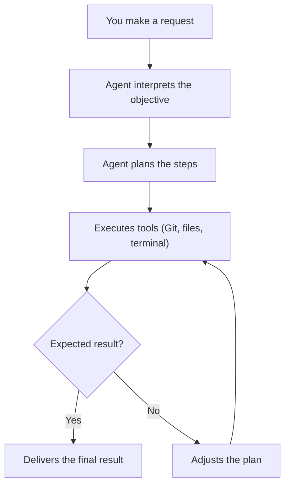
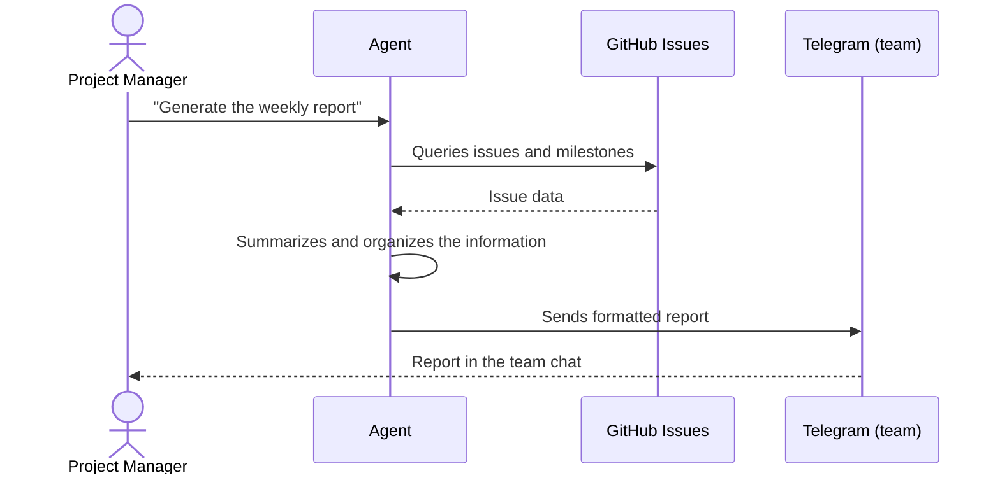
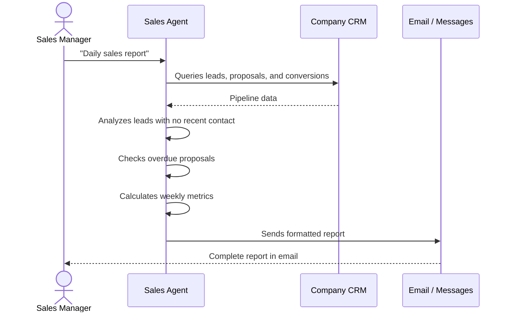

## What are autonomous AI agents

Imagine you could hire an assistant that never sleeps, never takes vacation, and handles repetitive tasks without constant supervision. An autonomous AI agent is exactly that: a program that uses language models (LLMs) to reason, plan, and act without depending on human commands at every step.

Unlike a chatbot that only answers questions, an agent operates in cycles. It receives an objective, analyzes the context, decides which tools to use, executes the action, observes the result, and adjusts the plan if needed. This loop of thought, action, and observation is what gives it autonomy.

## Why you need agents

Modern work demands constant attention to repetitive tasks. A developer spends hours opening pull requests and running tests. A project manager tracks deadlines and writes reports by hand. A sales administration professional monitors sales spreadsheets, organizes client contacts, generates proposals, and analyzes performance numbers.

Each of these tasks consumes time that could be spent on more complex problems. AI agents do not replace people. They take on the tedious, repetitive work. This way you can focus on what truly requires human judgment.

Below are three practical examples. Each shows how to create agents for different roles.

---

## Case 1: The technical coding agent

### The problem

A developer needs to review code, run tests, create Git branches, and open pull requests several times a week. Each PR follows the same process: create a branch, commit, push, open the PR, and wait for review. This manual flow repeats and is easy to automate.

### The solution

An agent that receives task descriptions in natural language, creates Git branches, writes code, runs tests, and opens pull requests on its own. It uses the terminal for Git commands, an editor to modify files, and the GitHub API to create PRs.

### Practical example with Hermes Agent

The Hermes Agent (the tool I am using right now to write this article) is a real example of an autonomous agent for code. You can make a request like this:

```
Update the local repository, create an article about
AI agents, and open a pull request.
```

The agent executes each step. It fetches the latest changes from GitHub, creates the article file with valid frontmatter, validates the Astro project build, commits on a new branch, and opens the PR. All in seconds. The developer does not need to remember every Git command.

### How this works in practice

Notice that you do not need to know how to program to use an agent like this. You give the instruction in plain language, and the language model behind the agent interprets, plans, and executes each step on its own. The Hermes Agent, for example, is built with ready-made tools you can install and configure without writing code.

The code blocks that appear below are only meant to illustrate the logic the language model follows internally. It is not you who needs to create that code. The model itself generates and executes equivalent instructions to carry out the tasks. Think of them as a demonstration of what happens "inside the box".

### Agent components

To build a coding agent like this, you need:

1. **A language model**: the intelligence that understands what you ask and plans the steps.
2. **Tools**: access to the file system, terminal, Git, and the GitHub API.
3. **Execution loop**: the agent thinks, acts, observes the result, and repeats until it finishes.
4. **Memory**: it knows what it did in previous steps so it does not repeat actions.



### Illustration of the code the model generates internally

When you ask the agent to "list the files in the current directory", the language model, behind the scenes, uses a mechanism similar to the code below to decide which command to run:

```python
# This code is generated and executed by the language model,
# not by you. It illustrates how the agent decides what to do.
import subprocess
import json

def run_command(command):
    result = subprocess.run(
        command, shell=True, capture_output=True, text=True
    )
    return result.stdout

# The model receives the instruction and identifies that it needs
# to run "ls" or "dir" to answer
command = "ls -la"
print(run_command(command))
```

The example above is simplified. In practice, the model chooses among several available tools, runs the most suitable one, analyzes the result, and decides whether it needs more actions or can already deliver the answer. All of that reasoning happens automatically.

---

## Case 2: The project manager agent

### The problem

A project manager tracks deadlines, sends progress reports, organizes meetings, and delegates tasks. These activities follow predictable patterns and consume hours every week.

### The solution

An agent that queries project tools like GitHub Issues, Jira, or Trello. It summarizes weekly progress, identifies overdue tasks, and sends reports to the team automatically.

### Practical usage example

A project manager can configure an agent that runs every Monday morning. It does the following:

1. Queries all open issues in the repository.
2. Checks which deadlines are near.
3. Counts how many pull requests are waiting for review.
4. Generates a summary and sends it to the team channel on Telegram.

The command would be something like:

```
Agent, generate the weekly project report.
Summarize open issues, upcoming deadlines,
and pending PRs. Send the summary to the team.
```

### Project agent flow



### Structure of the generated report

The agent produces something like:

```
Weekly Report - Project X
Period: August 11 to 18

Open issues: 12
  - 3 due by this Friday
  - 2 blocked waiting for review
  - 7 in progress within deadline

Pending pull requests: 4
  - 2 waiting for review for over 2 days
  - 1 in review
  - 1 waiting for tests

Tasks completed this week: 8
Next milestone: Sprint 24 (due 08/25)
```

This eliminates the need to open several browser tabs, run manual queries, and format text. The agent consolidates everything in seconds.

### Required tools

To create a project agent, you need integrations with:

- **GitHub API** or **GitLab API**: to read issues, milestones, and merge requests.
- **Calendar API**: to check holidays and deadlines.
- **Messaging platform**: Telegram, Slack, or email to deliver reports.

And most importantly: you do not need to integrate anything manually. Just describe what you need in natural language and the agent figures out which APIs to query and how to format the response.

---

## Case 3: The sales administrator agent

### The problem

A sales administration professional manages client contacts, tracks the sales funnel, organizes proposals, and analyzes performance numbers. He updates spreadsheets manually, sends follow-up emails one by one, and spends hours compiling sales reports that could be generated in seconds.

A sales opportunity can go unnoticed because no one realized a qualified lead has not been contacted for weeks. An important client can go without a response because the follow-up got lost among dozens of emails.

### The solution

An agent that connects to the company CRM, tracks the sales funnel, identifies leads that need contact, sends follow-up reminders, and generates sales performance reports automatically.

### Practical usage example

Imagine the agent is configured to check the sales pipeline daily. It runs the following actions:

1. Queries the CRM and lists all leads at each funnel stage.
2. Identifies leads that have had no contact for over 7 days.
3. Checks proposals sent over 5 days ago with no response.
4. Calculates the weekly conversion rate.
5. Sends a morning summary to the sales manager.

The command would be something like:

```
Agent, generate the daily sales report.
List leads with no contact for over 7 days,
proposals awaiting response, and the
week's conversion rate. Send it to my email.
```

### Sales agent flow



### Example of the generated report

The agent delivers something like:

```
Daily Sales Report - August 18

Sales pipeline:
  - New leads: 5 (3 qualified, 2 for nurturing)
  - In negotiation: 12
  - Proposals sent: 8 (3 waiting for response for +5 days)
  - Closed this week: 4 (BRL 47,500.00)

Recommended actions:
  - Lead "Company X": no contact for 9 days - send follow-up
  - Proposal "Project Y": sent 7 days ago with no response
  - Lead "Company Z": demo scheduled for tomorrow

Weekly conversion rate: 22%
Monthly goal: 62% reached
```

### Benefit for the sales administrator

The agent does not replace commercial judgment. It eliminates the manual work of opening the CRM, exporting spreadsheets, applying filters, copying data, and formatting reports. The professional receives the ready-made information every morning and can focus on what really matters: talking to clients and closing deals.

---

## How it all connects: the role of the language model

In all three examples, there is something in common: the user never needs to write code. In no case does the professional need to know Python, APIs, or terminal commands to use the agent.

The language model (LLM) at the center of each agent is what:

- Interprets the request in natural language.
- Decides which tools to use (terminal, API, file system).
- Generates the code or command needed for each step.
- Executes, observes the result, and adjusts if something went wrong.
- Delivers the final result formatted for the user.

The code examples in this article only serve to show the logic the model follows internally. If you are technical, they help you understand the mechanism. If you are not, you can ignore them completely. The model takes care of everything.

---

## Points to consider when creating agents

### Security and permissions

An autonomous agent has access to tools that can cause damage. A wrong command can delete files, take down servers, or generate unexpected costs on paid APIs.

Always restrict the agent's permissions:

- Do not give unrestricted terminal access without supervision.
- Use isolated environments (Docker containers) for destructive actions.
- For critical actions, require human confirmation before executing.
- Set usage limits for APIs with cost.

### API costs

Agents that make many calls to LLMs can get expensive. An agent that checks servers every 5 minutes and makes 12 calls per hour can consume more credit than it seems at the end of the month.

Strategies to control costs:

- Use smaller, cheaper models for simple tasks.
- Aggregate data before sending it to the LLM.
- Set a daily or monthly call budget.

### Planning quality

Agents are good at executing well-defined tasks. They are still limited in tasks that require broad context or subjective decisions. An agent that plans poorly can get stuck in loops or execute unnecessary steps.

Test the agent with controlled tasks before letting it operate without supervision.

---

## Conclusion

Autonomous AI agents change the way we deal with digital tools. They do not replace intellectual work. They eliminate the mechanical work that exists between an idea and its execution.

A developer no longer needs to remember every Git command to open a PR. A project manager no longer needs to open tabs and copy data to generate a report. A sales administrator no longer needs to waste time compiling sales spreadsheets by hand.

Each agent presented here can be built with tools that already exist. The Hermes Agent, the OpenAI API with function calling, the GitHub and Telegram integrations, and CRM systems are real components you can use today. And in every case, the one doing the heavy programming work is the language model, not you.

The most important thing is to start with a small, well-defined problem. Automate a single task you do every week. Then another. In a few months, you will have a team of agents working while you focus on what really matters.
