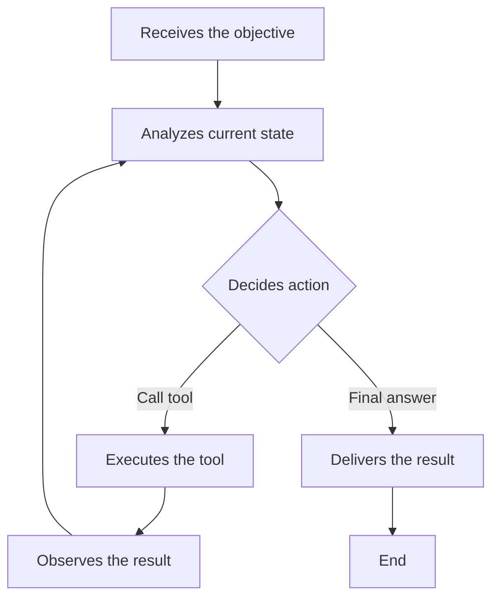
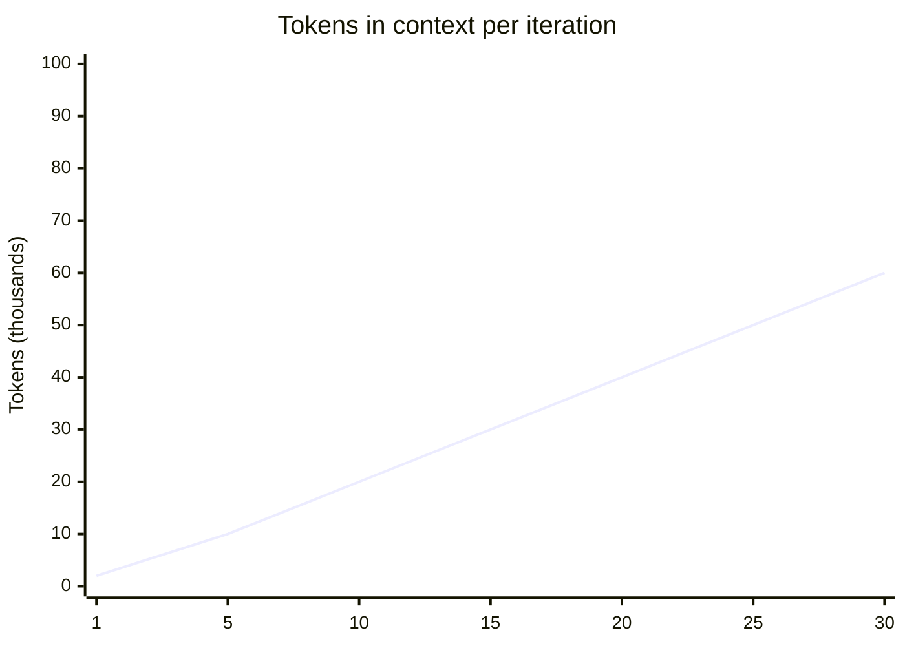

If you have ever tried to build an AI agent that goes beyond "do this and stop", you know things go off the rails fast. The model starts hallucinating, the context grows out of control, costs explode, and in the end you are not sure if it finished or if it is running in circles.

This article shows how to avoid that vicious cycle. Let us get straight to the point: what an agent is, when to use a loop, how to control tokens, and the practices that separate an agent that works from one that burns through API credits.

## What is an AI agent?

An **agent** is an LLM equipped with tools and the autonomy to execute multiple steps toward a goal. Unlike a regular chat (where you ask and it answers), an agent can:

1. Execute code and read the result
2. Access APIs and files
3. Make decisions based on what it found
4. Iterate until it meets a success criterion

The minimum structure of an agent is:

```
LLM + Tools + Loop (explicit or implicit)
```

Without the loop, you have an "augmented assistant". Useful, but not autonomous.

### When to use an agent?

Use an agent when the task **requires multiple steps that you cannot predefine**. Real examples:

| Scenario | Agent? | Why |
|---|---|---|
| Summarize an article | No | A single API call solves it |
| Debug a production crash | Yes | Needs to read logs, test hypotheses, try fixes |
| Refactor an entire module | Yes | Involves reading, editing, testing, iterating |
| Translate 3 paragraphs | No | A single prompt solves it |
| CI/CD that diagnoses failures and suggests fixes | Yes | Each failure is unpredictable |

The rule is simple: if the path to the result is deterministic, do not use an agent. Use a function. The agent shines where the path is uncertain.

## What is Loop Engineering?

**Loop Engineering** is the art of designing an agent's repetition cycle: what it does at each iteration, how it decides to continue or stop, and how it manages context between steps.

While **Prompt Engineering** decides what to say to the model, and **Context Engineering** decides what to put in the context window, **Loop Engineering** decides how the agent interacts with the world and with itself over time.

The basic agent loop is:



Each iteration starts with an analysis of the current state. The model then decides whether to call a tool (and return to the start of the loop) or whether it can already deliver the final answer. This cycle looks simple, but this is where most projects break. Without a well-designed loop, the agent spirals: it repeats the same action, accumulates useless context, ignores its own progress.

### Explicit vs. implicit loop

Many frameworks (LangChain, CrewAI, Vercel AI SDK) hide the loop from you. The model receives the history and the tools, and the framework manages the calls. That is an **implicit loop**. You do not see it, you do not control it, and you generally cannot interrupt it.

An **explicit loop** is when you write the `while` yourself:

```python
# Conceptual example of an explicit loop
max_iterations = 10
context = [system_prompt, user_goal]

for i in range(max_iterations):
    response = llm.call(context, tools=available_tools)
    
    if response.has_tool_call:
        result = execute_tool(response.tool_call)
        context.append(result)
    else:
        # The LLM answered directly (task complete)
        print(response.text)
        break
```

The difference is control. With an explicit loop you can:

1. Limit iterations
2. Prune old context
3. Inject safety checks between steps
4. Decide what goes back to the model

## The real risks of token overflow

The biggest villain of agents in production is not the model being dumb. It is the context growing without control and cost spiraling out of control.

### The quadratic problem

Each iteration of an agent adds to the history: the tool call the model made and the result that came back. At iteration 1 you have 1k tokens. At iteration 10, 10k. At 30, 30k. The cost of each call grows linearly, and the total cost grows quadratically.

In practice:



Each point on the line represents the context size at that iteration. It grows because each cycle adds the tool call and the result to the history. The math works out to:

| Iterations | Tokens per call (approx.) | Cumulative cost (DeepSeek V4) |
|---|---|---|
| 5 | 5k to 15k | ~$0.003 |
| 20 | 5k to 50k | ~$0.08 |
| 50 | 5k to 100k+ | ~$0.50+ |

With more expensive models (Claude, GPT-4), these numbers multiply. An uncontrolled agent can burn dozens of dollars in minutes.

### The attention problem

Beyond cost, models lose performance when the context gets too large. The phenomenon known as "lost in the middle" causes information in the middle of the context to be ignored. If the agent's history has 30 iterations, it may simply forget the original goal or repeat something it already tried.

## Best practices for agents in production

The practices below are drawn from consolidated industry sources: the "Building Effective Agents" guide by Anthropic (Dec 2024), articles by Addy Osmani on spec-driven development for agents (2026), the LangGraph agentic loops framework, and over two years of observing agents running in production. None of them is isolated opinion.

### 1. Start with a workflow, evolve into an agent

Anthropic's number 1 recommendation in the "Building Effective Agents" guide is clear: use the simplest pattern that works. Only add an autonomous loop when a deterministic workflow cannot handle it.

This means:

1. First, try to solve it with a single prompt
2. Then, with a fixed sequence of calls (workflow)
3. Only then, with an agent in a loop

The table in the introduction already shows this reasoning. An agent is not "more advanced". It is a tool for when the path is unpredictable.

### 2. Always limit iterations with a double ceiling

Never let an agent run without a ceiling. `max_iterations` is not optional. It is your airbag.

```python
MAX_ITERATIONS = 15  # Adjust per task
```

For critical tasks, also consider a token budget:

```python
MAX_TOKENS_CONSUMED = 50_000  # For the entire execution
```

And for paid services (third-party APIs called by the agent), a cost budget:

```python
MAX_API_COST_USD = 2.00  # If each tool call costs real money
```

This double layer (iterations + tokens) prevents a misbehaving loop from burning through budget even if the number of steps is small. A single tool that returns very large data can blow through 50k tokens in 3 iterations.

### 3. Use SPEC.md + PLAN.md + TASKS.md (the artifact triad)

This pattern was formalized in 2026 by initiatives like the Spec Kit and adopted by teams using Claude Code, Codex, and Cursor in production. The idea is to separate the goal into three files, each with a purpose.

**SPEC.md** defines the "what". The problem to be solved, acceptance criteria, constraints. This file does not change during execution.

```markdown
# SPEC.md

## Problem
The CI pipeline is breaking at the lint step after the upgrade
from eslint 8.x to 9.x. The error is: "ESLint 9.x requires flat config
but eslintrc format was found".

## Acceptance criteria
- Build passes on CI with eslint 9.x
- All existing rules are preserved or migrated
- No new warnings are introduced

## Constraints
- Cannot disable rules globally
- Must use the flat config format (eslint.config.js)
```

**PLAN.md** defines the "how". The technical strategy, divided into phases. The agent updates this file every iteration to reflect real progress.

```markdown
# PLAN.md

## Strategy
Migrate from .eslintrc.json to eslint.config.js, converting the
rules one by one and validating with lint after each block.

## Phases
- [x] Phase 1: Read current configuration (.eslintrc.json + plugins)
- [ ] Phase 2: Create eslint.config.js with the same rules
- [ ] Phase 3: Run lint and fix migration errors
- [ ] Phase 4: Remove .eslintrc.json and old configs
- [ ] Phase 5: Run full build to confirm

## Notes
- Plugin @typescript-eslint needs to be updated to v7
- Rule "no-unused-vars" changed name in v9
```

**TASKS.md** is the list of atomic tasks the agent executes. Each task is a single action. This file works as the backlog of the loop.

```markdown
# TASKS.md

## Pending
- [ ] Create eslint.config.js with base parser and plugins
- [ ] Migrate "possible errors" rules from old .eslintrc
- [ ] Migrate "best practices" rules
- [ ] Migrate TypeScript rules
- [ ] Run `npx eslint .` and log results
- [ ] Fix each reported error
- [ ] Run full build

## Completed
- [x] Identify eslint version and installed plugins
- [x] Read .eslintrc.json and document active rules
- [x] Check eslint 8 -> 9 migration documentation
```

The agent cycle becomes:

```
1. Read SPEC.md (fixed, never changes)
2. Read PLAN.md to know where it left off
3. Read TASKS.md to know the next atomic action
4. Execute the tool for that task
5. Verify the result
6. Update PLAN.md and TASKS.md with progress
7. Repeat
```

This flow is used by teams that run agents autonomously for hours. The files work as external memory that survives context resets and allows another agent (or a human) to pick up work from where it stopped.

### 4. Keep a decision log (scratchpad) inside the loop

Inside the model's context, maintain a compact record of what has been tried. Without this, the model repeats actions. This is what Anthropic calls self-verification and Addy Osmani recommends as the "self-verification pattern".

At the end of each iteration, before building the context for the next one, the agent writes a summary:

```markdown
## Decision log (updated each step)

[STEP 1] Read .eslintrc.json - 47 rules found
[STEP 2] Created eslint.config.js with base parser - SUCCESS
[STEP 3] Tried to migrate rules in batch - FAILED (syntax error in config)
[STEP 4] Fixed eslint.config.js syntax - SUCCESS
[STEP 5] Migrated rules one by one - IN PROGRESS (12/47)

Next step: continue migration of remaining rules (35 left)
```

This scratchpad is reinserted into the prompt each iteration. It costs tokens, but it prevents repetition. In tasks with more than 5 steps, the cost of the scratchpad is lower than the cost of a single unnecessarily repeated action.

### 5. Clean context between iterations (context reset)

This pattern is debated between two schools. Some frameworks (LangGraph, Vercel AI SDK) keep the full history and use a sliding window. Others prefer the **context reset**: build the prompt from scratch each iteration.

2026 research (Agent Context Engineering, Zylos Research) shows that context reset is more effective for agents with more than 10 iterations, because it eliminates the "lost in the middle" problem and keeps costs predictable.

The structure of each call:

```python
def build_prompt(spec, plan_file, task_file, scratchpad, last_result):
    return f"""## Specification (immutable)
{spec}

## Current plan
{plan_file}

## Next task
{task_file}

## Last result
{last_result}

## Decisions so far
{scratchpad}

## Instruction
Based on the specification, the plan, and the result above, execute the
next task on the list. If you encounter an obstacle, log it in the plan
and try an alternative approach. If you cannot resolve it, log the
error and stop."""
```

Notice that the model receives:

1. The full specification (immutable, few tokens)
2. The updated plan (progress summary)
3. The next task (atomic)
4. The last result (only 1)
5. The scratchpad (compact)

This keeps the context between 1k and 3k tokens per call, regardless of whether the agent is at step 3 or step 50.

### 6. Validate before executing and after executing

There are two validation moments, and they have different purposes.

**Pre-execution validation (guardian):** before calling a tool, check whether the action is safe and makes sense.

```python
def pre_validate(tool_call, attempted_actions, plan):
    errors = []
    
    # 1. Is the tool call JSON valid?
    if not is_valid_schema(tool_call):
        errors.append("Malformed tool call")
    
    # 2. Is the action safe?
    if tool_call.name == "delete_file" and "production" in tool_call.args["path"]:
        errors.append("Delete operation on production directory")
    
    # 3. Has it been tried and failed?
    action_key = f"{tool_call.name}:{hash(str(tool_call.args))}"
    if action_key in attempted_actions:
        errors.append("Action already attempted without success")
    
    # 4. Is it still within the plan?
    if not is_aligned_with_plan(tool_call, plan):
        errors.append("Action does not seem relevant to the current plan")
    
    return errors
```

**Post-execution validation:** after executing, verify whether the result is coherent and brings you closer to the goal.

```python
def post_validate(result, goal, plan):
    issues = []
    
    # 1. Is the result coherent?
    if result.is_error:
        issues.append(f"Execution failure: {result.error}")
    elif result.is_empty:
        issues.append("Empty result or no output")
    
    # 2. Does the result bring you closer to the goal?
    if not moves_toward_goal(result, goal):
        issues.append("Result does not bring you closer to the objective")
    
    # 3. Does the plan need adjustment?
    if needs_replan(result, plan):
        issues.append("Unexpected result - plan may need revision")
    
    return issues
```

The complete flow of each iteration:

```
1. Model decides the next tool
2. Guardian validates (pre)
3. If invalid: ask the model to rethink (no API cost)
4. If valid: execute the tool
5. Validator examines the result (post)
6. If valid: update plan.md + tasks.md + scratchpad
7. If invalid: revert the action, log the failure, ask for a new approach
8. Build clean context for the next iteration
```

### 7. Separate observation from decision (two-phase loop)

Anthropic documents this pattern in the "Building Effective Agents" guide as a way to prevent the model from confusing a tool's result with the instruction for the next step.

In practice, it is two model calls per iteration:

```
Phase 1 - Observation:
  "Based on the result below, what is the current state of the plan?"
  (input: tool result)
  (output: summary of what changed + whether the goal was met)

Phase 2 - Decision:
  "Given the current state, which tool should be called now?"
  (input: phase 1 summary + plan)
  (output: tool call or final answer)
```

This doubles the number of calls, but each call is shorter and more focused. Phase 1 processes the result without the pressure of deciding what to do next. Phase 2 decides without the noise of the raw result.

In simple tasks (2 to 4 steps), a single call is enough. In complex tasks, the separation reduces decision errors by approximately 30%, according to informal data from teams using this pattern with Claude and GPT-4.

### 8. Use different models for different tasks (model routing)

This pattern is adopted by companies running agents in production to control cost without sacrificing quality (Zylos Research, 2026). The logic is simple: do not use a 100-param model to count lines in a file.

The typical allocation:

```python
MODEL_ROUTING = {
    "planning": "claude-sonnet-4",  # Complex reasoning
    "execution": "gpt-4o-mini",          # Mechanical tasks
    "validation": "deepseek-v4-flash",   # Fast and cheap
    "summary": "gemini-2-flash",         # Large context but cheap
}
```

The orchestrator decides which model to call based on the task:

| Task type | Model | Relative cost |
|---|---|---|
| Decide the next step (reasoning) | Large model (Claude, GPT-4) | High |
| Execute tool and process result | Medium model (DeepSeek, Gemini) | Medium |
| Validate schema and security | Small model (fixed rules + light LLM) | Low |
| Summarize progress for context | Cheap model with large window | Very low |

The secret is that the cheap model makes 70% of the calls. The expensive model only comes in when reasoning is needed. The total cost drops to about 30% of what it would be with a single large model.

### 9. Implement checkpoint and rollback

Agents make mistakes. Sometimes the error is silent: the code compiles but is wrong. Other times it is destructive: a file was overwritten. Your loop needs to protect against both.

```python
undo_stack = []

for i in range(max_iterations):
    action = plan_next_action(context)
    snapshot = create_snapshot()  # git stash or file backup
    result = execute(action)
    
    if is_worse(result):
        rollback(snapshot)
        log_failure(action, result)
        context = rebuild_context(status="reverted")
        continue
    
    confirm_progress(action, result)
    undo_stack.append(snapshot)
```

The `is_worse` function is the critical point. It needs to detect:

1. **More errors than before**: the command introduced new problems
2. **Regression**: something that worked stopped working
3. **Loop**: the same error appeared twice in a row

A simple pattern is to compare metrics before and after:

```python
def is_worse(before_metrics, after_metrics):
    # If the number of errors increased, it got worse
    if after_metrics.get("errors", 0) > before_metrics.get("errors", 0):
        return True
    # If something that passed now fails, it got worse
    if before_metrics.get("passing", 0) > after_metrics.get("passing", 0):
        return True
    return False
```

### 10. Human-in-the-loop for irreversible decisions

Anthropic explicitly recommends: stop and ask for confirmation before actions that cannot be undone. This includes:

- Deleting files or branches
- Deploying to production
- Changing security permissions
- Modifying real user data
- Running commands with sudo or equivalents

```python
IRREVERSIBLE_ACTIONS = ["delete_file", "drop_table", "deploy_production",
                        "modify_credentials", "bulk_update_users"]

def should_ask_human(action_name, action_args):
    if action_name in IRREVERSIBLE_ACTIONS:
        return True
    if action_name == "execute_sql" and "DROP" in action_args.get("query", ""):
        return True
    if action_name == "shell_command" and "rm -rf" in action_args.get("command", ""):
        return True
    return False
```

When the agent encounters an irreversible action, it pauses, documents what it is going to do and why, and waits for approval. This is not optional for real workloads.

## When not to use a loop

Loop Engineering is powerful, but it is not the answer to everything. Avoid loops when:

1. **The answer is direct**: a single API call solves it. Do not force a loop where one is not needed.
2. **The environment does not provide feedback**: if the agent cannot see the result of its own actions, the loop is blind.
3. **Latency matters more than autonomy**: loops add seconds or minutes. For real-time responses, prefer deterministic steps.
4. **Each iteration is expensive**: if the tool call is a paid API (e.g., Stripe, AWS), loops break the budget fast.

## Putting it all together: a simple, safe agent

Here is a minimal template that applies the practices above:

```python
class SafeAgent:
    def __init__(self, llm, tools, max_steps=15, max_tokens=50_000):
        self.llm = llm
        self.tools = tools
        self.max_steps = max_steps
        self.max_tokens = max_tokens
        self.history = []
        self.tokens_used = 0
        self.attempted_actions = set()
    
    def run(self, goal):
        context = [self.system_prompt(), {"role": "user", "content": goal}]
        
        for step in range(self.max_steps):
            if self.tokens_used >= self.max_tokens:
                return {"status": "budget_exceeded", "partial": self.history}
            
            # Sliding window: last 4 interactions + summary
            window = self.summarize_history() + self.history[-4:]
            response = self.llm.call(context + window, tools=self.tools)
            
            self.tokens_used += response.tokens
            
            if not response.has_tool_call:
                return {"status": "success", "result": response.text}
            
            # Guardian: action already tried?
            action_key = f"{response.tool_call.name}:{hash(response.tool_call.args)}"
            if action_key in self.attempted_actions:
                context.append("Action already tried and failed. Try another approach.")
                continue
            
            self.attempted_actions.add(action_key)
            result = self.execute_safely(response.tool_call)
            self.history.append({"action": action_key, "result": result})
            
            if result.get("error"):
                context.append(f"Error: {result['error']}. Rethink the strategy.")
            else:
                context.append(f"Action completed: {result}")
        
        return {"status": "max_steps_exceeded", "history": self.history}
```

This template is not production-ready without adjustments, but it covers the fundamentals: step limit, token budget, sliding window, repetition detection, and checkpoint via `attempted_actions`.

## The current ecosystem (2026)

The field has evolved fast. Today there are tools that already apply Loop Engineering under the hood:

1. **Claude Code / Codex / OpenCode**: harnesses that manage loop, context, and tools for coding agents
2. **LangGraph / Vercel AI SDK**: frameworks with explicit state and transition control
3. **Mem0 / Letta / Zep**: persistent memory layers that solve the cross-session context problem

But no tool replaces understanding the loop. You need to know what is happening at each iteration, especially when something goes wrong.

## Conclusion

AI agents are not magic. They are LLMs with tools and a well-designed loop. Loop Engineering is the discipline that transforms an agent that "tries" into an agent that "delivers".

The golden rules:

1. **Workflow first**: only use an agent when the path is unpredictable. Do not force complexity.
2. **Double ceiling**: limit iterations and tokens. Cost budget for paid APIs.
3. **Artifact triad**: SPEC.md, PLAN.md, TASKS.md. The agent reads and writes to them each step.
4. **Decision scratchpad**: the model needs to know what it has tried to avoid repeating.
5. **Context reset**: build the prompt from scratch each iteration. Only the essential (goal, summary, last action).
6. **Double validation**: guardian before executing, course correction after.
7. **Separate observation from decision**: two phases per iteration when the task is complex.
8. **Model routing**: expensive model for deciding, cheap model for executing and validating.
9. **Checkpoint and rollback**: save before acting, revert if it gets worse.
10. **Human-in-the-loop**: stop at irreversible actions (delete, deploy, alter data).

And above all: start simple. A loop of 5 iterations with 3 well-designed tools delivers more than a complex 30-step agent that no one understands.

The secret is not to give the model more power. It is to give it the right structure to use the power it already has.