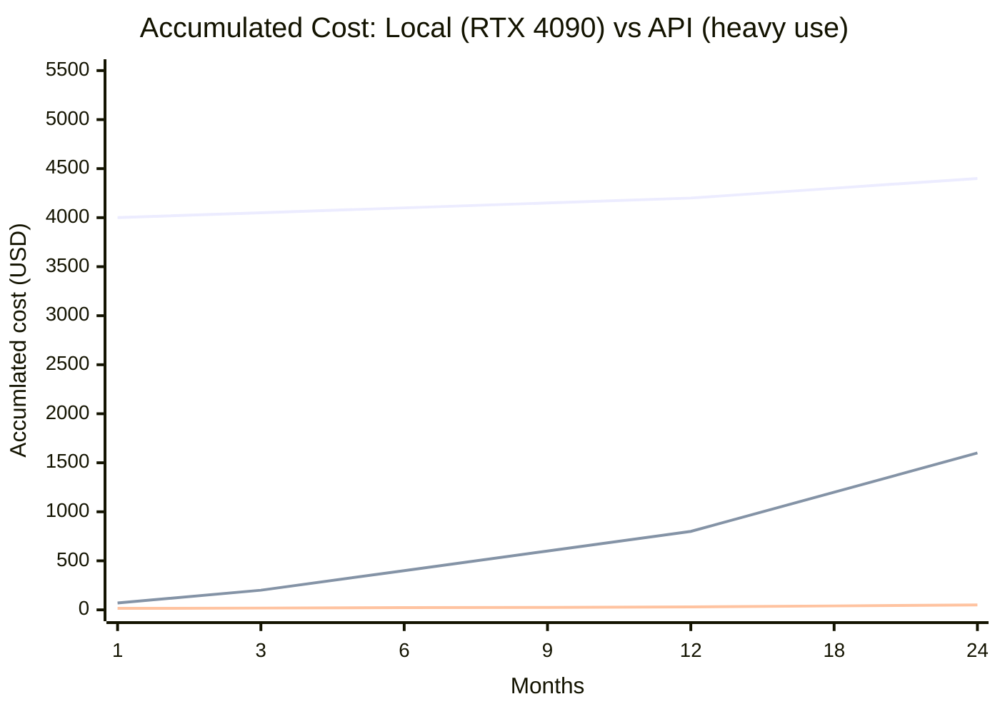

## The promise and the reality of local LLMs

Running language models locally has a strong appeal. You do not pay per token, you do not rely on internet access, you do not send your data to third parties, and you have complete freedom to use whatever model you want. Companies that handle sensitive data see it as a solution for keeping information within their own environment.

But there is a real cost that is often ignored in discussions. I am not just talking about the price of hardware. I am talking about electricity, cooling, setup time, and ongoing maintenance.

This article compares the total cost of running LLMs locally versus using commercial APIs, with real 2026 numbers. The goal is to help you decide which path makes sense for your use case.

---

## What you need to run locally

Before talking about costs, it is important to understand the hardware required. Language models are measured in billions of parameters. The larger the number, the more video memory (VRAM) the model needs.

The table below shows an estimate of the minimum hardware for each model range:

| Model | Parameters | Required VRAM (Q4) | Suggested Hardware |
|---|---|---|---|
| Llama 3.2 3B / Gemma 2 2B | 3B | ~3 GB | Mac M1+ 8GB, PC with 6GB GPU |
| Gemma 3 12B / Llama 3.1 8B | 8-12B | ~7-10 GB | RTX 3060 12GB, Mac M4 24GB |
| Llama 3.3 70B / Qwen 2.5 72B | 70B | ~40-48 GB | 2x RTX 3090, RTX 5090, Mac Ultra 64GB+ |
| DeepSeek V3 / Llama 4 120B | 120B+ | ~70+ GB | 4x RTX 3090, Mac Ultra 192GB, cloud GPU |

These numbers consider Q4 quantization, which reduces the model size with little quality loss. Without quantization, a 70B model needs approximately 140 GB of VRAM, making it unfeasible on consumer hardware.

## Hardware cost

The initial investment varies widely depending on the chosen configuration.

| Configuration | Supported models | Estimated cost (2026) |
|---|---|---|
| Mac Mini M4 Pro (24 GB unified) | 7B to 14B (Q4) | ~$1,600 USD |
| PC with RTX 4060 (12 GB) | 7B to 14B (Q4) | ~$1,200 USD |
| PC with RTX 4090 (24 GB) | 14B to 34B (Q4) | ~$3,200 USD |
| PC with RTX 5090 (32 GB) | 34B to 70B (Q4) | ~$5,000 USD |
| Mac Studio M3 Ultra (192 GB) | 70B to 120B (Q4) | ~$9,000 USD |
| Server with 2x RTX 3090 (48 GB) | 70B (Q4) | ~$4,500 USD |

If you already have a computer with a decent GPU, the incremental cost can be zero. Many people start testing with an RTX 3060 or a Mac M1 and discover they can already run small models at an acceptable speed.

If you need to buy something dedicated, the investment starts at around $1,200 and can reach $9,000 for larger models.

## Electricity cost

This is the cost almost nobody calculates before setting up a local system. A high-consumption GPU running 24 hours a day, 7 days a week has a real impact on your electricity bill.

For an RTX 4090 consuming 450W during continuous inference, the calculation is:

- 450 W x 24 h = 10.8 kWh per day
- 10.8 kWh x $0.12/kWh (US average) = $1.30 per day
- $1.30 x 30 days = **$39 per month**

That is just the GPU. Adding CPU, memory, fans, and power supply loss, the total system consumption is between 550W and 650W, raising the monthly cost to approximately **$50 to $58**.

Below is a comparison across common hardware:

| Hardware | Inference consumption | Idle consumption | Electricity cost/month (24h, $0.12/kWh) |
|---|---|---|---|
| Mac Mini M4 Pro | ~40 W | ~15 W | ~$3.50 |
| PC with RTX 4060 | ~200 W | ~60 W | ~$17 |
| PC with RTX 4090 | ~550 W | ~100 W | ~$48 |
| PC with RTX 5090 | ~700 W | ~120 W | ~$61 |
| Mac Studio Ultra | ~150 W | ~50 W | ~$13 |

The Mac stands out for its very low consumption. A Mac Mini running 24 hours a day costs about $3.50 per month in electricity. An RTX 4090 costs over $48.

If you plan to use it only during business hours (8 hours a day), the values drop by half or more.

## Cost of commercial APIs

API costs vary depending on the model and the number of tokens processed.

Reference prices from August 2026 (per million tokens):

| Provider | Model | Input (per 1M tokens) | Output (per 1M tokens) |
|---|---|---|---|
| OpenAI | GPT-4o mini | $0.15| $0.60 |
| OpenAI | GPT-4o| $2.50 | $10.00 |
| Anthropic | Claude Haiku 3.5 | $0.80 | $4.00 |
| Anthropic | Claude Sonnet 4 | $3.00 | $15.00 |
| DeepSeek | DeepSeek V3 | $0.27 | $1.10 |
| Google | Gemini 2.0 Flash | $0.10| $0.40 |
| Google | Gemini 2.0Pro | $2.00 | $8.00 |
| xAI | Grok 3 | $1.50 | $6.00 |

For those using smaller or open source models through providers like OpenRouter, prices are even lower. Models like Llama 3.1 8B cost pennies per million tokens across multiple providers.

### What typical daily usage costs

To calculate the real cost, consider a moderate usage scenario:

- 10 queries per day
- 2,000 input tokens + 500 output tokens per query
- Daily total: 20,000 input tokens + 5,000 output tokens
- Monthly total: 600,000 input tokens + 150,000 output tokens

With GPT-4o mini:

- Input: 0.6M x $0.15= $0.09
- Output: 0.15M x $0.60 = $0.09
- **Monthly total: ~$0.18**

With Claude Sonnet 4:

- Input: 0.6M x $3.00 = $1.80
- Output: 0.15M x $15.00 = $2.25
- **Monthly total: ~$4.05**

For heavy use, such as an agent processing hundreds of requests per day, the values scale proportionally.

## Direct comparison: local versus API

For an honest comparison, we need to consider hardware cost amortized over time.

I will consider a moderate usage scenario (20 thousand input tokens and 5 thousand output tokens per day) with an RTX 4090 running models locally.

### Total local cost (first year)

| Item | Value |
|---|---|
| PC with RTX 4090 | $3,200 (one time) |
| Electricity (12 months) | $576 ($48/month) |
| Estimated maintenance | $100 |
| **Total first year** | **$3,876** |

### Total API cost (first year)

Using GPT-4o mini for simple tasks and Claude Sonnet 4 for complex tasks (70% mini / 30% sonnet split):

| Item | Monthly value | Annual value |
|---|---|---|
| GPT-4o mini (70% of usage) | ~$0.13 | $1.56 |
| Claude Sonnet 4 (30% of usage) | ~$1.22 | $14.64 |
| **Total** | **~$1.35** | **~$16.20** |

### What about heavy use?

For heavy use, such as 1 million input tokens and 250 thousand output tokens per day, the numbers change dramatically.

**Total local cost (first year):**

Same hardware. Energy consumption does not change because the GPU is already on. The RTX 4090 delivers about 100 tokens per second, and processing 1.25 million tokens per day would require a few hours of intense processing. The energy cost remains practically unchanged.

**Total API cost (first year):**

With GPT-4o mini (70%) and Claude Sonnet 4 (30%):

- GPT-4o mini: 21M input tokens/month x $0.15 + 5.25M output/month x $0.60 = $6.30/month
- Claude Sonnet 4: 9M input tokens/month x $3.00 + 2.25M output/month x $15.00 = $60.75/month
- **Total API monthly: $67.05**
- **Total API annual: ~$804**

### Summary table

| Scenario | Local (1st year) | API (1st year) |
|---|---|---|
| Light use (20k tokens/day) | $3,876 | $16 |
| Moderate use (200k tokens/day) | $3,876 | $148 |
| Heavy use (1.25M tokens/day) | $3,876 | $804 |
| Heavy use, DeepSeek V3 only | $3,876 | $65 |

Local loses in the first year because of the initial hardware investment. Starting from the second year, the fixed operating cost is just electricity ($48/month for RTX 4090).

The break-even point depends on your usage volume. For light use, the API is infinitely cheaper. For heavy use, starting from the second year, local can pay off if you choose free models.

---

## Factors beyond money

### Privacy and data sovereignty

The strongest argument for running locally is privacy. When you use an API, your data leaves your environment. Providers like OpenAI and Anthropic state that they do not train models on API data, but terms of service change. And for regulated companies (LGPD, HIPAA, SOX), sending data outside may simply be prohibited.

With a local model, your data never leaves your machine.

### Latency and availability

APIs typically have network latency between 500ms and 3 seconds. Local models start responding in milliseconds, without depending on internet connectivity.

On the other hand, smaller local models are less capable. A local Llama 3.1 8B does not solve complex problems with the same quality as a GPT-4o via API. For tasks requiring sophisticated reasoning, the API still has the advantage.

### Maintenance and complexity

Running a model locally requires technical knowledge to configure, update, and troubleshoot issues. You need to manage model versions, GPU drivers, quantization, and inference libraries.

An API just works. You pay and use it.

---

## When each option makes sense

The chart shows three lines: the accumulated cost of an RTX 4090 (including hardware + energy), the API cost using Claude Sonnet 4 and GPT-4o mini combined, and the API cost using only DeepSeek V3. The local hardware line starts high due to the initial investment but grows slowly. The API lines start low but grow as usage increases.

Local never becomes cheaper than API in the short term. It only starts making financial sense after many months of heavy use with cheap electricity and without needing to replace hardware.

If you already have the hardware, the calculation changes completely. In that case, the marginal cost of running locally is just electricity, and for heavy use, local is often cheaper.

The practical recommendation is:

- **Light use (up to 100k tokens/day):** API is cheaper and more practical. Use GPT-4o mini or DeepSeek V3.
- **Moderate use (100k to 500k tokens/day):** API still wins, but consider a Mac Mini for local testing.
- **Heavy use (over 500k tokens/day) + privacy:** Local can pay off, especially in the second year.
- **Privacy or regulatory requirements:** Local is the only viable path.
- **You already have a good GPU:** Use local for routine tasks and API for tasks requiring larger models.

---

## Final considerations

Running LLMs locally is not the cheapest choice in most cases, especially if you are just starting out. Hardware is expensive, electricity adds up on the bill, and maintenance requires technical knowledge.

But there is a scenario where local makes total sense: absolute privacy, sustained heavy use, or when you already own the necessary hardware.

For most people and companies, the ideal combination is to use APIs for complex tasks and a small local model for routine tasks involving sensitive data. You do not have to choose one or the other. You can use both.

> **Important notice:** the values presented in this article are estimates based on August 2026 prices and may vary significantly depending on your location, exchange rate, local electricity cost, chosen hardware model, API provider, and actual volume of tokens processed. Check the sources listed below for updated values before making investment decisions.

### Sources

- [OpenAI API Pricing](https://openai.com/api/pricing/)
- [Anthropic API Pricing](https://www.anthropic.com/pricing)
- [DeepSeek API Pricing](https://api-docs.deepsek.com/quick_start/pricing)
- [PromptQuorum - Local LLM Power Consumption 2026](https://www.promptquorum.com/local-lms/local-lm-power-consumption)
- [Geo Toolbox - How to Run an LLM Locally (2026 Guide)](https://geotolbox.ai/blog/run-lm-locally)
- [GetDeploying - Cloud GPU Price Comparison](https://getdeploying.com/)
- US average electricity price: EIA 2026 (residential average $0.12/kWh)