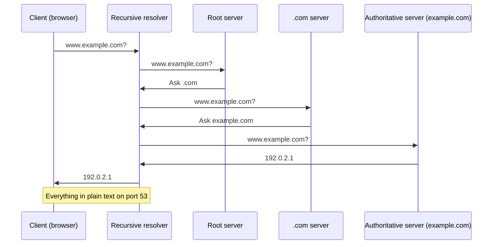

DNS was created in the 1980s with no concern for security. Queries travel in plain text. Anyone between you and the resolver can see which sites you are visiting, modify responses, or redirect your traffic.

Solving this is not trivial. Each secure DNS protocol solves a different problem and has its own trade-offs. This article explains the 8 main ones: how they work, which ports they use, which RFCs define them, when to use each, and where Cloudflare fits in this ecosystem.

## How DNS works (what we are protecting)

Before talking about security, it is worth understanding the basic flow of a DNS query. When you type `www.example.com` in your browser, something like this happens:



Every question and every answer travels in plain text over UDP port 53. There is no encryption. There is no authentication. The recursive resolver (usually operated by your ISP) sees every domain you query. An attacker in the middle can forge responses. And your ISP can redirect your queries to their own resolvers.

The protocols we will cover next protect different parts of this flow.

## The problem they all solve

A traditional DNS query (original protocol, RFC 1035) sends a UDP packet to port 53 of the resolver. The packet is neither encrypted nor authenticated. This creates three vulnerabilities:

1. **Eavesdropping**: anyone in the path can see which domains you are querying
2. **Spoofing / cache poisoning**: an attacker can forge a DNS response before the legitimate one arrives
3. **Hijacking**: your ISP or an intermediary can redirect queries to their own resolvers, ignoring what you configured

The protocols below solve one or more of these problems. Understanding the difference between them is essential for choosing the right combination.

## Comparison table

| Protocol | RFC | Port | Transport | Encryption | Resolver authentication | Hides client IP |
|---|---|---|---|---|---|---|
| DoH | 8484 | 443 (TCP) | HTTP/1.1, HTTP/2, HTTP/3 | TLS 1.3 | Yes (TLS certificate) | No |
| DoT | 7858 / 8310 | 853 (TCP) | Direct TLS | TLS 1.3 | Yes (TLS certificate) | No |
| DoQ | 9250 | 853 (UDP) | Direct QUIC | TLS 1.3 | Yes (TLS certificate) | No |
| DoH3 | 8484 + 9113 | 443 (UDP) | HTTP/3 over QUIC | TLS 1.3 | Yes (TLS certificate) | No |
| ODoH | 9230 | 443 (TCP/UDP) | HTTP over proxy | TLS 1.3 + double encryption | Yes (via proxy + target) | Yes |
| OHTTP | 9458 | 443 (TCP/UDP) | HTTP over proxy | HPKE + TLS | Yes (via proxy + target) | Yes |
| DNSCrypt v2 | (not an RFC) | 443 (UDP/TCP) | UDP/TCP with crypto envelope | X25519 + XSalsa20-Poly1305 | Yes (DNSCrypt certificate) | No |
| DNSSEC | 4033 / 4034 / 4035 | 53 (UDP/TCP) | UDP/TCP (same as DNS) | Does not encrypt | Yes (digital signature) | No |

Let us go through each one in detail.

## DNS over HTTPS (DoH)

**RFC 8484 | Port 443 TCP | MIME type: application/dns-message**

DoH encapsulates DNS queries inside regular HTTPS requests. The DNS query goes in the HTTP request body (POST) or URL (GET), and the response comes back in the HTTP response body.

```
GET /dns-query?dns=ABEiMAAABAAABAAABAAABAAABAAABAAABAAABAAABAAABAAABAAABAA...
Host: cloudflare-dns.com
Accept: application/dns-message
```

The big advantage of DoH is that it blends in with normal HTTPS traffic. On port 443, using the same protocol as web browsing, it is hard for a firewall or ISP to block DoH without blocking the entire web. This same characteristic makes DoH controversial in corporate environments, where the network team wants to inspect or redirect DNS traffic.

DoH works over any version of HTTP. Most implementations use HTTP/2 or HTTP/3, but the protocol itself does not require it.

**When to use:**

* Daily browsing, especially on restrictive networks
* Mobile devices (Android, iOS) that already support it natively
* Browsers (Firefox, Chrome, Edge) with built-in DoH

**Cloudflare:** `https://cloudflare-dns.com/dns-query` (also `https://one.one.one.one/dns-query`)

## DNS over TLS (DoT)

**RFC 7858 / RFC 8310 | Port 853 TCP**

DoT creates a dedicated TLS connection for DNS traffic. Unlike DoH, there is no HTTP in the middle. It is pure DNS inside a TLS tunnel.

```
Client: TLS connection on port 853
         -> TLS 1.3 Handshake
         -> DNS query (wire format)
         <- DNS response (wire format)
```

Because it uses a dedicated port (853), DoT is easier to identify and block than DoH. This can be an advantage or disadvantage depending on the perspective. For the home user, it is one more protocol the ISP can filter. For the network administrator, it is easier to audit.

DoT has two privacy profiles defined in RFC 8310:

1. **Strict**: the client verifies the server's DNS name in the TLS certificate. If it fails, the query is not sent.
2. **Opportunistic**: the client attempts TLS, but if it fails, falls back to plain text. Useful on networks that do not support DoT, but offers less security.

The strict implementation is recommended for production.

**When to use:**

* Routers and firewalls that support DoT natively (more common than DoH on network equipment)
* Environments where you control the resolver and want a simpler protocol than HTTP
* Recursive DNS servers communicating with each other

**Cloudflare:** `1.1.1.1` on port 853, with certificate for `cloudflare-dns.com`

## DNS over QUIC (DoQ)

**RFC 9250 | Port 853 UDP**

DoQ is DNS running directly over QUIC, without HTTP in the middle. Think of it as a "DoT over QUIC": same port 853, same TLS 1.3 encryption, but using QUIC instead of TCP.

The fundamental difference is that QUIC eliminates TCP's head-of-line blocking. On TCP connections, one lost packet holds up the entire queue. QUIC is multiplexed: one stream does not block another. For DNS, where each query is small and independent, this reduces latency.

QUIC also eliminates the extra round-trip of the TLS handshake. With TCP + TLS 1.3, you need 2 RTTs (round-trip times) before sending the first query. With QUIC (which embeds TLS 1.3 in the transport handshake), it is 0 or 1 RTT in practice, and 0 RTT for repeated queries to the same server.

DoQ is the fastest protocol among those offering dedicated encryption.

**When to use:**

* Scenarios where latency is critical (real-time applications, gaming, trading)
* Mobile devices (QUIC handles network changes better, like Wi-Fi to cellular)
* When you want encryption without the overhead of HTTP

**Cloudflare:** supports DoQ at endpoint `1.1.1.1` port 853 UDP (and `cloudflare-dns.com`)

## DNS over HTTP/3 (DoH3)

**RFC 8484 + RFC 9113 | Port 443 UDP**

DoH3 is DoH running over HTTP/3, which in turn runs over QUIC. It is a three-layer stack:

```
DNS (wire format)
  -> HTTP (application/dns-message)
    -> HTTP/3 (QUIC)
      -> UDP (port 443)
```

In practice, DoH3 offers the same advantages as DoQ (0 RTT, no head-of-line blocking, connection migration) but with the flexibility of HTTP: custom headers, authentication, cookies, HTTP caching, and HTTP proxies.

The difference between DoQ and DoH3 is subtle but important:

* **DoQ**: Direct DNS over QUIC. Lighter, without HTTP overhead. Ideal for dedicated resolvers.
* **DoH3**: DNS over HTTP/3 over QUIC. More flexible, leverages existing HTTP infrastructure (CDNs, proxies, load balancers).

**Cloudflare:** supports DoH3 on the same endpoint `https://cloudflare-dns.com/dns-query` (automatic HTTP/3 negotation via Alt-Svc)

## Oblivious DNS over HTTPS (ODoH)

**RFC 9230 | Port 443 (TCP/UDP)**

ODoH solves a problem that DoH and DoT do not solve: the resolver still sees your IP. Even with an encrypted query, the resolver knows who asked. ODoH separates these two pieces of information using an intermediary proxy.

The flow is:

```
Client -> Proxy (encrypts query with Target's public key)
Proxy  -> Target (Target decrypts, but does not see client IP)
Target -> Proxy (encrypted response)
Proxy  -> Client (Client decrypts)
```

The client encrypts the DNS query with the Target's (resolver's) public key. The proxy receives the packet, sees the client's IP, but cannot read the query. The proxy forwards to the Target, which decrypts the query, processes it, and encrypts the response back. The proxy only forwards.

Neither party has the complete information. The proxy knows who asked but not what. The Target knows what was asked but not who asked.

The cost is additional latency (an extra hop) and complexity of operating the proxy. In exchange, you gain strong privacy: neither your ISP, nor the resolver, nor the proxy can piece together the full picture.

**ODoH vs. regular DoH:**

* DoH: Target sees IP + query. A single point of privacy failure.
* ODoH: Proxy sees IP, Target sees query. Knowledge separation.

**Cloudflare:** operates as a Target (ODoH resolver) at `odoh.cloudflare-dns.com` and also as a proxy for those who want to use it.

## Oblivous HTTP (OHTTP)

**RFC 9458 | Port 443 (TCP/UDP)**

Oblivous HTTP is the generalization of ODoH. Instead of being specific to DNS, OHTTP defines a generic mechanism for any HTTP request to be sent in an "oblivous" way (without the server seeing the client's IP).

OHTTP uses the same principle as ODoH: HPKE (Hybrid Public Key Encryption) with two layers, using an intermediary proxy that cannot read the content.

ODoH is, in practice, a specific application of OHTTP for DNS. The relationship between them:

```
OHTTP (RFC 9458) -> generic protocol for oblivious HTTP
  |
  +--> ODoH (RFC 9230) -> specific application for DNS
```

If you already understand ODoH, you understand OHTTP. The difference is that OHTTP can be used for any API, not just DNS.

**When to use OHTTP (outside of DNS):**

* API queries where the server does not need to know your IP
* Anonymous metrics or telemetry submission
* Any scenario where origin privacy matters

## DNSCrypt

**Protocol version 2 (not an IETF RFC) | Port 443 UDP/TCP**

DNSCrypt predates DoH and DoT. It was created in 2008 as an alternative for encrypting DNS traffic without depending on TLS. Today it is at protocol version 2.

Unlike TLS-based protocols, DNSCrypt uses its own key exchange mechanism (X25519) and asymmetric cipher (XSalsa20-Poly1305). The default port is 443 (UDP and TCP), the same as HTTPS, which makes blocking difficult.

DNSCrypt authenticates the resolver (the client verifies a digital signature on the response) and encrypts the traffic. However, it is not an IETF standard and has much lower adoption than DoH and DoT.

**Advantages:**

* Port 443, hard to block
* Works over UDP (less overhead than TCP)
* Lighter than TLS in high-volume scenarios

**Disadvantages:**

* Not an IETF standard (ad-hoc, without broad review)
* Less support in clients and servers
* Small ecosystem (few public resolvers)
* Does not offer the same forward secrecy guarantees as TLS 1.3

**When to use:**

* Legacy or embedded scenarios where TLS is too heavy
* Networks where DoH/DoT are blocked but port 443 is open
* In combination with DNSCrypt-proxy as a local DNS proxy

**Cloudflare:** does not support DNSCrypt natively. The main resolvers that support it are from the DNSCrypt ecosystem (such as those listed on dnscrypt.info).

## DNSSEC

**RFC 4033 / RFC 4034 / RFC 4035 | Port 53 UDP/TCP (traditional DNS)**

DNSSEC does not encrypt DNS traffic. It adds digital signatures to DNS responses so the client can verify the response is authentic and has not been modified in transit.

While DoH, DoT, and DoQ protect the transport, DNSSEC protects the data. They solve different problems and are complementary. The ideal combination is DNSSEC + DoT/DoQ: you know the data is authentic (DNSSEC) and that nobody eavesdropped on the transport (DoT/DoQ).

### How DNSSEC works

Each DNS zone that implements DNSSEC publishes additional records:

* **DNSKEY**: contains the zone's public key
* **RRSIG**: digital signature of each record set (Rset)
* **DS** (Delegation Signer): hash of the child zone's DNSKEY, published in the parent zone
* **NSEC / NSEC3**: authenticated denial (proof that a record does not exist)

The validation process:

```
1. Client asks for www.example.com
2. Authoritative resolver responds with www.example.com A + RRSIG
3. Recursive resolver fetches example.com's DNSKEY
4. Verifies the RRSIG with the DNSKEY (ZSK)
5. Goes up to .com, fetches example.com's DS
6. Verifies that example.com's DNSKEY hash matches the DS
7. Continues up to the trust anchor of the root zone
8. If the entire chain is valid, marks the response as Authentic Data (AD flag)
```

The resolver manually configures the root zone's public key (root trust anchor). From there, everything else is verified in chain.

### Important limitations

1. **DNSSEC does not encrypt**: queries and responses remain visible to any intermediary
2. **Operational complexity**: managing keys, rotation, and signatures is work. A mistake like expiring an RRSIG breaks domain resolution
3. **Response size**: the additional records increase the payload, which can cause fragmentation over UDP and require fallback to TCP

**When to use DNSSEC:**

* On zones you administer: configure DNSSEC to protect your domains against spoofing
* On recursive resolvers: enable DNSSEC validation (all public resolvers do this)
* In combination with DoT/DoQ: the best of both worlds

**Cloudflare:** supports DNSSEC for all managed domains. Cloudflare generates and manages the keys automatically.

## How the protocols complement each other

The main confusion about secure DNS is treating all protocols as substitutes. They are not. They solve different layers of the problem:

```
Data authentication (is the DNS record legitimate?)
  -> DNSSEC

Transport encrypton (can nobody see my queries?)
  -> DoT / DoQ / DoH / DoH3

Source IP obfuscation (does the resolver not know who asked?)
  -> ODoH / OHTTP

Compatbility with restrictive networks (does the firewall not block?)
  -> DoH / DNSCrypt (port 443)
```

An ideal scenario combines:

1. **DNSSEC** on the zone you administer (so nobody can forge responses for your domain)
2. **DNSSEC validation** on the resolver you use (so fake responses are rejected)
3. **DoT or DoQ** between your device and the resolver (to encrypt the transport)
4. **ODoH** if you do not want the resolver to know your IP

In practice, most people use just DoH or DoT, and DNSSEC is handled by the resolver. It is an acceptable trade-off for daily use.

## Practical configuration with Cloudflare 1.1.1.1

Cloudflare offers all encrypted protocols on the same resolver (1.1.1.1). Here are the endpoints:

| Protocol | Address | Port | Example URL/config |
|---|---|---|---|
| DoH | cloudflare-dns.com | 443 | `https://cloudflare-dns.com/dns-query` |
| DoT | 1.1.1.1 | 853 | `tls://1.1.1.1` |
| DoQ | 1.1.1.1 | 853 UDP | `quic://1.1.1.1` |
| DoH3 | cloudflare-dns.com | 443 UDP | `https://cloudflare-dns.com/dns-query` (automatic H3 negotiation) |
| ODoH | odoh.cloudflare-dns.com | 443 | via ODoH proxy + Cloudflare target |

On Windows 11, you configure DoT in:

```
Settings > Network & Internet > DNS > Edit
  -> DNS over HTTPS: On (automatic)
```

On Linux with systemd-resolved:

```
# /etc/systemd/resolved.conf
[Resolve]
DNS=1.1.1.1#cloudflare-dns.com
DNSOverTLS=yes```

On Android (9+):

```
Settings > Network > Private DNS
  -> Provider hostname: cloudflare-dns.com
```

## Which protocol to choose?

The answer depends on your scenario:

| If you... | Use |
|---|---|
| Want the simplest and most universal | DoH (port 443, works on any network) |
| Want the best performance | DoQ (0 RTT, no head-of-line blocking) |
| Use a router or firewall | DoT (native support on network equipment) |
| Want performance + HTTP flexibility | DoH3 (DoH over QUIC) |
| Do not trust the resolver | ODoH (proxy separates IP from query) |
| Have a network that blocks port 853 | DoH or DNSCrypt (both on port 443) |
| Want to authenticate the data, not the transport | DNSSEC (complementary, not a substitute) |
| Need a lightweight, non-IETF standard | DNSCrypt (v2, port 443) |

And remember: you can (and should) use more than one at the same time. DNSSEC + DoQ + ODoH is a valid and secure combination. Each solves a different part of the problem.

## Conclusion

The DNS of the 1980s was not designed for a world where your phone carrier, your ISP, and your country's government are interested in what you access. Fortunately, the ecosystem has evolved a lot in recent years.

The 8 protocols we covered here form a complete set of tools. None solves everything alone. The right choice depends on your threat model: are you protecting yourself from a curious ISP? A corporate firewall? An attacker on the same network? A malicious resolver?

For the home user, the simplest and most effective setup is enabling DoH/DoT on the operating system and letting the resolver handle DNSSEC (Cloudflare and Google already validate by default). For those who want more privacy, adding ODoH is the next step. For critical operations, your own resolver with DoQ + DNSSEC validation is the state of the art.