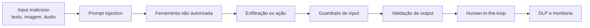

Em agosto de 2026, o OWASP GenAI Security Project publicou a terceira edição do seu Top 10 para aplicações com modelos de linguagem grandes. Pela primeira vez, o ranking foi construído com base em dados reais de incidentes, e não apenas na opinião de especialistas.

Foram analisados 7.714 incidentes de segurança relacionados a IA. Desses, 6.639 tinham detalhes suficientes para serem classificados contra a taxonomia de riscos. O resultado foi um ranking que combina 75% de votação da comunidade e 25% de evidência de incidentes reais.

Este artigo explica os dez riscos, por que alguns subiram ou desceram no ranking, e o que você pode fazer para proteger suas aplicações.

## Por que uma nova edição importa agora

A edição de 2026 não é só uma atualização de ranking. Ela reflete três mudanças estruturais no mercado:

1. **Agentes deixaram de ser experimento.** Sistemas baseados em agentes que chamam APIs, executam código e acessam sistemas corporativos estão em produção. O risco saiu do papel.
2. **O ataque mudou de forma.** Prompt injection não é mais só texto. Imagens, áudio, documentos e memória persistente são vetores de ataque.
3. **A defesa mudou de foco.** A mensagem central da OWASP não é "construa um modelo que não pode ser enganado". É "construa um sistema que permanece seguro quando o modelo é enganado".

## O ranking completo de 2026

| Posição | Risco | 2025 | Movimento |
|---|---|---|---|
| LLM01 | Prompt Injection | 1º | Estável |
| LLM02 | Sensitive Information Disclosure | 2º | Estável |
| LLM03 | Excessive Agency | 6º | Subiu 3 |
| LLM04 | Supply Chain | 3º | Desceu 1 |
| LLM05 | Data and Model Poisoning | 4º | Desceu 1 |
| LLM06 | Unbounded Consumption | 10º | Subiu 4 |
| LLM07 | Misinformation | 9º | Subiu 2 |
| LLM08 | Hidden Context Exposure | 7º | Desceu 1 |
| LLM09 | Vector and Embedding Weaknesses | 8º | Desceu 1 |
| LLM10 | Improper Output Handling | 5º | Desceu 5 |

A maior subida foi de Improper Output Handling para Unbounded Consumption, que saltou quatro posições. A maior descida foi a própria Improper Output Handling, que caiu cinco posições, não porque o risco diminuiu, mas porque outros riscos se tornaram mais urgentes.

## LLM01: Prompt Injection

Prompt injection continua no topo pelo terceiro ano consecutivo. A definição se expandiu: o input que altera o comportamento do modelo não precisa ser legível por humanos, não precisa vir de um usuário e não precisa ser visível na interface.

O que isso significa na prática:

**Vetores de ataque em 2026:**
- Texto direto na interface de chat
- Imagens com instruções ocultas (esteganografia)
- Áudio transcrito antes de chegar ao modelo
- Documentos anexados
- Conteúdo recuperado de páginas web
- Memória persistente entre sessões
- Saída de ferramentas ou mensagens de outros agentes

**Por que as defesas tradicionais falham:** Modelos de linguagem não fazem distinção arquitetural entre instruções e dados. Ambos são tokens na mesma stream. Não existe equivalente a "parametrização de queries" para LLMs.

**O que funciona:**
- Guardrails de input: classificam prompts antes de chegarem ao modelo
- Separação estrutural de conteúdo externo: marcar dados como "não confiáveis" em um canal separado
- Validação de output em código confiável, não por outro LLM
- Stripping de caracteres invisíveis (zero-width, variation-selectors)
- Human-in-the-loop para ações irreversíveis
- Regra dos Dois: se um agente tem (A) input não confiável + (B) dados sensíveis + (C) capacidade de estado mutante, requer aprovação humana por ação

## LLM03: Excessive Agency

A subida mais significativa do ranking. Excessive Agency saltou de sexto para terceiro lugar. O motivo: sistemas agentic em produção têm demonstrado que autonomia mal calibrada causa danos reais.

A definição é simples: o agente tem permissão para fazer mais do que deveria. A consequência: quando o modelo é enganado (por prompt injection ou alucinação), o dano não fica limitado ao texto gerado.

**Três causas raiz:**
1. **Funcionalidade excessiva:** a ferramenta faz mais do que a tarefa exige (ex.: ferramenta de leitura de email também permite enviar)
2. **Permissões excessivas:** o agente acessa sistemas com uma identidade que tem mais privilégios do que necessário
3. **Autonomia excessiva:** o agente executa ações irreversíveis sem confirmação humana

**Mitigações recomendadas pela OWASP:**
- Minimizar ferramentas: só expor as absolutamente necessárias
- Minimizar funcionalidade de cada ferramenta
- Evitar ferramentas abertas (shell, fetch URL genérico)
- Executar ações no contexto de autenticação do usuário
- Aprovação humana para ações de alto impacto
- Rate limiting e circuit breakers por ferramenta
- Monitoramento contínuo de padrões de chamada

## Guardrails: a primeira linha de defesa

Guardrails são mecanismos que filtram o que entra e o que sai do modelo. Eles se dividem em três categorias:

**Input guardrails:** analisam prompts, documentos anexados e conteúdo recuperado antes de chegar ao modelo. Classificam tentativas de jailbreak, instruções ocultas em imagens e caracteres de encoding malicioso.

**Output guardrails:** validam a resposta do modelo antes de entregá-la ao usuário ou a um sistema downstream. Bloqueiam vazamento de PII, código malicioso gerado e desinformação factual.

**Action guardrails:** em sistemas agentic, avaliam cada chamada de ferramenta proposta contra a intenção original do usuário. Uma ferramenta que percebe apenas a tarefa original e a ação que o agente quer executar (sem o contexto intermediário não confiável) recusará ações que desviaram por instrução injetada.

## RAG: o risco escondido

Sistemas de Retrieval-Augmented Generation (RAG) adicionam uma camada extra de risco. O conteúdo recuperado de bases vetoriais ou documentos externos entra no contexto do modelo sem distinção arquitetural entre "dado" e "instrução".

Isso significa que:
- Um documento malicioso em uma base vetorial pode sequestrar o comportamento do modelo em todas as consultas que o recuperam
- Metadados ocultos em PDFs ou planilhas podem conter instruções de ataque
- A memória persistente entre sessões pode ser envenenada e afetar usuários futuros

**Mitigações:**
- Marcar conteúdo recuperado como não confiável em canal separado
- Sanitizar documentos antes da indexação
- Validar conteúdo recuperado antes de passar ao modelo
- Aplicar os mesmos guardrails de input ao material do RAG

## DLP e proteção de dados sensíveis

LLM02 (Sensitive Information Disclosure) continua em segundo lugar. O vazamento de dados confidenciais pode acontecer em múltiplos canais:

- Na resposta final do modelo
- Nos argumentos de chamadas de ferramenta
- Nas cadeias de raciocínio (chain-of-thought)
- Nos logs e telemetria
- Nos embeddings armazenados em vetores

O DLP (Data Loss Prevention) para IA generativa precisa considerar todos esses canais. Ferramentas de DLP tradicionais monitoram tráfego de rede. Para IA, é preciso também monitorar o que entra e sai do contexto do modelo.

**Práticas recomendadas:**
- Mapear o fluxo de dados antes de implementar
- Minimizar os campos enviados ao modelo
- Redigir informações sensíveis antes de passar ao modelo
- Aplicar as mesmas regras de redação a logs e traces
- Validar saída do modelo contra políticas de DLP antes de liberar

## Human-in-the-loop em 2026

A OWASP é clara: ações irreversíveis ou de alto impacto exigem confirmação humana. Mas o diabo está nos detalhes:

**O que subir para aprovação humana:**
- Ações financeiras (transferências, pagamentos)
- Exclusão de dados
- Publicação de conteúdo
- Alterações de configuração de segurança
- Acesso a dados de outros usuários

**Como não cair em approval fatigue:**
- Exibir a ação exata que será executada, não um resumo
- Caracteres ocultos podem fazer a ação exibida ser diferente da executada
- Usar dry-run ou diff preview antes de aprovação
- Política gradual: auditoria para ações leves, aprovação para ações pesadas

## O que isso significa para seu time de segurança

Se você trabalha com segurança ou infraestrutura e sua organização está usando agentes de IA, alguns passos práticos:

1. **Revisite seu risk register** contra o ranking de 2026. Se ainda usa a versão de 2025, Excessive Agency e Unbounded Consumption estão sub-representados.
2. **Inventarie seus agentes.** Mapeie quais ferramentas cada agente pode chamar, com quais permissões, e em quais sistemas downstream.
3. **Implemente guardrails.** Input, output e action guardrails não são opcionais para agentes em produção.
4. **Revise ferramentas abertas.** Toda ferramenta que executa shell, fetch de URL genérico ou operações de escrita sem confirmação deve ser substituída ou ter aprovação humana.
5. **Monitore padrões de chamada.** Um aumento súbito no número de chamadas de ferramenta ou no volume de tokens é sinal de que algo pode estar errado.
6. **Separe decisão de autorização do LLM.** O modelo pode sugerir uma ação, mas a decisão final deve ser tomada por código determinístico.

## Links úteis

- [OWASP GenAI LLM Top 10 2026 (publicação oficial)](https://genai.owasp.org/resource/owasp-genai-llm-top-10-2026/)
- [Repositório GitHub com os detalhes de cada categoria](https://github.com/GenAI-Security-Project/GenAI-LLM-Top10)
- [CSA Research Note: incident data meets judgment](https://labs.cloudsecurityalliance.org/research/csa-research-note-owasp-llm-top10-2026-incident-weighted-202/)
- [Versa Networks: why network security matters for GenAI](https://versa-networks.com/blog/owasp-genai-top-10-network-security/)
- [OWASP Top 10 for Agentic Applications (dez 2025)](https://genai.owasp.org/download/52117)

## Conclusão

A OWASP GenAI Top 10 2026 não é apenas uma lista de vulnerabilidades. Ela reflete uma mudança de paradigma: a segurança de IA está saindo do laboratório e indo para produção, e os controles precisam acompanhar.

A mensagem mais importante é também a mais simples: pare de tentar construir um modelo que não pode ser enganado. Construa um sistema que permanece seguro quando o modelo é enganado. Guardrails, least privilege, human-in-the-loop e monitoramento contínuo são as ferramentas para isso.